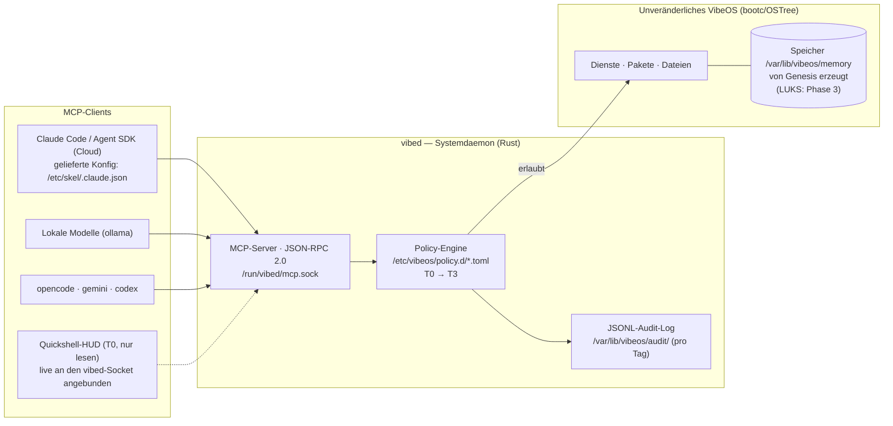

<div align="center">

# 🌀 VibeOS

**Ein unveränderliches Betriebssystem, das leer geboren wird,<br/>in dem die KI ein Bürger des Systems ist – keine installierte Anwendung.**

[](https://github.com/Micka420-collab/vibeos/actions/workflows/ci.yml)
[](LICENSE)
[](docs/HARDWARE.md)
[](os/Containerfile)
[](docs/DESKTOP.md)
[](STATUS.md)

**🌐 [Français](README.md) · [English](README.en.md) · [Español](README.es.md) · Deutsch**

</div>

> ℹ️ Dies ist eine Übersetzung der Haupt-README. VibeOS ist ein französischsprachiges Projekt: Die ausführlichen Dokumente unter `docs/` werden auf Französisch gepflegt (der kanonischen Sprache des Projekts). Diese Seite verlinkt direkt darauf.

## 👋 Neu hier? VibeOS in 2 Minuten

**Die Idee in einem Bild.** Stellen Sie sich ein hochgesichertes Gebäude vor. Die künstliche Intelligenz ist darin keine App, die man installiert und die dann tut, was sie will: Sie ist ein **an eine Hausordnung gebundener Bewohner**, mit Rechten und Pflichten — kein Gast, dem man den Schlüsselbund überlässt. Um am System zu handeln (Software installieren, einen Dienst neu starten, die Platte anfassen), muss sie über den **Wächter** des Gebäudes gehen, ein Programm namens `vibed`. Der Wächter prüft die Hausordnung, lässt Erlaubtes durch, **ruft Sie — den Eigentümer — bei allem Riskanten an** und hält jede Handlung in einem **fälschungssicheren Register** fest. Das ist VibeOS in einem Bild: Die KI hat echte Macht, aber eine regierte.

**Was es ist.** VibeOS ist ein Linux-Betriebssystem (wie Ubuntu oder Fedora), gebaut fürs *Programmieren im Dialog mit KI-Agenten* — Code-Assistenten wie Claude Code, die für Sie Code schreiben und ausführen. Das ist *Vibecoding*.

**Wie es sich von einem gewöhnlichen Linux unterscheidet.** Zweierlei. Es ist **unveränderlich**: Man bastelt nicht am laufenden Kern herum, man tauscht das ganze Image in einem Block aus — und wenn ein Update etwas kaputt macht, kehrt man mit einem Handgriff zum vorigen Zustand zurück. Und die KI ist keine obendrauf gesetzte Anwendung: Sie ist ins Fundament verdrahtet, von Anfang an durch Regeln eingefasst.

**Für wen, und wo es steht.** Heute vor allem für Neugierige und für Mitwirkende, die das Projekt verstehen oder voranbringen wollen. Es ist **noch kein** OS, das jeder installieren kann: Das Projekt ist **Pre-Alpha**, und bis heute **wurde kein Image auf echter Hardware gebootet** — alles, was dieses Repository behauptet, ist durch automatische Tests belegt, nicht durch einen Bildschirm, den jemand gesehen hätte. Der ehrliche Stand (erledigt / in Arbeit / offen) steht in **[STATUS.md](STATUS.md)**.

**Wie es funktioniert, in 4 Schritten:**

1. **Die Maschine wird leer geboren.** Das Image ist für alle gleich und enthält keine persönlichen Daten. Beim allerersten Start erzeugt eine Sequenz namens *Genesis* den Speicher der Maschine, der allein Ihnen gehört. *(Die Verschlüsselung dieses Speichers ist für eine spätere Phase geplant — vorerst wird er im Klartext erzeugt, und das Projekt sagt es offen.)*
2. **Die KI fragt den Wächter.** Ein Agent (Claude Code, ein lokales Modell über ollama…) richtet seine System-Aktionswünsche an den Wächter `vibed`, statt als root zu tun, was er will.
3. **Eine Regel entscheidet; Sie geben das Riskante frei.** Der Wächter stuft jede Aktion von **T0** (beobachten, ohne Risiko) bis **T3** (destruktiv) ein. Das Harmlose läuft allein durch; **das System zu ändern oder die Platte anzufassen erfordert Ihre ausdrückliche Freigabe**. Im Zweifel, oder wenn keine Regel passt, wird alles **standardmäßig verweigert**.
4. **Alles wird protokolliert.** Jeder Aufruf wird in ein *Append-only*-Log geschrieben (man fügt hinzu, schreibt nie um) und kryptografisch verkettet: Man kann stets beantworten, „wer was wann und mit wessen Autorisierung getan hat".

**Mini-Glossar** (die Wörter, die weiter unten überall wiederkehren):

| Wort | Im Klartext |
|---|---|
| **unveränderlich** | der Systemkern ist nur lesbar; ein fehlgeschlagenes Update wird durch Zurückrollen um einen Block behoben, ohne Narbe |
| **Vibecoding** | programmieren, indem man einer KI beschreibt, was man will, und sie den Code schreibt |
| **KI-Agent** | ein Assistent, der nicht nur redet: Er liest Dateien, führt Befehle aus (z. B. Claude Code) |
| **`vibed`** | der „Wächter": das Systemprogramm, über das jede privilegierte Agentenaktion läuft |
| **MCP** | die Standardsprache, in der Agenten mit `vibed` reden (eine einzige, kontrollierte Eingangstür) |
| **Policy / T0→T3** | die „Hausordnung", die jede Aktion nach Risikostufe einstuft und entscheidet, wer sie ausführen darf |
| **Audit-Log** | das „fälschungssichere Register", das jede Handlung nachverfolgbar festhält |
| **Genesis** | die Sequenz, die den Speicher der Maschine beim allerersten Start erzeugt |

> Lieber das *Warum* als das *Wie*? Lesen Sie das Manifest **[VISION.md](VISION.md)**. Für die geschichtete Architektur und die Diagramme siehe **[docs/ARCHITECTURE.md](docs/ARCHITECTURE.md)**.
>
> Der Rest dieser README ist die **technische Fassung** dessen, was Sie gerade gelesen haben — dichter, aber dieselbe Geschichte.

---

VibeOS ist eine **KI-native, unveränderliche, von Grund auf sichere** Linux-Distribution für das *Vibecoding*. Abgeleitet von Fedora Kinoite (KDE Plasma 6) und als Image mit bootc/OSTree gebaut, stellt sie die Systemsteuerung KI-Agenten über einen strikten Vertrag zur Verfügung – einen Systemdaemon (`vibed`), einen MCP-Server, eine Policy-Engine und ein Audit-Log – statt rohen Shell-Zugriff. Das Betriebssystem wird **leer** ausgeliefert: Sein Speicher wird beim ersten Start durch eine *Genesis*-Sequenz erzeugt und gehört seinem Benutzer, und niemandem sonst (die LUKS-Verschlüsselung dieses Speichers kommt in **Phase 3** – siehe [ROADMAP.md](ROADMAP.md)). Ein mehrjähriges Projekt: Das v0.1-Fundament steht – signiertes Multi-Arch-Image, zwei ISOs, `vibed`-Daemon beim Start aktiv, Vibecoding-Desktop ausgeliefert.

> 📊 **Wo steht das Projekt?** Der lebende Status (erledigt / in Arbeit / offen) steht in **[STATUS.md](STATUS.md)**.

---

## Kernfunktionen

### 🌱 Leer geboren — Genesis
Das OS-Image enthält **keinen Werksspeicher**. Beim ersten Start führt `vibeos-genesis.service` (abgesichert durch `ConditionPathExists=!/var/lib/vibeos/memory/.initialized`) `/usr/libexec/vibeos/genesis.sh` aus und baut den Speicher der Maschine von Grund auf unter `/var/lib/vibeos/memory` auf – **im Klartext in v0.1**; die LUKS/TPM2-Verschlüsselung des Volumes ist ein Ergebnis der **Phase 3**. Bei der Geburt **wählt die KI ihren eigenen Charakter** (`personality.toml`: Name, Archetyp, 6 Merkmale, Ton) – **einzigartig pro Installation** und deterministisch (abgeleitet aus `machine_id`, offline), mit einem **Erwachen**, das auf die Konsole gedruckt wird ([ADR-029](docs/DECISIONS.md)). Der **amnestische Modus** (inspiriert von Tails) erzeugt diesen Speicher **bei jedem Start** in tmpfs neu – nichts überlebt das Herunterfahren: Der **systemd-Generator** ist **ausgeliefert** (aktiviert durch den Kernel-Parameter `vibeos.amnesic=1`); seine Validierung in der VM bleibt **Phase 3**. Die vollständige Spezifikation steht in [docs/MEMORY.md](docs/MEMORY.md).

### 🤖 Die KI als Bürger des Systems — vibed + MCP + Policies
> **Status:** Das `vibed`-Binary ist **im Image eingebettet** (mehrstufig in `os/Containerfile` kompiliert, installiert unter `/usr/bin/vibed`). Beim Start startet `vibed.service` (per Preset aktiviert), **lädt und erzwingt die installierte Policy** (`/etc/vibeos/policy.d/`, fail-closed), **bedient den MCP-Server** unter `/run/vibed/mcp.sock` und **auditiert** jeden Aufruf unter `/var/lib/vibeos`. Auf Client-Seite liefert das Image die **MCP-Konfiguration von Claude Code** (`/etc/skel/.claude.json`): Der `vibeos`-Server wird **ohne manuelle Konfiguration** entdeckt (Voraussetzung: die Gruppe `vibeos-agents`). Der **Sandbox-Mechanismus pro Werkzeug** ([ADR-019](docs/DECISIONS.md)) ist ausgeliefert — gehärtete transiente systemd-Units + der niedrig privilegierte Helper `vibed-tool`, ausgeübt durch das Werkzeug `sandbox.probe` (T1), das die tatsächlich erreichte Einschließung beurteilt — sein **Nachweis auf echter Hardware steht aber noch aus** (machine-gated); ebenfalls noch ausstehend: dediziertes SELinux `vibed_t`, `User=vibed` und die externe TPM/Rekor-Verankerung der Audit-Kette (**Phase 4**). Das `vibed`-Crate ist getestet (383 grüne Tests, darunter 9 End-to-End-MCP-Integrationstests über Socket + 3 Policy-Tests); das Audit-Log ist **per SHA-256-Hash verkettet** (`vibed --verify-audit`).

Der Systemdaemon `vibed` (Rust, tokio, Unit `vibed.service`) stellt die Systemsteuerung über einen **MCP-Server** (JSON-RPC 2.0) auf dem Unix-Socket `/run/vibed/mcp.sock` bereit. Jede Agentenaktion durchläuft eine **Policy-Engine** (`/etc/vibeos/policy.d/*.toml`, die erste passende Regel gewinnt, standardmäßig Ablehnung), organisiert in Fähigkeitsstufen:

| Stufe | Umfang | Menschliche Freigabe |
|---|---|---|
| **T0** | Beobachten (nur lesen) | Nein |
| **T1** | Benutzeränderung (Dateien, Konfiguration) | Nein (konfigurierbar) |
| **T2** | Systemänderung (Pakete, Dienste) | **Ja, immer** |
| **T3** | Destruktiv (Datenträger, Zugangsdaten, Netzwerkidentität) | **Ja, immer** |

Jeder Werkzeugaufruf wird in einem **anfüge-only JSONL-Audit-Log, per SHA-256-Hash verkettet, mit Rotation pro UTC-Tag** (`/var/lib/vibeos/audit/vibed-<datum>.jsonl`) protokolliert, samt Identität des Aufrufers (uid/gid/pid) – jede Manipulation wird durch `vibed --verify-audit` erkannt. Die externe Verankerung der Kette (TPM/Rekor) bleibt **Phase 4**.

Der **menschliche Freigabe-Ablauf für T2/T3** ist auf der Klempnerei-Seite ausgeliefert: Eine Anfrage erzeugt einen protokollierten Eintrag, der Operator führt `vibectl approve <id>` aus, und ein **Einmal-Grant** (gebunden an `(Werkzeug, Ziel, uid)`, kurzlebig) autorisiert den erneuten Aufruf – ein Agent kann seine eigene Anfrage **niemals** freigeben (nur-root-Speicher), und das Audit hält fest, *wer* freigegeben hat (`ok_approved(by_uid=N)`). Ein **Rate-Limiting pro uid** (Token-Bucket) begrenzt einen entlaufenen oder kompromittierten Agenten (Anti-Flood, auditierte Ablehnung). **Erstes echtes T2-Backend ausgeliefert**: `svc.restart` startet tatsächlich eine systemd-Unit hinter der Freigabe neu, mit einer **Ziel-Allowlist** (Zugriffs-/Audit-/Freigabe-Units — `sshd`, `vibed`, `dbus`, `user@*`… — werden **vor** der Freigabe-Warteschlange abgelehnt) und dem vor der Entscheidung kanonisierten Unit-Namen. `pkg.install` bleibt ein Stub (Backend auf einem unveränderlichen OS zurückgestellt, [ADR-016](docs/DECISIONS.md)). Aktuelle Werkzeug-Oberfläche (20 — der `tools/list`-Katalog ist maßgeblich): T0 `os.status`/`fs.read`/`fs.list`/`svc.status`/`log.read`/`sectools.list`/`memory.query`/`agent.thinking`/`agent.sessions`/`agents.list`/`agent.activity`/`user.model`/`policy.check`/`policy.capabilities`, T1 `fs.write`/`memory.append`/`sandbox.probe`, T2 `svc.restart`/`pkg.install`/`deploy.plan` — `deploy.plan` ist **standardmäßig verweigert** (die ausgelieferte Policy enthält keine `[rule.deploy]`-Regel: fail-closed, bis der Operator Ziele allowlistet, [ADR-021](docs/DECISIONS.md)). Die Module `browser.*` ([ADR-022](docs/DECISIONS.md)) und `os.propose` ([ADR-024](docs/DECISIONS.md), zu ratifizieren) existieren im Code, sind aber **außerhalb des Katalogs** — bewusst inert, bis ihr governierter Pfad verdrahtet ist. Der Plasma/HUD-Freigabedialog kommt in **Phase 4**.

### 🔒 Unveränderlichkeit & überprüfbare Sicherheit
Bereits in v0.1 ausgeliefert: nur lesbares Root, atomare Updates und Werks-Rollback (bootc/OSTree), SELinux `enforcing` (Fedoras targeted-Policy), OS-Images **mit sigstore/cosign in der CI signiert**, Basis-Image per Digest gepinnt und KI-CLIs auf exakte Versionen gepinnt. Geplant: gemessene Boot-Kette **UEFI Secure Boot → UKI → dm-verity/composefs** (**Phase 4**), Generalisierung der Sandbox pro Werkzeug (systemd-run/seccomp-Mechanismus ausgeliefert und durch `sandbox.probe` ausgeübt — [ADR-019](docs/DECISIONS.md); landlock und Generalisierung: **Phase 3**), dedizierte SELinux-Policy `vibed_t` (**Phase 4**). Image-Referenz: `ghcr.io/micka420-collab/vibeos`.

### 🧰 Vollständiger Vibecoding-Werkzeugkasten — Cloud + lokal
Hybride Agenten-Laufzeit, vorinstalliert und im Image gepinnt: **Claude Code** und das **Claude Agent SDK** (Anthropic-Cloud), **gemini-cli** (Google), **codex** (OpenAI), **opencode** (Multi-Provider-Terminal-Agent, 100 % lokal über ollama) und **ollama** für lokale Modelle – das Image bündelt alles, um offline zu programmieren (die formale Validierung „`ollama run` ohne Netz" ist ein Ausgangskriterium der Phase 1, noch offen). `aider` bleibt bei Bedarf installierbar (`uvx --python 3.12 aider-chat`), ohne das unveränderliche OS zu berühren.

### 🛡️ Regierter Cybersecurity-Werkzeugkasten
VibeOS ist **security-first**: Ein professioneller Pentest/DFIR-Werkzeugkasten ist im Image eingebettet (≈ 60 signierte Fedora/RPM-Fusion-RPMs – `nmap`, `hashcat`, `radare2`, `aircrack-ng`, `impacket`, `sleuthkit`, `suricata`, `lynis`…), im Stil von Kali/Parrot/BlackArch. Der Unterschied: Er wird von der Policy-Engine **regiert**. Ein KI-Agent kann den Werkzeugkasten schreibgeschützt **entdecken** (MCP-Werkzeug `sectools.list`, T0), aber **kein Werkzeug ausführen**, ohne die Stufung zu durchlaufen – alles, was **aktiv gegen ein Ziel ist, ist T2, Destruktives ist T3**, mit **verpflichtender menschlicher Freigabe**. Vollständiger Katalog (Stand der Technik 2025–2026, einschließlich **KI/LLM-Sicherheit**: garak, PyRIT, guardrails) und Rahmen für die autorisierte Nutzung: [docs/SECURITY-TOOLKIT.md](docs/SECURITY-TOOLKIT.md).

### 🧬 Multi-Architektur — amd64 + arm64
VibeOS zielt auf **linux/amd64 und linux/arm64**. Seit dem Release `v0.1.0-dev` baut die CI beide Architekturen auf **nativen Runnern**, veröffentlicht das **cosign-signierte Multi-Arch-Manifest** (keyless, Rekor-Log) auf ghcr.io und erzeugt **eine ISO pro Architektur** als Release-Artefakte. Die **NVIDIA**-Treiberschicht (akmod, RPM Fusion) wird beim Image-Build kompiliert, nur auf amd64; ihre **Validierung auf dem Referenz-PC** (RTX 3070 Ti) ist ein Ausgangskriterium der Phase 1, noch offen – siehe [docs/HARDWARE.md](docs/HARDWARE.md).

### 🎨 Ein für das Vibecoding gestaltetes Desktop-Erlebnis
Ein Plasma-6-Desktop, organisiert um das Triptychon **Agent / Kontext / Vertrauen**. Die Sitzung öffnet sich im **Global Theme „VibeOS Dark"** (Systemstandard, Kvantum-Engine inklusive) mit dem **Agenten-HUD** (Quickshell, ins Image kompiliert, automatisch gestartet – Agentenstatus, aktuelle Policy-Stufe und Anzeigen des lokalen Modells; **live an `vibed` angebunden** via `Quickshell.Io.Socket`: os.status, Speicher, Reasoning und das uid-beschränkte Roster sind real, mit sauberer Offline-Degradierung). Das Terminal ist ab dem ersten Start einsatzbereit: Ghostty + fish + Starship + Zellij mit dem charakteristischen Layout „Agent + lazygit + Audit", Neovim-Preset „VibeVim". Diese Auswahl ist das Ergebnis einer **Kuratierung von 113 Open-Source-Projekten**, gefiltert nach weiterverteilbarer Lizenz und Kohärenz – detailliert in [docs/ECOSYSTEM.md](docs/ECOSYSTEM.md) und [docs/DESKTOP.md](docs/DESKTOP.md).

---

## Ausgeliefert in v0.1 / Unterwegs

| Fähigkeit | Status |
|---|---|
| Unveränderliches bootc-Image (Fedora Kinoite, RO-Root, atomares Rollback) | ✅ Ausgeliefert v0.1 |
| **amd64**-Image + ISO (lokaler Build + CI) | ✅ Ausgeliefert v0.1 |
| **arm64**-Manifest + ISO pro Architektur (native Runner, Release `v0.1.0-dev`) | ✅ Ausgeliefert v0.1 |
| ISO-Boot in VM validiert + NVIDIA auf dem Referenz-PC validiert | 🔄 Ausgangskriterien Phase 1 (in Arbeit) |
| KI-CLIs vorinstalliert und gepinnt (claude, agent SDK, gemini, codex, opencode, ollama) | ✅ Ausgeliefert v0.1 |
| cosign-Signierung (keyless) der Images in der CI | ✅ Ausgeliefert v0.1 |
| Policy-Dateien abgelegt in `/etc/vibeos/policy.d/` | ✅ Ausgeliefert v0.1 |
| `vibed`-Binary im Image eingebettet (startet beim Boot) | ✅ Ausgeliefert v0.1 |
| `vibed`-MCP-Server auf `/run/vibed/mcp.sock` | ✅ Ausgeliefert v0.1 |
| Policy-Laden/-Erzwingung durch `vibed` (fail-closed) | ✅ Ausgeliefert v0.1 |
| SHA-256-hashverkettetes JSONL-Audit-Log (`/var/lib/vibeos/audit/`, eine Datei pro Tag) mit Aufrufer-Identität | ✅ Ausgeliefert v0.1 |
| **Menschlicher T2/T3-Freigabe-Ablauf** (Klempnerei: `vibectl approve/deny`, Einmal-Grants, Freigebender auditiert) | ✅ Ausgeliefert (Phase 2) |
| **Rate-Limiting pro uid** (Token-Bucket, Anti-Flood; begrenzter Freigabe-Speicher) | ✅ Ausgeliefert (Phase 2) |
| Genesis beim ersten Boot (Speicher **im Klartext** erzeugt, Unit + `genesis.sh`) | ✅ Ausgeliefert v0.1 |
| Global Theme **VibeOS Dark standardmäßig** (`/etc/xdg/kdeglobals` + Kvantum) | ✅ Ausgeliefert (Phase 2) |
| **Quickshell-HUD** installiert + automatisch gestartet (Runtime ins Image kompiliert), **live an `vibed` angebunden** (os.status, Speicher, Reasoning, Roster) | ✅ Ausgeliefert (Phase 2.5) |
| **`svc.restart` (T2) — echtes Backend** hinter Freigabe + Ziel-Deny-Liste (Zugang/Audit/Freigabe-Units vor der Warteschlange abgelehnt) · **`agents.list` (T0)** uid-beschränktes Roster | ✅ Ausgeliefert (Phase 2.5) |
| **Claude-Code-MCP-Konfiguration** ausgeliefert (`/etc/skel/.claude.json` → `vibed`-Socket) | ✅ Ausgeliefert (Phase 2) |
| **Live**-Anbindung des HUD an den `vibed`-Socket (QML `Quickshell.Io`) | 🛣️ Phase 2 |
| **`memory.append`** (T1, additiv: journal + knowledge) · `scope`/`limit` von `memory.query` | ✅ Ausgeliefert (Phase 2) |
| Zusätzliche **echte T1-Werkzeuge** · `user`/`projects`-Scopes von `memory.append` | 🛣️ Phase 2 |
| **Agenten-Supervisor** mit Budgets + **Always-on-Autonomiemodus** (voll T0/T1, T2/T3 asynchron in Warteschlange – Freigabe-Schwelle nie gesenkt) | ✅ Ausgeliefert (Phase 2.5, Mechanismus) |
| **Erfassung des Reasonings** der Agenten (Tap auf den `stream-json`-Strom) + T0-Werkzeug `agent.thinking` | ✅ Ausgeliefert (Phase 2.5, Mechanismus) |
| Unit `vibeos-agent@.service` + **TPM2-versiegeltes Abo-Token** + **Egress-Allowlist pro Hostname** | ✅ Ausgeliefert (Phase 2.5, Scaffolding) — Boot-Enforcement ausstehend |
| LUKS/TPM2-Verschlüsselung des Speichers | 🛣️ Phase 3 |
| Amnestischer Modus (tmpfs bei jedem Boot neu erzeugt, systemd-Generator) | 🛣️ Phase 3 |
| **Geburts-Interview** — Opt-in-Skript `genesis-interview.sh`: 4 Fragen (Name, Sprache, Domäne, Kollaborationsstil) → **Append-only**-`user/`-Speicher, escaped (Anti-Poisoning), idempotent und **beim Start nie blockierend** (No-op ohne TTY); von `genesis.sh` nach dem Erwachen aufgerufen | ✅ Ausgeliefert (opt-in); reiche interaktive Version = Phase 3 |
| **`vibectl memory reset`** — Werksreset des Speichers (root-only, `--yes`-Schutz: ausdrückliche Ablehnung mit Auflistung des zu Zerstörenden), löscht die Geburtsdateien + Unterverzeichnis-Inhalte und schärft dann Genesis neu (LUKS-Krypto-Löschung folgt in Phase 3) | ✅ Ausgeliefert |
| **Client-seitige cosign-Verifikation** — keyless sigstore-Policy **STAGED ausgeliefert** (`policy-strict.json`, gepinnte Anker) + ein skopeo-Ablehnungsnachweis in der CI; Aktivierung machine-gated (c/image kann URI-SANs noch nicht abgleichen) | ✅ Mechanismus ausgeliefert (staged); Aktivierung = machine-gated |
| Sandbox pro Werkzeug — Generalisierung auf die ganze Oberfläche (der ADR-019-Mechanismus ist ausgeliefert, siehe `sandbox.probe` unten) | 🔄 Mechanismus ausgeliefert; Generalisierung + Nachweis auf Hardware ausstehend |
| **`policy.capabilities` (T0)** — Fähigkeiten-Manifest, **abgeleitet** aus der geladenen Policy (der Agent liest die Karte seiner Rechte ohne Herumprobieren) | ✅ Ausgeliefert ([ADR-023](docs/DECISIONS.md)) |
| **`agent.activity` (T0)** — der Bürger liest seine **eigenen Taten** erneut (jüngste regierte Aufrufe, Ablehnungen inbegriffen), pro uid eingegrenzt | ✅ Ausgeliefert ([ADR-026](docs/DECISIONS.md)) |
| **`user.model` (T0)** — **abgeleitetes & transparentes** Modell davon, *wie Sie arbeiten* (Präferenzen, Muster, Rhythmus, Reibung) + deterministische **Antizipation** Ihrer nächsten Aktionen; abgeleitet aus bereits regierten Daten, pro uid eingegrenzt, lokal/löschbar | ✅ Fundament ausgeliefert ([ADR-028](docs/DECISIONS.md)); Opt-in-Lernen/Embeddings = folgt |
| **Lebendige Genesis** — beim ersten Start **wählt die KI ihren Charakter** (`personality.toml`: Name, Archetyp, 6 Merkmale, Ton), **einzigartig pro Installation** und deterministisch (abgeleitet aus `machine_id`, offline), mit einem futuristischen **Erwachen** auf der Konsole; `personality`-Scope (`memory.query`) + Selfcheck-Invariante `ai-personality`. Der Charakter **beugt sich zum Menschen** (`[adaptation]`-Tabelle ← `user.model`) | ✅ Geburt + Erwachen ausgeliefert ([ADR-029](docs/DECISIONS.md)); lebendige Anpassungsschleife & grafische HUD-Zeremonie = folgt/machine-gated |
| **`sandbox.probe` (T1)** — gesteuerter Nachweis der ADR-019-Sandbox (gehärtete transiente Unit + `vibed-tool`-Helper, Einschließungs-Urteil) | ✅ Ausgeliefert (Mechanismus); Nachweis auf echter Hardware = machine-gated |
| **`deploy.plan` (T2)** — Deployment-Status lesen (fly/vercel/railway), TPM2-versiegeltes Token **nie auf argv**, ADR-019-Sandbox | ✅ Ausgeliefert, **standardmäßig verweigert** (keine `[rule.deploy]`-Regel ausgeliefert — fail-closed, [ADR-021](docs/DECISIONS.md)) |
| **Governiertes Browser-Substrat** — `chromium-headless` im Image + gehärteter CDP-über-Pipe-Starter (`spawn_chromium`) | ✅ Substrat ausgeliefert; `browser.*`-Werkzeuge **außerhalb des Katalogs**, bis der governierte Ausführungspfad verdrahtet ist ([ADR-022](docs/DECISIONS.md)) |
| **Low-Level-Performance** — Audit/Journal weg vom tokio-Reaktor, Werkzeug-Katalog gecacht · **Kernel-Tuning für KI-Lasten** (belegtes `sysctl.d` + zstd-zram) + 18. Selfcheck-Invariante | ✅ Ausgeliefert ([ADR-025](docs/DECISIONS.md)); Messung auf Hardware = machine-gated |
| UKI / gemessener Boot, hashverkettetes Audit, dediziertes SELinux, `User=vibed` | 🛣️ Phase 4 |
| Geführter Installer, Datenträgerverschlüsselung standardmäßig | 🛣️ Phase 5 |

Schreibregel des Projekts: Kein nicht implementierter Mechanismus wird im Präsens beschrieben – jedes Dokument unterscheidet „ausgeliefert in v0.1" von „Phase N (spezifiziert)".

---

## Architektur auf einen Blick



---

## Repository-Struktur

| Verzeichnis | Inhalt |
|---|---|
| `docs/` | Dokumentation: Architektur, Build ([docs/BUILD.md](docs/BUILD.md)), Referenz-Hardware ([docs/HARDWARE.md](docs/HARDWARE.md)), Speicher, Sicherheit, Entscheidungen |
| `os/` | bootc/OSTree-Image-Definition (abgeleitet von Fedora Kinoite, KDE Plasma 6, Multi-Arch) |
| `vibed/` | Systemdaemon `vibed` (Rust, tokio): MCP-Server, Policy-Engine, Audit |
| `agent/` | Agenten-Laufzeit: Claude-Code-/Agent-SDK-Integration, ollama, opencode, Genesis-Interview-Prototyp |
| `memory/` | Speicher-Subsystem: Genesis-Sequenz (`memory/genesis.sh`) |
| `security/` | Policies (`policy.d`), Härtung, Signierung |
| `desktop/` | Desktop-Arbeit: VibeOS-Dark-Theme, Stufen-Palette, Quickshell-HUD (QML) — siehe [docs/DESKTOP.md](docs/DESKTOP.md) |
| `installer/` | Installer: kickstart, Branding, Logo — siehe [docs/INSTALLER.md](docs/INSTALLER.md) |
| `.github/` | GitHub-Actions-CI: Tests (`ci.yml`), Multi-Arch-OS-Image-Build, cosign-Signierung, Push zu ghcr.io, ISO-Erzeugung |

---

## Schnellstart

### Das Image ausprobieren (ohne etwas zu bauen)

```bash
# Das Multi-Arch-Image holen (amd64 / arm64):
podman pull ghcr.io/micka420-collab/vibeos:0.1.0-dev

# Die cosign-Signatur prüfen (keyless, GitHub-Actions-CI):
cosign verify ghcr.io/micka420-collab/vibeos:0.1.0-dev \
  --certificate-identity-regexp 'https://github.com/Micka420-collab/vibeos/.*' \
  --certificate-oidc-issuer https://token.actions.githubusercontent.com
```

Die **installierbaren ISOs** (eine pro Architektur) werden bei jedem `v*`-Tag als CI-Artefakte erzeugt – siehe [docs/BUILD.md](docs/BUILD.md), um sie lokal zu erzeugen.

### Mit `vibed` aus einer VibeOS-Sitzung sprechen

Socket-Zugriff: **Administratoren (Gruppe `wheel`) werden bei jedem Boot automatisch** in `vibeos-agents` eingetragen (`vibeos-agents-group.service`) – sie haben bereits `sudo`, es ist also *weniger* als das, was sie ohnehin besitzen. Ein **Nicht-`wheel`**-Konto bleibt opt-in: `sudo usermod -aG vibeos-agents <benutzer>` (dann die Sitzung neu öffnen). Die Mitgliedschaft wird beim nächsten Login wirksam.

```bash
# Claude Code entdeckt den MCP-Server „vibeos" automatisch
# (Konfig in ~/.claude.json geliefert; Anweisungen in ~/.claude/CLAUDE.md).
# Manueller Test ohne MCP-Client:
printf '%s\n' '{"jsonrpc":"2.0","id":1,"method":"tools/list"}' \
  | socat - UNIX-CONNECT:/run/vibed/mcp.sock
```

### Das Image selbst bauen

Der lokale Build läuft unter **WSL2 Ubuntu + podman** (der Windows-Host braucht weder docker noch podman). Die GitHub-Actions-CI baut das Multi-Arch-OS-Image auf nativen Runnern, signiert es mit cosign, pusht es nach `ghcr.io` und erzeugt die ISOs mit `bootc-image-builder`.

```bash
git clone https://github.com/Micka420-collab/vibeos.git
cd vibeos
podman build -t vibeos:dev -f os/Containerfile .
```

➡️ **Alle detaillierten Anweisungen (Voraussetzungen, ISOs, Veröffentlichung) stehen in [docs/BUILD.md](docs/BUILD.md).**

---

## Projektstatus

| | |
|---|---|
| **Phase** | Pre-Alpha — Phase 1 „Erste ISO" (VM-Validierung ausstehend) · Phase 2 „vibed + MCP" weit fortgeschritten · Phase 2.5 „Regierte Autonomie" weitgehend umgesetzt (Supervisor, Reasoning-Erfassung, echtes `svc.restart`, Agent-Runner + TPM2 + Egress, Live-HUD) |
| **Letzte Aktualisierung** | 2026-07-21 |
| **OS-Image** | `ghcr.io/micka420-collab/vibeos:0.1.0-dev` — amd64- + arm64-Manifest, **cosign-signiert** (Rekor) |
| **ISO** | amd64 (7,0 GB) + arm64 (6,3 GB) — CI-Artefakte des Releases `v0.1.0-dev` |
| **Build** | Grüne CI (native Runner, ~15 min/Arch) · `bootc container lint` OK · 383 grüne `vibed`-Tests (+ 27 Tests der Zed-Erweiterung + 100 Prüfungen des HUD-Clients) |
| **Referenzmaschine** | Ryzen 7 3700X + RTX 3070 Ti + 16 GB — [docs/HARDWARE.md](docs/HARDWARE.md) |
| **Erwarten Sie** | Brüche, Umschreibungen, null Stabilitätsgarantie |

VibeOS ist ein **mehrjähriges** Projekt. v0.1 legt ein vollständiges, kohärentes, baubares Repository an – kein fertiges Produkt. Die Tabelle „Ausgeliefert in v0.1 / Unterwegs" oben ist maßgeblich dafür, was tatsächlich existiert.

---

## Weiterführendes

**Vision & Steuerung**
- 📜 [VISION.md](VISION.md) — das Manifest: warum VibeOS existiert, seine fünf Gründungsprinzipien
- 🗺️ [ROADMAP.md](ROADMAP.md) — die mehrjährige Trajektorie, Meilenstein für Meilenstein
- 📊 [STATUS.md](STATUS.md) — der lebende Status (erledigt / in Arbeit / offen)

**Design**
- 🏛️ [docs/ARCHITECTURE.md](docs/ARCHITECTURE.md) — die geschichtete Architektur (Diagramme, Sequenzen)
- 🧭 [docs/DECISIONS.md](docs/DECISIONS.md) — die Architekturentscheidungen (ADR)
- 🧠 [docs/MEMORY.md](docs/MEMORY.md) — das Speicher-Subsystem und Genesis
- 🎨 [docs/DESKTOP.md](docs/DESKTOP.md) · 🧩 [docs/ECOSYSTEM.md](docs/ECOSYSTEM.md) — der Vibecoding-Desktop und die OSS-Auswahl

**Sicherheit**
- 🛡️ [SECURITY.md](SECURITY.md) — Sicherheitsrichtlinie und Meldung von Schwachstellen
- 🎯 [docs/THREAT-MODEL.md](docs/THREAT-MODEL.md) · 🔐 [docs/SECURITY-ARCHITECTURE.md](docs/SECURITY-ARCHITECTURE.md)

**Bauen & installieren**
- 🔨 [docs/BUILD.md](docs/BUILD.md) — Image-Build, ISOs, Veröffentlichung
- 💿 [docs/INSTALLER.md](docs/INSTALLER.md) — der Installer und der erste Start
- 🖥️ [docs/HARDWARE.md](docs/HARDWARE.md) — Zielarchitekturen und Referenzmaschine

## Lizenz

Verteilt unter der **Apache-2.0**-Lizenz. Siehe [LICENSE](LICENSE).
