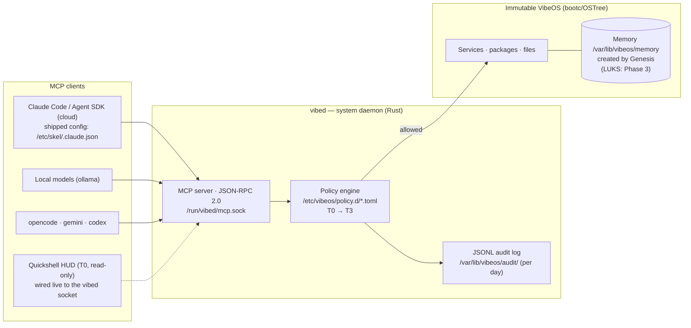

<div align="center">

# 🌀 VibeOS

**An immutable operating system born blank,<br/>where AI is a citizen of the system — not an installed app.**

[](https://github.com/Micka420-collab/vibeos/actions/workflows/ci.yml)
[](LICENSE)
[](docs/HARDWARE.md)
[](os/Containerfile)
[](docs/DESKTOP.md)
[](STATUS.md)

**🌐 [Français](README.md) · English · [Español](README.es.md) · [Deutsch](README.de.md)**

</div>

> ℹ️ This is a translation of the main README. VibeOS is a French-first project: the in-depth documents under `docs/` are maintained in French (the project's canonical language). This page links to them directly.

VibeOS is an **AI-native, immutable, secure-by-design** Linux distribution dedicated to *vibecoding*. Derived from Fedora Kinoite (KDE Plasma 6) and built as an image with bootc/OSTree, it exposes system control to AI agents through a strict contract — a system daemon (`vibed`), an MCP server, a policy engine and an audit log — rather than raw shell access. The OS ships **blank**: its memory is created on first boot by a *Genesis* sequence and belongs to its user, and no one else (LUKS encryption of that memory lands in **Phase 3** — see [ROADMAP.md](ROADMAP.md)). A multi-year project: the v0.1 foundation is in place — signed multi-arch image, two ISOs, `vibed` daemon running at boot, vibecoding desktop delivered.

> 📊 **Where does the project stand?** The living status (done / in progress / to do) is in **[STATUS.md](STATUS.md)**.

---

## Key features

### 🌱 Born blank — Genesis
The OS image contains **no factory memory**. On first boot, `vibeos-genesis.service` (guarded by `ConditionPathExists=!/var/lib/vibeos/memory/.initialized`) runs `/usr/libexec/vibeos/genesis.sh` and builds the machine's memory from scratch under `/var/lib/vibeos/memory` — **in cleartext in v0.1**; LUKS/TPM2 volume encryption is a **Phase 3** deliverable. **Amnesic mode** (inspired by Tails) recreates that memory in tmpfs **on every boot** — nothing survives shutdown: the **systemd generator** is **delivered** (enabled by the `vibeos.amnesic=1` kernel parameter); its VM validation remains **Phase 3**. Full spec in [docs/MEMORY.md](docs/MEMORY.md).

### 🤖 AI as a citizen of the OS — vibed + MCP + policies
> **Status:** the `vibed` binary is **embedded in the image** (compiled multi-stage in `os/Containerfile`, installed at `/usr/bin/vibed`). At boot, `vibed.service` (preset-enabled) starts, **loads and enforces the installed policy** (`/etc/vibeos/policy.d/`, fail-closed), **serves the MCP server** on `/run/vibed/mcp.sock` and **audits** every call under `/var/lib/vibeos`. On the client side, the image ships the **Claude Code MCP config** (`/etc/skel/.claude.json`): the `vibeos` server is discovered **with no manual setup** (prerequisite: the `vibeos-agents` group). The **per-tool sandbox mechanism** ([ADR-019](docs/DECISIONS.md)) is delivered — hardened transient systemd units + the low-privilege `vibed-tool` helper, exercised by the `sandbox.probe` (T1) tool which judges the confinement actually obtained — but its **proof on real hardware remains to be done** (machine-gated); also still to come: dedicated SELinux `vibed_t`, `User=vibed`, and external TPM/Rekor anchoring of the audit chain (**Phase 4**). The `vibed` crate is tested (299 green tests, including 9 end-to-end MCP integration tests over a socket + 3 policy tests); the audit log is **SHA-256 hash-chained** (`vibed --verify-audit`).

The `vibed` system daemon (Rust, tokio, `vibed.service` unit) exposes OS control via an **MCP server** (JSON-RPC 2.0) on the unix socket `/run/vibed/mcp.sock`. Every agent action goes through a **policy engine** (`/etc/vibeos/policy.d/*.toml`, first matching rule wins, default-deny) organized into capability tiers:

| Tier | Scope | Human approval |
|---|---|---|
| **T0** | Observe (read-only) | No |
| **T1** | Modify user (files, config) | No (configurable) |
| **T2** | Modify system (packages, services) | **Yes, always** |
| **T3** | Destructive (disk, credentials, network identity) | **Yes, always** |

Every tool call is recorded in an **append-only JSONL audit log, SHA-256 hash-chained, rotated per UTC day** (`/var/lib/vibeos/audit/vibed-<date>.jsonl`), with the caller's identity (uid/gid/pid) — any tampering is detected by `vibed --verify-audit`. External anchoring of the chain (TPM/Rekor) remains **Phase 4**.

The **T2/T3 human-approval flow** is delivered on the plumbing side: a request creates a traced entry, the operator runs `vibectl approve <id>`, and a **single-use grant** (bound to `(tool, target, uid)`, short-lived) authorizes the re-call — an agent can **never** approve its own request (root-only store), and the audit records *who* approved (`ok_approved(by_uid=N)`). **Per-uid rate-limiting** (token bucket) bounds a runaway or compromised agent (anti-flood, audited refusal). **First real T2 backend delivered**: `svc.restart` actually restarts a systemd unit behind the approval, with a **target allowlist** (access/audit/approval units — `sshd`, `vibed`, `dbus`, `user@*`… — are refused **before** the approval queue) and the unit name canonicalized before the decision. `pkg.install` stays a stub (backend deferred on an immutable OS, [ADR-016](docs/DECISIONS.md)). Current tool surface (18 — the `tools/list` catalog is authoritative): T0 `os.status`/`fs.read`/`fs.list`/`svc.status`/`log.read`/`sectools.list`/`memory.query`/`agent.thinking`/`agent.sessions`/`agents.list`/`policy.check`/`policy.capabilities`, T1 `fs.write`/`memory.append`/`sandbox.probe`, T2 `svc.restart`/`pkg.install`/`deploy.plan` — `deploy.plan` is **denied by default** (the shipped policy carries no `[rule.deploy]` rule: fail-closed until the operator allowlists targets, [ADR-021](docs/DECISIONS.md)). The `browser.*` modules ([ADR-022](docs/DECISIONS.md)) and `os.propose` ([ADR-024](docs/DECISIONS.md), to be ratified) exist in the code but are **out of the catalog** — deliberately inert until their governed path is wired. The Plasma/HUD approval dialog arrives in **Phase 4**.

### 🔒 Immutability & verifiable security
Delivered in v0.1: read-only root, atomic updates and factory rollback (bootc/OSTree), SELinux `enforcing` (Fedora's targeted policy), OS images **signed with sigstore/cosign in CI**, base image pinned by digest and AI CLIs pinned to exact versions. Planned: measured boot chain **UEFI Secure Boot → UKI → dm-verity/composefs** (**Phase 4**), generalization of the per-tool sandbox (systemd-run/seccomp mechanism delivered and exercised by `sandbox.probe` — [ADR-019](docs/DECISIONS.md); landlock and generalization: **Phase 3**), dedicated SELinux policy `vibed_t` (**Phase 4**). Image reference: `ghcr.io/micka420-collab/vibeos`.

### 🧰 Complete vibecoding toolkit — cloud + local
Hybrid agent runtime, preinstalled and pinned in the image: **Claude Code** and the **Claude Agent SDK** (Anthropic cloud), **gemini-cli** (Google), **codex** (OpenAI), **opencode** (multi-provider terminal agent, 100% local via ollama) and **ollama** for local models — the image bundles everything to code offline (formal "`ollama run` with no network" validation is a Phase 1 exit criterion, still open). `aider` remains installable on demand (`uvx --python 3.12 aider-chat`) without touching the immutable OS.

### 🛡️ Governed cybersecurity toolkit
VibeOS is **security-first**: a professional pentest/DFIR toolkit is embedded in the image (≈ 60 signed Fedora/RPM Fusion RPMs — `nmap`, `hashcat`, `radare2`, `aircrack-ng`, `impacket`, `sleuthkit`, `suricata`, `lynis`…), Kali/Parrot/BlackArch style. The difference: it is **governed** by the policy engine. An AI agent can **discover** the toolkit read-only (MCP tool `sectools.list`, T0) but **cannot execute** any tool without going through tiering — anything **active against a target is T2, destructive is T3**, with **mandatory human approval**. Full catalog (2025–2026 state of the art, including **AI/LLM security**: garak, PyRIT, guardrails) and authorized-use framework: [docs/SECURITY-TOOLKIT.md](docs/SECURITY-TOOLKIT.md).

### 🧬 Multi-architecture — amd64 + arm64
VibeOS targets **linux/amd64 and linux/arm64**. Since the `v0.1.0-dev` release, CI builds both architectures on **native runners**, publishes the **cosign-signed multi-arch manifest** (keyless, Rekor log) to ghcr.io and generates **one ISO per architecture** as release artifacts. The **NVIDIA** driver layer (akmod, RPM Fusion) is compiled at image build time, on amd64 only; its **validation on the reference PC** (RTX 3070 Ti) is a Phase 1 exit criterion, still open — see [docs/HARDWARE.md](docs/HARDWARE.md).

### 🎨 A desktop experience designed for vibecoding
A Plasma 6 desktop organized around the **Agent / Context / Trust** triptych. The session opens in the **Global Theme "VibeOS Dark"** (system default, Kvantum engine included) with the **agents HUD** (Quickshell, compiled into the image, autostarted — agent state, current policy tier and local-model gauges; **live-wired to `vibed`** via `Quickshell.Io.Socket`: os.status, memory, reasoning and the uid-confined roster are real, with graceful offline degradation). The terminal is ready on first boot: Ghostty + fish + Starship + Zellij with the signature "agent + lazygit + audit" layout, "VibeVim" Neovim preset. This selection is the result of a **curation of 113 open-source projects**, filtered by redistributable license and coherence — detailed in [docs/ECOSYSTEM.md](docs/ECOSYSTEM.md) and [docs/DESKTOP.md](docs/DESKTOP.md).

---

## Delivered in v0.1 / On the way

| Capability | Status |
|---|---|
| Immutable bootc image (Fedora Kinoite, RO root, atomic rollback) | ✅ Delivered v0.1 |
| **amd64** image + ISO (local build + CI) | ✅ Delivered v0.1 |
| **arm64** manifest + per-architecture ISO (native runners, `v0.1.0-dev` release) | ✅ Delivered v0.1 |
| ISO boot validated in VM + NVIDIA validated on the reference PC | 🔄 Phase 1 exit criteria (in progress) |
| AI CLIs preinstalled and pinned (claude, agent SDK, gemini, codex, opencode, ollama) | ✅ Delivered v0.1 |
| cosign (keyless) image signing in CI | ✅ Delivered v0.1 |
| Policy files placed in `/etc/vibeos/policy.d/` | ✅ Delivered v0.1 |
| `vibed` binary embedded in the image (starts at boot) | ✅ Delivered v0.1 |
| `vibed` MCP server on `/run/vibed/mcp.sock` | ✅ Delivered v0.1 |
| Policy loading / enforcement by `vibed` (fail-closed) | ✅ Delivered v0.1 |
| SHA-256 hash-chained JSONL audit log (`/var/lib/vibeos/audit/`, one file per day) with caller identity | ✅ Delivered v0.1 |
| **T2/T3 human-approval flow** (plumbing: `vibectl approve/deny`, single-use grants, approver audited) | ✅ Delivered (Phase 2) |
| **Per-uid rate-limiting** (token bucket, anti-flood; bounded approval store) | ✅ Delivered (Phase 2) |
| Genesis on first boot (memory created **in cleartext**, unit + `genesis.sh`) | ✅ Delivered v0.1 |
| Global Theme **VibeOS Dark by default** (`/etc/xdg/kdeglobals` + Kvantum) | ✅ Delivered (Phase 2) |
| **Quickshell HUD** installed + autostarted (runtime compiled into the image), **live-wired to `vibed`** (os.status, memory, reasoning, uid-confined roster) | ✅ Delivered (Phase 2.5) |
| **`svc.restart` (T2) — real backend** behind approval + target deny-list (access/audit/approval units refused before the queue) · **`agents.list` (T0)** uid-confined roster | ✅ Delivered (Phase 2.5) |
| **Claude Code MCP config** shipped (`/etc/skel/.claude.json` → `vibed` socket) | ✅ Delivered (Phase 2) |
| **Live** HUD wiring to the `vibed` socket (QML `Quickshell.Io`) | 🛣️ Phase 2 |
| **`memory.append`** (T1, additive: journal + knowledge) · `scope`/`limit` on `memory.query` | ✅ Delivered (Phase 2) |
| Additional **real T1 tools** · `user`/`projects` scopes of `memory.append` | 🛣️ Phase 2 |
| **Agent supervisor** with budgets + **always-on autonomous mode** (full T0/T1, T2/T3 async-queued — approval floor never lifted) | ✅ Delivered (Phase 2.5, mechanism) |
| **Reasoning capture** of agents (tap on the `stream-json` stream) + T0 tool `agent.thinking` | ✅ Delivered (Phase 2.5, mechanism) |
| `vibeos-agent@.service` unit + **TPM2-sealed subscription token** + **per-host egress allowlist** | ✅ Delivered (Phase 2.5, scaffolding) — boot enforcement pending |
| LUKS/TPM2 memory encryption | 🛣️ Phase 3 |
| Amnesic mode (tmpfs recreated at each boot, systemd generator) | 🛣️ Phase 3 |
| Birth interview (prototype: `agent/genesis_interview.py`, not wired in v0.1) | 🛣️ Phase 3 |
| Per-tool sandbox — generalization to the whole surface (the ADR-019 mechanism is delivered, see `sandbox.probe` below) | 🔄 Mechanism delivered; generalization + on-target proof remaining |
| **`policy.capabilities` (T0)** — capability manifest **derived** from the loaded policy (the agent reads the map of its rights without trial-and-error) | ✅ Delivered ([ADR-023](docs/DECISIONS.md)) |
| **`sandbox.probe` (T1)** — driven proof of the ADR-019 sandbox (hardened transient unit + `vibed-tool` helper, confinement verdict judged) | ✅ Delivered (mechanism); proof on real hardware = machine-gated |
| **`deploy.plan` (T2)** — deployment state read (fly/vercel/railway), TPM2-sealed token **never on argv**, ADR-019 sandbox | ✅ Delivered, **denied by default** (no `[rule.deploy]` rule shipped — fail-closed, [ADR-021](docs/DECISIONS.md)) |
| **Governed browser substrate** — `chromium-headless` in the image + hardened CDP-over-pipe launcher (`spawn_chromium`) | ✅ Substrate delivered; `browser.*` tools **out of the catalog** until the governed execution path is wired ([ADR-022](docs/DECISIONS.md)) |
| **Low-level perf** — audit/journal off the tokio reactor, tool catalog cached · **AI-workload kernel tuning** (sourced `sysctl.d` + zstd zram) + 18th selfcheck invariant | ✅ Delivered ([ADR-025](docs/DECISIONS.md)); on-target measurement = machine-gated |
| UKI / measured boot, hash-chained audit, dedicated SELinux, `User=vibed` | 🛣️ Phase 4 |
| Guided installer, disk encryption by default | 🛣️ Phase 5 |

Project writing rule: no unimplemented mechanism is described in the present tense — each document distinguishes "delivered in v0.1" from "Phase N (specified)".

---

## Architecture at a glance



---

## Repository structure

| Directory | Contents |
|---|---|
| `docs/` | Documentation: architecture, build ([docs/BUILD.md](docs/BUILD.md)), reference hardware ([docs/HARDWARE.md](docs/HARDWARE.md)), memory, security, decisions |
| `os/` | bootc/OSTree image definition (derived from Fedora Kinoite, KDE Plasma 6, multi-arch) |
| `vibed/` | `vibed` system daemon (Rust, tokio): MCP server, policy engine, audit |
| `agent/` | Agent runtime: Claude Code / Agent SDK integration, ollama, opencode, Genesis interview prototype |
| `memory/` | Memory subsystem: Genesis sequence (`memory/genesis.sh`) |
| `security/` | Policies (`policy.d`), hardening, signing |
| `desktop/` | Desktop work: VibeOS Dark theme, tier palette, Quickshell HUD (QML) — see [docs/DESKTOP.md](docs/DESKTOP.md) |
| `installer/` | Installer: kickstart, branding, logo — see [docs/INSTALLER.md](docs/INSTALLER.md) |
| `.github/` | GitHub Actions CI: tests (`ci.yml`), multi-arch OS image build, cosign signing, push to ghcr.io, ISO generation |

---

## Quick start

### Try the image (without building anything)

```bash
# Pull the multi-arch image (amd64 / arm64):
podman pull ghcr.io/micka420-collab/vibeos:0.1.0-dev

# Verify the cosign signature (keyless, GitHub Actions CI):
cosign verify ghcr.io/micka420-collab/vibeos:0.1.0-dev \
  --certificate-identity-regexp 'https://github.com/Micka420-collab/vibeos/.*' \
  --certificate-oidc-issuer https://token.actions.githubusercontent.com
```

The **installable ISOs** (one per architecture) are produced as CI artifacts on every `v*` tag — see [docs/BUILD.md](docs/BUILD.md) to generate them locally.

### Talk to `vibed` from a VibeOS session

Socket access: **administrators (the `wheel` group) are enrolled automatically** in `vibeos-agents` at every boot (`vibeos-agents-group.service`) — they already have `sudo`, so it is *less* than what they already hold. A **non-`wheel`** account remains opt-in: `sudo usermod -aG vibeos-agents <user>` (then re-open the session). Membership takes effect on the next login.

```bash
# Claude Code discovers the "vibeos" MCP server automatically
# (config shipped in ~/.claude.json; instructions in ~/.claude/CLAUDE.md).
# Manual test without an MCP client:
printf '%s\n' '{"jsonrpc":"2.0","id":1,"method":"tools/list"}' \
  | socat - UNIX-CONNECT:/run/vibed/mcp.sock
```

### Build the image yourself

The local build runs under **WSL2 Ubuntu + podman** (the Windows host needs neither docker nor podman). GitHub Actions CI builds the multi-arch OS image on native runners, signs it with cosign, pushes it to `ghcr.io` and generates the ISOs with `bootc-image-builder`.

```bash
git clone https://github.com/Micka420-collab/vibeos.git
cd vibeos
podman build -t vibeos:dev -f os/Containerfile .
```

➡️ **All the detailed instructions (prerequisites, ISOs, publishing) are in [docs/BUILD.md](docs/BUILD.md).**

---

## Project status

| | |
|---|---|
| **Phase** | Pre-alpha — Phase 1 "First ISO" (VM validation remaining) · Phase 2 "vibed + MCP" well advanced · Phase 2.5 "Governed autonomy" largely implemented (supervisor, reasoning capture, real `svc.restart`, agent-runner + TPM2 + egress, live HUD) |
| **Last update** | 2026-07-21 |
| **OS image** | `ghcr.io/micka420-collab/vibeos:0.1.0-dev` — amd64 + arm64 manifest, **cosign-signed** (Rekor) |
| **ISO** | amd64 (7.0 GB) + arm64 (6.3 GB) — CI artifacts of the `v0.1.0-dev` release |
| **Build** | Green CI (native runners, ~15 min/arch) · `bootc container lint` OK · 299 green `vibed` tests (+ 17 Zed extension tests + 73 HUD client checks) |
| **Reference machine** | Ryzen 7 3700X + RTX 3070 Ti + 16 GB — [docs/HARDWARE.md](docs/HARDWARE.md) |
| **Expect** | Breakage, rewrites, zero stability guarantee |

VibeOS is a **multi-year** project. v0.1 lays down a complete, coherent, buildable repository — not a finished product. The "Delivered in v0.1 / On the way" table above is authoritative on what actually exists.

---

## Go further

**Vision & steering**
- 📜 [VISION.md](VISION.md) — the manifesto: why VibeOS exists, its five founding principles
- 🗺️ [ROADMAP.md](ROADMAP.md) — the multi-year trajectory, milestone by milestone
- 📊 [STATUS.md](STATUS.md) — the living status (done / in progress / to do)

**Design**
- 🏛️ [docs/ARCHITECTURE.md](docs/ARCHITECTURE.md) — the layered architecture (diagrams, sequences)
- 🧭 [docs/DECISIONS.md](docs/DECISIONS.md) — the architecture decisions (ADR)
- 🧠 [docs/MEMORY.md](docs/MEMORY.md) — the memory subsystem and Genesis
- 🎨 [docs/DESKTOP.md](docs/DESKTOP.md) · 🧩 [docs/ECOSYSTEM.md](docs/ECOSYSTEM.md) — the vibecoding desktop and the OSS selection

**Security**
- 🛡️ [SECURITY.md](SECURITY.md) — security policy and vulnerability reporting
- 🎯 [docs/THREAT-MODEL.md](docs/THREAT-MODEL.md) · 🔐 [docs/SECURITY-ARCHITECTURE.md](docs/SECURITY-ARCHITECTURE.md)

**Build & install**
- 🔨 [docs/BUILD.md](docs/BUILD.md) — image build, ISOs, publishing
- 💿 [docs/INSTALLER.md](docs/INSTALLER.md) — the installer and first boot
- 🖥️ [docs/HARDWARE.md](docs/HARDWARE.md) — target architectures and reference machine

## License

Distributed under the **Apache-2.0** license. See [LICENSE](LICENSE).
