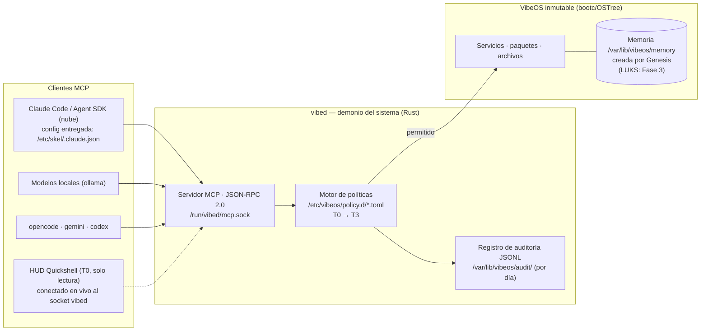

<div align="center">

# 🌀 VibeOS

**Un sistema operativo inmutable que nace en blanco,<br/>donde la IA es un ciudadano del sistema, no una aplicación instalada.**

[](https://github.com/Micka420-collab/vibeos/actions/workflows/ci.yml)
[](LICENSE)
[](docs/HARDWARE.md)
[](os/Containerfile)
[](docs/DESKTOP.md)
[](STATUS.md)

**🌐 [Français](README.md) · [English](README.en.md) · Español · [Deutsch](README.de.md)**

</div>

> ℹ️ Esta es una traducción del README principal. VibeOS es un proyecto francófono: los documentos detallados en `docs/` se mantienen en francés (la lengua canónica del proyecto). Esta página enlaza directamente con ellos.

## 👋 ¿Nuevo por aquí? VibeOS en 2 minutos

**La idea en una imagen.** Imagina un edificio muy seguro. La inteligencia artificial no es ahí una app que instalas y que luego hace lo que quiere: es un **residente sujeto a un reglamento**, con derechos y deberes — no un invitado al que se le da el llavero. Para actuar sobre el sistema (instalar un programa, reiniciar un servicio, tocar el disco), debe pasar por el **guardián** del edificio, un programa llamado `vibed`. El guardián consulta el reglamento, deja pasar lo autorizado, **te llama a ti — el propietario — para todo lo arriesgado**, y anota cada gesto en un **registro inviolable**. Eso es todo VibeOS en una imagen: la IA tiene poderes reales, pero gobernados.

**Qué es.** VibeOS es un sistema operativo Linux (como Ubuntu o Fedora) pensado para *programar dialogando con agentes de IA* — asistentes de código como Claude Code, que escriben y ejecutan código por ti. Eso es el *vibecoding*.

**En qué se diferencia de un Linux normal.** Dos cosas. Es **inmutable**: no se trastea el núcleo del sistema mientras funciona, se reemplaza la imagen entera de un bloque — y si una actualización rompe algo, se vuelve al estado anterior de un gesto. Y la IA no es una aplicación puesta encima: está cableada en los cimientos, encuadrada por reglas desde el principio.

**Para quién, y en qué punto está.** Hoy, sobre todo para los curiosos y para quienes contribuyen y quieren entender el proyecto o hacerlo avanzar. **Todavía no** es un SO listo para instalar por todos: el proyecto está en **pre-alpha**, y hasta la fecha **ninguna imagen se ha arrancado en hardware real** — todo lo que este repositorio afirma está probado por pruebas automáticas, no por una pantalla que alguien haya visto. El estado honesto (hecho / en curso / por hacer) vive en **[STATUS.md](STATUS.md)**.

**Cómo funciona, en 4 tiempos:**

1. **La máquina nace en blanco.** La imagen es la misma para todos y no contiene ningún dato personal. En el primer arranque, una secuencia llamada *Genesis* crea la memoria de la máquina, que solo te pertenece a ti. *(El cifrado de esa memoria está previsto para una fase posterior — de momento se crea en texto claro, y el proyecto lo dice sin rodeos.)*
2. **La IA le pide al guardián.** Un agente (Claude Code, un modelo local vía ollama…) dirige sus peticiones de acción de sistema al guardián `vibed`, en lugar de hacer lo que quiera como root.
3. **Una regla decide; tú validas lo arriesgado.** El guardián clasifica cada acción de **T0** (observar, sin riesgo) a **T3** (destructivo). Lo inofensivo pasa solo; **modificar el sistema o tocar el disco exige tu aprobación explícita**. En caso de duda, o si ninguna regla coincide, todo se **deniega por defecto**.
4. **Todo queda trazado.** Cada llamada se escribe en un registro *append-only* (se añade, nunca se reescribe) y encadenado criptográficamente: siempre se puede responder a «quién hizo qué, cuándo y con qué autorización».

**Mini-glosario** (las palabras que reaparecen por todas partes más abajo):

| Palabra | En claro |
|---|---|
| **inmutable** | el núcleo del sistema es de solo lectura; una actualización fallida se repara volviendo atrás un bloque, sin cicatriz |
| **vibecoding** | programar describiendo lo que quieres a una IA que escribe el código |
| **agente de IA** | un asistente que no solo habla: lee archivos, ejecuta comandos (p. ej. Claude Code) |
| **`vibed`** | el «guardián»: el programa de sistema por el que pasa toda acción privilegiada de un agente |
| **MCP** | el lenguaje estándar con el que los agentes hablan con `vibed` (una única puerta de entrada controlada) |
| **política / T0→T3** | el «reglamento» que clasifica cada acción por nivel de riesgo y decide quién puede ejecutarla |
| **registro de auditoría** | el «registro inviolable» que guarda la traza de cada gesto |
| **Genesis** | la secuencia que crea la memoria de la máquina en el primer arranque |

> ¿Quieres el *porqué* más que el *cómo*? Lee el manifiesto **[VISION.md](VISION.md)**. Para la arquitectura por capas y los diagramas, véase **[docs/ARCHITECTURE.md](docs/ARCHITECTURE.md)**.
>
> El resto de este README es la **versión técnica** de lo que acabas de leer — más densa, pero cuenta exactamente la misma historia.

---

VibeOS es una distribución de Linux **nativa para IA, inmutable y segura por diseño**, dedicada al *vibecoding*. Derivada de Fedora Kinoite (KDE Plasma 6) y construida como imagen con bootc/OSTree, expone el control del sistema a los agentes de IA a través de un contrato estricto —un demonio del sistema (`vibed`), un servidor MCP, un motor de políticas y un registro de auditoría— en lugar de acceso directo a la shell. El sistema operativo se entrega **en blanco**: su memoria se crea en el primer arranque mediante una secuencia *Genesis* y pertenece a su usuario, y a nadie más (el cifrado LUKS de esa memoria llega en la **Fase 3** — véase [ROADMAP.md](ROADMAP.md)). Proyecto plurianual: la base v0.1 está sentada —imagen multiarquitectura firmada, dos ISO, demonio `vibed` activo en el arranque, escritorio de vibecoding entregado.

> 📊 **¿En qué punto está el proyecto?** El estado vivo (hecho / en curso / por hacer) está en **[STATUS.md](STATUS.md)**.

---

## Características clave

### 🌱 Nacimiento en blanco — Genesis
La imagen del sistema no contiene **ninguna memoria de fábrica**. En el primer arranque, `vibeos-genesis.service` (protegido por `ConditionPathExists=!/var/lib/vibeos/memory/.initialized`) ejecuta `/usr/libexec/vibeos/genesis.sh` y construye la memoria de la máquina desde cero en `/var/lib/vibeos/memory` —**en texto claro en v0.1**; el cifrado LUKS/TPM2 del volumen es un entregable de la **Fase 3**. El **modo amnésico** (inspirado en Tails) recrea esa memoria en tmpfs **en cada arranque** —nada sobrevive al apagado: el **generador de systemd** está **entregado** (activado por el parámetro de kernel `vibeos.amnesic=1`); su validación en VM sigue siendo **Fase 3**. La especificación completa está en [docs/MEMORY.md](docs/MEMORY.md).

### 🤖 La IA, ciudadana del sistema — vibed + MCP + políticas
> **Estado:** el binario `vibed` está **incrustado en la imagen** (compilado en multietapa en `os/Containerfile`, instalado en `/usr/bin/vibed`). En el arranque, `vibed.service` (activado por preset) inicia, **carga y aplica la política instalada** (`/etc/vibeos/policy.d/`, fail-closed), **sirve el servidor MCP** en `/run/vibed/mcp.sock` y **audita** cada llamada bajo `/var/lib/vibeos`. Del lado del cliente, la imagen entrega la **configuración MCP de Claude Code** (`/etc/skel/.claude.json`): el servidor `vibeos` se descubre **sin configuración manual** (requisito: el grupo `vibeos-agents`). El **mecanismo de aislamiento por herramienta** ([ADR-019](docs/DECISIONS.md)) está entregado — unidades systemd transitorias endurecidas + el helper de bajo privilegio `vibed-tool`, ejercitado por la herramienta `sandbox.probe` (T1) que juzga el confinamiento realmente obtenido — pero su **prueba en hardware real sigue pendiente** (machine-gated); quedan también el SELinux dedicado `vibed_t`, `User=vibed` y el anclaje externo TPM/Rekor de la cadena de auditoría (**Fase 4**). El crate `vibed` está probado (361 pruebas en verde, incluidas 9 pruebas de integración MCP de extremo a extremo sobre socket + 3 de política); el registro de auditoría está **encadenado por hash SHA-256** (`vibed --verify-audit`).

El demonio del sistema `vibed` (Rust, tokio, unidad `vibed.service`) expone el control del sistema mediante un **servidor MCP** (JSON-RPC 2.0) sobre el socket unix `/run/vibed/mcp.sock`. Cada acción de un agente pasa por un **motor de políticas** (`/etc/vibeos/policy.d/*.toml`, gana la primera regla que coincide, denegación por defecto) organizado en niveles de capacidad:

| Nivel | Alcance | Aprobación humana |
|---|---|---|
| **T0** | Observación (solo lectura) | No |
| **T1** | Modificación de usuario (archivos, configuración) | No (configurable) |
| **T2** | Modificación del sistema (paquetes, servicios) | **Sí, siempre** |
| **T3** | Destructivo (disco, credenciales, identidad de red) | **Sí, siempre** |

Cada llamada a herramienta se registra en un **registro de auditoría JSONL de solo anexado, encadenado por hash SHA-256, con rotación por día UTC** (`/var/lib/vibeos/audit/vibed-<fecha>.jsonl`), con la identidad del llamante (uid/gid/pid) —cualquier alteración se detecta con `vibed --verify-audit`. El anclaje externo de la cadena (TPM/Rekor) sigue siendo **Fase 4**.

El **flujo de aprobación humana T2/T3** está entregado en su fontanería: una solicitud crea una entrada trazada, el operador ejecuta `vibectl approve <id>`, y una **concesión de un solo uso** (acotada a `(herramienta, objetivo, uid)`, de corta vida) autoriza la reinvocación —un agente **nunca** puede aprobar su propia solicitud (almacén solo para root), y la auditoría registra *quién* aprobó (`ok_approved(by_uid=N)`). Un **limitador de tasa por uid** (token bucket) acota a un agente desbocado o comprometido (anti-inundación, rechazo auditado). **Primer backend T2 real entregado**: `svc.restart` reinicia realmente una unidad systemd tras la aprobación, con una **allowlist de objetivos** (las unidades de acceso/auditoría/aprobación — `sshd`, `vibed`, `dbus`, `user@*`… — se rechazan **antes** de la cola de aprobación) y el nombre de unidad canonicalizado antes de la decisión. `pkg.install` sigue siendo un stub (backend aplazado en un OS inmutable, [ADR-016](docs/DECISIONS.md)). Superficie de herramientas actual (20 — el catálogo `tools/list` es la referencia): T0 `os.status`/`fs.read`/`fs.list`/`svc.status`/`log.read`/`sectools.list`/`memory.query`/`agent.thinking`/`agent.sessions`/`agents.list`/`agent.activity`/`user.model`/`policy.check`/`policy.capabilities`, T1 `fs.write`/`memory.append`/`sandbox.probe`, T2 `svc.restart`/`pkg.install`/`deploy.plan` — `deploy.plan` está **denegado por defecto** (la política entregada no contiene ninguna regla `[rule.deploy]`: fail-closed hasta que el operador ponga sus objetivos en la allowlist, [ADR-021](docs/DECISIONS.md)). Los módulos `browser.*` ([ADR-022](docs/DECISIONS.md)) y `os.propose` ([ADR-024](docs/DECISIONS.md), por ratificar) existen en el código pero están **fuera del catálogo** — deliberadamente inertes hasta que su ruta gobernada esté cableada. El diálogo de aprobación de Plasma/HUD llega en la **Fase 4**.

### 🔒 Inmutabilidad y seguridad verificable
Entregado ya en v0.1: raíz de solo lectura, actualizaciones atómicas y reversión de fábrica (bootc/OSTree), SELinux `enforcing` (política targeted de Fedora), imágenes del sistema **firmadas con sigstore/cosign en CI**, imagen base fijada por digest y CLI de IA fijadas a versiones exactas. Planificado: cadena de arranque medido **UEFI Secure Boot → UKI → dm-verity/composefs** (**Fase 4**), generalización del aislamiento por herramienta (mecanismo systemd-run/seccomp entregado y ejercitado por `sandbox.probe` — [ADR-019](docs/DECISIONS.md); landlock y generalización: **Fase 3**), política SELinux dedicada `vibed_t` (**Fase 4**). Referencia de imagen: `ghcr.io/micka420-collab/vibeos`.

### 🧰 Caja de herramientas de vibecoding completa — nube + local
Runtime de agentes híbrido, preinstalado y fijado en la imagen: **Claude Code** y el **Claude Agent SDK** (nube de Anthropic), **gemini-cli** (Google), **codex** (OpenAI), **opencode** (agente de terminal multiproveedor, 100 % local vía ollama) y **ollama** para modelos locales —la imagen incluye todo para programar sin conexión (la validación formal «`ollama run` sin red» es un criterio de salida de la Fase 1, aún abierto). `aider` sigue siendo instalable bajo demanda (`uvx --python 3.12 aider-chat`) sin tocar el sistema inmutable.

### 🛡️ Caja de herramientas de ciberseguridad gobernada
VibeOS es **security-first**: una caja de herramientas profesional de pentest/DFIR está incrustada en la imagen (≈ 60 RPM firmados de Fedora/RPM Fusion —`nmap`, `hashcat`, `radare2`, `aircrack-ng`, `impacket`, `sleuthkit`, `suricata`, `lynis`…), al estilo Kali/Parrot/BlackArch. La diferencia: está **gobernada** por el motor de políticas. Un agente de IA puede **descubrir** la caja en solo lectura (herramienta MCP `sectools.list`, T0) pero **no puede ejecutar** ninguna herramienta sin pasar por los niveles —todo lo que es **activo contra un objetivo es T2, lo destructivo es T3**, con **aprobación humana obligatoria**. Catálogo completo (estado del arte 2025-2026, incluida la **seguridad de IA/LLM**: garak, PyRIT, guardrails) y marco de uso autorizado: [docs/SECURITY-TOOLKIT.md](docs/SECURITY-TOOLKIT.md).

### 🧬 Multiarquitectura — amd64 + arm64
VibeOS apunta a **linux/amd64 y linux/arm64**. Desde la release `v0.1.0-dev`, la CI construye ambas arquitecturas en **runners nativos**, publica el **manifiesto multiarquitectura firmado con cosign** (keyless, registro Rekor) en ghcr.io y genera **una ISO por arquitectura** como artefactos de release. La capa del controlador **NVIDIA** (akmod, RPM Fusion) se compila al construir la imagen, solo en amd64; su **validación en el PC de referencia** (RTX 3070 Ti) es un criterio de salida de la Fase 1, aún abierto —véase [docs/HARDWARE.md](docs/HARDWARE.md).

### 🎨 Una experiencia de escritorio pensada para el vibecoding
Un escritorio Plasma 6 organizado en torno al tríptico **Agente / Contexto / Confianza**. La sesión se abre con el **Global Theme «VibeOS Dark»** (predeterminado del sistema, motor Kvantum incluido) con el **HUD de agentes** (Quickshell, compilado en la imagen, autoarrancado — estado de los agentes, nivel de política actual y medidores del modelo local; **conectado en vivo a `vibed`** vía `Quickshell.Io.Socket`: os.status, memoria, razonamiento y el roster confinado por uid son reales, con degradación elegante sin conexión). El terminal está listo para usar desde el primer arranque: Ghostty + fish + Starship + Zellij con el layout característico «agente + lazygit + auditoría», preset de Neovim «VibeVim». Esta selección es fruto de una **curación de 113 proyectos de código abierto**, filtrada por licencia redistribuible y coherencia —detallada en [docs/ECOSYSTEM.md](docs/ECOSYSTEM.md) y [docs/DESKTOP.md](docs/DESKTOP.md).

---

## Entregado en v0.1 / En camino

| Capacidad | Estado |
|---|---|
| Imagen bootc inmutable (Fedora Kinoite, raíz RO, reversión atómica) | ✅ Entregado v0.1 |
| Imagen + ISO **amd64** (build local + CI) | ✅ Entregado v0.1 |
| Manifiesto **arm64** + ISO por arquitectura (runners nativos, release `v0.1.0-dev`) | ✅ Entregado v0.1 |
| Arranque de las ISO validado en VM + NVIDIA validado en el PC de referencia | 🔄 Criterios de salida de la Fase 1 (en curso) |
| CLI de IA preinstaladas y fijadas (claude, agent SDK, gemini, codex, opencode, ollama) | ✅ Entregado v0.1 |
| Firma cosign (keyless) de las imágenes en CI | ✅ Entregado v0.1 |
| Archivos de política colocados en `/etc/vibeos/policy.d/` | ✅ Entregado v0.1 |
| Binario `vibed` incrustado en la imagen (arranca al inicio) | ✅ Entregado v0.1 |
| Servidor MCP `vibed` en `/run/vibed/mcp.sock` | ✅ Entregado v0.1 |
| Carga / aplicación de políticas por `vibed` (fail-closed) | ✅ Entregado v0.1 |
| Registro de auditoría JSONL encadenado SHA-256 (`/var/lib/vibeos/audit/`, un archivo por día) con identidad del llamante | ✅ Entregado v0.1 |
| **Flujo de aprobación humana T2/T3** (fontanería: `vibectl approve/deny`, concesiones de un solo uso, aprobador auditado) | ✅ Entregado (Fase 2) |
| **Limitador de tasa por uid** (token bucket, anti-inundación; almacén de aprobación acotado) | ✅ Entregado (Fase 2) |
| Genesis en el primer arranque (memoria creada **en texto claro**, unidad + `genesis.sh`) | ✅ Entregado v0.1 |
| Global Theme **VibeOS Dark por defecto** (`/etc/xdg/kdeglobals` + Kvantum) | ✅ Entregado (Fase 2) |
| **HUD Quickshell** instalado + autoarrancado (runtime compilado en la imagen), **conectado en vivo a `vibed`** (os.status, memoria, razonamiento, roster) | ✅ Entregado (Fase 2.5) |
| **`svc.restart` (T2) — backend real** tras aprobación + deny-list de objetivos (unidades de acceso/auditoría/aprobación rechazadas antes de la cola) · **`agents.list` (T0)** roster confinado por uid | ✅ Entregado (Fase 2.5) |
| **Config MCP de Claude Code** entregada (`/etc/skel/.claude.json` → socket `vibed`) | ✅ Entregado (Fase 2) |
| Conexión **en vivo** del HUD al socket `vibed` (QML `Quickshell.Io`) | 🛣️ Fase 2 |
| **`memory.append`** (T1, aditivo: journal + knowledge) · `scope`/`limit` de `memory.query` | ✅ Entregado (Fase 2) |
| **Herramientas T1 reales** adicionales · scopes `user`/`projects` de `memory.append` | 🛣️ Fase 2 |
| **Supervisor de agentes** con presupuestos + **modo autónomo always-on** (T0/T1 total, T2/T3 en cola asíncrona — el umbral de aprobación nunca se rebaja) | ✅ Entregado (Fase 2.5, mecanismo) |
| **Captura del razonamiento** de los agentes (tap sobre el flujo `stream-json`) + herramienta T0 `agent.thinking` | ✅ Entregado (Fase 2.5, mecanismo) |
| Unidad `vibeos-agent@.service` + **token de suscripción sellado con TPM2** + **allowlist de egress por nombre de host** | ✅ Entregado (Fase 2.5, scaffolding) — enforcement en arranque pendiente |
| Cifrado LUKS/TPM2 de la memoria | 🛣️ Fase 3 |
| Modo amnésico (tmpfs recreado en cada arranque, generador systemd) | 🛣️ Fase 3 |
| Entrevista de nacimiento (prototipo: `agent/genesis_interview.py`, no conectado en v0.1) | 🛣️ Fase 3 |
| Aislamiento por herramienta — generalización a toda la superficie (el mecanismo ADR-019 está entregado, ver `sandbox.probe` abajo) | 🔄 Mecanismo entregado; generalización + prueba en hardware pendientes |
| **`policy.capabilities` (T0)** — manifiesto de capacidades **derivado** de la política cargada (el agente lee el mapa de sus derechos sin tantear) | ✅ Entregado ([ADR-023](docs/DECISIONS.md)) |
| **`agent.activity` (T0)** — el ciudadano relee sus **propios actos** (llamadas gobernadas recientes, rechazos incluidos), confinado por uid | ✅ Entregado ([ADR-026](docs/DECISIONS.md)) |
| **`user.model` (T0)** — modelo **derivado y transparente** de *cómo trabajas* (preferencias, patrones, ritmo, fricción) + **anticipación** determinista de tus próximas acciones; derivado de datos ya gobernados, confinado por uid, local/borrable | ✅ Base entregada ([ADR-028](docs/DECISIONS.md)); aprendizaje opt-in/embeddings = por venir |
| **Genesis vivo** — en el primer arranque la IA **elige su carácter** (`personality.toml`: nombre, arquetipo, 6 rasgos, tono), **único por instalación** y determinista (derivado de `machine_id`, sin conexión), con un **despertar** futurista en la consola; scope `personality` (`memory.query`) + invariante selfcheck `ai-personality`. El carácter **se pliega hacia el humano** (tabla `[adaptation]` ← `user.model`) | ✅ Nacimiento + despertar entregados ([ADR-029](docs/DECISIONS.md)); bucle de adaptación vivo y ceremonia gráfica HUD = por venir/machine-gated |
| **`sandbox.probe` (T1)** — prueba pilotada del sandbox ADR-019 (unidad transitoria endurecida + helper `vibed-tool`, veredicto de confinamiento juzgado) | ✅ Entregado (mecanismo); prueba en hardware real = machine-gated |
| **`deploy.plan` (T2)** — lectura de estado de despliegue (fly/vercel/railway), token sellado TPM2 **nunca en argv**, sandbox ADR-019 | ✅ Entregado, **denegado por defecto** (ninguna regla `[rule.deploy]` entregada — fail-closed, [ADR-021](docs/DECISIONS.md)) |
| **Sustrato de navegador gobernado** — `chromium-headless` en la imagen + lanzador CDP-sobre-pipe endurecido (`spawn_chromium`) | ✅ Sustrato entregado; herramientas `browser.*` **fuera del catálogo** hasta cablear la ejecución gobernada ([ADR-022](docs/DECISIONS.md)) |
| **Perf de capa baja** — auditoría/journal fuera del reactor tokio, catálogo de herramientas en caché · **ajuste del kernel para cargas IA** (`sysctl.d` con fuentes + zram zstd) + 18.º invariante del selfcheck | ✅ Entregado ([ADR-025](docs/DECISIONS.md)); medición en hardware = machine-gated |
| UKI / arranque medido, auditoría encadenada por hash, SELinux dedicado, `User=vibed` | 🛣️ Fase 4 |
| Instalador guiado, cifrado de disco por defecto | 🛣️ Fase 5 |

Regla de redacción del proyecto: ningún mecanismo no implementado se describe en presente —cada documento distingue «entregado en v0.1» de «Fase N (especificado)».

---

## Arquitectura de un vistazo



---

## Estructura del repositorio

| Directorio | Contenido |
|---|---|
| `docs/` | Documentación: arquitectura, build ([docs/BUILD.md](docs/BUILD.md)), hardware de referencia ([docs/HARDWARE.md](docs/HARDWARE.md)), memoria, seguridad, decisiones |
| `os/` | Definición de la imagen bootc/OSTree (derivada de Fedora Kinoite, KDE Plasma 6, multiarquitectura) |
| `vibed/` | Demonio del sistema `vibed` (Rust, tokio): servidor MCP, motor de políticas, auditoría |
| `agent/` | Runtime de agentes: integración Claude Code / Agent SDK, ollama, opencode, prototipo de entrevista Genesis |
| `memory/` | Subsistema de memoria: secuencia Genesis (`memory/genesis.sh`) |
| `security/` | Políticas (`policy.d`), endurecimiento, firma |
| `desktop/` | Trabajo de escritorio: tema VibeOS Dark, paleta de niveles, HUD Quickshell (QML) — véase [docs/DESKTOP.md](docs/DESKTOP.md) |
| `installer/` | Instalador: kickstart, branding, logo — véase [docs/INSTALLER.md](docs/INSTALLER.md) |
| `.github/` | CI de GitHub Actions: pruebas (`ci.yml`), build multiarquitectura de la imagen del SO, firma cosign, push a ghcr.io, generación de las ISO |

---

## Inicio rápido

### Probar la imagen (sin construir nada)

```bash
# Obtener la imagen multiarquitectura (amd64 / arm64):
podman pull ghcr.io/micka420-collab/vibeos:0.1.0-dev

# Verificar la firma cosign (keyless, CI de GitHub Actions):
cosign verify ghcr.io/micka420-collab/vibeos:0.1.0-dev \
  --certificate-identity-regexp 'https://github.com/Micka420-collab/vibeos/.*' \
  --certificate-oidc-issuer https://token.actions.githubusercontent.com
```

Las **ISO instalables** (una por arquitectura) se producen como artefactos de CI en cada etiqueta `v*` —véase [docs/BUILD.md](docs/BUILD.md) para generarlas localmente.

### Hablar con `vibed` desde una sesión de VibeOS

Acceso al socket: **los administradores (grupo `wheel`) se inscriben automáticamente** en `vibeos-agents` en cada arranque (`vibeos-agents-group.service`) —ya tienen `sudo`, así que es *menos* de lo que ya poseen. Una cuenta **no-`wheel`** sigue siendo opt-in: `sudo usermod -aG vibeos-agents <usuario>` (luego reabrir la sesión). La pertenencia surte efecto en el siguiente inicio de sesión.

```bash
# Claude Code descubre el servidor MCP «vibeos» automáticamente
# (config entregada en ~/.claude.json; instrucciones en ~/.claude/CLAUDE.md).
# Prueba manual sin cliente MCP:
printf '%s\n' '{"jsonrpc":"2.0","id":1,"method":"tools/list"}' \
  | socat - UNIX-CONNECT:/run/vibed/mcp.sock
```

### Construir la imagen uno mismo

El build local se realiza bajo **WSL2 Ubuntu + podman** (el host Windows no necesita ni docker ni podman). La CI de GitHub Actions construye la imagen del SO multiarquitectura en runners nativos, la firma con cosign, la sube a `ghcr.io` y genera las ISO con `bootc-image-builder`.

```bash
git clone https://github.com/Micka420-collab/vibeos.git
cd vibeos
podman build -t vibeos:dev -f os/Containerfile .
```

➡️ **Todas las instrucciones detalladas (requisitos, ISO, publicación) están en [docs/BUILD.md](docs/BUILD.md).**

---

## Estado del proyecto

| | |
|---|---|
| **Fase** | Pre-alpha — Fase 1 «Primera ISO» (validación en VM pendiente) · Fase 2 «vibed + MCP» muy avanzada · Fase 2.5 «Autonomía gobernada» ampliamente implementada (supervisor, captura del razonamiento, `svc.restart` real, agent-runner + TPM2 + egress, HUD en vivo) |
| **Última actualización** | 2026-07-21 |
| **Imagen del SO** | `ghcr.io/micka420-collab/vibeos:0.1.0-dev` — manifiesto amd64 + arm64, **firmado con cosign** (Rekor) |
| **ISO** | amd64 (7,0 GB) + arm64 (6,3 GB) — artefactos de CI de la release `v0.1.0-dev` |
| **Build** | CI en verde (runners nativos, ~15 min/arq) · `bootc container lint` OK · 361 pruebas `vibed` en verde (+ 17 pruebas de la extensión Zed + 73 comprobaciones del cliente HUD) |
| **Máquina de referencia** | Ryzen 7 3700X + RTX 3070 Ti + 16 GB — [docs/HARDWARE.md](docs/HARDWARE.md) |
| **Espere** | Rupturas, reescrituras, cero garantía de estabilidad |

VibeOS es un proyecto **plurianual**. La v0.1 sienta un repositorio completo, coherente y construible —no un producto terminado. La tabla «Entregado en v0.1 / En camino» de arriba es la referencia sobre lo que existe realmente.

---

## Ir más lejos

**Visión y dirección**
- 📜 [VISION.md](VISION.md) — el manifiesto: por qué existe VibeOS, sus cinco principios fundadores
- 🗺️ [ROADMAP.md](ROADMAP.md) — la trayectoria plurianual, hito a hito
- 📊 [STATUS.md](STATUS.md) — el estado vivo (hecho / en curso / por hacer)

**Diseño**
- 🏛️ [docs/ARCHITECTURE.md](docs/ARCHITECTURE.md) — la arquitectura por capas (diagramas, secuencias)
- 🧭 [docs/DECISIONS.md](docs/DECISIONS.md) — las decisiones de arquitectura (ADR)
- 🧠 [docs/MEMORY.md](docs/MEMORY.md) — el subsistema de memoria y Genesis
- 🎨 [docs/DESKTOP.md](docs/DESKTOP.md) · 🧩 [docs/ECOSYSTEM.md](docs/ECOSYSTEM.md) — el escritorio de vibecoding y la selección OSS

**Seguridad**
- 🛡️ [SECURITY.md](SECURITY.md) — política de seguridad y reporte de vulnerabilidades
- 🎯 [docs/THREAT-MODEL.md](docs/THREAT-MODEL.md) · 🔐 [docs/SECURITY-ARCHITECTURE.md](docs/SECURITY-ARCHITECTURE.md)

**Construir e instalar**
- 🔨 [docs/BUILD.md](docs/BUILD.md) — build de la imagen, ISO, publicación
- 💿 [docs/INSTALLER.md](docs/INSTALLER.md) — el instalador y el primer arranque
- 🖥️ [docs/HARDWARE.md](docs/HARDWARE.md) — arquitecturas objetivo y máquina de referencia

## Licencia

Distribuido bajo la licencia **Apache-2.0**. Véase [LICENSE](LICENSE).
