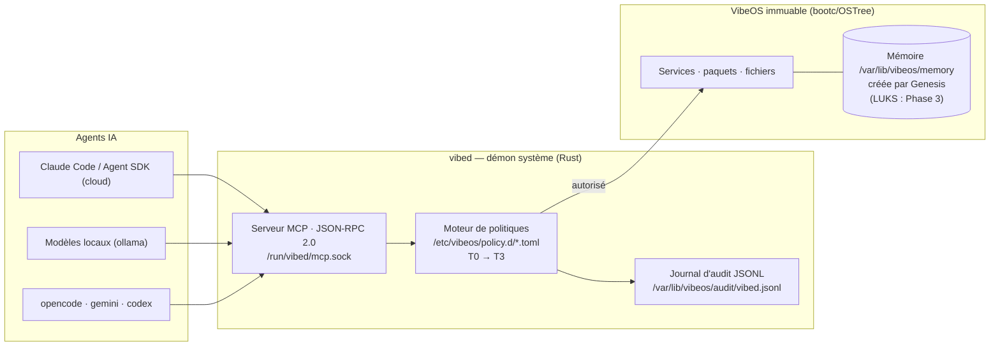

<div align="center">

# 🌀 VibeOS

**Un système d'exploitation immuable qui naît vierge,<br/>où l'IA est un citoyen du système — pas une application installée.**

[](https://github.com/Micka420-collab/vibeos/actions/workflows/ci.yml)
[](LICENSE)
[](docs/HARDWARE.md)
[](os/Containerfile)
[](docs/DESKTOP.md)
[](STATUS.md)

</div>

VibeOS est une distribution Linux **AI-native, immuable et sécurisée par conception**, dédiée au *vibecoding*. Dérivée de Fedora Kinoite (KDE Plasma 6) et construite en mode image avec bootc/OSTree, elle expose le contrôle du système aux agents IA à travers un contrat strict — un démon système (`vibed`), un serveur MCP, un moteur de politiques et un journal d'audit — plutôt qu'un accès brut au shell. L'OS est livré **vierge** : sa mémoire est créée au premier démarrage par une séquence *Genesis* et appartient à son utilisateur, et à personne d'autre (le chiffrement LUKS de cette mémoire arrive en **Phase 3** — voir [ROADMAP.md](ROADMAP.md)). Projet pluriannuel, fondation v0.1 posée aujourd'hui.

> 📊 **Où en est le projet ?** L'état d'avancement vivant (fait / en cours / reste à faire) est dans **[STATUS.md](STATUS.md)**.

---

## Fonctionnalités clés

### 🌱 Naissance vierge — Genesis
L'image OS ne contient **aucune mémoire d'usine**. Au premier démarrage, `vibeos-genesis.service` (gardé par `ConditionPathExists=!/var/lib/vibeos/memory/.initialized`) exécute `/usr/libexec/vibeos/genesis.sh` et construit la mémoire de la machine à partir de zéro dans `/var/lib/vibeos/memory` — **en clair en v0.1** ; le chiffrement LUKS/TPM2 du volume est un livrable de la **Phase 3**. Le **mode amnésique** (inspiré de Tails), qui recréera cette mémoire en tmpfs **à chaque démarrage** — rien ne survivra à l'extinction — est lui aussi un livrable **Phase 3** (generator systemd). La spécification complète est dans [docs/MEMORY.md](docs/MEMORY.md).

### 🤖 L'IA, citoyenne de l'OS — vibed + MCP + politiques
> **Statut v0.1 :** le binaire `vibed` n'est **pas encore embarqué dans l'image** — c'est un livrable **Phase 2** (l'unité `vibed.service` est livrée mais gardée par `ConditionPathExists=/usr/bin/vibed`, donc sautée tant que le binaire est absent). Le serveur MCP, le **chargement des politiques** et le **journal d'audit** décrits ci-dessous sont donc la **cible Phase 2** ; en v0.1, seuls les **fichiers** de politique sont posés dans l'image. Le crate `vibed` existe et est testé (33 tests verts).

Le démon système `vibed` (Rust, tokio, unité `vibed.service`) expose le contrôle de l'OS via un **serveur MCP** (JSON-RPC 2.0) sur la socket unix `/run/vibed/mcp.sock`. Chaque action d'un agent passe par un **moteur de politiques** (`/etc/vibeos/policy.d/*.toml`, la première règle qui matche gagne, refus par défaut) organisé en niveaux de capacités :

| Niveau | Portée | Approbation humaine |
|---|---|---|
| **T0** | Observation (lecture seule) | Non |
| **T1** | Modification utilisateur (fichiers, config) | Non (configurable) |
| **T2** | Modification système (paquets, services) | **Oui, toujours** |
| **T3** | Destructif (disque, identifiants, identité réseau) | **Oui, toujours** |

Chaque appel d'outil est consigné dans un **journal d'audit JSONL append-only** (`/var/lib/vibeos/audit/vibed.jsonl`), avec l'identité de l'appelant (uid/gid/pid). Le chaînage cryptographique du journal est prévu en **Phase 4**.

### 🔒 Immuabilité & sécurité vérifiable
Livré dès la v0.1 : racine en lecture seule, mises à jour atomiques et retour d'usine (bootc/OSTree), SELinux `enforcing` (politique targeted de Fedora), images OS **signées avec sigstore/cosign en CI**, image de base épinglée par digest et CLIs IA épinglées en versions exactes. Planifié : chaîne de démarrage mesurée **UEFI Secure Boot → UKI → dm-verity/composefs** (**Phase 4**), bac à sable par outil — systemd-run, seccomp, landlock (**Phase 3**), politique SELinux dédiée `vibed_t` (**Phase 4**). Référence d'image : `ghcr.io/micka420-collab/vibeos`.

### 🧰 Boîte à outils vibecoding complète — cloud + local
Runtime d'agents hybride, préinstallé et épinglé dans l'image : **Claude Code** et le **Claude Agent SDK** (cloud Anthropic), **gemini-cli** (Google), **codex** (OpenAI), **opencode** (agent terminal multi-fournisseur, 100 % local via ollama) et **ollama** pour les modèles locaux — utilisable hors ligne. Codez avec le meilleur des deux mondes, même sans réseau. `aider` reste installable à la demande (`uvx --python 3.12 aider-chat`) sans toucher l'OS immuable.

### 🧬 Multi-architecture — amd64 + arm64
VibeOS cible **linux/amd64 et linux/arm64**. En v0.1, la CI construit l'**image amd64** (poussée sur ghcr.io) et génère l'**ISO amd64** ; le **manifest arm64** et les **ISO par architecture via CI** sont en **première validation** (release sur tag `v0.1.0-dev` en cours). La couche pilote **NVIDIA** (akmod, RPM Fusion) s'applique sur amd64 et est validée sur le PC de référence du projet — voir [docs/HARDWARE.md](docs/HARDWARE.md).

### 🎨 Une expérience de bureau pensée pour le vibecoding
Un bureau Plasma 6 organisé autour du triptyque **Agent / Contexte / Confiance** : thème **« VibeOS Dark »**, HUD affichant l'état des agents, le tier de politique courant et les jauges du modèle local, et un terminal prêt à l'emploi dès le premier boot (Ghostty + fish + Starship + Zellij avec le layout signature « agent + lazygit + audit », preset Neovim « VibeVim »). Cette sélection est le fruit d'une **curation de 113 projets open-source**, filtrée par licence redistribuable et cohérence — détaillée dans [docs/ECOSYSTEM.md](docs/ECOSYSTEM.md) et [docs/DESKTOP.md](docs/DESKTOP.md).

---

## Livré en v0.1 / En route

| Capacité | Statut |
|---|---|
| Image bootc immuable (Fedora Kinoite, racine RO, rollback atomique) | ✅ Livré v0.1 |
| Image + ISO **amd64** (build local + CI) | ✅ Livré v0.1 |
| Manifest **arm64** + ISO par architecture (via CI) | 🔄 Première release en validation |
| CLIs IA préinstallées et épinglées (claude, agent SDK, gemini, codex, opencode, ollama) | ✅ Livré v0.1 |
| Signature cosign (keyless) des images en CI | ✅ Livré v0.1 |
| Fichiers de politique posés dans `/etc/vibeos/policy.d/` | ✅ Livré v0.1 |
| Chargement / application des politiques par `vibed` (fail-closed) | 🛣️ Phase 2 (avec `vibed`) |
| Journal d'audit JSONL (`/var/lib/vibeos/audit/vibed.jsonl`) avec identité de l'appelant | 🛣️ Phase 2 (avec `vibed`) |
| Genesis au premier boot (mémoire créée **en clair**, unité + `genesis.sh`) | ✅ Livré v0.1 |
| Chiffrement LUKS/TPM2 de la mémoire | 🛣️ Phase 3 |
| Mode amnésique (tmpfs recréé à chaque boot, generator systemd) | 🛣️ Phase 3 |
| Interview de naissance (prototype : `agent/genesis_interview.py`, non câblé en v0.1) | 🛣️ Phase 3 |
| Bac à sable par outil (systemd-run, seccomp, landlock) | 🛣️ Phase 3 |
| UKI / boot mesuré, audit chaîné par hachage, SELinux dédiée, `User=vibed` | 🛣️ Phase 4 |
| Installateur guidé, chiffrement disque par défaut | 🛣️ Phase 5 |

Règle de rédaction du projet : aucun mécanisme non implémenté n'est décrit au présent — chaque document distingue « livré en v0.1 » de « Phase N (spécifié) ».

---

## Architecture en un coup d'œil



---

## Structure du dépôt

| Répertoire | Contenu |
|---|---|
| `docs/` | Documentation : architecture, build ([docs/BUILD.md](docs/BUILD.md)), matériel de référence ([docs/HARDWARE.md](docs/HARDWARE.md)), mémoire, sécurité, décisions |
| `os/` | Définition de l'image bootc/OSTree (dérivée de Fedora Kinoite, KDE Plasma 6, multi-arch) |
| `vibed/` | Démon système `vibed` (Rust, tokio) : serveur MCP, moteur de politiques, audit |
| `agent/` | Runtime d'agents : intégration Claude Code / Agent SDK, ollama, opencode, prototype d'interview Genesis |
| `memory/` | Sous-système mémoire : séquence Genesis (`memory/genesis.sh`) |
| `security/` | Politiques (`policy.d`), durcissement, signature |
| `desktop/` | Chantier bureau : thème VibeOS Dark, palette des tiers, HUD Quickshell (QML) — voir [docs/DESKTOP.md](docs/DESKTOP.md) |
| `installer/` | Installateur : kickstart, branding, logo — voir [docs/INSTALLER.md](docs/INSTALLER.md) |
| `.github/` | CI GitHub Actions : tests (`ci.yml`), build multi-arch de l'image OS, signature cosign, push vers ghcr.io, génération des ISO |

---

## Démarrage rapide

Le build local s'effectue sous **WSL2 Ubuntu + podman** (l'hôte Windows n'a besoin ni de docker ni de podman). La CI GitHub Actions construit l'image OS (**amd64** en v0.1, **manifest arm64** en première validation), la signe avec cosign, la pousse vers `ghcr.io` et génère l'ISO installable avec `bootc-image-builder`.

```bash
git clone https://github.com/Micka420-collab/vibeos.git
cd vibeos
# Prerequisites, image build and ISO generation:
# follow docs/BUILD.md step by step.
```

➡️ **Toutes les instructions détaillées sont dans [docs/BUILD.md](docs/BUILD.md).**

---

## Statut du projet

| | |
|---|---|
| **Phase** | Pré-alpha — fondation v0.1 |
| **Date** | 2026-07-03 |
| **Image OS** | `ghcr.io/micka420-collab/vibeos` — amd64 + arm64 |
| **Build** | Image amd64 constructible ✅ (`bootc container lint` OK) · tests `vibed` verts en CI ✅ |
| **Machine de référence** | Ryzen 7 3700X + RTX 3070 Ti + 16 Go — [docs/HARDWARE.md](docs/HARDWARE.md) |
| **Attendez-vous à** | Des ruptures, des refontes, zéro garantie de stabilité |

VibeOS est un projet **pluriannuel**. La v0.1 pose un dépôt complet, cohérent et buildable — pas un produit fini. Le tableau « Livré en v0.1 / En route » ci-dessus fait foi sur ce qui existe réellement.

---

## Aller plus loin

**Vision & pilotage**
- 📜 [VISION.md](VISION.md) — le manifeste : pourquoi VibeOS existe, ses cinq principes fondateurs
- 🗺️ [ROADMAP.md](ROADMAP.md) — la trajectoire pluriannuelle, jalon par jalon
- 📊 [STATUS.md](STATUS.md) — l'état d'avancement vivant (fait / en cours / reste à faire)

**Conception**
- 🏛️ [docs/ARCHITECTURE.md](docs/ARCHITECTURE.md) — l'architecture en couches (diagrammes, séquences)
- 🧭 [docs/DECISIONS.md](docs/DECISIONS.md) — les décisions d'architecture (ADR)
- 🧠 [docs/MEMORY.md](docs/MEMORY.md) — le sous-système mémoire et Genesis
- 🎨 [docs/DESKTOP.md](docs/DESKTOP.md) · 🧩 [docs/ECOSYSTEM.md](docs/ECOSYSTEM.md) — le bureau vibecoding et la sélection OSS

**Sécurité**
- 🛡️ [SECURITY.md](SECURITY.md) — politique de sécurité et signalement de vulnérabilités
- 🎯 [docs/THREAT-MODEL.md](docs/THREAT-MODEL.md) · 🔐 [docs/SECURITY-ARCHITECTURE.md](docs/SECURITY-ARCHITECTURE.md)

**Construire & installer**
- 🔨 [docs/BUILD.md](docs/BUILD.md) — build de l'image, ISO, publication
- 💿 [docs/INSTALLER.md](docs/INSTALLER.md) — l'installateur et le premier démarrage
- 🖥️ [docs/HARDWARE.md](docs/HARDWARE.md) — architectures cibles et machine de référence

## Licence

Distribué sous licence **Apache-2.0**. Voir [LICENSE](LICENSE).
