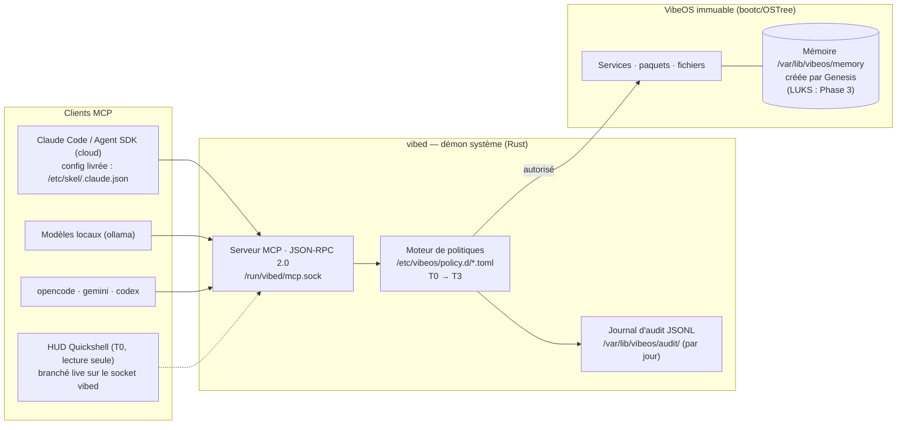

<div align="center">

# 🌀 VibeOS

**Un système d'exploitation immuable qui naît vierge,<br/>où l'IA est un citoyen du système — pas une application installée.**

[](https://github.com/Micka420-collab/vibeos/actions/workflows/ci.yml)
[](LICENSE)
[](docs/HARDWARE.md)
[](os/Containerfile)
[](docs/DESKTOP.md)
[](STATUS.md)

**🌐 Français · [English](README.en.md) · [Español](README.es.md) · [Deutsch](README.de.md)**

</div>

## 👋 Nouveau ici ? VibeOS en 2 minutes

**L'idée en une image.** Imaginez un immeuble très sécurisé. L'intelligence artificielle n'y est pas une appli qu'on installe et qui fait ensuite ce qu'elle veut : c'est un **résident encadré par un règlement**, avec des droits et des devoirs — pas un invité à qui on confie le trousseau de clés. Pour agir sur le système (installer un logiciel, redémarrer un service, toucher au disque), elle doit passer par le **gardien** de l'immeuble, un programme nommé `vibed`. Le gardien consulte le règlement, laisse passer ce qui est autorisé, **vous appelle — vous, le propriétaire — pour tout ce qui est risqué**, et note chaque geste dans un **registre inviolable**. C'est tout VibeOS en une image : l'IA a de vrais pouvoirs, mais gouvernés.

**Ce que c'est.** VibeOS est un système d'exploitation Linux (comme Ubuntu ou Fedora) pensé pour *coder en dialoguant avec des agents IA* — des assistants de code comme Claude Code, qui écrivent et lancent du code à votre place. C'est ça, le *vibecoding*.

**En quoi c'est différent d'un Linux ordinaire.** Deux choses. Il est **immuable** : on ne bricole pas le cœur du système pendant qu'il tourne, on remplace l'image entière d'un bloc — et si une mise à jour casse quelque chose, on revient à l'état précédent d'un geste. Et l'IA n'est pas une application posée par-dessus : elle est câblée dans les fondations, encadrée par des règles dès le départ.

**Pour qui, et où on en est.** Aujourd'hui, surtout pour les curieux et les contributeurs qui veulent comprendre le projet ou le faire avancer. Ce n'est **pas encore** un OS prêt à installer pour tout le monde : le projet est en **pré-alpha**, et à ce jour **aucune image n'a encore été démarrée sur du vrai matériel** — tout ce qu'affirme ce dépôt est prouvé par des tests automatiques, pas par un écran qu'on aurait vu. L'état d'avancement honnête (fait / en cours / à faire) vit dans **[STATUS.md](STATUS.md)**.

**Comment ça marche, en 4 temps :**

1. **La machine naît vierge.** L'image est la même pour tout le monde et ne contient aucune donnée personnelle. Au tout premier démarrage, une séquence appelée *Genesis* crée la mémoire de la machine, qui n'appartient qu'à vous. *(Le chiffrement de cette mémoire est prévu pour une phase ultérieure — en l'état, elle est créée en clair, et le projet le dit sans détour.)*
2. **L'IA demande au gardien.** Un agent (Claude Code, un modèle local via ollama…) adresse ses demandes d'action système au gardien `vibed`, au lieu de faire tout ce qu'il veut en root.
3. **Une règle décide ; vous validez le risqué.** Le gardien classe chaque action de **T0** (observer, sans risque) à **T3** (destructif). L'inoffensif passe seul ; **modifier le système ou toucher au disque exige votre approbation explicite**. En cas de doute ou de règle manquante, tout est **refusé par défaut**.
4. **Tout est tracé.** Chaque appel est écrit dans un journal en *append-only* (on ajoute, on ne réécrit jamais) et chaîné cryptographiquement : on peut toujours répondre à « qui a fait quoi, quand, et avec quelle autorisation ».

**Mini-glossaire** (les mots qui reviennent partout ensuite) :

| Mot | En clair |
|---|---|
| **immuable** | le cœur du système est en lecture seule ; une mise à jour ratée se répare en revenant en arrière d'un bloc, sans cicatrice |
| **vibecoding** | programmer en décrivant ce qu'on veut à une IA qui écrit le code |
| **agent IA** | un assistant qui n'agit pas que par la parole : il lit des fichiers, lance des commandes (ex. Claude Code) |
| **`vibed`** | le « gardien » : le programme système par lequel transite toute action privilégiée d'un agent |
| **MCP** | le langage standard par lequel les agents parlent à `vibed` (une porte d'entrée unique et contrôlée) |
| **politique / T0→T3** | le « règlement » qui classe chaque action par niveau de risque et décide qui peut l'exécuter |
| **journal d'audit** | le « registre inviolable » qui garde la trace de chaque geste |
| **Genesis** | la séquence qui crée la mémoire de la machine au tout premier démarrage |

> Envie du *pourquoi* plutôt que du *comment* ? Lisez le manifeste **[VISION.md](VISION.md)**. Pour l'architecture en couches et les schémas, voir **[docs/ARCHITECTURE.md](docs/ARCHITECTURE.md)**.
>
> La suite de ce README est la **version technique** de ce que vous venez de lire — plus dense, mais qui dit exactement la même histoire.

---

VibeOS est une distribution Linux **AI-native, immuable et sécurisée par conception**, dédiée au *vibecoding*. Dérivée de Fedora Kinoite (KDE Plasma 6) et construite en mode image avec bootc/OSTree, elle expose le contrôle du système aux agents IA à travers un contrat strict — un démon système (`vibed`), un serveur MCP, un moteur de politiques et un journal d'audit — plutôt qu'un accès brut au shell. L'OS est livré **vierge** : sa mémoire est créée au premier démarrage par une séquence *Genesis* et appartient à son utilisateur, et à personne d'autre (le chiffrement LUKS de cette mémoire arrive en **Phase 3** — voir [ROADMAP.md](ROADMAP.md)). Projet pluriannuel : la fondation v0.1 est posée — image multi-arch signée, deux ISO, démon `vibed` actif au boot, bureau vibecoding livré.

> 📊 **Où en est le projet ?** L'état d'avancement vivant (fait / en cours / reste à faire) est dans **[STATUS.md](STATUS.md)**.
>
> 🟢 **Travail autonome (week-end 2026-07-18 → 20)** : la trousse **SaaS + ecommerce gouvernée** est **livrée** (outils embarqués, serveurs en conteneurs par projet, installeur à la demande vérifié, catalogue) — voir la section dédiée plus bas. Côté déploiement : `deploy.plan` (T2, lecture d'état) est depuis **livré et refusé par défaut** — l'**activation** (allowlist `[rule.deploy]`, jeton scellé) et les capacités d'écriture restent une décision d'architecture ouverte. Suivi en direct dans **[WEEKEND-LOG.md](WEEKEND-LOG.md)**.

---

## Fonctionnalités clés

### 🌱 Naissance vierge — Genesis
L'image OS ne contient **aucune mémoire d'usine**. Au premier démarrage, `vibeos-genesis.service` (gardé par `ConditionPathExists=!/var/lib/vibeos/memory/.initialized`) exécute `/usr/libexec/vibeos/genesis.sh` et construit la mémoire de la machine à partir de zéro dans `/var/lib/vibeos/memory` — **en clair en v0.1** ; le chiffrement LUKS/TPM2 du volume est un livrable de la **Phase 3**. Le **mode amnésique** (inspiré de Tails) recrée cette mémoire en tmpfs **à chaque démarrage** — rien ne survit à l'extinction : le **generator systemd** est **livré** (activation par le paramètre kernel `vibeos.amnesic=1`) ; sa validation en VM reste **Phase 3**. La spécification complète est dans [docs/MEMORY.md](docs/MEMORY.md).

### 🤖 L'IA, citoyenne de l'OS — vibed + MCP + politiques
> **Statut :** le binaire `vibed` est **embarqué dans l'image** (compilé en multi-stage dans `os/Containerfile`, installé en `/usr/bin/vibed`). Au boot, `vibed.service` (activé par preset) démarre, **charge et applique la politique installée** (`/etc/vibeos/policy.d/`, fail-closed), **sert le serveur MCP** sur `/run/vibed/mcp.sock` et **audite** chaque appel sous `/var/lib/vibeos`. Côté client, l'image livre la **config MCP de Claude Code** (`/etc/skel/.claude.json`) : le serveur `vibeos` est découvert **sans configuration manuelle** (prérequis : groupe `vibeos-agents`). Le **mécanisme de bac à sable par outil** ([ADR-019](docs/DECISIONS.md)) est livré — unités systemd transitoires durcies + helper de faible privilège `vibed-tool`, éprouvé par l'outil `sandbox.probe` (T1) qui juge le confinement réellement obtenu — mais sa **preuve sur machine réelle reste à faire** (machine-gated) ; restent aussi le durcissement SELinux dédié `vibed_t`, `User=vibed` et l'ancrage externe TPM/Rekor de la chaîne d'audit (**Phase 4**). Le crate `vibed` est testé (372 tests verts, dont 9 tests d'intégration MCP bout-en-bout sur socket + 3 de politique) ; le journal d'audit est **chaîné par hachage SHA-256** (`vibed --verify-audit`).

Le démon système `vibed` (Rust, tokio, unité `vibed.service`) expose le contrôle de l'OS via un **serveur MCP** (JSON-RPC 2.0) sur la socket unix `/run/vibed/mcp.sock`. Chaque action d'un agent passe par un **moteur de politiques** (`/etc/vibeos/policy.d/*.toml`, la première règle qui matche gagne, refus par défaut) organisé en niveaux de capacités :

| Niveau | Portée | Approbation humaine |
|---|---|---|
| **T0** | Observation (lecture seule) | Non |
| **T1** | Modification utilisateur (fichiers, config) | Non (configurable) |
| **T2** | Modification système (paquets, services) | **Oui, toujours** |
| **T3** | Destructif (disque, identifiants, identité réseau) | **Oui, toujours** |

Chaque appel d'outil est consigné dans un **journal d'audit JSONL append-only, chaîné par hachage SHA-256, avec rotation par jour UTC** (`/var/lib/vibeos/audit/vibed-<date>.jsonl`), avec l'identité de l'appelant (uid/gid/pid) — toute altération est détectée par `vibed --verify-audit`. L'ancrage externe de la chaîne (TPM/Rekor) reste **Phase 4**.

Le **flux d'approbation humaine T2/T3** est livré côté plomberie : une demande crée une requête tracée, l'opérateur exécute `vibectl approve <id>`, et un **grant à usage unique** (borné `(outil, cible, uid)`, expirant) autorise le ré-appel — un agent ne peut **jamais** approuver sa propre requête (store root-only), et l'audit garde la trace de *qui* a approuvé (`ok_approved(by_uid=N)`). Un **rate-limiting par uid** (token bucket) borne un agent emballé ou compromis (anti-flood, refus audité). **Premier backend T2 réel livré** : `svc.restart` redémarre réellement une unité systemd derrière l'approbation, avec une **allowlist de cibles** (les unités d'accès/audit/approbation — `sshd`, `vibed`, `dbus`, `user@*`… — sont refusées **avant** la file d'approbation) et le nom d'unité canonicalisé avant la décision. `pkg.install` reste un stub (backend reporté sur OS immuable, [ADR-016](docs/DECISIONS.md)). Surface d'outils actuelle (20, le catalogue `tools/list` fait foi) : T0 `os.status`/`fs.read`/`fs.list`/`svc.status`/`log.read`/`sectools.list`/`memory.query`/`agent.thinking`/`agent.sessions`/`agents.list`/`agent.activity`/`user.model`/`policy.check`/`policy.capabilities`, T1 `fs.write`/`memory.append`/`sandbox.probe`, T2 `svc.restart`/`pkg.install`/`deploy.plan` — `deploy.plan` est **refusé par défaut** (la politique livrée ne contient aucune règle `[rule.deploy]` : fail-closed tant que l'opérateur n'a pas allowlisté ses cibles, [ADR-021](docs/DECISIONS.md)). Les modules `browser.*` ([ADR-022](docs/DECISIONS.md)) et `os.propose` ([ADR-024](docs/DECISIONS.md), à ratifier) existent dans le code mais sont **hors catalogue** — volontairement inertes tant que leur chemin gouverné n'est pas câblé. Le dialogue Plasma/HUD d'approbation arrive en **Phase 4**.

**Mode autonome / ouvert** ([ADR-027](docs/DECISIONS.md), fondation livrée) : par défaut l'OS est **gouverné** (T2/T3 = approbation humaine). Un opérateur peut **déverrouiller hors-bande** un mode ouvert borné — `vibectl mode open [--minutes N]` (root) — où l'IA agit **en autonomie** (T2/T3 auto-accordés) pour la fenêtre, avec **panneau danger** (bloc `mode` d'`os.status` → HUD, invariant selfcheck `operating-mode`). Trois choses restent **irréductibles** même en mode ouvert : le déverrouillage est une **action humaine** (l'IA ne peut jamais s'auto-escalader — fichier de mode root-only + sur la denylist d'écriture), **l'audit reste actif** (issues distinctes `*_open_mode`), et un **kill-switch** (`vibectl mode governed`) + l'auto-expiration rendent le mode toujours réversible ; la denylist intégrée (audit, mode, politique, secrets) n'est **jamais** levée. Sur-couches conçues, non encore livrées : auto-planification (crons/battements de cœur révocables), usage d'applications, auto-modification via `os.propose` (racine immuable → nouvelle image, [ADR-024](docs/DECISIONS.md)).

### 🔒 Immuabilité & sécurité vérifiable
Livré dès la v0.1 : racine en lecture seule, mises à jour atomiques et retour d'usine (bootc/OSTree), SELinux `enforcing` (politique targeted de Fedora), images OS **signées avec sigstore/cosign en CI**, image de base épinglée par digest et CLIs IA épinglées en versions exactes. Planifié : chaîne de démarrage mesurée **UEFI Secure Boot → UKI → dm-verity/composefs** (**Phase 4**), généralisation du bac à sable par outil (mécanisme systemd-run/seccomp livré et éprouvé par `sandbox.probe` — [ADR-019](docs/DECISIONS.md) ; landlock et généralisation : **Phase 3**), politique SELinux dédiée `vibed_t` (**Phase 4**). Référence d'image : `ghcr.io/micka420-collab/vibeos`.

### 🧰 Boîte à outils vibecoding complète — cloud + local
Runtime d'agents hybride, préinstallé et épinglé dans l'image : **Claude Code** et le **Claude Agent SDK** (cloud Anthropic), **gemini-cli** (Google), **codex** (OpenAI), **opencode** (agent terminal multi-fournisseur, 100 % local via ollama) et **ollama** pour les modèles locaux — l'image embarque tout pour coder hors ligne (la validation formelle « `ollama run` sans réseau » est un critère de sortie de la Phase 1, encore ouvert). `aider` reste installable à la demande (`uvx --python 3.12 aider-chat`) sans toucher l'OS immuable.

### 🛡️ Trousse cybersécurité gouvernée
VibeOS est **security-first** : une trousse d'outils de pentest/DFIR professionnelle est embarquée dans l'image (≈ 60 RPM signés Fedora/RPM Fusion — `nmap`, `hashcat`, `radare2`, `aircrack-ng`, `impacket`, `sleuthkit`, `suricata`, `lynis`…), à la manière de Kali/Parrot/BlackArch. La différence : elle est **gouvernée** par le moteur de politiques. Un agent IA peut **découvrir** la trousse en lecture seule (outil MCP `sectools.list`, T0) mais **ne peut exécuter** aucun outil sans passer par le tiering — tout ce qui est **actif contre une cible est T2, le destructif T3**, avec **approbation humaine obligatoire**. Catalogue complet (état de l'art 2025-2026, dont la **sécurité IA/LLM** : garak, PyRIT, guardrails) et cadre d'usage autorisé : [docs/SECURITY-TOOLKIT.md](docs/SECURITY-TOOLKIT.md).

### 🚀 Trousse SaaS + ecommerce gouvernée
Même modèle, seconde trousse ([ADR-020](docs/DECISIONS.md)) : de quoi développer un SaaS ou une boutique **de A à Z**. L'image ne grave que les **outils passifs** — les **clients** et l'outillage de dev (`psql`, `sqlite`, `redis-cli`, `uv`/`ruff`/`mypy`, `podman-compose`, `mkcert`), la mesure de performance (`ab`, `perf`, `sysstat`, `bpftrace`, `bcc`) et `gh` — au-dessus des runtimes déjà présents (Node 24, Python 3.13, git). Les **serveurs** (PostgreSQL, Valkey, Caddy) ne sont **jamais** gravés : ils tournent en **conteneurs par projet** depuis les modèles `compose` fournis (`/usr/share/vibeos/saas/`), sous l'uid de l'utilisateur. Les CLIs de déploiement et de test de charge (`flyctl`, `railway`, `oha`, `vegeta`) s'installent **à la demande, épinglés + sha256 vérifié** (`/usr/libexec/vibeos/install-saas-tool`). Le **déploiement en production** avance sous gouvernance : `deploy.plan` (T2, lecture d'état — fly/vercel/railway, token scellé TPM2 **jamais en argv**, sandbox ADR-019) est **livré et refusé par défaut** tant qu'aucune règle `[rule.deploy]` n'allowliste de cibles ; les capacités d'**écriture** (`deploy.apply`…) restent à concevoir. Catalogue complet (3 seaux + pièges de licence) : [docs/ECOSYSTEM.md](docs/ECOSYSTEM.md).

### 🧬 Multi-architecture — amd64 + arm64
VibeOS cible **linux/amd64 et linux/arm64**. Depuis le tag `v0.1.0-dev`, la CI construit les deux architectures sur **runners natifs**, publie le **manifest multi-arch signé cosign** (keyless, journal Rekor) sur ghcr.io et génère **une ISO par architecture**, en artefacts du run de release (voir ci-dessous : ce sont des artefacts de *run*, pas des assets de *release* — le dépôt ne publie aucune GitHub Release à ce jour). La couche pilote **NVIDIA** (akmod, RPM Fusion) est compilée au build de l'image, sur amd64 uniquement ; sa **validation sur le PC de référence** (RTX 3070 Ti) est un critère de sortie de la Phase 1, encore ouvert — voir [docs/HARDWARE.md](docs/HARDWARE.md).

## 💿 Télécharger une ISO

> **Lis ce paragraphe avant de cliquer.** Il n'y a **aucune GitHub Release** : les ISO sont des **artefacts de run**, uploadés avec `retention-days: 14`. **Elles expirent 14 jours après leur build** et le lien meurt avec elles. C'est pour ça que ce README ne contient pas de lien en dur vers un run — il serait faux avant la fin du mois.

**→ [Page des builds `build-os`](https://github.com/Micka420-collab/vibeos/actions/workflows/build-os.yml)** — ce lien-là ne pourrit pas.

Ouvre le run le plus récent **déclenché par un tag `v*`** (les builds sur `main` et les PR ne produisent **pas** d'ISO : ils ne vérifient que l'image amd64), puis prends `vibeos-iso-amd64` ou `vibeos-iso-arm64` dans la section **Artifacts**, en bas de page. Il faut être connecté avec un compte ayant accès au dépôt.

| | |
|---|---|
| **Taille** | ~7,4 Go (amd64) · ~6,7 Go (arm64) |
| **Rétention** | **14 jours** après le build, sans exception |
| **Prérequis VM/machine** | **UEFI** (pas de BIOS legacy), **Secure Boot désactivé** (la signature MOK des kmods est Phase 4), **≥ 60 Go** de disque (l'image seule pèse ~12 Go), **≥ 8 Go** de RAM. L'image est **Wayland uniquement** (`X11=OFF`) : en VM, préfère un GPU virtio |
| **NVIDIA en VM** | Sans passthrough GPU, `nvidia-smi` échoue — c'est **attendu**, pas un défaut |

**Après le boot**, une seule commande donne l'état réel du système (20 invariants : `vibed`, socket + permissions, politique fail-closed, denylist, chaîne d'audit, Genesis, caractère du citoyen IA, racine en lecture seule, réglage noyau IA appliqué, mode d'exploitation) :

```bash
sudo /usr/libexec/vibeos/vibeos-selfcheck.sh      # chemin complet : il n'est PAS dans le PATH
```

Elle est **en lecture seule** et **tolérante aux versions** (`SKIP` ≠ `FAIL`). Note ce que tu observes dans [docs/BOOT-VALIDATION.md](docs/BOOT-VALIDATION.md) — le relevé est vide tant que personne n'a booté, et ça doit le rester.

> ⚠️ **Aucune ISO n'a encore été bootée sur du vrai matériel.** Tout ce que ce dépôt affirme est prouvé par des tests et une CI — c'est-à-dire par du code qui juge du code. Le HUD, le splash et la session graphique n'ont **jamais été vus**. Tant que [docs/BOOT-VALIDATION.md](docs/BOOT-VALIDATION.md) est vide, considère ces ISO comme **non validées**.

### 🎨 Une expérience de bureau pensée pour le vibecoding
Un bureau Plasma 6 organisé autour du triptyque **Agent / Contexte / Confiance**. La session s'ouvre en **Global Theme « VibeOS Dark »** (défaut système, moteur Kvantum inclus) avec le **HUD agents** (Quickshell, compilé dans l'image, auto-démarré — état des agents, tier de politique courant et jauges du modèle local ; **branché en live sur `vibed`** via `Quickshell.Io.Socket` : `os.status`, `memory.query`, raisonnement (`agent.sessions`→`agent.thinking`) et roster (`agents.list`, confiné à l'uid) sont réels, dégradation gracieuse hors ligne). Le terminal est prêt à l'emploi dès le premier boot : Ghostty + fish + Starship + Zellij avec le layout signature « agent + lazygit + audit », preset Neovim « VibeVim ». Cette sélection est le fruit d'une **curation de 113 projets open-source**, filtrée par licence redistribuable et cohérence — détaillée dans [docs/ECOSYSTEM.md](docs/ECOSYSTEM.md) et [docs/DESKTOP.md](docs/DESKTOP.md).

---

## Livré en v0.1 / En route

| Capacité | Statut |
|---|---|
| Image bootc immuable (Fedora Kinoite, racine RO, rollback atomique) | ✅ Livré v0.1 |
| Image + ISO **amd64** (build local + CI) | ✅ Livré v0.1 |
| Manifest **arm64** + ISO par architecture (runners natifs, release `v0.1.0-dev`) | ✅ Livré v0.1 |
| Boot des ISO validé en VM + NVIDIA validé sur le PC de référence | 🔄 Critères de sortie Phase 1 (en cours) |
| CLIs IA préinstallées et épinglées (claude, agent SDK, gemini, codex, opencode, ollama) | ✅ Livré v0.1 |
| Signature cosign (keyless) des images en CI | ✅ Livré v0.1 |
| Fichiers de politique posés dans `/etc/vibeos/policy.d/` | ✅ Livré v0.1 |
| Binaire `vibed` embarqué dans l'image (démarre au boot) | ✅ Livré v0.1 |
| Serveur MCP `vibed` sur `/run/vibed/mcp.sock` | ✅ Livré v0.1 |
| Chargement / application des politiques par `vibed` (fail-closed) | ✅ Livré v0.1 |
| Journal d'audit JSONL chaîné SHA-256 (`/var/lib/vibeos/audit/`, un fichier par jour) avec identité de l'appelant | ✅ Livré v0.1 |
| **Flux d'approbation humaine T2/T3** (plomberie : `vibectl approve/deny`, grants à usage unique, approbateur audité) | ✅ Livré (Phase 2) |
| **Rate-limiting par uid** (token bucket, anti-flood ; store d'approbation borné) | ✅ Livré (Phase 2) |
| Genesis au premier boot (mémoire créée **en clair**, unité + `genesis.sh`) | ✅ Livré v0.1 |
| Global Theme **VibeOS Dark par défaut** (`/etc/xdg/kdeglobals` + Kvantum) | ✅ Livré (Phase 2) |
| **HUD Quickshell** installé + auto-démarré (runtime compilé dans l'image) | ✅ Livré (Phase 2) |
| **Config MCP Claude Code** livrée (`/etc/skel/.claude.json` → socket `vibed`) | ✅ Livré (Phase 2) |
| Branchement **live** du HUD sur le socket `vibed` (`Quickshell.Io.Socket` : os.status, memory.query, raisonnement, roster) | ✅ Livré (Phase 2.5) |
| **`svc.restart` (T2) — backend réel** derrière approbation + allowlist de cibles (refus des unités d'accès/audit/approbation avant la file) | ✅ Livré (Phase 2.5) |
| **`agents.list` (T0)** — roster HUD dérivé de l'audit, confiné à l'uid appelant | ✅ Livré (Phase 2.5) |
| **`memory.append`** (T1, additif : journal + knowledge) · `scope`/`limit` de `memory.query` | ✅ Livré (Phase 2) |
| Outils **T1 réels** supplémentaires · scopes `user`/`projects` de `memory.append` | 🛣️ Phase 2 |
| Chiffrement LUKS/TPM2 de la mémoire | 🛣️ Phase 3 |
| Mode amnésique (tmpfs recréé à chaque boot, generator systemd) | 🛣️ Phase 3 |
| Interview de naissance (prototype : `agent/genesis_interview.py`, non câblé en v0.1) | 🛣️ Phase 3 |
| Bac à sable par outil — généralisation à toute la surface (le mécanisme ADR-019 est livré, cf. `sandbox.probe` ci-dessous) | 🔄 Mécanisme livré ; généralisation + preuve sur cible restantes |
| **Superviseur d'agent** `vibectl agent run/stop/thinking` (budgets wall-clock + nb d'appels, kill-switch opérateur ; T2/T3 restent gérés par vibed, non bloquant) | ✅ Livré (Phase 2.5, mécanisme) |
| **Capture du raisonnement** des agents (tap sur flux `stream-json` → `memory/reasoning/`) + outil T0 `agent.thinking` | ✅ Livré (Phase 2.5, mécanisme) |
| Unité `vibeos-agent@.service` (always-on, `User=%i` durcie) · **jeton d'abonnement scellé TPM2** (`LoadCredentialEncrypted`) · **allowlist d'egress par nom d'hôte** | ✅ Livré (Phase 2.5, scaffolding validé statiquement — enforcement au boot) |
| **Initiative « VibeOS pour Zed »** — extension `vibeos-claude-acp` gouverne l'agent ACP via `policy.check` ([ADR-014](docs/DECISIONS.md)) ; câblage image bundlé, gardé off jusqu'à l'E2E ([ADR-015](docs/DECISIONS.md)) | ✅ Cœur livré & vérifié hors Zed ; E2E Tier B = machine réelle |
| Découpe de `vibed/src/mcp.rs` en modules `tools/*` (F6) | ✅ Livré — 10 modules (`fs`, `svc`, `log`, `sectools`, `memory`, `policy_tool`, `sandbox_tool`, `deploy`, `browser`, `propose`) |
| **`policy.capabilities` (T0)** — manifeste de capacités **dérivé** de la politique chargée (l'agent lit la carte de ses droits sans tâtonner) | ✅ Livré ([ADR-023](docs/DECISIONS.md)) |
| **`agent.activity` (T0)** — le citoyen relit ses **propres actes** (appels gouvernés récents, refus compris), confiné par uid | ✅ Livré ([ADR-026](docs/DECISIONS.md)) |
| **`user.model` (T0)** — modèle **dérivé & transparent** de *comment vous travaillez* (préférences, patterns, rythme, friction) + **anticipation** déterministe des prochaines actions ; dérivé de données déjà gouvernées, confiné par uid, local/effaçable | ✅ Fondation livrée ([ADR-028](docs/DECISIONS.md)) ; apprentissage opt-in/embeddings = à venir |
| **Genesis vivant** — au premier boot l'IA **choisit son caractère** (`personality.toml` : nom, archétype, 6 traits, ton), **unique par installation** et déterministe (dérivé de `machine_id`, hors-ligne), avec un **éveil** futuriste sur la console ; scope `personality` (`memory.query`) + invariant selfcheck `ai-personality`. Le caractère **se plie vers l'humain** (table `[adaptation]` ← `user.model`) | ✅ Naissance + éveil livrés ([ADR-029](docs/DECISIONS.md)) ; boucle d'adaptation vivante & cérémonie graphique HUD = à venir/machine-gated |
| **`sandbox.probe` (T1)** — preuve pilotée du bac à sable ADR-019 (unité transitoire durcie + helper `vibed-tool`, verdict de confinement jugé) | ✅ Livré (mécanisme) ; preuve sur machine réelle = machine-gated |
| **`deploy.plan` (T2)** — lecture d'état de déploiement (fly/vercel/railway), token scellé TPM2 **jamais en argv**, sandbox ADR-019 | ✅ Livré, **refusé par défaut** (aucune règle `[rule.deploy]` livrée — fail-closed, [ADR-021](docs/DECISIONS.md)) |
| **Substrat navigateur gouverné** — `chromium-headless` dans l'image + lanceur CDP-sur-pipe durci (`spawn_chromium`) | ✅ Substrat livré ; outils `browser.*` **hors catalogue** tant que l'exécution gouvernée n'est pas câblée ([ADR-022](docs/DECISIONS.md)) |
| **Perf couche basse** — audit/journal hors du réacteur tokio, catalogue d'outils en cache · **réglage noyau charges IA** (`sysctl.d` sourcé + zram zstd) + 18ᵉ invariant selfcheck | ✅ Livré ([ADR-025](docs/DECISIONS.md)) ; mesure sur cible = machine-gated |
| **Mode autonome / ouvert** ([ADR-027](docs/DECISIONS.md)) — déverrouillage humain hors-bande (`vibectl mode open`), T2/T3 auto-accordés en fenêtre bornée, panneau danger (`os.status`.mode + selfcheck `operating-mode`), kill-switch + auto-expiration, audit `*_open_mode`, no-self-escalation | ✅ Fondation livrée ; sur-couches (crons/apps/`os.propose`) conçues, non livrées ; effet sur cible = machine-gated |
| UKI / boot mesuré, ancrage externe TPM/Rekor de l'audit, SELinux dédiée, `User=vibed` | 🛣️ Phase 4 |
| Installateur guidé, chiffrement disque par défaut | 🛣️ Phase 5 |

Règle de rédaction du projet : aucun mécanisme non implémenté n'est décrit au présent — chaque document distingue « livré en v0.1 » de « Phase N (spécifié) ».

---

## Architecture en un coup d'œil



---

## Structure du dépôt

| Répertoire | Contenu |
|---|---|
| `docs/` | Documentation : architecture, build ([docs/BUILD.md](docs/BUILD.md)), matériel de référence ([docs/HARDWARE.md](docs/HARDWARE.md)), mémoire, sécurité, décisions |
| `os/` | Définition de l'image bootc/OSTree (dérivée de Fedora Kinoite, KDE Plasma 6, multi-arch) |
| `vibed/` | Démon système `vibed` (Rust, tokio) : serveur MCP, moteur de politiques, audit, superviseur d'agent (`vibectl`), outils découpés par famille (`src/tools/*`) |
| `zed/` | Extension **VibeOS pour Zed** (`vibeos-claude-acp`) : gouverne l'agent ACP hébergé via `vibeos:policy.check` — Allow (T0/T1) sans prompt, T2/T3 jamais auto ([ADR-014/015](docs/DECISIONS.md)) |
| `agent/` | Runtime d'agents : intégration Claude Code / Agent SDK, ollama, opencode, prototype d'interview Genesis |
| `memory/` | Sous-système mémoire : séquence Genesis (`memory/genesis.sh`) |
| `security/` | Politiques (`policy.d`), durcissement, signature |
| `desktop/` | Chantier bureau : thème VibeOS Dark, palette des tiers, HUD Quickshell (QML) — voir [docs/DESKTOP.md](docs/DESKTOP.md) |
| `installer/` | Installateur : kickstart, branding, logo — voir [docs/INSTALLER.md](docs/INSTALLER.md) |
| `.github/` | CI GitHub Actions : tests (`ci.yml`), build multi-arch de l'image OS, signature cosign, push vers ghcr.io, génération des ISO |

---

## Démarrage rapide

### Essayer l'image (sans rien construire)

```bash
# Récupérer l'image multi-arch (amd64 / arm64) :
podman pull ghcr.io/micka420-collab/vibeos:0.1.0-dev

# Vérifier la signature cosign (keyless, CI GitHub Actions) :
cosign verify ghcr.io/micka420-collab/vibeos:0.1.0-dev \
  --certificate-identity-regexp 'https://github.com/Micka420-collab/vibeos/.*' \
  --certificate-oidc-issuer https://token.actions.githubusercontent.com
```

Les **ISO installables** (une par architecture) sont produites en artefacts de la CI sur chaque tag `v*` — voir [docs/BUILD.md](docs/BUILD.md) pour les générer localement.

### Parler à `vibed` depuis une session VibeOS

Accès au socket : **les administrateurs (groupe `wheel`) sont enrôlés
automatiquement** dans `vibeos-agents` à chaque boot (`vibeos-agents-group.service`)
— ils ont déjà `sudo`, donc c'est *moins* que ce qu'ils détiennent. Un compte
**non-`wheel`** reste opt-in : `sudo usermod -aG vibeos-agents <user>` (puis
rouvrir la session). L'appartenance devient effective à la connexion suivante.

```bash
# Claude Code découvre le serveur MCP « vibeos » automatiquement
# (config livrée dans ~/.claude.json ; instructions dans ~/.claude/CLAUDE.md).
# Test manuel sans client MCP :
printf '%s\n' '{"jsonrpc":"2.0","id":1,"method":"tools/list"}' \
  | socat - UNIX-CONNECT:/run/vibed/mcp.sock
```

### Construire l'image soi-même

Le build local s'effectue sous **WSL2 Ubuntu + podman** (l'hôte Windows n'a besoin ni de docker ni de podman). La CI GitHub Actions construit l'image OS multi-arch sur runners natifs, la signe avec cosign, la pousse vers `ghcr.io` et génère les ISO avec `bootc-image-builder`.

```bash
git clone https://github.com/Micka420-collab/vibeos.git
cd vibeos
podman build -t vibeos:dev -f os/Containerfile .
```

➡️ **Toutes les instructions détaillées (prérequis, ISO, publication) sont dans [docs/BUILD.md](docs/BUILD.md).**

---

## Statut du projet

| | |
|---|---|
| **Phase** | Pré-alpha — Phase 1 « Première ISO » (validation VM restante) · Phase 2 « vibed + MCP » bien avancée · Phase 2.5 « Autonomie encadrée » largement implémentée (superviseur, capture du raisonnement, `svc.restart` réel, agent-runner + TPM2 + egress, HUD live) |
| **Dernière mise à jour** | 2026-07-21 |
| **Image OS** | `ghcr.io/micka420-collab/vibeos:0.1.0-dev` — manifest amd64 + arm64, **signé cosign** (Rekor) |
| **ISO** | amd64 (7,0 Go) + arm64 (6,3 Go) — artefacts CI de la release `v0.1.0-dev` |
| **Build** | CI verte (runners natifs, ~15 min/arch) · `bootc container lint` OK · 372 tests `vibed` verts (+ 17 tests de l'extension Zed + 73 contrôles du client HUD) |
| **Machine de référence** | Ryzen 7 3700X + RTX 3070 Ti + 16 Go — [docs/HARDWARE.md](docs/HARDWARE.md) |
| **Attendez-vous à** | Des ruptures, des refontes, zéro garantie de stabilité |

VibeOS est un projet **pluriannuel**. La v0.1 pose un dépôt complet, cohérent et buildable — pas un produit fini. Le tableau « Livré en v0.1 / En route » ci-dessus fait foi sur ce qui existe réellement.

---

## Aller plus loin

**Vision & pilotage**
- 📜 [VISION.md](VISION.md) — le manifeste : pourquoi VibeOS existe, ses cinq principes fondateurs
- 🗺️ [ROADMAP.md](ROADMAP.md) — la trajectoire pluriannuelle, jalon par jalon
- 📊 [STATUS.md](STATUS.md) — l'état d'avancement vivant (fait / en cours / reste à faire)

**Conception**
- 🏛️ [docs/ARCHITECTURE.md](docs/ARCHITECTURE.md) — l'architecture en couches (diagrammes, séquences)
- 🧭 [docs/DECISIONS.md](docs/DECISIONS.md) — les décisions d'architecture (ADR)
- 🧠 [docs/MEMORY.md](docs/MEMORY.md) — le sous-système mémoire et Genesis
- 🎨 [docs/DESKTOP.md](docs/DESKTOP.md) · 🧩 [docs/ECOSYSTEM.md](docs/ECOSYSTEM.md) — le bureau vibecoding et la sélection OSS

**Sécurité**
- 🛡️ [SECURITY.md](SECURITY.md) — politique de sécurité et signalement de vulnérabilités
- 🎯 [docs/THREAT-MODEL.md](docs/THREAT-MODEL.md) · 🔐 [docs/SECURITY-ARCHITECTURE.md](docs/SECURITY-ARCHITECTURE.md)

**Construire & installer**
- 🔨 [docs/BUILD.md](docs/BUILD.md) — build de l'image, ISO, publication
- 💿 [docs/INSTALLER.md](docs/INSTALLER.md) — l'installateur et le premier démarrage
- 🖥️ [docs/HARDWARE.md](docs/HARDWARE.md) — architectures cibles et machine de référence

## Licence

Distribué sous licence **Apache-2.0**. Voir [LICENSE](LICENSE).
