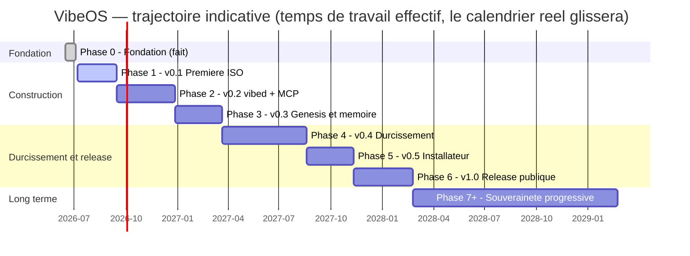

# ROADMAP — VibeOS

> Feuille de route pluriannuelle du projet VibeOS (nom de code provisoire) : distribution Linux immuable, AI-native et security-first, dédiée au vibecoding.
>
> Document maintenu par le lead programme. Révision à chaque fin de phase et au minimum une fois par trimestre. Dernière mise à jour : **2026-07-03**.

---

## 1. Principes de la feuille de route

1. **Versionnée** : chaque phase correspond à une version livrable (`v0.1` → `v1.0`), taguée dans Git et publiée comme image `ghcr.io/micka420-collab/vibeos:<tag>`.
2. **Critères de sortie mesurables** : une phase n'est terminée que lorsque *tous* ses critères de sortie sont vérifiés (idéalement par la CI). Pas de « c'est presque fini ».
3. **Durées honnêtes** : les durées sont exprimées en **temps de travail effectif** pour une équipe très réduite (1 mainteneur + agents IA). Le calendrier réel glissera ; c'est assumé. Total réaliste jusqu'à v1.0 : **environ 2 ans**, puis des années de Phase 7+.
4. **Rien ne saute la sécurité** : une fonctionnalité qui contourne le moteur de politiques (tiers T0–T3, approbation humaine T2+) ou l'audit trail n'est pas mergeable, quelle que soit la phase.
5. **Immutabilité d'abord** : tout livrable doit rester compatible avec le modèle bootc/OSTree (racine en lecture seule, mises à jour atomiques, retour d'usine).

### Vue d'ensemble

| Phase | Version | Nom | Statut | Durée indicative |
|---|---|---|---|---|
| 0 | — | Fondation | ✅ Fait (2026-07-03) | 2–3 semaines (effectué) |
| 1 | v0.1 | Première ISO | 🔄 En cours (reste : validation VM + NVIDIA) | 6–10 semaines |
| 2 | v0.2 | vibed + MCP | 🔄 Bien avancée (vibed + HUD + thème + MCP client + memory.append complet + svc.status/fs.list/sectools.list + audit chaîné + **fs.read/list confinés** + **memory.query extraits** + **plomberie d'approbation T2/T3** + **rate-limiting par uid**) | 3–4 mois |
| 2.5 | v0.2.5 | Autonomie encadrée & accès IA externes | 🔄 Largement implémenté (superviseur `vibectl agent run/stop/thinking`, **kill-switch mesuré 2,6 s**, **capture du raisonnement**, `policy.check`, **unité `vibeos-agent@` durcie + jeton scellé TPM2 + allowlist egress par hôte**) ; reste l'enforcement live (machine bootée). Périmètre figé T0/T1, plancher T2/T3 non levé | 3–5 semaines |
| 3 | v0.3 | Genesis & mémoire | 🔄 Démarrée (generator amnésique + hardware.json schema 2 + ébauche vibectl livrés) | 2–3 mois |
| 4 | v0.4 | Durcissement | 🔄 Amorcée (audit chaîné SHA-256 + rotation ; reste : ancrage TPM/Rekor, User=vibed, SELinux) | 4–6 mois |
| 5 | v0.5 | Installateur & identité | Planifiée | 2–3 mois |
| 6 | v1.0 | Release publique | Planifiée | 3–4 mois |
| 7+ | v1.x → v2+ | Souveraineté progressive | Continue | Plusieurs années |

---

## 2. Phase 0 — « Fondation » — ✅ fait le 2026-07-03

**Objectif** : poser un dépôt complet, cohérent et constructible ; figer les décisions d'architecture pour que toutes les phases suivantes s'y réfèrent sans les rediscuter.

### Livrables (ce dépôt)

- Documentation en français : `README.md`, `ROADMAP.md` (ce fichier), `docs/BUILD.md` et le reste de `docs/`.
- Squelette de l'image : `Containerfile` dérivé de Fedora Kinoite (KDE Plasma 6), cible `ghcr.io/micka420-collab/vibeos`.
- Squelettes des composants : daemon `vibed` (Rust/tokio), politiques `/etc/vibeos/policy.d/*.toml`, script Genesis (`memory/genesis.sh`, installé en `/usr/libexec/vibeos/genesis.sh`), unités systemd (`vibed.service`, `vibeos-genesis.service`).
- CI GitHub Actions : build **multi-architecture (amd64 + arm64)** de l'image OS, **signature cosign keyless** et push vers ghcr.io ; génération d'ISO par architecture via bootc-image-builder ; workflow `ci.yml` (tests Rust, shellcheck, validation des politiques).
- Matériel : architectures cibles et machine de référence documentées dans [docs/HARDWARE.md](docs/HARDWARE.md).
- Procédure de build locale documentée : WSL2 Ubuntu + podman (hôte Windows 11 sans docker/podman natif).

### Critères de sortie — tous atteints

- [x] Dépôt greenfield peuplé : docs, squelettes, CI présents et cohérents entre eux.
- [x] Toutes les décisions d'architecture (bootc/OSTree, vibed/MCP, tiers T0–T3, mémoire LUKS, chaîne Secure Boot → UKI → dm-verity/composefs, SELinux enforcing, cosign) écrites noir sur blanc et non contradictoires d'un fichier à l'autre.
- [x] Feuille de route pluriannuelle validée (ce document).

### Risques principaux

| Risque | Mitigation |
|---|---|
| Décisions d'architecture prises sur le papier, jamais confrontées au réel | Phase 1 volontairement courte : confronter le `Containerfile` à un vrai build le plus tôt possible |
| `micka420-collab` encore placeholder (pas de dépôt GitHub) | Créer l'organisation/le dépôt GitHub en tout début de Phase 1 ; remplacer `micka420-collab` partout en un seul commit |

**Durée** : 2–3 semaines de conception, clôturée le 2026-07-03.

---

## 3. Phase 1 — v0.1 « Première ISO »

**Objectif** : passer du papier au métal. Une image bootc personnalisée qui build en CI, une ISO installable qui démarre dans une VM, avec KDE Plasma 6 et les outils IA préinstallés. Aucune intelligence système encore : on prouve la chaîne de production.

### Livrables

- **Image bootc multi-architecture** dérivée de Fedora Kinoite, publiée comme **manifest `linux/amd64` + `linux/arm64`** sur `ghcr.io/micka420-collab/vibeos:0.1` (et `:latest` sur la branche principale).
- **Deux ISO installables** générées par bootc-image-builder : une par architecture (amd64 et arm64).
- **Outils IA préinstallés dans l'image** (versions épinglées) : Claude Code + **Claude Agent SDK**, **gemini-cli** (Google), **codex** (OpenAI), `ollama` (modèles locaux, mode hors-ligne), **opencode** (`opencode-ai`, agent terminal multi-fournisseur, 100 % local via ollama). `aider` reste en installation optionnelle par l'utilisateur (`uvx --python 3.12 aider-chat`), incompatible avec l'image car il exige Python < 3.13.
- **Couche pilote NVIDIA (amd64 uniquement)** : akmod-nvidia + CUDA via RPM Fusion (technique akmods de Bazzite/uBlue), **validée sur le PC de référence** — Ryzen 7 3700X + RTX 3070 Ti, voir [docs/HARDWARE.md](docs/HARDWARE.md). Signature MOK des modules pour Secure Boot : Phase 4.
- **CI verte sur GitHub Actions** : build multi-arch de l'image sur chaque push, signature cosign keyless après push, push vers ghcr.io sur tag, génération des ISO en artefacts de release.
- **Build local reproductible** sous WSL2 Ubuntu + podman, suivant `docs/BUILD.md`.
- Layering minimal du dépôt dans l'image : arborescence `/etc/vibeos/`, unité `vibed.service` livrée et **activée par preset, sautée tant que le binaire `/usr/bin/vibed` est absent** (garde `ConditionPathExists`) ; aucun placeholder de binaire.

### Critères de sortie (mesurables)

- [ ] `podman build` du `Containerfile` réussit localement (WSL2) **et** en CI ; le workflow GitHub Actions est vert sur la branche principale.
- [ ] Manifest multi-arch poussé et « pullable » : `podman pull ghcr.io/micka420-collab/vibeos:0.1` fonctionne depuis une machine tierce **pour amd64 et arm64**.
- [ ] `cosign verify` réussit sur l'image publiée (signature keyless posée par la CI).
- [ ] ISO générée par bootc-image-builder **pour chaque architecture** : boot amd64 testé en VM (QEMU/KVM ou Hyper-V, UEFI) jusqu'à SDDM puis session Plasma 6 fonctionnelle ; boot arm64 testé en VM (QEMU aarch64).
- [ ] Validation NVIDIA sur le PC de référence ([docs/HARDWARE.md](docs/HARDWARE.md)) : `nvidia-smi` fonctionnel, session Plasma Wayland stable avec le pilote propriétaire.
- [ ] Racine en lecture seule vérifiée (`touch /usr/test` échoue) ; `bootc upgrade` depuis un tag antérieur applique une mise à jour atomique, `bootc rollback` restaure l'état précédent.
- [ ] Dans une session utilisateur de l'image : `claude --version`, `gemini --version`, `codex --version`, `ollama --version`, `opencode --version` répondent ; `ollama run` d'un petit modèle fonctionne hors-ligne.
- [ ] Temps de build CI < 45 min par architecture (garde-fou contre la dérive).

### Risques principaux

| Risque | Mitigation |
|---|---|
| bootc-image-builder évolue vite ; l'ISO casse d'une version à l'autre | Épingler les versions d'images de build ; test de boot en VM automatisé (ou à défaut checklist manuelle documentée) à chaque release |
| Taille d'image excessive (KDE + toolchain IA + modèles) | **Ne pas** embarquer de modèles ollama dans l'image ; les télécharger au premier usage ou pendant Genesis (Phase 3) |
| Limites de ghcr.io (taille des layers, quotas) | Multi-stage builds, purge des caches dnf, surveiller la taille par layer en CI |
| WSL2 + podman : différences subtiles avec la CI Linux | La CI fait foi ; le build WSL2 est un confort de dev, pas la référence |

**Durée indicative** : 6–10 semaines.

---

## 4. Phase 2 — v0.2 « vibed + MCP »

**Objectif** : le système devient pilotable par des agents IA, au niveau OS, de façon gouvernée. Premier daemon fonctionnel, premiers outils T0/T1, moteur de politiques actif, audit complet.

> **Statut (2026-07-08) — en grande partie fait** : le **branchement de `vibed`** est réalisé dès l'image v0.1. Le **binaire** est embarqué (compilé en multi-stage dans `os/Containerfile`, `/usr/bin/vibed`), **`vibed.service` démarre au boot**, le **moteur de politiques** est chargé et appliqué (fail-closed), le **serveur MCP** écoute sur `/run/vibed/mcp.sock`, le **journal d'audit** JSONL est écrit avec l'identité de l'appelant (`SO_PEERCRED`), et l'outil **`memory.query`** est servi. Depuis le 2026-07-08 : le **HUD Quickshell est installé et auto-démarré** (runtime compilé depuis les sources — aucun paquet Fedora 42 n'existe ; autostart `/etc/skel`), le **Global Theme `org.vibeos.dark` est le défaut système** (`/etc/xdg/kdeglobals` + Kvantum), et la **configuration MCP côté client est livrée** (`/etc/skel/.claude.json` → Claude Code découvre `vibeos` sans config manuelle). L'outil **`memory.append`** (T1, strictement additif — scopes `journal`/`knowledge`) et les arguments **`scope`/`limit`** de `memory.query` sont **livrés et testés** (58 tests). **Reste en Phase 2** : les **outils T1 réels** supplémentaires, les scopes `user`/`projects` de `memory.append` (fusion structurée), le **branchement live du HUD** sur le socket (le QML affiche des données mockées) et le preset **Panel Colorizer**.

### Livrables

- **`vibed` fonctionnel** (Rust, tokio) : binaire `/usr/bin/vibed`, unité `vibed.service` activée, serveur MCP (JSON-RPC 2.0) sur le socket unix `/run/vibed/mcp.sock` (`root:vibeos-agents`, mode `0660` — groupe créé par sysusers.d).
- **Outils T0 (observe, lecture seule)** : infos système, état des services, lecture du journal, lecture de fichiers autorisés, métriques.
- **Outils T1 (modify-user)** : écriture dans les fichiers et la configuration de l'utilisateur, dans les limites du moteur de politiques.
- **Moteur de politiques v1** : chargement de `/etc/vibeos/policy.d/*.toml`, application des tiers T0–T3. En v0.2, **T2/T3 sont refusés par défaut** (aucun outil T2+ exposé) ; le flux d'approbation humaine est spécifié mais implémenté en Phase 4.
- **Audit trail** : chaque appel d'outil journalisé (horodatage, agent, outil, tier, décision de politique, résultat) — journal append-only.
- **Configuration MCP pour Claude Code** livrée dans l'image : Claude Code découvre et utilise `vibed` sans configuration manuelle.
- Harnais de tests : tests unitaires Rust + tests d'intégration MCP (handshake, appels d'outils, refus de politique) exécutés en CI.

### Critères de sortie (mesurables)

- [ ] `systemctl status vibed` : actif, sain, redémarre proprement après `kill -9` (Restart=on-failure vérifié).
- [ ] Handshake MCP `initialize` réussi depuis Claude Code via `/run/vibed/mcp.sock` ; liste d'outils T0/T1 exposée.
- [ ] Démonstration bout-en-bout : depuis Claude Code, un agent lit l'état du système (T0) et modifie un fichier de config utilisateur (T1) — les deux actions apparaissent dans l'audit trail.
- [ ] Tout appel T2/T3 est refusé avec une erreur JSON-RPC explicite, et le refus est audité.
- [ ] Politique invalide dans `/etc/vibeos/policy.d/` → `vibed` refuse de démarrer en mode permissif : soit il refuse tout appel, soit il échoue explicitement (fail-closed vérifié par un test).
- [ ] CI : tests unitaires + intégration verts ; `cargo clippy -D warnings` et `cargo audit` sans erreur.
- [ ] Aucune fuite d'informations sensibles (tokens, contenus de fichiers) dans les logs de niveau info.

### Risques principaux

| Risque | Mitigation |
|---|---|
| Spécification MCP en évolution ; incompatibilités clients | S'aligner sur la version supportée par Claude Code ; tests d'intégration contractuels dans la CI |
| Conception du moteur de politiques trop rigide ou trop laxiste | Politiques déclaratives versionnées dans le dépôt ; principe fail-closed ; itérer sur des cas d'usage réels dès la Phase 2 |
| Surface d'attaque du socket (n'importe quel process local) | Permissions du socket + groupe dédié dès v0.2 ; contrôles par pair (SO_PEERCRED) ; durcissement complet en Phase 4 |
| Effet tunnel Rust : daemon jamais « fini » | Périmètre v0.2 strictement limité à T0/T1 ; tout le reste va dans les phases suivantes |

**Durée indicative** : 3–4 mois.

---

## 4 bis. Phase 2.5 — v0.2.5 « Autonomie encadrée & accès IA externes »

**Objectif** : permettre des sessions d'agents longues, non supervisées en continu, **dans le contrat T0/T1 existant** — sans toucher au moteur de politiques ni anticiper le flux d'approbation T2/T3 de la Phase 4. En parallèle, sécuriser la façon dont ces agents s'authentifient auprès de leurs fournisseurs de modèles (abonnement plutôt que clé API quand c'est pertinent) et gouverner leurs appels réseau sortants.

> **Statut : largement implémenté (2026-07-13)**. Périmètre **figé à T0/T1** : aucun livrable n'ouvre une capacité T2/T3 ni n'anticipe l'approbation humaine (Phase 4). **Livré** : le **superviseur d'agent** (`vibectl agent run/stop/thinking` — budgets wall-clock + nombre d'appels, kill-switch opérateur **mesuré 2,6 s**), la **capture du raisonnement** (store `memory/reasoning/`, outil T0 `agent.thinking`, tap `stream-json`, HUD `ReasoningPanel.qml`), le type de journal réservé `autonomous_session` — voir ADR-012/013 ; **l'unité template `vibeos-agent@.service`** (always-on, `User=%i` jamais root, durcie), le **scellement TPM2 du jeton** (`LoadCredentialEncrypted=` + `vibeos-agent-seal-token.sh`), et **l'allowlist d'egress par nom d'hôte** (`vibeos-agent-egress@.service` + `/etc/vibeos/agent-egress.conf`, `getent`→`IPAddressAllow`). **Reste (boot/matériel)** : l'enforcement live (TPM2 réel, egress BPF) et l'auth abonnement E2E exigent une machine bootée. Le scellement TPM2 des jetons est un morceau du travail Phase 3 (LUKS/TPM2) **avancé** ici parce que nécessaire à l'auth externe.

### Livrables

- **Superviseur d'agent** (`vibectl agent run`, ou unité template `vibeos-agent@.service`) : lance un CLI déjà embarqué (claude, codex, gemini, opencode) en mode non-interactif, avec **budget de temps** (wall-clock), **budget de nombre d'appels d'outils**, et **kill-switch humain uniquement** (`vibectl agent stop` — jamais un outil MCP exposé à l'agent lui-même).
- **Authentification par abonnement en mode par défaut** pour les CLI qui le supportent : `claude setup-token` (Claude Code, scope inference-only) et l'équivalent Codex (`codex login --with-access-token`) plutôt qu'une clé API facturée au token — mécanisme **déjà natif** de ces CLI, pas un contournement.
- **Scellement TPM2 du jeton** via `systemd-creds` (`LoadCredentialEncrypted=` dans l'unité agent-runner) — même ancrage de confiance que le LUKS mémoire prévu Phase 3, posé plus tôt car nécessaire ici. **Jamais de jeton en clair** sur disque en dehors de l'espace credential privé de l'unité.
- **Allowlist d'egress réseau par unité** (`IPAddressAllow=`/`IPAddressDeny=` systemd — même famille de directives que le durcissement déjà en place sur `vibed.service`) : chaque CLI ne joint que les hôtes de son propre fournisseur (`api.anthropic.com`, `api.openai.com`, `generativelanguage.googleapis.com`…). Résolution **par nom d'hôte**, pas par IP figée.
- **Nouveau type de journal réservé au système** : `autonomous_session` (5ᵉ entrée de `JOURNAL_RESERVED_TYPES`, aux côtés de `genesis`/`boot`/`tool_call`/`purge`) — émis par le superviseur lui-même au début et à la fin d'une session, **jamais forgeable par l'agent** (invariant §4).
- **Identité d'authentification en mémoire** : `identity.toml` ou le journal note **quel compte** a authentifié les agents de la machine (label déclaratif, jamais le jeton) — cohérent avec « la mémoire appartient à la machine et à son humain ».

**Mode autonome permanent (« always-on ») — autonomie maximale, gate préservé.**

- **Mode autonome par défaut, sur toute la surface T0/T1.** Le superviseur peut tourner en permanence (`vibectl agent run --always`, ou l'unité `vibeos-agent@.service` activée) : l'agent enchaîne **seul** toute action T0 (observation) et T1 (modification-utilisateur), sans validation humaine geste-par-geste. C'est l'autonomie maximale que le contrat de capacités existant autorise déjà — on ne change **pas** ce qui est permis, on retire seulement l'humain de la boucle synchrone du T0/T1.
- **T2/T3 : approbation asynchrone, jamais un bypass.** En mode always-on, une action T2/T3 ne **bloque** plus l'agent : la demande est **mise en file** (le store d'approbation déjà livré + son bornage) et l'agent **poursuit son travail T0/T1** pendant que l'humain approuve/refuse **en différé et en lot** (`vibectl approvals list` → `approve`/`deny`). Le **plancher d'approbation T2/T3 n'est jamais levé** (invariant §7 ; THREAT-MODEL S1 — un OS « autonome pour tout, destructif compris, sans accord » serait un vecteur de ransomware sur simple injection de prompt). « Autonome pour tout » = **autonome sur tout le T0/T1 sans babysitting**, pas « exécute du destructif sans accord ». Décision et frontière : **ADR-013**.

**Capture du raisonnement des agents** *(par tap sur le flux, jamais depuis le transcript CLI — ADR-012)*.

- **Capture du raisonnement, par tap sur le flux, jamais depuis le transcript CLI** : le superviseur invoque le CLI en mode structuré (`claude -p --output-format stream-json` pour Claude Code ; équivalent côté codex/gemini si disponible — à vérifier à l'implémentation) et copie chaque bloc `thinking` vu passer vers un store dédié, indépendamment de ce que le CLI écrit lui-même sur disque. Capture **passive** uniquement : on ne reconstruit jamais la conversation renvoyée à l'API, on ne fait que la lire au passage (cf. risques).
- **Store dédié** : `/var/lib/vibeos/memory/reasoning/<session-id>.jsonl` — un fichier par session, sibling de `journal/` et `knowledge/`, mêmes permissions (root:root 0700, denylist d'écriture déjà couverte par `/var/lib/vibeos/memory/**`). Volume nettement plus lourd qu'un journal classique (un budget de raisonnement peut peser plusieurs Ko par tour) : **politique de rétention propre** à trancher pendant la phase, plus courte que les 365 jours du journal.
- **Lecture gouvernée** : nouvel outil T0 `agent.thinking` (session_id, tail, since) plutôt qu'un scope de plus sur `memory.query` — le raisonnement d'un agent n'est pas un fait appris sur l'humain, c'est de l'observabilité ; garder les deux modèles séparés.
- **Vue live** : extension d'`AgentStatus.qml`/`ReasoningPanel.qml` (HUD) avec un panneau streaming du raisonnement en cours pendant une session autonome (composant **livré en scaffolding**, ship avec `[]` — règle d'honnêteté).
- **Vue historique** : `vibectl agent thinking --session <id>` en CLI d'abord (lecture du store, cheap) ; navigateur HUD par session en fast-follow si le temps le permet.
- **Toggle par session** : capture/affichage désactivable (équivalent `display: omitted` côté API) pour les runs de production pure — le raisonnement est facturé comme de l'output, un budget de pensée non coupé peut vider une fenêtre d'usage d'abonnement en une session.

### Critères de sortie (mesurables)

- [ ] `vibectl agent run --budget 8h` tourne en autonomie et s'arrête au budget écoulé même sans intervention ; journal exploitable (début/fin, actions T0/T1, erreurs).
- [ ] Jeton `setup-token` scellé via `systemd-creds` survit à un reboot ; `fs.read` du fichier credential échoue **même pour root** sans le TPM de la machine (testé).
- [ ] Un agent lancé par le superviseur ne peut atteindre, en sortant, **que** les hôtes de son fournisseur déclaré — test négatif : connexion à un hôte hors-liste échoue et est journalisée.
- [ ] `ANTHROPIC_API_KEY` positionnée globalement dans l'environnement système **ne prend pas** le pas silencieusement sur l'auth abonnement du superviseur (piège documenté des CLI elles-mêmes — vérifié explicitement).
- [x] Kill-switch : `vibectl agent stop` interrompt une session en **< 5 s**, dernier append mémoire cohérent (pas de ligne JSONL tronquée). **Mesuré 2026-07-13 : 2,636 s** (stop → arrêt), `reason: operator_stop`, dernière ligne raisonnement = JSON complet. Sous WSL le chiffre est dominé par le drain borné (2 s) car le group-kill externe ne stoppe pas le petit-fils ; sur Linux natif, plus court.
- [ ] Toute tentative T2/T3 pendant une session autonome reste refusée **exactement comme aujourd'hui** — zéro régression du contrat existant.

**Mode always-on.**

- [ ] En mode always-on, une session enchaîne ≥ N actions T0/T1 **sans aucune interaction humaine** ; une action T2/T3 rencontrée **ne bloque pas** la session — elle apparaît dans `vibectl approvals list` et l'agent a continué son travail T0/T1 pendant ce temps.
- [ ] Une demande T2/T3 mise en file puis **approuvée en différé** s'exécute au ré-appel exactement via le grant one-shot existant ; **refusée en différé**, elle ne s'exécute jamais. Test de non-régression : le plancher T2/T3 reste strictement identique au mode supervisé.

**Capture du raisonnement.**

- [ ] Une session `vibectl agent run` avec capture activée produit un fichier `reasoning/<session-id>.jsonl` non vide, lisible via `agent.thinking`, y compris pour un run de plusieurs heures.
- [ ] Le transcript propre de Claude Code (`~/.claude/projects/...`) reste **inchangé** — la capture ne modifie jamais ce que le CLI envoie/reçoit de l'API (non-régression : une session capturée reste `--resume`-able normalement).
- [ ] `agent.thinking` **refuse tout accès hors du home de l'appelant** tant que le confinement de lecture mémoire (dette notée dans l'audit de capacités) n'est pas corrigé — pas de nouvelle fuite cross-utilisateur créée par cette fonctionnalité.
- [ ] Toggle testé : capture désactivée → **zéro octet** de raisonnement écrit, latence de premier token inchangée.

### Risques principaux

| Risque | Mitigation |
|---|---|
| Confondre « plus autonome » et « moins gouverné » | Périmètre figé à T0/T1 dès le lancement ; toute tentative d'anticiper l'approbation T2/T3 (Phase 4) refusée en revue |
| **Mode always-on interprété comme « exécute tout sans accord »** | Le plancher T2/T3 reste **non abaissable** (invariant §7) : le mode ne fait que rendre l'approbation **asynchrone** (file d'attente), jamais optionnelle ; ADR-013 fige la frontière, revue adversariale à chaque évolution |
| File d'approbation qui gonfle si l'humain n'approuve jamais (agent always-on qui accumule des T2/T3) | Store d'approbation **déjà borné** (purge des périmés, dedup, plafond) ; l'agent est prévenu (`pending`) et continue en T0/T1 sans être bloqué |
| Politique d'usage des abonnements IA en mouvement côté fournisseurs | Documenter la règle « un humain, un abonnement, une machine » dans `docs/` ; revoir à chaque changement de policy constaté |
| Allowlist d'egress cassée par un changement d'IP/CDN fournisseur | Allowlist **par nom d'hôte** (résolution DNS), testée en CI régulièrement |
| Kill-switch exposé par erreur à l'agent | `vibectl agent stop` est une commande **opérateur** (comme `approve`/`deny`, root) ; jamais un outil MCP — vérifié en revue |
| S'appuyer sur le format JSONL interne de Claude Code (non contractuel, fragile — bugs ouverts sur des transcripts corrompus par des blocs thinking) | **Ne jamais lire/parser ce fichier** ; tap uniquement le flux `stream-json` du process qu'on supervise soi-même (ADR-012) |
| Confusion : croire voir le raisonnement brut du modèle | Documenter dans le HUD/README : résumé fourni par l'API pour les modèles cloud, raisonnement réellement complet seulement en local via ollama (note de transparence dans `ReasoningPanel.qml`) |

**Durée indicative** : 3–5 semaines (délibérément resserré : pas de sandbox seccomp/Landlock complet, ça reste Phase 4).

---

## 5. Phase 3 — v0.3 « Genesis & mémoire »

**Objectif** : concrétiser la promesse fondatrice — l'OS naît vierge et **crée sa mémoire au premier démarrage**. Volume chiffré, interview de naissance, mode amnésique.

### Livrables

- **`vibeos-genesis.service`** : exécution au premier boot uniquement, gardée par `ConditionPathExists=!/var/lib/vibeos/memory/.initialized` ; exécute `/usr/libexec/vibeos/genesis.sh` (source : `memory/genesis.sh`).
- **Volume chiffré** : `/var/lib/vibeos/memory` sur un volume LUKS provisionné via crypttab + unité de montage systemd — jamais par `genesis.sh` lui-même (cf. [docs/MEMORY.md](docs/MEMORY.md)) ; clé dérivée de la session utilisateur / TPM selon le matériel (décision documentée pendant la phase).
- **Interview de naissance** : au premier démarrage, dialogue guidé (TUI/UI) où l'utilisateur définit son profil, ses préférences, le persona des agents ; les réponses fondent la mémoire initiale. Le prototype `agent/genesis_interview.py` (non câblé dans `genesis.sh` en v0.1) sert de base de travail.
- **Mode amnésique** (style Tails) : activé par un paramètre kernel cmdline (ex. `vibeos.amnesic=1`) choisi au menu de boot — la mémoire est un tmpfs recréé à **chaque** démarrage, rien ne persiste.
- **Retour d'usine** : commande documentée qui détruit le volume mémoire et réarme Genesis (suppression de `.initialized` + effacement cryptographique du LUKS).
- Intégration `vibed` ↔ mémoire : les agents lisent/écrivent la mémoire via des outils MCP gouvernés (l'accès direct au volume reste réservé au système).
- Ébauche de `vibectl` (CLI admin, périmètre minimal : statut de la mémoire, déclenchement du retour d'usine).

### Critères de sortie (mesurables)

- [ ] VM neuve : premier boot → Genesis s'exécute, l'interview se déroule, `/var/lib/vibeos/memory/.initialized` existe, le volume est bien LUKS (`cryptsetup isLuks` vrai).
- [ ] Deuxième boot : Genesis **ne se relance pas** (condition systemd vérifiée dans les logs).
- [ ] Mode amnésique : boot avec le flag → mémoire en tmpfs, fichier témoin écrit, reboot → le fichier a disparu ; boot normal → la mémoire persiste.
- [ ] Retour d'usine : après la procédure, la machine se comporte exactement comme au premier boot (Genesis rejoue l'interview).
- [ ] Données de l'interview effectivement présentes dans la mémoire et accessibles aux agents via MCP (démonstration : « qui suis-je ? » répond avec l'identité définie à la naissance).
- [ ] Un disque extrait de la machine (ou l'image disque de la VM) ne révèle aucune donnée mémoire en clair.

### Risques principaux

| Risque | Mitigation |
|---|---|
| Gestion de la clé LUKS : équilibre sécurité / UX (TPM absent, VM, multi-utilisateur) | Stratégie par paliers : passphrase d'abord (simple, sûr), TPM2 enroll en option ; documenter clairement le modèle de menace |
| Genesis échoue à mi-parcours → état incohérent | Genesis idempotent et transactionnel : `.initialized` écrit en tout dernier ; un échec relance Genesis proprement au boot suivant |
| Interview de naissance : effet gadget si mal conçue | La traiter comme un produit : contenu scripté, testé avec de vrais utilisateurs, versionné |
| tmpfs amnésique : fuites via swap ou logs persistants | Pas de swap sur disque en mode amnésique (ou swap chiffré volatil) ; journald en mode volatile ; checklist de fuite auditée |

**Durée indicative** : 2–3 mois.

---

## 6. Phase 4 — v0.4 « Durcissement »

**Objectif** : transformer un prototype fonctionnel en système défendable. C'est la phase la plus technique et la plus longue : chaîne de boot mesurée, politique SELinux dédiée, signatures, sandbox des outils, et activation gouvernée des tiers T2/T3.

### Livrables

- **Politique SELinux dédiée** : domaine `vibed_t` confiné (et types associés pour le socket, la mémoire, les politiques), système entier en **enforcing**.
- **Chaîne de boot signée** : UEFI Secure Boot → UKI signée → dm-verity/composefs ; démarrage vérifié testé en VM (OVMF) **et** sur au moins un matériel physique réel.
- **Vérification de signature côté client** : la signature cosign des images en CI est livrée depuis la Phase 0 ; la Phase 4 impose la **vérification** de signature côté client lors des `bootc upgrade` (une image non signée ou mal signée est rejetée).
- **Sandbox d'exécution des outils** : durcissement systemd de `vibed` (NoNewPrivileges, ProtectSystem=strict, etc.), filtres **seccomp** et règles **Landlock** par outil, proportionnés au tier.
- **Activation T2 (modify-system)** avec le **flux d'approbation humaine obligatoire** (spécifié en Phase 2) : paquets, services. T3 (destructive) reste désactivé par défaut, activable explicitement par politique.
- Scans de sécurité en CI : audit des dépendances (cargo audit), lint de conteneur, scan de vulnérabilités de l'image, profil OpenSCAP de base.
- Documentation du modèle de menace (en français) dans `docs/`.

### Critères de sortie (mesurables)

- [ ] `getenforce` = `Enforcing` ; zéro AVC denial pendant un scénario d'usage nominal complet (boot, session, appels T0/T1/T2 approuvés) ; `vibed` tourne bien dans son domaine dédié (`ps -eZ`).
- [ ] Boot Secure Boot activé sur matériel physique : chaîne UKI + dm-verity vérifiée ; une image dont la racine a été altérée **refuse de démarrer**.
- [ ] `cosign verify` reste vert sur chaque image publiée (signature en CI livrée depuis la Phase 0) ; une image non signée ou mal signée est **rejetée** à la mise à jour côté client (test négatif en CI).
- [ ] Démonstration sandbox : un outil T1 tentant d'accéder hors de son périmètre (fichier interdit, syscall bloqué) est stoppé par Landlock/seccomp, et l'événement est audité.
- [ ] Flux T2 bout-en-bout : un agent demande l'installation d'un paquet → notification à l'humain → approbation → action exécutée et auditée ; sans approbation, refus après timeout.
- [ ] Scan de vulnérabilités de l'image : zéro CVE critique non justifiée à la release.

### Risques principaux

| Risque | Mitigation |
|---|---|
| Écrire une politique SELinux correcte est long et pointu | Partir des politiques Fedora existantes ; boucle audit2allow **en revue manuelle uniquement** (jamais en aveugle) ; y consacrer du temps dédié, pas des restes |
| Secure Boot sur matériel varié (clés custom vs shim/MOK) | Cible v0.4 : shim + MOK enroll documenté ; clés custom en option avancée ; matrice de matériel testé maintenue dans `docs/` |
| La sandbox casse des outils légitimes (faux positifs) | Profils par outil versionnés avec leurs tests ; mode « complain » de développement pour calibrer avant enforcement |
| Cette phase peut engloutir le projet (perfectionnisme sécurité) | Périmètre gelé au démarrage de la phase ; ce qui dépasse va en v1.x ; revue mensuelle d'avancement |

**Durée indicative** : 4–6 mois. C'est le chemin critique du projet — ne pas le sous-estimer.

---

## 7. Phase 5 — v0.5 « Installateur & identité »

**Objectif** : rendre le système installable et désirable par quelqu'un d'autre que son auteur. Identité visuelle, installateur guidé, présence publique.

### Livrables

- **Identité** : nom définitif (fin du nom de code), logo, thème Plasma/SDDM/GRUB cohérents, lignes directrices de marque dans le dépôt.
- **Installateur guidé** : parcours d'installation depuis l'ISO (partitionnement guidé avec chiffrement disque par défaut, création utilisateur, choix du mode amnésique par défaut ou non) ; l'installation aboutit à un premier boot qui enchaîne sur Genesis (Phase 3).
- **Site web** : présentation du projet, téléchargement de l'ISO avec sommes de contrôle et signatures, documentation utilisateur (FR d'abord, EN ensuite).
- Notes de version systématiques ; canal d'annonces.

### Critères de sortie (mesurables)

- [ ] Test utilisateur : une personne extérieure au projet installe VibeOS sur une machine (VM ou physique) **sans assistance**, de l'ISO au bureau Plasma post-Genesis, en moins de 30 minutes.
- [ ] Le disque installé est chiffré par défaut ; le choix amnésique/persistant est proposé pendant l'installation et respecté au boot.
- [ ] Site en ligne, ISO téléchargeable, empreintes SHA-256 et signature cosign publiées et vérifiables.
- [ ] Zéro occurrence restante du nom de code ni du placeholder `micka420-collab` dans l'image, l'ISO et le site.

### Risques principaux

| Risque | Mitigation |
|---|---|
| Développer un installateur maison = gouffre à temps | Réutiliser l'existant (Anaconda WebUI / `bootc install` guidé) et l'habiller ; installateur 100 % maison repoussé en Phase 7+ |
| Le branding retarde la technique | Le traiter en parallèle des phases 3–4 (design ≠ ingénierie) ; la Phase 5 ne fait qu'assembler |
| Nom définitif : collision de marque | Vérification de disponibilité (marques, domaines, dépôts) avant tout engagement public |

**Durée indicative** : 2–3 mois (en partie parallélisable avec la fin de la Phase 4).

---

## 8. Phase 6 — v1.0 « Release publique »

**Objectif** : première version dont on assume publiquement la promesse : un OS immuable, gouverné, à la mémoire née au premier boot, utilisable au quotidien pour le vibecoding.

### Livrables

- **Gel du périmètre** puis cycle bêta public (v1.0-beta1 → rcN) : uniquement corrections et durcissement.
- **Revue de sécurité externe** (audit tiers ou revue communautaire structurée) sur `vibed`, le moteur de politiques et la chaîne de boot ; correctifs intégrés.
- **Canaux de mise à jour** : `stable` / `testing` / `dev`, politique de support écrite (durée de support de v1.0, cadence des mises à jour de sécurité).
- Processus de sécurité public : politique de divulgation (`SECURITY.md`), contact chiffré, engagement de délai de correctifs.
- Documentation complète FR/EN : utilisateur, administrateur, développeur d'outils MCP.
- Annonce publique et distribution de l'ISO.

### Critères de sortie (mesurables)

- [ ] Au moins **4 semaines de bêta publique** sans bug bloquant ni régression de sécurité ouverte.
- [ ] Tous les problèmes critiques et majeurs de l'audit externe corrigés ou explicitement acceptés et documentés.
- [ ] Mise à niveau atomique v0.5 → v1.0 vérifiée (upgrade + rollback) sur les canaux publics.
- [ ] Le mainteneur utilise VibeOS comme machine de travail quotidienne depuis au moins 1 mois (dogfooding réel).
- [ ] Métriques de première adoption suivies (téléchargements, retours structurés) — sans télémétrie intrusive : la collecte agressive de données serait contraire à l'ADN du projet.

### Risques principaux

| Risque | Mitigation |
|---|---|
| Coût d'un audit externe pour un projet indépendant | Alternatives graduées : revue croisée par des pairs reconnus, programme de divulgation, audit ciblé sur `vibed` uniquement |
| Afflux d'utilisateurs → charge de support ingérable | Attentes explicites (v1.0 = early adopters), canaux communautaires, FAQ solide avant l'annonce |
| Promesse IA sur-vendue par rapport au réel | La communication décrit ce qui est démontrable, critères de sortie à l'appui — rien d'autre |

**Durée indicative** : 3–4 mois. **Fenêtre réaliste pour v1.0 : mi-2028, avec une tolérance jusqu'à fin 2028.**

---

## 9. Phase 7+ — « Souveraineté progressive » (v1.x → v2 et au-delà)

**Objectif** : réduire méthodiquement les dépendances externes et faire de VibeOS un système souverain — sans jamais casser la promesse de stabilité de v1.0. Phase continue, jalonnée par les versions mineures puis v2.0.

### Axes de travail (ordre de priorité indicatif)

1. **Infrastructure propre** : registre d'images auto-hébergé (miroir de ghcr.io d'abord, source de vérité ensuite), serveurs de build dédiés, transparence des builds (journaux publics, builds reproductibles au maximum).
2. **Config kernel dédiée** : passer du kernel Fedora générique à une configuration durcie et allégée pour VibeOS (surface d'attaque réduite, options de durcissement compilées, signatures de modules propres).
3. **Contributions upstream** : reverser ce qui doit l'être — bootc/OSTree, composefs, écosystème MCP, SELinux, outillage sigstore. La souveraineté ne signifie pas le fork systématique ; l'upstream d'abord, le fork en dernier recours.
4. **Remplacement progressif de composants par des implémentations maison en Rust** — un composant à la fois, à trois conditions : gain mesurable (sécurité, intégration IA ou maintenance), parité fonctionnelle testée, plan de retour arrière. Candidats dans l'ordre : `vibectl` complet, moteur de mémoire (indexation/embeddings locaux via ollama), installateur maison, superviseur d'agents, puis des briques système plus profondes.
5. **Indépendance de la base** : étudier (sans dogme) la réduction de la dépendance à Fedora — d'abord par la maîtrise du pipeline de composition de l'image, éventuellement à terme par une base construite en propre. Décision sur données, pas sur fierté.

### Critères de progression (par version mineure)

- [ ] Chaque remplacement de composant est livré derrière un interrupteur de politique, avec comparatif avant/après (perf, sécurité, bugs) publié.
- [ ] Part de l'infrastructure critique auto-hébergée : mesurée et en croissance à chaque version (registre, build, signatures).
- [ ] Nombre de contributions mergées upstream : suivi public.
- [ ] Zéro régression du contrat v1.0 : immutabilité, tiers T0–T3, audit, Genesis, mode amnésique restent invariants.

### Risques principaux

| Risque | Mitigation |
|---|---|
| Syndrome NIH : réécrire pour réécrire | Les trois conditions ci-dessus sont bloquantes ; toute réécriture sans gain mesuré est refusée en revue |
| Épuisement du mainteneur sur un horizon de plusieurs années | Cadence soutenable, automatisation maximale (les agents IA de VibeOS participent à son propre développement), élargissement progressif des contributeurs |
| Divergence d'avec Fedora rendant les rebases coûteuses | Limiter les patchs porteurs ; tout ce qui peut vivre upstream vit upstream |

**Durée** : continue — c'est le régime de croisière du projet, sur plusieurs années.

---

## 9 bis. Initiative parallèle — « VibeOS pour Zed »

**Objectif** : porter la gouvernance VibeOS (moteur de politiques `vibed`, tiers
T0–T3, audit, approbation) à l'**éditeur [Zed](https://zed.dev)**, dont le panneau
agent parle **ACP**. On **cible l'adaptateur** `@zed-industries/claude-code-acp`
(qui fait tourner Claude Code comme agent ACP), **jamais le cœur de Zed**. Décision
et invariants : [docs/DECISIONS.md](docs/DECISIONS.md) **ADR-014**.

> **Statut : cœur implémenté & vérifié sans Zed (2026-07-13)** — couches 0/1/2
> livrées (config Zed-only + fork `vibeos-claude-acp`, `tsc` + 17 tests + boot
> headless), reste le E2E en session Zed réelle (voir `BLOCKERS.md`) et le câblage
> image (ADR-015). Périmètre gouverné par
> les mêmes invariants que le reste du projet : **plancher T2/T3 jamais levé**, aucun
> chemin ne touche `approval.rs`, pas d'auto-approbation, toute surface d'écriture
> ⇒ `THREAT-MODEL.md` dans le même commit.

| Couche | Livrable | Fork ? | Statut |
|---|---|---|---|
| **0** | `settings.json` VibeOS pour Zed (`/etc/skel/.config/zed/`) : `agent_servers` (adaptateur ACP) + `context_servers` → `vibed` (MCP `vibeos:*`) | Non (config) | 🔶 Scaffolding livré (à valider sur Zed réel) |
| **1** | Read/Write/Edit natifs **désactivés par CONFIG** (`permissions.deny` dans un `CLAUDE_CONFIG_DIR` **Zed-only**) et l'agent routé vers `vibeos:fs.*`/`memory.query` — décision Zed-only (le terminal garde ses outils) | Non (config) | 🔶 Config livrée (`/etc/skel/.config/vibeos/zed-claude/`), à valider Zed |
| **2** | **Mode auto gouverné** (le fork) : `zed/vibeos-claude-acp` patche `canUseTool` → `vibeos:policy.check` ; `Allow` (T0/T1) sans prompt, `RequireApproval` (T2/T3) **jamais** auto-accepté. Ne touche jamais `approval.rs`. Groundwork vibed : outil T0 **`policy.check`** livré | Oui (extension) | ✅ Cœur livré & vérifié (`tsc` + **17 tests** + boot ACP headless) ; E2E Zed live à valider |
| **3** | Intégrations éditeur : raisonnement (ADR-012) visible dans Zed, indicateurs de tier, journal de session | Oui | Proposé |

**Contrainte de méthode** : **investigation avant fork** — cartographier le code réel
de l'adaptateur (exposition des outils, hook d'élicitation/permission, config MCP,
mode de permission) et la consigner dans ADR-014 § « Structure de l'adaptateur »
**avant** le premier patch de la couche 1. Le fork reste **minimal, chirurgical et
rebasable** (l'amont évolue vite).

**Durée indicative** : couche 0 en jours ; couches 1–2 en semaines ; couche 3 au fil de l'eau.

---

## 9 ter. Dette technique explicite (suivie, non abandonnée)

> Cette section existe pour qu'aucune dette identifiée ne disparaisse
> silencieusement d'une réécriture de doc à l'autre. Chaque entrée porte une
> estimation d'effort et une raison de report. Une dette n'est **pas** un
> critère de sortie de phase, mais elle doit rester visible jusqu'à sa
> résorption.

| # | Dette | Origine | Effort estimé | Report justifié par |
|---|---|---|---|---|
| **F6** | **Découper `vibed/src/mcp.rs`** en modules `tools/{fs,memory,svc,sectools}.rs`. **3/4 faits (2026-07-14)** : `tools/svc.rs` ✅, `tools/sectools.rs` ✅, `tools/memory.rs` ✅ (impl **et** tests déplacés ; mcp.rs **4257 → 2777 lignes**, −35 %). **Reste : `fs`** | Revue adversariale Fable 5 (finding F6, 7/7 traités sauf celui-ci) | **~0,5 j** restant (fs). fs est le cas **structurellement entrelacé** (investigation 2026-07-14) : ses tests appellent **7 fonctions internes** (`fs_read`/`fs_list`/`fs_write` + `is_within` + `home_dir_for_uid`×2 + `confine_read`), testent le **`builtin_denied` partagé** (qui reste dans `mcp.rs` — utilisé aussi par `handle_tools_call` et `policy.check`), et s'appuient sur des **helpers de test partagés** (`empty_policy`, `policy_from_toml` sont aussi utilisés par des tests **non-fs** : `builtin_denied` en haut, `policy.check` en bas). Pire, un **test non-fs** (le lecteur de ligne borné, « Fix 4 ») est **intercalé au milieu des tests fs**, et `home_scratch` dépend de `home_dir_for_uid`. Extraire fs proprement exige donc (a) un module `crate::test_support` partagé (`#[cfg(test)] pub(crate)`) ET (b) la séparation chirurgicale du test non-fs intercalé — un refactor d'**infrastructure de test**, pas un déplacement mécanique | Refactor **mécanique sans gain fonctionnel**. svc/sectools/memory (tests autonomes) faits ce soir, chacun vérifié (147 tests, clippy/fmt) ; fs **délibérément différé** — le forcer créerait soit un split bancal (impl dans `fs.rs`, tests restés dans `mcp.rs`), soit un risque de changement de comportement sur une surface sécurité (denylist, confinement home). Idéalement juste après le merge de PR #11 |

**F6 — critère de « fait »** : `mcp.rs` réduit à un module de câblage, chaque famille d'outils dans son propre fichier `tools/*.rs`, **zéro changement de comportement** (les 147 tests passent sans modification de leurs assertions), `clippy -D warnings` et `fmt --check` verts. **État 2026-07-14** : svc + sectools + memory ✅ (mcp.rs −35 %) ; **fs** reste (entrelacé, session dédiée).

---

## 10. Gouvernance de la feuille de route

- **Versionnement** : `v0.x` = phases de construction (une version par phase) ; `v1.0` = premier contrat public ; ensuite versions mineures trimestrielles visées, correctifs de sécurité au fil de l'eau.
- **Révision** : ce document est revu à chaque fin de phase (bilan critères de sortie / réel) et au minimum chaque trimestre. Les changements de périmètre passent par une modification explicite de ce fichier, jamais par dérive silencieuse.
- **Règle d'or** : quand une phase déborde, on **réduit son périmètre**, on ne dégrade ni les critères de sortie de sécurité ni la qualité. Ce qui sort du périmètre est réinscrit plus loin dans la roadmap, tracé et daté.

> Never stop at « it doesn't work » — mais un OS qui « marche » sans être défendable ne marche pas. Les deux exigences avancent ensemble, phase après phase.
