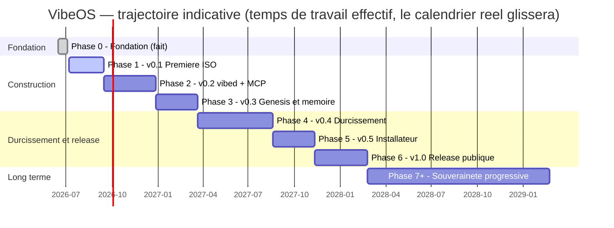

# ROADMAP — VibeOS

> Feuille de route pluriannuelle du projet VibeOS (nom de code provisoire) : distribution Linux immuable, AI-native et security-first, dédiée au vibecoding.
>
> Document maintenu par le lead programme. Révision à chaque fin de phase et au minimum une fois par trimestre. Dernière mise à jour : **2026-07-03**.

---

## 1. Principes de la feuille de route

1. **Versionnée** : chaque phase correspond à une version livrable (`v0.1` → `v1.0`), taguée dans Git et publiée comme image `ghcr.io/micka420-collab/vibeos:<tag>`.
2. **Critères de sortie mesurables** : une phase n'est terminée que lorsque *tous* ses critères de sortie sont vérifiés (idéalement par la CI). Pas de « c'est presque fini ».
3. **Durées honnêtes** : les durées sont exprimées en **temps de travail effectif** pour une équipe très réduite (1 mainteneur + agents IA). Le calendrier réel glissera ; c'est assumé. Total réaliste jusqu'à v1.0 : **environ 2 ans**, puis des années de Phase 7+.
4. **Rien ne saute la sécurité** : une fonctionnalité qui contourne le moteur de politiques (tiers T0–T3, approbation humaine T2+) ou l'audit trail n'est pas mergeable, quelle que soit la phase.
5. **Immutabilité d'abord** : tout livrable doit rester compatible avec le modèle bootc/OSTree (racine en lecture seule, mises à jour atomiques, retour d'usine).

### Vue d'ensemble

| Phase | Version | Nom | Statut | Durée indicative |
|---|---|---|---|---|
| 0 | — | Fondation | ✅ Fait (2026-07-03) | 2–3 semaines (effectué) |
| 1 | v0.1 | Première ISO | 🔜 Prochaine | 6–10 semaines |
| 2 | v0.2 | vibed + MCP | Planifiée | 3–4 mois |
| 3 | v0.3 | Genesis & mémoire | Planifiée | 2–3 mois |
| 4 | v0.4 | Durcissement | Planifiée | 4–6 mois |
| 5 | v0.5 | Installateur & identité | Planifiée | 2–3 mois |
| 6 | v1.0 | Release publique | Planifiée | 3–4 mois |
| 7+ | v1.x → v2+ | Souveraineté progressive | Continue | Plusieurs années |

---

## 2. Phase 0 — « Fondation » — ✅ fait le 2026-07-03

**Objectif** : poser un dépôt complet, cohérent et constructible ; figer les décisions d'architecture pour que toutes les phases suivantes s'y réfèrent sans les rediscuter.

### Livrables (ce dépôt)

- Documentation en français : `README.md`, `ROADMAP.md` (ce fichier), `docs/BUILD.md` et le reste de `docs/`.
- Squelette de l'image : `Containerfile` dérivé de Fedora Kinoite (KDE Plasma 6), cible `ghcr.io/micka420-collab/vibeos`.
- Squelettes des composants : daemon `vibed` (Rust/tokio), politiques `/etc/vibeos/policy.d/*.toml`, script Genesis (`memory/genesis.sh`, installé en `/usr/libexec/vibeos/genesis.sh`), unités systemd (`vibed.service`, `vibeos-genesis.service`).
- CI GitHub Actions : build **multi-architecture (amd64 + arm64)** de l'image OS, **signature cosign keyless** et push vers ghcr.io ; génération d'ISO par architecture via bootc-image-builder ; workflow `ci.yml` (tests Rust, shellcheck, validation des politiques).
- Matériel : architectures cibles et machine de référence documentées dans [docs/HARDWARE.md](docs/HARDWARE.md).
- Procédure de build locale documentée : WSL2 Ubuntu + podman (hôte Windows 11 sans docker/podman natif).

### Critères de sortie — tous atteints

- [x] Dépôt greenfield peuplé : docs, squelettes, CI présents et cohérents entre eux.
- [x] Toutes les décisions d'architecture (bootc/OSTree, vibed/MCP, tiers T0–T3, mémoire LUKS, chaîne Secure Boot → UKI → dm-verity/composefs, SELinux enforcing, cosign) écrites noir sur blanc et non contradictoires d'un fichier à l'autre.
- [x] Feuille de route pluriannuelle validée (ce document).

### Risques principaux

| Risque | Mitigation |
|---|---|
| Décisions d'architecture prises sur le papier, jamais confrontées au réel | Phase 1 volontairement courte : confronter le `Containerfile` à un vrai build le plus tôt possible |
| `micka420-collab` encore placeholder (pas de dépôt GitHub) | Créer l'organisation/le dépôt GitHub en tout début de Phase 1 ; remplacer `micka420-collab` partout en un seul commit |

**Durée** : 2–3 semaines de conception, clôturée le 2026-07-03.

---

## 3. Phase 1 — v0.1 « Première ISO »

**Objectif** : passer du papier au métal. Une image bootc personnalisée qui build en CI, une ISO installable qui démarre dans une VM, avec KDE Plasma 6 et les outils IA préinstallés. Aucune intelligence système encore : on prouve la chaîne de production.

### Livrables

- **Image bootc multi-architecture** dérivée de Fedora Kinoite, publiée comme **manifest `linux/amd64` + `linux/arm64`** sur `ghcr.io/micka420-collab/vibeos:0.1` (et `:latest` sur la branche principale).
- **Deux ISO installables** générées par bootc-image-builder : une par architecture (amd64 et arm64).
- **Outils IA préinstallés dans l'image** (versions épinglées) : Claude Code + **Claude Agent SDK**, **gemini-cli** (Google), **codex** (OpenAI), `ollama` (modèles locaux, mode hors-ligne), **opencode** (`opencode-ai`, agent terminal multi-fournisseur, 100 % local via ollama). `aider` reste en installation optionnelle par l'utilisateur (`uvx --python 3.12 aider-chat`), incompatible avec l'image car il exige Python < 3.13.
- **Couche pilote NVIDIA (amd64 uniquement)** : akmod-nvidia + CUDA via RPM Fusion (technique akmods de Bazzite/uBlue), **validée sur le PC de référence** — Ryzen 7 3700X + RTX 3070 Ti, voir [docs/HARDWARE.md](docs/HARDWARE.md). Signature MOK des modules pour Secure Boot : Phase 4.
- **CI verte sur GitHub Actions** : build multi-arch de l'image sur chaque push, signature cosign keyless après push, push vers ghcr.io sur tag, génération des ISO en artefacts de release.
- **Build local reproductible** sous WSL2 Ubuntu + podman, suivant `docs/BUILD.md`.
- Layering minimal du dépôt dans l'image : arborescence `/etc/vibeos/`, unité `vibed.service` livrée et **activée par preset, sautée tant que le binaire `/usr/bin/vibed` est absent** (garde `ConditionPathExists`) ; aucun placeholder de binaire.

### Critères de sortie (mesurables)

- [ ] `podman build` du `Containerfile` réussit localement (WSL2) **et** en CI ; le workflow GitHub Actions est vert sur la branche principale.
- [ ] Manifest multi-arch poussé et « pullable » : `podman pull ghcr.io/micka420-collab/vibeos:0.1` fonctionne depuis une machine tierce **pour amd64 et arm64**.
- [ ] `cosign verify` réussit sur l'image publiée (signature keyless posée par la CI).
- [ ] ISO générée par bootc-image-builder **pour chaque architecture** : boot amd64 testé en VM (QEMU/KVM ou Hyper-V, UEFI) jusqu'à SDDM puis session Plasma 6 fonctionnelle ; boot arm64 testé en VM (QEMU aarch64).
- [ ] Validation NVIDIA sur le PC de référence ([docs/HARDWARE.md](docs/HARDWARE.md)) : `nvidia-smi` fonctionnel, session Plasma Wayland stable avec le pilote propriétaire.
- [ ] Racine en lecture seule vérifiée (`touch /usr/test` échoue) ; `bootc upgrade` depuis un tag antérieur applique une mise à jour atomique, `bootc rollback` restaure l'état précédent.
- [ ] Dans une session utilisateur de l'image : `claude --version`, `gemini --version`, `codex --version`, `ollama --version`, `opencode --version` répondent ; `ollama run` d'un petit modèle fonctionne hors-ligne.
- [ ] Temps de build CI < 45 min par architecture (garde-fou contre la dérive).

### Risques principaux

| Risque | Mitigation |
|---|---|
| bootc-image-builder évolue vite ; l'ISO casse d'une version à l'autre | Épingler les versions d'images de build ; test de boot en VM automatisé (ou à défaut checklist manuelle documentée) à chaque release |
| Taille d'image excessive (KDE + toolchain IA + modèles) | **Ne pas** embarquer de modèles ollama dans l'image ; les télécharger au premier usage ou pendant Genesis (Phase 3) |
| Limites de ghcr.io (taille des layers, quotas) | Multi-stage builds, purge des caches dnf, surveiller la taille par layer en CI |
| WSL2 + podman : différences subtiles avec la CI Linux | La CI fait foi ; le build WSL2 est un confort de dev, pas la référence |

**Durée indicative** : 6–10 semaines.

---

## 4. Phase 2 — v0.2 « vibed + MCP »

**Objectif** : le système devient pilotable par des agents IA, au niveau OS, de façon gouvernée. Premier daemon fonctionnel, premiers outils T0/T1, moteur de politiques actif, audit complet.

### Livrables

- **`vibed` fonctionnel** (Rust, tokio) : binaire `/usr/bin/vibed`, unité `vibed.service` activée, serveur MCP (JSON-RPC 2.0) sur le socket unix `/run/vibed/mcp.sock` (`root:vibeos-agents`, mode `0660` — groupe créé par sysusers.d).
- **Outils T0 (observe, lecture seule)** : infos système, état des services, lecture du journal, lecture de fichiers autorisés, métriques.
- **Outils T1 (modify-user)** : écriture dans les fichiers et la configuration de l'utilisateur, dans les limites du moteur de politiques.
- **Moteur de politiques v1** : chargement de `/etc/vibeos/policy.d/*.toml`, application des tiers T0–T3. En v0.2, **T2/T3 sont refusés par défaut** (aucun outil T2+ exposé) ; le flux d'approbation humaine est spécifié mais implémenté en Phase 4.
- **Audit trail** : chaque appel d'outil journalisé (horodatage, agent, outil, tier, décision de politique, résultat) — journal append-only.
- **Configuration MCP pour Claude Code** livrée dans l'image : Claude Code découvre et utilise `vibed` sans configuration manuelle.
- Harnais de tests : tests unitaires Rust + tests d'intégration MCP (handshake, appels d'outils, refus de politique) exécutés en CI.

### Critères de sortie (mesurables)

- [ ] `systemctl status vibed` : actif, sain, redémarre proprement après `kill -9` (Restart=on-failure vérifié).
- [ ] Handshake MCP `initialize` réussi depuis Claude Code via `/run/vibed/mcp.sock` ; liste d'outils T0/T1 exposée.
- [ ] Démonstration bout-en-bout : depuis Claude Code, un agent lit l'état du système (T0) et modifie un fichier de config utilisateur (T1) — les deux actions apparaissent dans l'audit trail.
- [ ] Tout appel T2/T3 est refusé avec une erreur JSON-RPC explicite, et le refus est audité.
- [ ] Politique invalide dans `/etc/vibeos/policy.d/` → `vibed` refuse de démarrer en mode permissif : soit il refuse tout appel, soit il échoue explicitement (fail-closed vérifié par un test).
- [ ] CI : tests unitaires + intégration verts ; `cargo clippy -D warnings` et `cargo audit` sans erreur.
- [ ] Aucune fuite d'informations sensibles (tokens, contenus de fichiers) dans les logs de niveau info.

### Risques principaux

| Risque | Mitigation |
|---|---|
| Spécification MCP en évolution ; incompatibilités clients | S'aligner sur la version supportée par Claude Code ; tests d'intégration contractuels dans la CI |
| Conception du moteur de politiques trop rigide ou trop laxiste | Politiques déclaratives versionnées dans le dépôt ; principe fail-closed ; itérer sur des cas d'usage réels dès la Phase 2 |
| Surface d'attaque du socket (n'importe quel process local) | Permissions du socket + groupe dédié dès v0.2 ; contrôles par pair (SO_PEERCRED) ; durcissement complet en Phase 4 |
| Effet tunnel Rust : daemon jamais « fini » | Périmètre v0.2 strictement limité à T0/T1 ; tout le reste va dans les phases suivantes |

**Durée indicative** : 3–4 mois.

---

## 5. Phase 3 — v0.3 « Genesis & mémoire »

**Objectif** : concrétiser la promesse fondatrice — l'OS naît vierge et **crée sa mémoire au premier démarrage**. Volume chiffré, interview de naissance, mode amnésique.

### Livrables

- **`vibeos-genesis.service`** : exécution au premier boot uniquement, gardée par `ConditionPathExists=!/var/lib/vibeos/memory/.initialized` ; exécute `/usr/libexec/vibeos/genesis.sh` (source : `memory/genesis.sh`).
- **Volume chiffré** : `/var/lib/vibeos/memory` sur un volume LUKS provisionné via crypttab + unité de montage systemd — jamais par `genesis.sh` lui-même (cf. [docs/MEMORY.md](docs/MEMORY.md)) ; clé dérivée de la session utilisateur / TPM selon le matériel (décision documentée pendant la phase).
- **Interview de naissance** : au premier démarrage, dialogue guidé (TUI/UI) où l'utilisateur définit son profil, ses préférences, le persona des agents ; les réponses fondent la mémoire initiale. Le prototype `agent/genesis_interview.py` (non câblé dans `genesis.sh` en v0.1) sert de base de travail.
- **Mode amnésique** (style Tails) : activé par un paramètre kernel cmdline (ex. `vibeos.amnesic=1`) choisi au menu de boot — la mémoire est un tmpfs recréé à **chaque** démarrage, rien ne persiste.
- **Retour d'usine** : commande documentée qui détruit le volume mémoire et réarme Genesis (suppression de `.initialized` + effacement cryptographique du LUKS).
- Intégration `vibed` ↔ mémoire : les agents lisent/écrivent la mémoire via des outils MCP gouvernés (l'accès direct au volume reste réservé au système).
- Ébauche de `vibectl` (CLI admin, périmètre minimal : statut de la mémoire, déclenchement du retour d'usine).

### Critères de sortie (mesurables)

- [ ] VM neuve : premier boot → Genesis s'exécute, l'interview se déroule, `/var/lib/vibeos/memory/.initialized` existe, le volume est bien LUKS (`cryptsetup isLuks` vrai).
- [ ] Deuxième boot : Genesis **ne se relance pas** (condition systemd vérifiée dans les logs).
- [ ] Mode amnésique : boot avec le flag → mémoire en tmpfs, fichier témoin écrit, reboot → le fichier a disparu ; boot normal → la mémoire persiste.
- [ ] Retour d'usine : après la procédure, la machine se comporte exactement comme au premier boot (Genesis rejoue l'interview).
- [ ] Données de l'interview effectivement présentes dans la mémoire et accessibles aux agents via MCP (démonstration : « qui suis-je ? » répond avec l'identité définie à la naissance).
- [ ] Un disque extrait de la machine (ou l'image disque de la VM) ne révèle aucune donnée mémoire en clair.

### Risques principaux

| Risque | Mitigation |
|---|---|
| Gestion de la clé LUKS : équilibre sécurité / UX (TPM absent, VM, multi-utilisateur) | Stratégie par paliers : passphrase d'abord (simple, sûr), TPM2 enroll en option ; documenter clairement le modèle de menace |
| Genesis échoue à mi-parcours → état incohérent | Genesis idempotent et transactionnel : `.initialized` écrit en tout dernier ; un échec relance Genesis proprement au boot suivant |
| Interview de naissance : effet gadget si mal conçue | La traiter comme un produit : contenu scripté, testé avec de vrais utilisateurs, versionné |
| tmpfs amnésique : fuites via swap ou logs persistants | Pas de swap sur disque en mode amnésique (ou swap chiffré volatil) ; journald en mode volatile ; checklist de fuite auditée |

**Durée indicative** : 2–3 mois.

---

## 6. Phase 4 — v0.4 « Durcissement »

**Objectif** : transformer un prototype fonctionnel en système défendable. C'est la phase la plus technique et la plus longue : chaîne de boot mesurée, politique SELinux dédiée, signatures, sandbox des outils, et activation gouvernée des tiers T2/T3.

### Livrables

- **Politique SELinux dédiée** : domaine `vibed_t` confiné (et types associés pour le socket, la mémoire, les politiques), système entier en **enforcing**.
- **Chaîne de boot signée** : UEFI Secure Boot → UKI signée → dm-verity/composefs ; démarrage vérifié testé en VM (OVMF) **et** sur au moins un matériel physique réel.
- **Vérification de signature côté client** : la signature cosign des images en CI est livrée depuis la Phase 0 ; la Phase 4 impose la **vérification** de signature côté client lors des `bootc upgrade` (une image non signée ou mal signée est rejetée).
- **Sandbox d'exécution des outils** : durcissement systemd de `vibed` (NoNewPrivileges, ProtectSystem=strict, etc.), filtres **seccomp** et règles **Landlock** par outil, proportionnés au tier.
- **Activation T2 (modify-system)** avec le **flux d'approbation humaine obligatoire** (spécifié en Phase 2) : paquets, services. T3 (destructive) reste désactivé par défaut, activable explicitement par politique.
- Scans de sécurité en CI : audit des dépendances (cargo audit), lint de conteneur, scan de vulnérabilités de l'image, profil OpenSCAP de base.
- Documentation du modèle de menace (en français) dans `docs/`.

### Critères de sortie (mesurables)

- [ ] `getenforce` = `Enforcing` ; zéro AVC denial pendant un scénario d'usage nominal complet (boot, session, appels T0/T1/T2 approuvés) ; `vibed` tourne bien dans son domaine dédié (`ps -eZ`).
- [ ] Boot Secure Boot activé sur matériel physique : chaîne UKI + dm-verity vérifiée ; une image dont la racine a été altérée **refuse de démarrer**.
- [ ] `cosign verify` reste vert sur chaque image publiée (signature en CI livrée depuis la Phase 0) ; une image non signée ou mal signée est **rejetée** à la mise à jour côté client (test négatif en CI).
- [ ] Démonstration sandbox : un outil T1 tentant d'accéder hors de son périmètre (fichier interdit, syscall bloqué) est stoppé par Landlock/seccomp, et l'événement est audité.
- [ ] Flux T2 bout-en-bout : un agent demande l'installation d'un paquet → notification à l'humain → approbation → action exécutée et auditée ; sans approbation, refus après timeout.
- [ ] Scan de vulnérabilités de l'image : zéro CVE critique non justifiée à la release.

### Risques principaux

| Risque | Mitigation |
|---|---|
| Écrire une politique SELinux correcte est long et pointu | Partir des politiques Fedora existantes ; boucle audit2allow **en revue manuelle uniquement** (jamais en aveugle) ; y consacrer du temps dédié, pas des restes |
| Secure Boot sur matériel varié (clés custom vs shim/MOK) | Cible v0.4 : shim + MOK enroll documenté ; clés custom en option avancée ; matrice de matériel testé maintenue dans `docs/` |
| La sandbox casse des outils légitimes (faux positifs) | Profils par outil versionnés avec leurs tests ; mode « complain » de développement pour calibrer avant enforcement |
| Cette phase peut engloutir le projet (perfectionnisme sécurité) | Périmètre gelé au démarrage de la phase ; ce qui dépasse va en v1.x ; revue mensuelle d'avancement |

**Durée indicative** : 4–6 mois. C'est le chemin critique du projet — ne pas le sous-estimer.

---

## 7. Phase 5 — v0.5 « Installateur & identité »

**Objectif** : rendre le système installable et désirable par quelqu'un d'autre que son auteur. Identité visuelle, installateur guidé, présence publique.

### Livrables

- **Identité** : nom définitif (fin du nom de code), logo, thème Plasma/SDDM/GRUB cohérents, lignes directrices de marque dans le dépôt.
- **Installateur guidé** : parcours d'installation depuis l'ISO (partitionnement guidé avec chiffrement disque par défaut, création utilisateur, choix du mode amnésique par défaut ou non) ; l'installation aboutit à un premier boot qui enchaîne sur Genesis (Phase 3).
- **Site web** : présentation du projet, téléchargement de l'ISO avec sommes de contrôle et signatures, documentation utilisateur (FR d'abord, EN ensuite).
- Notes de version systématiques ; canal d'annonces.

### Critères de sortie (mesurables)

- [ ] Test utilisateur : une personne extérieure au projet installe VibeOS sur une machine (VM ou physique) **sans assistance**, de l'ISO au bureau Plasma post-Genesis, en moins de 30 minutes.
- [ ] Le disque installé est chiffré par défaut ; le choix amnésique/persistant est proposé pendant l'installation et respecté au boot.
- [ ] Site en ligne, ISO téléchargeable, empreintes SHA-256 et signature cosign publiées et vérifiables.
- [ ] Zéro occurrence restante du nom de code ni du placeholder `micka420-collab` dans l'image, l'ISO et le site.

### Risques principaux

| Risque | Mitigation |
|---|---|
| Développer un installateur maison = gouffre à temps | Réutiliser l'existant (Anaconda WebUI / `bootc install` guidé) et l'habiller ; installateur 100 % maison repoussé en Phase 7+ |
| Le branding retarde la technique | Le traiter en parallèle des phases 3–4 (design ≠ ingénierie) ; la Phase 5 ne fait qu'assembler |
| Nom définitif : collision de marque | Vérification de disponibilité (marques, domaines, dépôts) avant tout engagement public |

**Durée indicative** : 2–3 mois (en partie parallélisable avec la fin de la Phase 4).

---

## 8. Phase 6 — v1.0 « Release publique »

**Objectif** : première version dont on assume publiquement la promesse : un OS immuable, gouverné, à la mémoire née au premier boot, utilisable au quotidien pour le vibecoding.

### Livrables

- **Gel du périmètre** puis cycle bêta public (v1.0-beta1 → rcN) : uniquement corrections et durcissement.
- **Revue de sécurité externe** (audit tiers ou revue communautaire structurée) sur `vibed`, le moteur de politiques et la chaîne de boot ; correctifs intégrés.
- **Canaux de mise à jour** : `stable` / `testing` / `dev`, politique de support écrite (durée de support de v1.0, cadence des mises à jour de sécurité).
- Processus de sécurité public : politique de divulgation (`SECURITY.md`), contact chiffré, engagement de délai de correctifs.
- Documentation complète FR/EN : utilisateur, administrateur, développeur d'outils MCP.
- Annonce publique et distribution de l'ISO.

### Critères de sortie (mesurables)

- [ ] Au moins **4 semaines de bêta publique** sans bug bloquant ni régression de sécurité ouverte.
- [ ] Tous les problèmes critiques et majeurs de l'audit externe corrigés ou explicitement acceptés et documentés.
- [ ] Mise à niveau atomique v0.5 → v1.0 vérifiée (upgrade + rollback) sur les canaux publics.
- [ ] Le mainteneur utilise VibeOS comme machine de travail quotidienne depuis au moins 1 mois (dogfooding réel).
- [ ] Métriques de première adoption suivies (téléchargements, retours structurés) — sans télémétrie intrusive : la collecte agressive de données serait contraire à l'ADN du projet.

### Risques principaux

| Risque | Mitigation |
|---|---|
| Coût d'un audit externe pour un projet indépendant | Alternatives graduées : revue croisée par des pairs reconnus, programme de divulgation, audit ciblé sur `vibed` uniquement |
| Afflux d'utilisateurs → charge de support ingérable | Attentes explicites (v1.0 = early adopters), canaux communautaires, FAQ solide avant l'annonce |
| Promesse IA sur-vendue par rapport au réel | La communication décrit ce qui est démontrable, critères de sortie à l'appui — rien d'autre |

**Durée indicative** : 3–4 mois. **Fenêtre réaliste pour v1.0 : mi-2028, avec une tolérance jusqu'à fin 2028.**

---

## 9. Phase 7+ — « Souveraineté progressive » (v1.x → v2 et au-delà)

**Objectif** : réduire méthodiquement les dépendances externes et faire de VibeOS un système souverain — sans jamais casser la promesse de stabilité de v1.0. Phase continue, jalonnée par les versions mineures puis v2.0.

### Axes de travail (ordre de priorité indicatif)

1. **Infrastructure propre** : registre d'images auto-hébergé (miroir de ghcr.io d'abord, source de vérité ensuite), serveurs de build dédiés, transparence des builds (journaux publics, builds reproductibles au maximum).
2. **Config kernel dédiée** : passer du kernel Fedora générique à une configuration durcie et allégée pour VibeOS (surface d'attaque réduite, options de durcissement compilées, signatures de modules propres).
3. **Contributions upstream** : reverser ce qui doit l'être — bootc/OSTree, composefs, écosystème MCP, SELinux, outillage sigstore. La souveraineté ne signifie pas le fork systématique ; l'upstream d'abord, le fork en dernier recours.
4. **Remplacement progressif de composants par des implémentations maison en Rust** — un composant à la fois, à trois conditions : gain mesurable (sécurité, intégration IA ou maintenance), parité fonctionnelle testée, plan de retour arrière. Candidats dans l'ordre : `vibectl` complet, moteur de mémoire (indexation/embeddings locaux via ollama), installateur maison, superviseur d'agents, puis des briques système plus profondes.
5. **Indépendance de la base** : étudier (sans dogme) la réduction de la dépendance à Fedora — d'abord par la maîtrise du pipeline de composition de l'image, éventuellement à terme par une base construite en propre. Décision sur données, pas sur fierté.

### Critères de progression (par version mineure)

- [ ] Chaque remplacement de composant est livré derrière un interrupteur de politique, avec comparatif avant/après (perf, sécurité, bugs) publié.
- [ ] Part de l'infrastructure critique auto-hébergée : mesurée et en croissance à chaque version (registre, build, signatures).
- [ ] Nombre de contributions mergées upstream : suivi public.
- [ ] Zéro régression du contrat v1.0 : immutabilité, tiers T0–T3, audit, Genesis, mode amnésique restent invariants.

### Risques principaux

| Risque | Mitigation |
|---|---|
| Syndrome NIH : réécrire pour réécrire | Les trois conditions ci-dessus sont bloquantes ; toute réécriture sans gain mesuré est refusée en revue |
| Épuisement du mainteneur sur un horizon de plusieurs années | Cadence soutenable, automatisation maximale (les agents IA de VibeOS participent à son propre développement), élargissement progressif des contributeurs |
| Divergence d'avec Fedora rendant les rebases coûteuses | Limiter les patchs porteurs ; tout ce qui peut vivre upstream vit upstream |

**Durée** : continue — c'est le régime de croisière du projet, sur plusieurs années.

---

## 10. Gouvernance de la feuille de route

- **Versionnement** : `v0.x` = phases de construction (une version par phase) ; `v1.0` = premier contrat public ; ensuite versions mineures trimestrielles visées, correctifs de sécurité au fil de l'eau.
- **Révision** : ce document est revu à chaque fin de phase (bilan critères de sortie / réel) et au minimum chaque trimestre. Les changements de périmètre passent par une modification explicite de ce fichier, jamais par dérive silencieuse.
- **Règle d'or** : quand une phase déborde, on **réduit son périmètre**, on ne dégrade ni les critères de sortie de sécurité ni la qualité. Ce qui sort du périmètre est réinscrit plus loin dans la roadmap, tracé et daté.

> Never stop at « it doesn't work » — mais un OS qui « marche » sans être défendable ne marche pas. Les deux exigences avancent ensemble, phase après phase.
