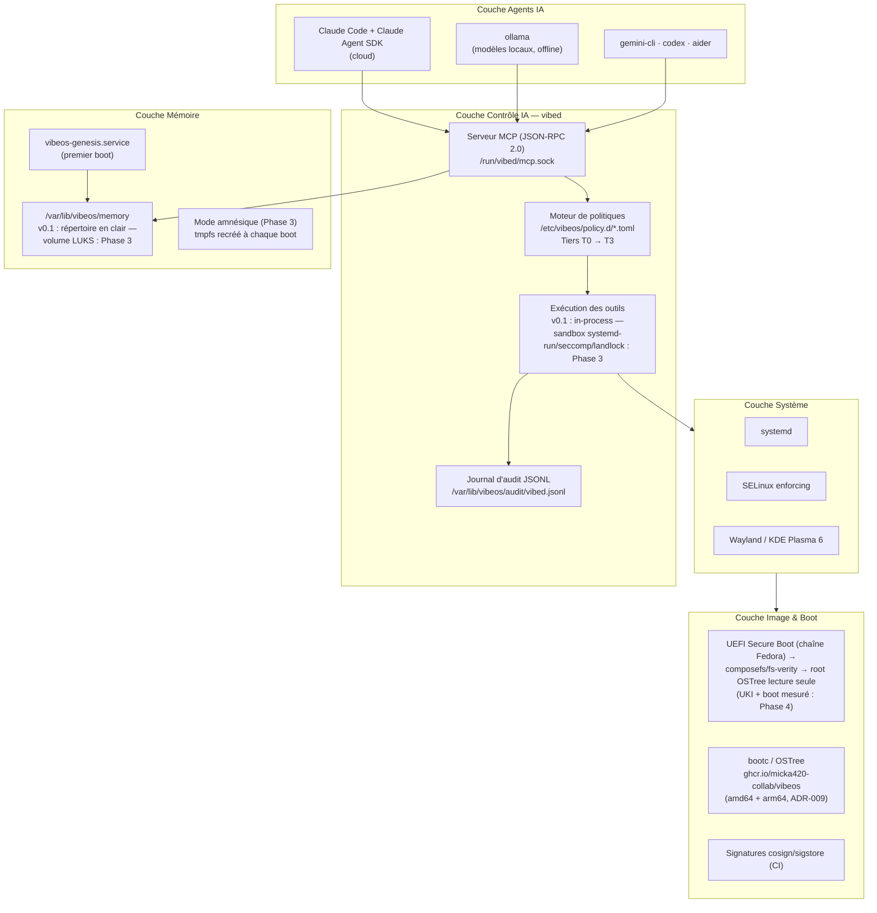
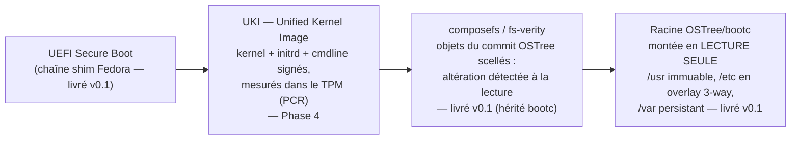
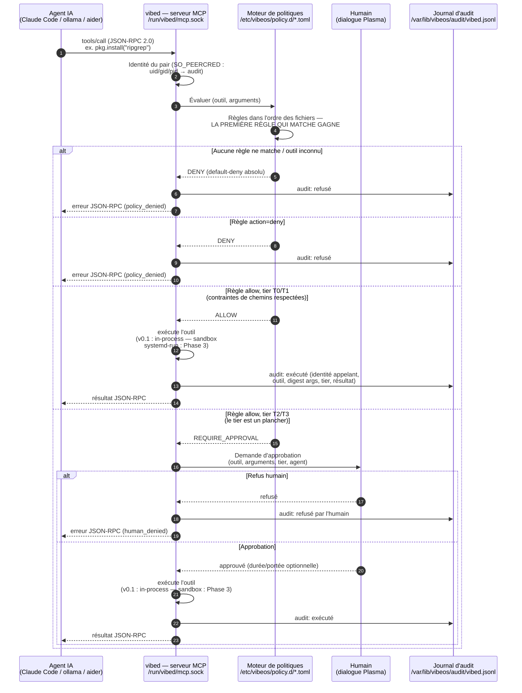
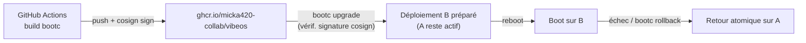

# Architecture de VibeOS

> Version : v0.1 (fondation) — Date : 2026-07-03
> Statut : document de référence. Les décisions justifiant cette architecture sont consignées dans [DECISIONS.md](DECISIONS.md). Le plan pluriannuel est dans [../ROADMAP.md](../ROADMAP.md). Les instructions de build sont dans [BUILD.md](BUILD.md).

VibeOS est une distribution Linux **immuable**, **AI-native** et **security-first**, dérivée de Fedora Kinoite (KDE Plasma 6) et livrée sous forme d'image bootc/OSTree. Les agents IA interagissent avec l'OS **au niveau système** via un démon dédié (`vibed`), sous le contrôle strict d'un moteur de politiques et d'un journal d'audit. L'OS est livré **vierge** : sa mémoire est créée au premier démarrage (séquence *Genesis*). Le *mode amnésique* (mémoire tmpfs recréée à chaque démarrage) est une cible **Phase 3**.

> **Convention de lecture.** Tout mécanisme non livré en v0.1 est marqué « Phase N », selon la numérotation de [../ROADMAP.md](../ROADMAP.md) (qui fait foi) : Phase 1 = v0.1 Première ISO · Phase 2 = vibed + MCP · Phase 3 = Genesis & mémoire · Phase 4 = Durcissement · Phase 5 = Installateur & identité · Phase 6 = v1.0. Aucun mécanisme non implémenté n'est décrit au présent.

---

## 1. Vue d'ensemble en couches



Chaque couche n'expose à la couche supérieure qu'une interface contrôlée : les agents ne touchent **jamais** le système directement, ils passent par le socket MCP de `vibed`.

---

## 2. Chaîne de boot mesurée

Objectif (cible complète : **Phase 4**) : garantir que **tout ce qui s'exécute avant l'espace utilisateur est signé, mesuré et vérifié**, et que la racine du système est cryptographiquement intègre et en lecture seule. En v0.1, VibeOS hérite de la chaîne Fedora/bootc (Secure Boot via shim, composefs/fs-verity) ; l'UKI et les mesures TPM arrivent en Phase 4.



Propriétés :

| Propriété | Mécanisme | Statut |
|---|---|---|
| Aucun code de boot non signé | UEFI Secure Boot (shim → bootloader → noyau signés Fedora) | livré v0.1 |
| Racine intègre | composefs adossé à fs-verity (objets du commit OSTree scellés) | livré v0.1 (hérité bootc) |
| Racine immuable à l'exécution | Montage lecture seule OSTree ; seuls `/etc` (merge 3-way) et `/var` sont inscriptibles | livré v0.1 |
| Retour usine | Redéploiement de l'image + purge de `/var` (sémantique factory-reset de bootc) | livré v0.1 |
| Ligne de commande kernel non falsifiable | Intégrée dans l'UKI (signée avec elle) | **Phase 4** |
| Attestation possible | Mesures TPM (PCR) à chaque étape | **Phase 4** |

Limite honnête de la v0.1 : l'initrd généré localement et la cmdline ne sont pas encore couverts par une signature unique. Le détail de cet écart et de sa fermeture est dans [SECURITY-ARCHITECTURE.md](SECURITY-ARCHITECTURE.md) §1.

---

## 3. Plan système

- **systemd** : orchestrateur unique. Tous les composants VibeOS sont des unités systemd (`vibed.service`, `vibeos-genesis.service`) avec durcissement systématique (`ProtectSystem=strict`, `PrivateTmp=`, `NoNewPrivileges=`, `SystemCallFilter=` seccomp, `RestrictAddressFamilies=`). Le confinement landlock par outil est une cible Phase 3.
- **SELinux enforcing** : politique ciblée héritée de Fedora. Le module dédié `vibed_t` confinant le démon et ses sous-processus d'exécution d'outils est une cible **Phase 4**. Aucun mode permissif, y compris en développement.
- **Wayland / KDE Plasma 6** : session graphique par défaut (héritage Kinoite). X11 non installé. Les dialogues d'approbation humaine (voir §4) s'afficheront (Phase 2) via une intégration Plasma (portail/notification) parlant à `vibed` par le socket MCP côté privilégié.
- **Espace utilisateur applicatif** : Flatpak pour les applications graphiques, `toolbox`/conteneurs pour le développement — la racine reste intacte.

---

## 4. Plan IA

### 4.1 vibed — le démon système IA

- Binaire : `/usr/bin/vibed` — Rust, runtime tokio (voir ADR-003). L'unité `vibed.service` est livrée et activée par preset dès la v0.1, mais **sautée** (`ConditionPathExists=/usr/bin/vibed`) tant que le binaire n'est pas dans l'image (Phase 2). Aucun placeholder de binaire.
- Privilèges : en v0.1, `vibed` s'exécute en **root**, avec un durcissement systemd en deny-list (documenté honnêtement dans [SECURITY-ARCHITECTURE.md](SECURITY-ARCHITECTURE.md) §3.1). Cible Phase 4 : `User=vibed` + `CapabilityBoundingSet=` en allow-list vide.
- Interface : **serveur MCP** (Model Context Protocol, JSON-RPC 2.0) sur socket Unix `/run/vibed/mcp.sock`. Le socket est `root:vibeos-agents` en mode `0660` : le groupe `vibeos-agents` et l'utilisateur système `vibed` sont créés par `usr/lib/sysusers.d/vibeos.conf` (livré dans l'image), et `vibed` applique ce groupe au socket à l'ouverture (avertissement + poursuite si le groupe manque). L'identité de l'appelant (uid/gid/pid) est capturée via les *peer credentials* (`SO_PEERCRED`) et inscrite dans chaque enregistrement d'audit.

### 4.2 Moteur de politiques — tiers de capacités

Chaque outil MCP exposé par `vibed` est classé dans un tier. Le moteur lit `/etc/vibeos/policy.d/*.toml` (fichiers chargés en ordre lexicographique de nom, règles évaluées dans l'ordre d'apparition : **la première règle qui matche gagne**, l'évaluation s'arrête) et décide : `allow`, `deny` ou `ask` (approbation humaine). Sémantique stricte :

- **Default-deny absolu** : aucune règle ne matche → refus ; outil inconnu du registre → refus.
- **Le tier est un plancher** : une règle `allow` sur un outil T2/T3 exige `approval = "human"` et produit toujours une demande d'approbation ; une règle T2/T3 `allow` sans approbation humaine est une **erreur de chargement**.
- **Fail-closed au chargement** : tout fichier `*.toml` illisible ou invalide dans `policy.d` fait refuser le démarrage de `vibed` (erreur journalisée, sortie non nulle) — jamais de dégradation silencieuse vers un état plus permissif.
- **Contraintes de chemins** : pour les outils à chemin (`fs.read`, `fs.write`), le chemin résolu doit matcher `paths.allowed` (si présent) et ne pas matcher `paths.denied` (le refus gagne) ; une denylist intégrée au code (audit, secrets, `.ssh`, `/boot`, …) s'applique en plus, quelle que soit la politique.

| Tier | Nom | Périmètre | Défaut |
|---|---|---|---|
| **T0** | observe | Lecture seule : état système, logs, fichiers (lecture), métriques | allow |
| **T1** | modify-user | Fichiers et configuration de l'utilisateur | allow (journalisé) |
| **T2** | modify-system | Paquets, services, configuration système | **ask** — approbation humaine requise |
| **T3** | destructive | Disques, credentials, identité réseau | **ask** — approbation humaine requise + confirmation renforcée |

Toute décision (y compris les refus) est écrite dans le **journal d'audit** `/var/lib/vibeos/audit/vibed.jsonl` : horodatage, identité de l'appelant (uid/gid/pid — peer credentials), outil appelé, digest FNV-1a des arguments (non cryptographique, pour corrélation), tier, décision, résultat d'exécution. En v0.1 le journal est un JSONL **append-only** simple ; le chaînage par hachage, la réplication dans le journal systemd et le scellement TPM sont prévus en **Phase 4** (voir [SECURITY-ARCHITECTURE.md](SECURITY-ARCHITECTURE.md) §8).

### 4.3 Exécution des outils — v0.1 (in-process) et cible sandbox (Phase 3)

**État v0.1, assumé et documenté** : les outils approuvés s'exécutent **dans le processus `vibed`** (qui tourne root, cf. §4.1). Les barrières effectives sont le moteur de politiques (default-deny, contraintes de chemins) et la denylist de chemins intégrée au code — pas un confinement noyau par appel.

**Cible Phase 3** : chaque appel approuvé sera lancé dans une unité transitoire systemd (`systemd-run`) avec profil de durcissement dérivé du tier (seccomp, landlock, namespaces, limites cgroup). Un outil T1 ne pourra alors physiquement pas toucher `/etc` même si le code de l'outil est bogué. Spécification détaillée : [SECURITY-ARCHITECTURE.md](SECURITY-ARCHITECTURE.md) §3.2.

### 4.4 Runtime agents (hybride cloud + local)

Préinstallés dans l'image, en versions épinglées (voir ADR-006 et [BUILD.md](BUILD.md)) :

- **Claude Code** (`@anthropic-ai/claude-code`) et **Claude Agent SDK** (`@anthropic-ai/claude-agent-sdk`) — agents cloud, capacité maximale ;
- **gemini-cli** (`@google/gemini-cli`) et **codex** (`@openai/codex`) — CLIs agents cloud alternatifs ;
- **aider** (`aider-chat`, pip) — pair-programming CLI ;
- **ollama** — modèles locaux, fonctionnement hors-ligne complet.

Tous consomment la même interface : le socket MCP de `vibed`. Aucun agent n'a de chemin privilégié.

### 4.5 Séquence : action IA à travers la passerelle de politiques



> En v0.1, le canal d'approbation humaine interactif (dialogue Plasma) n'est pas encore livré : les outils T2/T3 aboutissent à `RequireApproval` et sont refusés faute d'approbateur — comportement volontairement fail-closed jusqu'à la Phase 2.

---

## 5. Plan mémoire

L'OS est livré **vierge** : l'image ne contient aucune mémoire. La mémoire de la machine est **créée au premier démarrage**. La spécification de référence du sous-système est [MEMORY.md](MEMORY.md).

- **Emplacement** : `/var/lib/vibeos/memory`. En v0.1, c'est un **répertoire en clair** (`root:root`, `0700`) sous `/var` ; le volume **LUKS2** dédié (clé scellée TPM2 + phrase de récupération, monté via `crypttab` + unité de montage — jamais par `genesis.sh`) est une cible **Phase 3**. `/var` étant hors de l'image OSTree, la mémoire survit aux mises à jour et disparaît lors d'un factory-reset.
- **Genesis** : `vibeos-genesis.service` (oneshot, `RequiresMountsFor=/var/lib/vibeos/memory`) s'exécute au premier boot uniquement, gardé par :

  ```ini
  ConditionPathExists=!/var/lib/vibeos/memory/.initialized
  ```

  Il exécute `/usr/libexec/vibeos/genesis.sh` (source du dépôt : [memory/genesis.sh](../memory/genesis.sh)) : création de l'arborescence mémoire (`identity.toml`, `hardware.json`, squelette `user/`, `projects/`, `journal/`, `knowledge/`), premier événement de journal, puis marqueur `.initialized` en dernier (crash-safe). **`genesis.sh` ne fait ni `cryptsetup`, ni `mkfs`, ni aucun montage**, et n'accepte aucun flag : le mode est lu depuis la variable d'environnement `VIBEOS_MEMORY_MODE` (`persistent` par défaut).
- **Mode amnésique** (style Tails — **Phase 3, non livré en v0.1**) : activable par option kernel `vibeos.amnesic=1`, lue par un *generator* systemd (Phase 3) qui montera un **tmpfs** sur `/var/lib/vibeos/memory` et injectera `VIBEOS_MEMORY_MODE=amnesic` dans l'environnement de Genesis. La mémoire sera reconstruite **à chaque boot** et perdue à l'extinction, sans écriture disque.
- **Administration** : CLI `vibectl` (futur — statut : planifié, voir [../ROADMAP.md](../ROADMAP.md)).

### 5.1 Séquence : premier démarrage (Genesis)

```mermaid
sequenceDiagram
    autonumber
    participant FW as Boot vérifié<br/>(Secure Boot + composefs/fs-verity ;<br/>UKI mesurée : Phase 4)
    participant SD as systemd
    participant G as vibeos-genesis.service
    participant GS as /usr/libexec/vibeos/genesis.sh
    participant M as /var/lib/vibeos/memory<br/>(v0.1 : répertoire en clair —<br/>volume LUKS : Phase 3)
    participant V as vibed.service

    FW->>SD: Démarre systemd (racine lecture seule)
    SD->>G: ConditionPathExists=!.../.initialized → VRAI (premier boot)
    G->>GS: exécute genesis.sh<br/>(VIBEOS_MEMORY_MODE=persistent par défaut)
    GS->>M: mkdir arborescence (user/, projects/,<br/>journal/, knowledge/) — 0700, umask 077
    GS->>M: hardware.json (lscpu/free/lsblk/df,<br/>replis gracieux)
    GS->>M: identity.toml (hostname, machine-id,<br/>birth, mode)
    GS->>M: premier événement de journal (type: genesis)
    GS->>M: touch .initialized (EN DERNIER — crash-safe)
    SD->>V: Démarre vibed (After=vibeos-genesis.service,<br/>sauté si /usr/bin/vibed absent — Phase 2)
    V->>V: Ouvre /run/vibed/mcp.sock<br/>charge /etc/vibeos/policy.d/*.toml (fail-closed)
    Note over M: Phase 3 : le répertoire devient un volume LUKS2<br/>(crypttab + TPM2, monté AVANT Genesis) ;<br/>mode amnésique : generator tmpfs +<br/>VIBEOS_MEMORY_MODE=amnesic, Genesis rejoué à chaque boot
```

Aux démarrages suivants (mode persistant), le marqueur `.initialized` existe : la condition est fausse, Genesis est ignoré. En Phase 3, le volume LUKS sera au préalable déverrouillé et monté par `crypttab`/unité de montage — pas par `genesis.sh`.

---

## 6. Plan mises à jour

- **Format** : l'OS est une image OCI bootc **multi-architecture** (manifeste `linux/amd64` + `linux/arm64`, voir ADR-009 et [HARDWARE.md](HARDWARE.md)) construite par GitHub Actions et poussée sur `ghcr.io/micka420-collab/vibeos` (`micka420-collab` = placeholder jusqu'à la création du dépôt GitHub). ISO d'installation générée par architecture avec **bootc-image-builder**. Builds locaux : WSL2 Ubuntu + podman (voir [BUILD.md](BUILD.md)).
- **Signature** : chaque image poussée est signée en CI avec **cosign** (sigstore, keyless — livré v0.1). La **vérification côté client** (bootc/OSTree refuse toute image non signée ; identité du workflow CI épinglée dans la politique embarquée) est une cible **Phase 2** : tant qu'elle n'est pas active, la signature existe mais n'est pas encore imposée localement.
- **Application atomique** : la mise à jour est un nouveau déploiement OSTree préparé à froid ; bascule au reboot. Il n'existe **aucun état intermédiaire** : soit l'ancienne image, soit la nouvelle.
- **Rollback** : le déploiement précédent est conservé ; `bootc rollback` (ou le menu de boot) restaure l'état antérieur en un redémarrage. Échec de boot répété → retour automatique possible via boot-counting systemd.



---

## 7. Tableau des composants

| Composant | Rôle | Interface | Chemins clés |
|---|---|---|---|
| Image OS bootc | Racine immuable, mises à jour atomiques | OCI registry (manifeste amd64+arm64), `bootc upgrade/rollback` | `ghcr.io/micka420-collab/vibeos`, racine OSTree lecture seule |
| Boot vérifié | Secure Boot + composefs/fs-verity (v0.1) ; UKI + mesures TPM2 : **Phase 4** | UEFI Secure Boot ; TPM2 (PCR) en Phase 4 | ESP (`/boot/efi`) |
| `vibed` | Démon système IA (Rust/tokio) — binaire dans l'image en Phase 2 | MCP JSON-RPC 2.0 sur socket Unix (`root:vibeos-agents` 0660) | `/usr/bin/vibed`, `vibed.service`, `/run/vibed/mcp.sock`, `usr/lib/sysusers.d/vibeos.conf` |
| Moteur de politiques | Décision allow/deny/ask par tier T0–T3 — première règle qui matche, default-deny, fail-closed | Fichiers TOML, évalué in-process par vibed | `/etc/vibeos/policy.d/*.toml` |
| Journal d'audit | Trace de chaque appel d'outil | JSONL append-only (chaînage de hachés + réplication journald : **Phase 4**) | `/var/lib/vibeos/audit/vibed.jsonl` |
| Sandbox d'exécution (**Phase 3**) | Isolation des outils approuvés — v0.1 : exécution in-process | Unités systemd transitoires (seccomp, landlock) — Phase 3 | Profils par tier (Phase 3) |
| Genesis | Création de la mémoire au premier boot (arborescence, identité, journal — pas de cryptsetup/mkfs/montage) | Unité systemd one-shot (condition sur `.initialized`), env `VIBEOS_MEMORY_MODE` | `vibeos-genesis.service`, `/usr/libexec/vibeos/genesis.sh` (source : `memory/genesis.sh`) |
| Mémoire | État persistant de la machine | v0.1 : répertoire en clair `root:root` 0700 ; **Phase 3** : volume LUKS2 (ou tmpfs en amnésique) | `/var/lib/vibeos/memory`, marqueur `.initialized` |
| Runtime agents | Claude Code, Claude Agent SDK, gemini-cli, codex, aider, ollama | Client MCP → `/run/vibed/mcp.sock` | Binaires dans l'image ; modèles ollama sous `/var/lib/ollama` |
| `vibectl` | CLI d'administration (futur) | CLI → socket MCP privilégié | `/usr/bin/vibectl` (planifié) |
| SELinux | Confinement obligatoire | Politique ciblée héritée de Fedora (module `vibed_t` : **Phase 4**) | `/etc/selinux/`, mode enforcing |
| Bureau | Session graphique, dialogues d'approbation | Wayland, portails Plasma | KDE Plasma 6 (héritage Kinoite) |
| CI/CD | Build, signature, publication | GitHub Actions + cosign + bootc-image-builder | `.github/workflows/`, ISO via bootc-image-builder |

---

## 8. Invariants d'architecture

1. **Aucun agent IA ne contourne `vibed`** : le socket MCP est l'unique surface de contrôle système exposée aux agents.
2. **Aucune action T2+ sans humain** : l'approbation humaine par défaut pour T2/T3 est une propriété du produit, pas une option de confort.
3. **Aucun appel d'outil sans trace** : l'audit précède la réponse à l'agent ; si l'audit échoue, l'action échoue.
4. **La racine ne s'écrit jamais** : toute personnalisation passe par `/etc` (overlay), `/var`, Flatpak ou une nouvelle image.
5. **La mémoire naît au boot** : l'image livrée est identique pour toutes les machines ; l'identité et la mémoire sont créées localement par Genesis.
