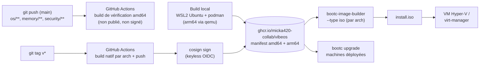

# BUILD.md — Construire, tester et publier VibeOS

Guide de référence pour produire l'image bootc **multi-architecture**
(`linux/amd64` + `linux/arm64`) `ghcr.io/micka420-collab/vibeos` (dépôt GitHub
`Micka420-collab/vibeos`, nom normalisé en minuscules pour ghcr), générer les ISO d'installation et les
tester en VM depuis un poste **Windows 11**.



Rappel d'architecture : le **contexte de build est la racine du dépôt** (le
`Containerfile` copie `os/rootfs/`, `security/policy.d/` **et**
`memory/genesis.sh`). Toujours builder avec `-f os/Containerfile .` depuis la
racine.

---

## 1. Build principal : GitHub Actions (référence)

Le pipeline officiel est [`.github/workflows/build-os.yml`](../.github/workflows/build-os.yml) :

- **Déclencheurs** :
  - *push* sur `main` ou *pull request* touchant `os/**`, `memory/**`,
    `security/**` ou le workflow → **build de vérification amd64 seul**
    (`bootc container lint`), **sans push ni signature**. Garde-fou rapide.
  - *tag* `v*` **ou** `workflow_dispatch` (manuel) → **release** : build
    `amd64 + arm64`, push sur `ghcr.io`, assemblage du manifest multi-arch,
    signature cosign, **plus** les jobs ISO (une par architecture).

  Autrement dit : les commits ordinaires sur `main` sont *validés* mais **non
  publiés** ; pour publier/signer une image, on **pose un tag `v*`**.
- **Runners natifs (pas d'émulation)** : le build est une matrice où chaque
  architecture tourne sur **son propre runner natif** — amd64 sur
  `ubuntu-latest`, arm64 sur `ubuntu-24.04-arm`. Chacun construit
  `os/Containerfile` (contexte = racine, `bootc container lint` en dernière
  étape) pour sa plateforme, sans `qemu` : l'arm64 se construit en ~15 min au
  lieu de plus d'une heure en émulation. En release, chaque job pousse une image
  taguée par arch (`<sha>-amd64`, `<sha>-arm64`). Le `Containerfile` reçoit
  `TARGETARCH` : la couche NVIDIA n'est appliquée que sur amd64.
- **Job `manifest`** (release) : assemble les deux images par arch en un
  **manifest OCI** unique (tags `latest`, SHA, et la version sur un tag), poussé
  avec le `GITHUB_TOKEN` intégré — **aucun secret à configurer**.
- **Signature** : le **manifest** est signé par **cosign keyless** (OIDC GitHub
  Actions, permission `id-token: write`, journalisée dans Rekor). Aucune clé
  stockée. Vérification : section 6.
- **Jobs `iso`** (release) : `bootc-image-builder` produit une ISO **par
  architecture** sur son runner natif (pas de `--target-arch`), publiées comme
  artefacts `vibeos-iso-amd64` / `vibeos-iso-arm64`. Sur une release, l'ISO ne
  contient **aucun mot de passe en clair** (Anaconda demande le compte à
  l'installation) ; seul un `workflow_dispatch` manuel bake un compte de test.

Le workflow séparé [`ci.yml`](../.github/workflows/ci.yml) valide le code à
chaque push/PR : build + tests + clippy de `vibed/` (dont le test
d'intégration qui charge `security/policy.d/default.toml` avec le vrai
parseur), `shellcheck` sur `memory/genesis.sh`, et validation `tomllib` du
schéma des politiques.

Premier push : le paquet ghcr créé est **privé** par défaut. Le rendre public
(ou lier le dépôt) dans *GitHub → Packages → vibeos → Package settings*.

---

## 2. Build local : Windows 11 → WSL2 Ubuntu + podman

L'hôte Windows n'a ni docker ni podman : tout se passe dans **WSL2 Ubuntu**
(déjà installé). `bootc container lint` s'exécute en fin de build et valide la
conformité OSTree de l'image.

### 2.1 Préparer WSL2

Depuis PowerShell (vérification) :

```powershell
wsl -l -v          # Ubuntu doit être en VERSION 2
wsl -d Ubuntu      # entrer dans Ubuntu
```

> Si un build échoue par manque de RAM/disque, créer `%UserProfile%\.wslconfig` :
> ```ini
> [wsl2]
> memory=12GB
> ```
> puis `wsl --shutdown` et relancer.

### 2.2 Installer podman dans Ubuntu (WSL2)

```bash
sudo apt-get update
sudo apt-get install -y podman
podman --version          # >= 4.9 (Ubuntu 24.04) : OK
```

### 2.3 Récupérer les sources

Deux options :

- **Recommandé (I/O rapides)** — cloner dans le système de fichiers Linux :
  ```bash
  git clone https://github.com/Micka420-collab/vibeos.git ~/vibeos
  cd ~/vibeos
  ```
- **Direct** — travailler sur la copie Windows (plus lent via 9p) :
  ```bash
  cd "/mnt/f/je ne sais pas encore"
  ```

### 2.4 Builder l'image (amd64, architecture native)

**Builder en root** (`sudo`) : `bootc-image-builder` (étape ISO) lit le
stockage conteneurs de root ; builder directement dedans évite un push/pull.

```bash
sudo podman build -t ghcr.io/micka420-collab/vibeos:dev -f os/Containerfile .
```

Options de build utiles :

```bash
# Sauter la couche NVIDIA (gain de temps notable — le kmod est compilé au build)
sudo podman build --build-arg NVIDIA_ENABLED=0 -t ghcr.io/micka420-collab/vibeos:dev -f os/Containerfile .
```

Le build échoue si `bootc container lint` détecte une violation de layout
(contenu dans `/var`, installation dans `/usr/local`, etc.) — c'est voulu.

### 2.5 Tester le contenu de l'image

```bash
sudo podman run --rm -it ghcr.io/micka420-collab/vibeos:dev bash
```

Dans le conteneur :

```bash
cat /usr/lib/vibeos/image-info.json
ls -l /usr/lib/systemd/system/vibed.service \
      /usr/lib/systemd/system/vibeos-genesis.service \
      /usr/lib/systemd/system-preset/50-vibeos.preset \
      /usr/lib/sysusers.d/vibeos.conf \
      /usr/libexec/vibeos/genesis.sh
# La politique par défaut DOIT être livrée dans l'image (fail-closed sinon) :
test -f /etc/vibeos/policy.d/default.toml && echo "policy OK" || echo "POLICY MANQUANTE"
command -v codium ollama claude gemini codex opencode rg fd fzf socat
ollama --version            # 0.31.1 (épinglé + sha256 vérifié au build)
exit
```

> Un conteneur ne boote pas systemd : le test complet (Genesis, presets,
> sysusers, gardes `ConditionPathExists`) se fait en VM — section 5.

### 2.6 Build arm64 et manifest multi-arch (local)

Le build arm64 sur un hôte amd64 passe par l'émulation **qemu-user-static**
(mêmes couches, la couche NVIDIA est automatiquement sautée via `TARGETARCH`) :

```bash
# Émulation binfmt dans WSL2 Ubuntu
sudo apt-get install -y qemu-user-static binfmt-support

# Build arm64 seul (nettement plus lent — émulation complète)
sudo podman build --arch arm64 -t ghcr.io/micka420-collab/vibeos:dev-arm64 -f os/Containerfile .
```

Pour produire et pousser un **manifest multi-arch** comme la CI :

```bash
sudo podman manifest create ghcr.io/micka420-collab/vibeos:dev-multi
sudo podman build --arch amd64 --manifest ghcr.io/micka420-collab/vibeos:dev-multi -f os/Containerfile .
sudo podman build --arch arm64 --manifest ghcr.io/micka420-collab/vibeos:dev-multi -f os/Containerfile .
sudo podman manifest push --all ghcr.io/micka420-collab/vibeos:dev-multi \
  docker://ghcr.io/micka420-collab/vibeos:dev-multi
```

---

## 3. NVIDIA — notes pour le PC de référence

Le PC de référence n°1 (Ryzen 7 3700X + **RTX 3070 Ti** + 16 Go) est décrit
dans [`docs/HARDWARE.md`](HARDWARE.md) — c'est lui qui valide chaque release
amd64.

- La couche NVIDIA du `Containerfile` (RPM Fusion : `akmod-nvidia` +
  `xorg-x11-drv-nvidia-cuda` + `kernel-devel` correspondant) compile le module
  noyau **au build de l'image** via `akmods --force` (technique
  Bazzite/uBlue) : rien n'est compilé sur les machines des utilisateurs, le
  kmod est du contenu d'image immuable.
- Elle n'est appliquée **que sur amd64** (`TARGETARCH`), et peut être
  désactivée avec `--build-arg NVIDIA_ENABLED=0`.
- **Limite v0.1 assumée** : le module n'est **pas signé** pour Secure Boot.
  Avec Secure Boot activé, le driver ne charge pas — tester d'abord Secure
  Boot **désactivé** sur matériel réel ; la signature MOK de nos kmods est
  prévue en **Phase 4** (ROADMAP.md).
- Validation sur matériel réel : `nvidia-smi` fonctionnel, offload CUDA
  d'ollama vérifié (checklist complète dans `docs/HARDWARE.md`).

---

## 4. Générer l'ISO d'installation (bootc-image-builder)

Toujours dans Ubuntu WSL2, image `:dev` présente dans le stockage root
(section 2.4).

### 4.1 Configuration de l'installateur

`bootc-image-builder` injecte un utilisateur initial via un `config.toml`
(fichier de build local, **non versionné** — il est dans `.gitignore`) :

```bash
mkdir -p ~/vibeos-out && cd ~/vibeos-out
cat > config.toml <<'EOF'
[[customizations.user]]
name = "vibe"
password = "changeme"        # ISO de TEST uniquement — changer/retirer
groups = ["wheel"]
# key = "ssh-ed25519 AAAA... vous@machine"   # préférer une clé SSH
EOF
```

### 4.2 Lancer le build ISO

```bash
sudo podman run --rm -it --privileged \
  --security-opt label=type:unconfined_t \
  -v /var/lib/containers/storage:/var/lib/containers/storage \
  -v ./config.toml:/config.toml:ro \
  -v ./output:/output \
  quay.io/centos-bootc/bootc-image-builder:latest \
  --type iso \
  --config /config.toml \
  ghcr.io/micka420-collab/vibeos:dev
```

Résultat : `./output/bootiso/install.iso` (installateur Anaconda embarquant
l'image — installation possible **hors ligne**). Comptez ~5–6 Go pour une image
avec l'ensemble des outils.

> ⚠️ **Mémoire** : `osbuild` est gourmand. Avec le plafond WSL2 par défaut
> (8 Go), le build ISO est **tué par l'OOM** en cours d'assemblage. Allouez
> **≥ 12 Go de RAM + du swap** à WSL2 via `%UserProfile%\.wslconfig` :
> ```ini
> [wsl2]
> memory=12GB
> swap=8GB
> ```
> puis `wsl --shutdown` avant de relancer. (L'image OS, elle, se construit sans
> problème à 8 Go — seule l'étape ISO exige cette marge.) En CI, les runners
> GitHub sont suffisamment dotés : la génération d'ISO y est déclenchée sur
> tag `v*` / `workflow_dispatch`.

Pour une ISO **arm64** depuis un hôte amd64 (qemu-user-static requis,
section 2.6) : pull de l'image arm64 (`sudo podman pull --arch arm64 ...` ou
build local `--arch arm64`), puis ajouter `--target-arch arm64` à la commande
ci-dessus. En CI, ce détour est inutile : la matrice `iso` tourne sur des
runners natifs par architecture, sans `--target-arch` (voir §1).

Copier l'ISO côté Windows pour Hyper-V :

```bash
mkdir -p /mnt/f/ISO
cp output/bootiso/install.iso /mnt/f/ISO/vibeos.iso
```

---

## 5. Tester l'ISO en VM

### 5.1 Hyper-V (Windows 11)

PowerShell **administrateur** (Hyper-V activé) :

```powershell
$vm = "VibeOS-Test"
New-VM -Name $vm -Generation 2 -MemoryStartupBytes 8GB `
  -NewVHDPath "F:\VMs\$vm.vhdx" -NewVHDSizeBytes 64GB -SwitchName "Default Switch"
Set-VMProcessor -VMName $vm -Count 4

# Secure Boot ON avec le template UEFI tiers de Microsoft :
# le shim Fedora est signé par la "Microsoft 3rd Party UEFI CA".
Set-VMFirmware -VMName $vm -EnableSecureBoot On `
  -SecureBootTemplate MicrosoftUEFICertificateAuthority

# TPM virtuel (utile pour la chaîne measured boot prévue en Phase 4)
Set-VMKeyProtector -VMName $vm -NewLocalKeyProtector
Enable-VMTPM -VMName $vm

Add-VMDvdDrive -VMName $vm -Path "F:\ISO\vibeos.iso"
Set-VMFirmware -VMName $vm -FirstBootDevice (Get-VMDvdDrive -VMName $vm)

Start-VM $vm
vmconnect.exe localhost $vm
```

Checklist premier boot après installation :

```bash
systemctl status vibeos-genesis.service   # oneshot exécuté, stamp créé
ls /var/lib/vibeos/memory/.initialized
systemctl status vibed.service            # "active (running)" attendu — le binaire /usr/bin/vibed est embarqué dans l'image
getent passwd vibed; getent group vibeos-agents   # sysusers appliqué
ls /etc/vibeos/policy.d/default.toml      # politique par défaut livrée
bootc status                              # image et déploiement actifs
```

Un reboot ne doit **pas** relancer Genesis (garde `ConditionPathExists=!`).

### 5.2 virt-manager / virt-install (hôte Linux ou WSL2 avec KVM imbriqué)

```bash
sudo apt-get install -y virt-manager libvirt-daemon-system qemu-system-x86
virt-install --name vibeos-test --memory 8192 --vcpus 4 \
  --disk size=64 --osinfo fedora-eln \
  --cdrom ~/vibeos-out/output/bootiso/install.iso \
  --boot uefi
```

Ou via l'interface `virt-manager` : *New VM → Local install media → l'ISO*,
firmware **UEFI**, 8 Go RAM / 64 Go disque.

---

## 6. Vérifier la signature cosign

Chaque image poussée par la CI est signée en **keyless** : la signature est
liée à l'identité OIDC du workflow GitHub Actions et enregistrée dans le
journal de transparence Rekor. Vérification (cosign ≥ 2.x) :

```bash
cosign verify \
  --certificate-identity-regexp \
    '^https://github.com/Micka420-collab/vibeos/\.github/workflows/build-os\.yml@.*$' \
  --certificate-oidc-issuer https://token.actions.githubusercontent.com \
  ghcr.io/micka420-collab/vibeos:latest
```

- `micka420-collab` est la forme minuscule du propriétaire du dépôt
  (`Micka420-collab`) ; adapter l'identité si vous vérifiez un fork.
- La commande échoue si l'image n'a pas été signée par **ce** workflow de
  **ce** dépôt — c'est le comportement attendu pour tout artefact non issu de
  la CI (dont les builds locaux, jamais signés).
- Les push sur `main` et les PR ne poussent ni ne signent rien (build de
  vérification uniquement) : seuls les tags `v*` et les dispatch manuels
  confirmés produisent des images publiées et signées.

> La **vérification côté client au moment du `bootc upgrade`** (policy
> container/signature dans `/etc/containers/`) n'est pas encore câblée en
> v0.1 — cible Phase 4 avec le reste du durcissement de la chaîne de mise à
> jour.

---

## 7. Publier vers ghcr.io (manuel)

La CI publie automatiquement ; pour une publication manuelle depuis WSL2 :

1. Créer un **PAT (classic)** GitHub avec le scope `write:packages`.
2. Se connecter et pousser (image simple, ou manifest multi-arch — section 2.6) :

```bash
echo "$CR_PAT" | sudo podman login ghcr.io -u micka420-collab --password-stdin
sudo podman tag ghcr.io/micka420-collab/vibeos:dev ghcr.io/micka420-collab/vibeos:latest
sudo podman push ghcr.io/micka420-collab/vibeos:dev
sudo podman push ghcr.io/micka420-collab/vibeos:latest
```

Les machines VibeOS installées suivent ensuite ce ref :

```bash
sudo bootc switch ghcr.io/micka420-collab/vibeos:latest   # une seule fois
sudo bootc upgrade                              # mises à jour atomiques
```

> Les publications manuelles ne sont **pas signées**. Pour une release, passer
> par la CI (tag `v*`) afin que cosign signe le digest poussé.

---

## 8. Dépannage

| Symptôme | Cause / correctif |
|---|---|
| `bootc container lint` échoue (`/var` non vide) | Un `RUN` a laissé caches/logs : nettoyer dans la même couche (voir couche 8 du `Containerfile`). |
| Push ghcr refusé `name must be lowercase` | Le nom d'image doit être en minuscules — la CI normalise via `micka420-collab`. |
| `bootc-image-builder` : image introuvable | L'image doit être dans le stockage **root** (`sudo podman images`) ou publiée sur un registre accessible. |
| Build ISO tué / disque plein dans WSL2 | ~20 Go libres requis : `sudo podman system prune -a`, augmenter le VHD WSL, ou monter `output/` ailleurs. |
| Build très lent sous `/mnt/f/...` | I/O 9p : cloner dans `~/` (section 2.3). |
| `exec format error` sur un build `--arch arm64` | binfmt/qemu absent : `sudo apt-get install -y qemu-user-static binfmt-support` (section 2.6). |
| Échec du download ollama (`sha256sum: FAILED`) | Somme de contrôle non concordante : NE PAS contourner. Vérifier `OLLAMA_VERSION`/sha256 dans le `Containerfile` contre le `sha256sum.txt` officiel de la release GitHub. |
| Couche NVIDIA très longue / échec `akmods` | Compilation du kmod au build (normal, amd64 seulement). Pour itérer vite : `--build-arg NVIDIA_ENABLED=0`. Vérifier que `kernel-devel` correspond au noyau de l'image. |
| Driver NVIDIA absent au boot sur matériel réel | Secure Boot activé : le kmod n'est **pas signé MOK en v0.1** (Phase 4). Tester Secure Boot désactivé — voir section 3 et `docs/HARDWARE.md`. |
| `cosign verify` échoue | Image non produite/signée par la CI (build local, publication manuelle) ou `micka420-collab`/workflow différent dans `--certificate-identity-regexp`. |
| VM Hyper-V ne boote pas l'ISO | Génération 2 + template Secure Boot `MicrosoftUEFICertificateAuthority` requis (ou Secure Boot Off pour isoler le problème). |
| `vibed.service` en `failed` au boot | Anormal : le binaire `/usr/bin/vibed` est embarqué dans l'image et l'unité doit être `active (running)`. Vérifier `ls -l /usr/bin/vibed`, `journalctl -u vibed` (politique invalide = arrêt fail-closed, ligne suivante) et que l'overlay `os/rootfs/` est bien copié. |
| `vibed` refuse de démarrer (politique invalide) | Comportement **fail-closed** voulu : corriger le TOML fautif dans `/etc/vibeos/policy.d/` (le CI `policy` attrape ça avant la release). |
