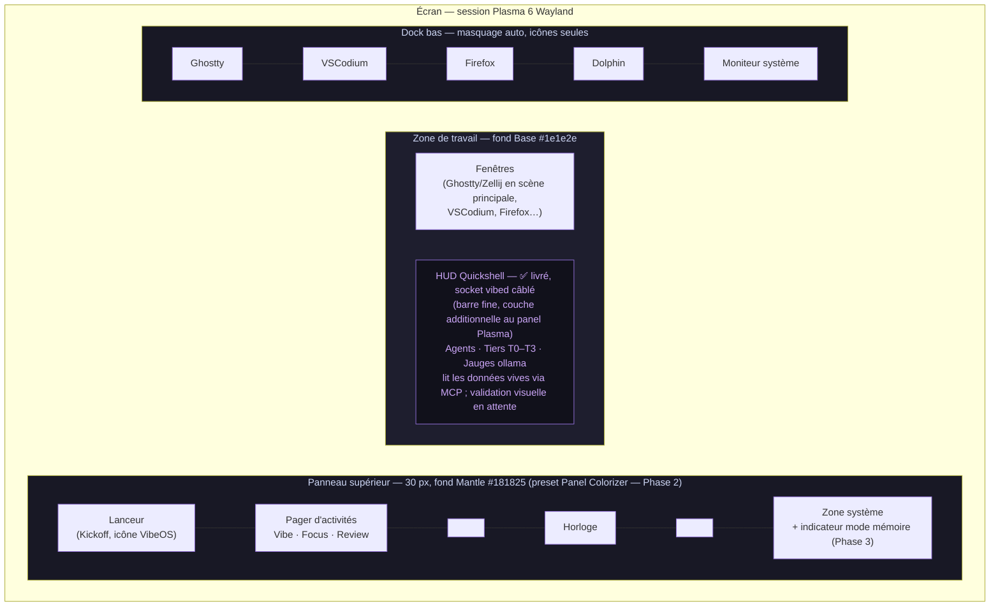

# L'expérience bureau VibeOS — spécification « vibecoding »

> Version : v0.1 (fondation) — Date : 2026-07-03
> Statut : document de référence du chantier bureau. Sources amont : [ECOSYSTEM.md](ECOSYSTEM.md) (stack curée), [ARCHITECTURE.md](ARCHITECTURE.md) (vibed, tiers T0–T3), [MEMORY.md](MEMORY.md) (mémoire, mode amnésique). Fichiers du chantier : [`desktop/`](../desktop/README.md).
>
> **Convention de lecture (règle d'honnêteté du projet)** : tout ce qui n'est pas livré en v0.1 est marqué **Phase N** (numérotation de [ROADMAP.md](../ROADMAP.md)). En v0.1, la couche bureau réellement embarquée dans l'image se limite au **schéma de couleurs `VibeOSDark.colors`**, aux **dotfiles terminal `/etc/skel`** (fish/Starship/Ghostty/Zellij/nvim) et aux **polices** (JetBrains Mono / Fira Code). Le **HUD Quickshell** (rendu + autostart + client du socket `vibed` **câblé**) et le **Global Theme / layout** sont **livrés** (Phase 2) ; la **validation visuelle du HUD** (jamais rendu sur un Plasma booté), le **preset Panel Colorizer**, les **activités** et les **raccourcis** restent des livrables **Phase 2** ; les **wallpapers** sont livrés dans l'image (« VibeOS » posé en défaut par le Global Theme, « Genesis »/« Void » sélectionnables) ; les thèmes **SDDM** et **Plymouth** ainsi que l'**identité OS** (os-release + logo) sont désormais **actifs par défaut** (2026-07-23, à la demande du mainteneur — plus de logo Fedora). Restent en **Phase 5** : jeux d'icônes/curseurs VibeOS, atlas Kvantum complet, thème GRUB et chartes de marque. Aucun mécanisme non implémenté n'est décrit au présent.

---

## 1. Concept directeur — le triptyque Agent / Contexte / Confiance

Un bureau classique organise l'écran autour des **applications**. Un bureau de vibecoding doit l'organiser autour de trois questions que l'utilisateur se pose en permanence :

1. **Agent** — *qui travaille pour moi, et sur quoi ?*
   Combien d'agents tournent, dans quel projet, depuis combien de temps, lequel attend une réponse. C'est le rôle du **HUD Quickshell** (§6) et des layouts Zellij « agent + lazygit + logs ».

2. **Contexte** — *sur quoi la machine et moi sommes-nous en train de travailler ?*
   Le projet courant, la mémoire de la machine (`/var/lib/vibeos/memory`, interrogée via l'outil MCP `memory.query`, livré v0.1), l'historique des commandes (Atuin), les diffs en attente (lazygit). C'est le rôle des **activités KDE** (§3) : un contexte = une activité.

3. **Confiance** — *qu'est-ce que j'autorise, et qu'est-ce qui a été fait en mon nom ?*
   Les tiers de policy T0–T3, les demandes d'approbation T2/T3, le journal d'audit. C'est le rôle du **code couleur des tiers** (voir [desktop/theme/palette.md](../desktop/theme/palette.md) §2), des futurs dialogues d'approbation Plasma (**Phase 4**, cf. [ROADMAP.md](../ROADMAP.md)) et du panneau « policy » du HUD.

Tout choix de design du bureau se juge à cette aune : *est-ce que cela rend l'un des trois plus visible, plus rapide d'accès, ou plus honnête ?* Le reste est du décor.

Trois principes d'exécution en découlent :

- **Le terminal est la scène principale.** Le cœur du vibecoding est Ghostty + fish + Starship + Zellij ([ECOSYSTEM.md](ECOSYSTEM.md)). Le bureau ne s'interpose pas : il encadre, il informe, il s'efface (`Meta+Return` est le raccourci le plus important de l'OS).
- **Plasma 6 n'est pas remplacé, il est habillé.** Global Theme, schéma de couleurs, Panel Colorizer, HUD Quickshell **en couche additionnelle** (même stack Qt6/QML que Plasma). Zéro fork du shell Plasma, zéro composant non supporté.
- **Dégradation gracieuse partout.** `vibed` est **embarqué et démarre au boot** (le socket `/run/vibed/mcp.sock` est présent) et le **HUD Quickshell est installé et auto-démarré** (client du socket `vibed` **câblé** ; validation visuelle en attente). Il gère par conception l'absence du socket (état « daemon hors ligne ») quand le démon est arrêté ou indisponible, jamais une erreur ni un crash.

---

## 2. Layout Plasma 6

### 2.1 Vue d'ensemble

### 2.2 Panneau supérieur (unique panneau permanent)

| Zone | Widget Plasma | Détail |
|---|---|---|
| Gauche | Application Launcher (Kickoff) | Icône VibeOS (Phase 5 : logo définitif ; v0.1 : glyphe provisoire) |
| Gauche | Activity Pager | Les trois activités nommées **Vibe / Focus / Review** (§3) |
| Centre | Horloge numérique | Format 24 h |
| Droite | Zone système (System Tray) | Réseau, son, notifications ; **indicateur de mode mémoire** (persistant/amnésique) exigé par [MEMORY.md](MEMORY.md) §5 — livrable **Phase 3** avec le mode amnésique |
| Toute la barre | Preset **Panel Colorizer** « vibeos-dark » | Fond Mantle opaque, texte Text, accent Mauve — GPL-3.0 ; **livrable Phase 2** (installation `kpackagetool6`, pas encore dans l'image) |

### 2.3 Dock bas

Panneau Plasma standard (Icons-Only Task Manager), **masquage automatique** — la scène appartient au terminal, pas au dock. Épinglés par défaut (ordre) : Ghostty, VSCodium, Firefox, Dolphin, moniteur système. Configurable par l'utilisateur comme n'importe quel panneau Plasma.

### 2.4 Le HUD Quickshell — couche additionnelle

Le HUD est une **barre fine** (Quickshell `PanelWindow`) ancrée au bord **supérieur**, pleine largeur, posée **en couche additionnelle au-dessus de Plasma 6** : le panneau Plasma garde son propre bord, le HUD réserve son propre strut. Ce n'est **jamais** un remplacement du shell Plasma — si Quickshell est absent ou plante, le bureau Plasma reste 100 % fonctionnel. C'est **la** surface du triptyque : agents, tiers, jauges.

**Statut : ✅ câblé (Phase 2), validation visuelle en attente.** Le **runtime Quickshell est compilé dans l'image** (étage `quickshell-builder` d'`os/Containerfile` — le paquet Fedora `quickshell` existe depuis f44 et la base est désormais f44 : cet étage est **redondant** et son retrait est suivi à part — un rebase de sécurité ne change pas aussi la provenance d'un composant livré, voir `desktop/quickshell/README.md` §2) et le HUD est **auto-démarré** en session Plasma (`/etc/skel/.config/autostart/vibeos-hud.desktop` → `/usr/bin/vibeos-hud`). **Honnêteté** : le QML lit les données **vives** via le socket (`Quickshell.Io` — `shell.qml` ouvre le `Socket` et poll les outils T0 `os.status` / `memory.query` / `agents.list` / `agent.sessions`→`agent.thinking`), mais ce rendu **n'a jamais été validé sur un Plasma booté** (pas de Quickshell headless) — c'est le reste du chantier HUD en Phase 2, avec le **repli en pastille discrète** et le dépli/repli par `Meta+V`.

### 2.5 Comportement des fenêtres (KWin)

- Tuilage : le tuilage natif KWin (Meta+glisser, `Meta+T` pour l'éditeur de zones) est configuré avec une disposition par défaut 2/3–1/3 pensée pour « terminal + navigateur ».
- Bordures fines, coins non arrondis de force (on respecte Breeze), barre de titre teinte Mantle (via `vibeos-dark.colors`, section `[WM]`).
- Pas d'effets lourds par défaut (pas de wobbly windows) : les animations restent celles de Plasma, durée standard.

### 2.6 Mécanique de livraison (OS immuable)

Tout est posé **au build** (jamais à l'exécution). La colonne « Statut » distingue ce qui est réellement dans l'image v0.1 de ce qui reste à câbler.

| Élément | Chemin dans l'image | Statut |
|---|---|---|
| Schéma de couleurs | `/usr/share/color-schemes/VibeOSDark.colors` — source : [`desktop/theme/vibeos-dark.colors`](../desktop/theme/vibeos-dark.colors) | ✅ livré v0.1 |
| Défauts utilisateur **terminal** (config Ghostty/Zellij/fish/Starship/nvim) | `/etc/skel/.config/…` — copiés dans chaque nouveau `$HOME` | ✅ livré v0.1 |
| Polices JetBrains Mono / Fira Code | `jetbrains-mono-fonts`, `fira-code-fonts` (paquets Fedora) | ✅ livré v0.1 |
| Global Theme (Look-and-Feel) « VibeOS Dark » | `/usr/share/plasma/look-and-feel/org.vibeos.dark/` — **défaut système** via `/etc/xdg/kdeglobals` (`LookAndFeelPackage`), moteur Kvantum installé + sélection `/etc/skel/.config/Kvantum/kvantum.kvconfig` | ✅ livré (Phase 2) |
| Preset Panel Colorizer | appliqué via la config par défaut | 🛣️ Phase 2 |
| Défauts utilisateur **bureau** (raccourcis, activités) | `/etc/skel/.config/…` | 🛣️ Phase 2 |
| HUD Quickshell | Runtime compilé dans l'image (étage `quickshell-builder`) ; QML sous `/usr/share/vibeos/quickshell/` ; autostart `/etc/skel/.config/autostart/vibeos-hud.desktop` → `/usr/bin/vibeos-hud` | ✅ livré (Phase 2) — socket vibed câblé, validation visuelle en attente (§2.4) |
| Config MCP Claude Code → `vibed` | `/etc/skel/.claude.json` (pont `socat` vers `/run/vibed/mcp.sock`) | ✅ livré (Phase 2) |
| Wallpapers (« VibeOS » défaut, « Genesis », « Void ») | `/usr/share/wallpapers/{VibeOS,VibeOSDark,VibeOSVoid}/` — défaut posé par le Global Theme (`[Wallpaper] Image=VibeOS`) | ✅ livré (Phase 2) — série de branding complète : Phase 5 |

Le `Containerfile` livre désormais toute la chaîne : couche terminal (Ghostty, polices), assets du thème, **runtime Quickshell compilé** (étage `quickshell-builder` — le paquet Fedora `quickshell` existe depuis f44 et la base est désormais f44 : cet étage est **redondant** et son retrait est suivi à part — un rebase de sécurité ne change pas aussi la provenance d'un composant livré, voir `desktop/quickshell/README.md`), **moteur Kvantum** (couche 1g), **pointeur de thème par défaut** (`/etc/xdg/kdeglobals`) et **autostart du HUD** (`/etc/skel`). Reste **Phase 2** : le preset **Panel Colorizer** (verre panneau/dock) et la **validation visuelle du HUD** (son branchement live sur le socket `vibed` est **câblé**, jamais rendu sur un Plasma booté). Ce document ne fait que **référencer** ces éléments — le Containerfile est un chantier distinct.

---

## 3. Les activités KDE — trois contextes nommés

Les activités Plasma (mécanisme natif, stable) incarnent le pilier **Contexte**. Trois activités seront pré-configurées par défaut (config `/etc/skel`) — **livrable 🛣️ Phase 2**, pas encore dans l'image v0.1 :

| Activité | Usage | Différences concrètes |
|---|---|---|
| **Vibe** (défaut) | Diriger les agents. La session de vibecoding nominale. | Barre HUD visible, wallpaper accent mauve, dock visible au survol |
| **Focus** | Coder/écrire soi-même sans bruit. | Notifications en **Ne pas déranger**, wallpaper sombre uni (Crust), dock masqué (repli du HUD en pastille : **Phase 2**) |
| **Review** | Relire ce que les agents ont produit. | Wallpaper teinte verte discrète ; pensée pour un plein écran Ghostty/Zellij layout « review » (lazygit + diff + journal d'audit) |

- `Meta+Tab` cycle entre les trois (comportement Plasma standard).
- Les fenêtres peuvent être assignées à une activité (clic droit sur la barre de titre) — les agents longue durée restent dans **Vibe** pendant qu'on relit dans **Review**.
- **Honnêteté** : une fois livrées (Phase 2), les activités seront une *convention pré-configurée* (noms, wallpapers, réglages de notifications). Aucune automatisation ne déplace les fenêtres à votre place ; le couplage activité ↔ état des agents (ex. basculer en Review quand un agent termine) est une piste **Phase 2+**, non spécifiée ici.

---

## 4. La session par défaut

1. **SDDM** (greeter par défaut : **VibeOS** — thème original activé le 2026-07-23 via `/usr/lib/sddm/sddm.conf.d/10-vibeos.conf` ; il nomme le **citoyen IA** né au premier boot ; repli SDDM intégré si le thème échoue — voir `desktop/sddm/`) ouvre une **session Plasma 6 Wayland** (X11 non installé, héritage Kinoite).
2. La session s'ouvre en **Global Theme VibeOS Dark par défaut** (pointeur `/etc/xdg/kdeglobals`, layout panneau + dock du paquet `org.vibeos.dark` appliqué aux nouvelles sessions ; surchargeable par utilisateur). Le wallpaper par défaut est **« VibeOS »**, posé par le Global Theme (« Genesis » et « Void » restent sélectionnables).
3. L'**autostart utilisateur** livré dans l'image (`/etc/skel/.config/autostart/vibeos-hud.desktop` → `/usr/bin/vibeos-hud`, `$HOME` — pas de service système) **lance le HUD Quickshell** en session Plasma. Le supprimer de son `$HOME` désactive le HUD.
4. **Reste Phase 2 (validation visuelle)** : le HUD **ouvre** `connect()` sur `/run/vibed/mcp.sock` — le QML ouvre bien le socket (câblé dans `shell.qml`), reste à valider le rendu sur un Plasma booté :
   - `vibed` étant désormais embarqué et démarré au boot, le socket existe → handshake MCP, abonnement aux événements, données vives (§6) ;
   - si le démon est arrêté ou indisponible, le socket est absent → le HUD affiche l'état **« vibed hors ligne »** (pastille grise Overlay1, un texte court, un lien vers la doc). Il reste utile : jauges locales (CPU/RAM via les API systèmes standard) et raccourcis de lancement fonctionnent.
5. Aucun agent ne démarre tout seul. VibeOS n'exécute **jamais** un agent sans action explicite de l'humain — le bureau propose (raccourcis, dock, HUD), l'humain dispose.

La session par défaut est désormais un Plasma 6 en **Global Theme VibeOS Dark**, terminal prêt (Ghostty + fish + Starship + Zellij), **HUD affiché** (client du socket `vibed` câblé ; validation visuelle en attente) — mais **sans activités pré-configurées ni verre Panel Colorizer** (Phase 2). Le premier geste attendu reste l'ouverture d'un terminal Ghostty (le raccourci `Meta+Return` sera posé en Phase 2 avec les défauts bureau).

---

## 5. Identité visuelle

### 5.1 Thème global « VibeOS Dark »

- **Origine** : fork de **Catppuccin Mocha** (MIT) — base légale et esthétique assumée, attribution conservée dans chaque fichier dérivé. Voir [ECOSYSTEM.md](ECOSYSTEM.md) (« Catppuccin KDE »).
- **Accent unique** : **Mauve `#cba6f7`**. Là où Catppuccin propose 26 déclinaisons d'accent, VibeOS en fige une — la cohérence prime.
- **Palette exacte** (extrait ; table complète, sémantique des tiers et propagation : [desktop/theme/palette.md](../desktop/theme/palette.md)) :

| Rôle | Nom | Hex |
|---|---|---|
| Fond contenu | Base | `#1e1e2e` |
| Fond chrome (panneau, titres, HUD) | Mantle | `#181825` |
| Fond creux (OSD, verrouillage) | Crust | `#11111b` |
| Surfaces (boutons, cartes) | Surface0–2 | `#313244` / `#45475a` / `#585b70` |
| Texte principal | Text | `#cdd6f4` |
| **Accent / agent actif** | Mauve | `#cba6f7` |
| Tier **T0** (observe) | Blue | `#89b4fa` |
| Tier **T1** (modify-user) | Green | `#a6e3a1` |
| Tier **T2** (modify-system, approbation) | Peach | `#fab387` |
| Tier **T3** (destructif) | Red | `#f38ba8` |

- **Le code couleur des tiers est un invariant produit** : le même Peach signale une action T2 dans le HUD, dans le terminal et dans le futur dialogue d'approbation Plasma (Phase 4). L'utilisateur doit pouvoir évaluer la gravité d'une demande **à la couleur, avant de lire**.

### 5.2 Typographie

| Usage | Police | Licence | Détail |
|---|---|---|---|
| Monospace (terminal, éditeurs, HUD données) | **JetBrains Mono** | OFL-1.1 | Ligatures activées dans Ghostty/VSCodium ; taille 11 par défaut |
| Monospace (alternative documentée) | Fira Code | OFL-1.1 | Livrée dans l'image, sélectionnable |
| Interface (Plasma) | Noto Sans | OFL-1.1 | Héritage Fedora — pas de police UI exotique |

Les deux familles mono sont packagées dans Fedora (`jetbrains-mono-fonts`, `fira-code-fonts`), licences redistribuables — **installées dans l'image v0.1** (déclarées dans `os/Containerfile`).

### 5.3 Icônes et curseurs

v0.1 : **Breeze** (défaut Plasma, LGPL) — aucun fork d'icônes tant que le branding n'est pas mûr. Jeu d'icônes/curseurs VibeOS : **Phase 5**.

### 5.4 Wallpapers et branding

- **Trois wallpapers originaux livrés dans l'image** (créés pour le projet, licence du dépôt — aucun asset tiers non redistribuable) : « VibeOS » (fond officiel, **défaut** posé par le Global Theme), « Genesis » (dégradé Base→Crust avec halo Mauve, pour Vibe/Review) et « Void » (Crust quasi uni, pour Focus). Copiés sous `/usr/share/wallpapers/` (paquets `VibeOS`, `VibeOSDark`, `VibeOSVoid` — sources : `desktop/wallpapers/`).
- **Identité OS livrée (2026-07-23)** : `/usr/lib/os-release` réécrit (`ID=vibeos`, `PRETTY_NAME="VibeOS 0.1.0-dev (Genesis)"`, `ID_LIKE=fedora` pour la compat dnf/rpm-ostree) — le nom « Fedora » disparaît du menu de boot (BLS), du greeter, de `fastfetch` et de `/etc/os-release`. Logo VibeOS livré sous `/usr/share/pixmaps/vibeos-logo.svg` (référencé par `LOGO=vibeos-logo`).
- **Thèmes SDDM + Plymouth activés par défaut (2026-07-23)** : greeter VibeOS (drop-in SDDM) et splash VibeOS (posé + initramfs régénéré au build, remplace le logo Fedora). L'existant adi1090x reste rejeté pour provenance d'assets floue (cf. ECOSYSTEM).
- **Reste Phase 5** : logo définitif (le glyphe actuel est provisoire, le nom lui-même est un nom de code), jeux d'icônes/curseurs VibeOS, atlas Kvantum complet, thème GRUB dédié, lignes directrices de marque.

---

## 6. Le HUD agents (renvoi)

Le HUD est spécifié et son code vit dans [`desktop/quickshell/`](../desktop/README.md) ; **rappel de statut : le HUD est installé et auto-démarré, son client du socket est câblé, mais son rendu n'a jamais été validé visuellement** (pas de Quickshell headless — §2.4). Ce paragraphe fixe son **contrat produit** cible ; les colonnes distinguent le comportement selon que `vibed` est absent (« hors ligne ») ou présent :

| Surface | Contenu | vibed hors ligne | vibed présent |
|---|---|---|---|
| Barre HUD (toujours visible ; repli en pastille : plus tard) | État global : gris = vibed hors ligne, mauve = agents actifs, peach pulsé = approbation attendue | barre fixe, gris uniquement | pastille repliable + tous les états |
| Panneau Agents | Liste des sessions agents (nom, projet, durée, dernier outil appelé) | vide + message « vibed hors ligne (Phase 2) » | live via MCP `/run/vibed/mcp.sock` |
| Panneau Confiance | Tiers T0–T3 avec compteurs d'appels, dernières décisions du moteur de politiques, lien vers l'audit | lecture **statique** de `/etc/vibeos/policy.d/*.toml` si lisible, sinon état vide propre | décisions vives + demandes T2/T3 |
| Panneau Ressources | Jauges CPU/RAM/GPU, VRAM ollama, modèles chargés | jauges locales (sans ollama si absent) | jauges + états des modèles via ollama API locale |
| Panneau Mémoire | Mode (persistant/amnésique), date de naissance, derniers événements du journal | état « non accessible » (la mémoire est `root:0700` et `memory.query` arrive avec vibed) | `memory.query` (T0) via MCP |

Règle absolue (contrainte de dégradation gracieuse) : **toute absence de dépendance (vibed, ollama, policy illisible) doit produire un état affiché, jamais une exception**. Le HUD (Phase 2) sera, de fait, la démonstration permanente de la règle d'honnêteté : il montrera ce qui n'est pas encore là.

---

## 7. Raccourcis clavier globaux

**Statut : 🛣️ Phase 2.** Ces raccourcis seront livrés via `/etc/skel/.config/kglobalshortcutsrc` (+ entrées `.desktop` dédiées pour les actions personnalisées) — **ce fichier n'est pas encore dans l'image en v0.1**, où les défauts Plasma 6 restent inchangés. Le tableau fixe la **cible** ; la colonne « Statut » indique la phase de câblage. « outil v0.1 » signale que le programme lancé est déjà dans l'image, seul le raccourci arrivant en Phase 2.

| Raccourci | Action | Implémentation | Statut |
|---|---|---|---|
| `Meta+Return` | Terminal **Ghostty** (nouvelle fenêtre) | lancement `ghostty` | 🛣️ Phase 2 (outil v0.1) |
| `Meta+Shift+Return` | Session vibecoding : Ghostty + layout Zellij « vibe » (agent + lazygit + logs) | `ghostty -e zellij --layout vibe` | 🛣️ Phase 2 (outil v0.1) |
| `Meta+A` | **Nouvel agent** : Ghostty + layout Zellij « agent », prompt de choix du CLI (claude / opencode / gemini / codex) | script `vibeos-new-agent` (fish) | 🛣️ Phase 2 (puis session déclarée à vibed, visible dans le HUD) |
| `Meta+M` | **État mémoire** : ouvre le panneau Mémoire du HUD | IPC Quickshell | 🛣️ Phase 2 |
| `Meta+P` | **Tiers de politique** : ouvre le panneau Confiance du HUD | IPC Quickshell | 🛣️ Phase 2 |
| `Meta+V` | Déplier/replier le **HUD** (repli en pastille) | IPC Quickshell | 🛣️ Phase 2 |
| `Meta+G` | **lazygit** dans le projet courant | `ghostty -e lazygit` | 🛣️ Phase 2 (outil v0.1) |
| `Meta+Y` | **yazi** (explorateur TUI) | `ghostty -e yazi` | 🛣️ Phase 2 (outil v0.1) |
| `Meta+B` | **btop** (monitoring GPU/CPU pendant l'inférence) | `ghostty -e btop` | 🛣️ Phase 2 (outil v0.1) |
| `Meta+E` | Dolphin (défaut Plasma, conservé) | Plasma | ✅ défaut Plasma (v0.1) |
| `Meta+W` | Vue d'ensemble / Overview (défaut Plasma 6) | KWin | ✅ défaut Plasma (v0.1) |
| `Meta+Tab` | Cycle des activités **Vibe → Focus → Review** | Plasma | ✅ défaut Plasma (activités nommées : Phase 2) |
| `Meta+T` | Éditeur de zones de tuilage (défaut KWin) | KWin | ✅ défaut Plasma (v0.1) |
| `Meta+L` | Verrouiller la session (défaut Plasma) | Plasma | ✅ défaut Plasma (v0.1) |
| `Meta+1…5` | Applications épinglées du dock (défaut Plasma) | Plasma | ✅ défaut Plasma (v0.1) |

Notes :

- Aucun raccourci ne déclenche d'action T2/T3 : les raccourcis **ouvrent des surfaces d'information ou des outils**, jamais une approbation (une approbation T2/T3 exigera toujours une interaction explicite dans le dialogue dédié — Phase 4).
- `Meta+A`, `Meta+M`, `Meta+P` sont volontairement adjacents au triptyque : **A**gent, **M**émoire (contexte), **P**olicy (confiance).
- Tout sera remappable par l'utilisateur (Réglages système → Raccourcis) : `/etc/skel` ne fournira que des défauts.

---

## 8. Parcours utilisateur type — une session de vibecoding

1. **Boot** → SDDM → session Plasma Wayland (à partir de la **Phase 2** : activité **Vibe** et barre HUD visible en état « vibed hors ligne »). (Premier boot : Genesis a créé la mémoire — [MEMORY.md](MEMORY.md).)
2. `Meta+Shift+Return` → Ghostty s'ouvre avec le layout Zellij « vibe » : un volet agent, un volet lazygit, un volet logs. Starship affiche la branche git en Mauve.
3. `zoxide` (`z monprojet`) pour rejoindre le projet ; Atuin retrouvera chaque commande de la session (piste d'audit locale).
4. `Meta+A` → nouvel agent : l'utilisateur choisit `claude` (cloud) ou `opencode` sur ollama (offline). Il décrit l'objectif ; l'agent lit, écrit, compile. *(Phase 2 : la session apparaît dans le HUD ; ses appels d'outils passent par `/run/vibed/mcp.sock` et le moteur de politiques.)*
5. Pendant que l'agent travaille : `Meta+B` (btop) pour surveiller la VRAM si ollama tourne ; `Meta+V` pour jeter un œil au HUD. *(Phase 2 : le HUD affiche d'abord l'état hors ligne + jauges locales, puis agents et tiers en direct une fois `vibed` livré.)*
6. *(Phase 4)* L'agent demande une action **T2** (installer un paquet) : notification Plasma bord droit, badge **Peach**, dialogue d'approbation détaillant outil/arguments/tier — approuver, refuser, ou approuver avec durée limitée. Tout est audité dans `/var/lib/vibeos/audit/ (par jour)`.
7. L'agent annonce la fin. `Meta+Tab` → activité **Review** : plein écran Zellij « review », lazygit pour relire les diffs hunk par hunk, `bat` pour lire les nouveaux fichiers, `yazi` (`Meta+Y`) pour survoler l'arborescence créée.
8. Commit (l'humain signe — jamais l'agent seul), retour à **Vibe**, agent suivant — ou `Meta+Tab` vers **Focus** pour reprendre la main au calme, notifications coupées.
9. Fin de journée : la session Zellij se détache (résurrection après reboot/mise à jour bootc) ; la machine se souvient *(journal Atuin + git ; et `memory.append` — livré — permet aux agents d'enrichir la mémoire de la machine)*.

Le bureau réussit si, à chaque étape, les trois questions du triptyque ont une réponse à moins d'un raccourci de distance.

---

## 9. Livré / en route — le tableau qui fait foi

| Élément | v0.1 (Phase 1) | Phase 2 (vibed + MCP) | Phase 3 | Phase 5 (branding) |
|---|---|---|---|---|
| Schéma de couleurs `VibeOSDark.colors` | ✅ livré (`desktop/theme/`) | — | — | — |
| Dotfiles terminal `/etc/skel` (fish/Starship/Ghostty/Zellij/nvim) | ✅ livré | — | — | — |
| Polices JetBrains Mono / Fira Code | ✅ livré (`os/Containerfile`) | — | — | — |
| Global Theme (layout panneau + dock) | ❌ | ✅ **livré** (défaut système via `/etc/xdg/kdeglobals` + Kvantum) | — | raffinements identité |
| Preset Panel Colorizer | ❌ | 🛣️ **Phase 2** | — | — |
| Activités Vibe / Focus / Review pré-configurées | ❌ | 🛣️ **Phase 2** (`/etc/skel`) + couplage agents (piste) | — | — |
| Raccourcis globaux (§7) | ❌ | 🛣️ **Phase 2** (`/etc/skel/kglobalshortcutsrc`, actions branchées sur vibed) | — | — |
| Wallpapers originaux (VibeOS, Genesis, Void) | ❌ | ✅ **livré** (copiés dans l'image ; « VibeOS » défaut via le Global Theme) | — | 🛣️ Phase 5 (série complète + logo) |
| HUD Quickshell — rendu, panneaux, état « vibed hors ligne » | ❌ | ✅ **livré** (runtime compilé + autostart ; socket câblé, validation visuelle en attente) | — | — |
| HUD ↔ vibed : agents, tiers, décisions **en direct** | ❌ | 🔄 **câblé, validation visuelle en attente** (socket MCP `/run/vibed/mcp.sock` ouvert dans `shell.qml`) | — | — |
| Panneau Mémoire du HUD (`memory.query`) | ❌ (état « non accessible ») | 🛣️ Phase 2 | enrichi (mémoire v2) | — |
| Dialogues d'approbation T2/T3 dans Plasma | ❌ (T2/T3 = refus fail-closed, cf. [ARCHITECTURE.md](ARCHITECTURE.md) §4.5) | 🛣️ Phase 4 | — | — |
| Indicateur de mode amnésique dans la zone système | ❌ | — | 🛣️ **Phase 3** (avec le mode lui-même) | — |
| Thèmes SDDM et Plymouth VibeOS (originaux) | ❌ (Breeze / défaut distro) | ✅ **copiés dans l'image** | — | ✅ **activés par défaut (2026-07-23)** — greeter + splash VibeOS, os-release + logo ; restent Phase 5 : icônes/curseurs, atlas Kvantum, thème GRUB |
| Identité OS (os-release, logo, plus de « Fedora ») | ❌ | — | — | ✅ **livré (2026-07-23)** (`/usr/lib/os-release`, `LOGO=vibeos-logo`) |
| Login « naissance » : le greeter nomme le citoyen IA | ❌ | — | — | ✅ **livré (2026-07-23)** (`vibeos-identity.service` → `/run/vibeos/citizen.json`, lu par `Main.qml`) |
| Session « focus » distincte au login | ❌ | — | — | 🛣️ Phase 5 (optionnelle) |

---

## 10. Licences du chantier bureau

| Composant | Licence | Note |
|---|---|---|
| VibeOS Dark (schéma, palette) | MIT | Fork de Catppuccin (MIT), attribution conservée |
| Quickshell | LGPL-3.0 | Lié dynamiquement, non modifié |
| Plasma Panel Colorizer | GPL-3.0 | Utilisé tel quel (preset = données) |
| JetBrains Mono / Fira Code / Noto Sans | OFL-1.1 | Paquets Fedora |
| Wallpapers, layout.js, scripts, QML VibeOS | licence du dépôt (Apache-2.0) | Créations originales |

Tout est redistribuable dans une ISO — condition d'entrée de [ECOSYSTEM.md](ECOSYSTEM.md).
