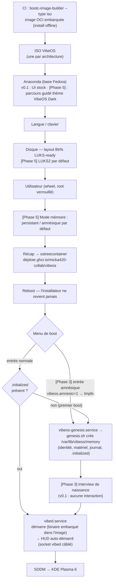

# INSTALLER.md — Installateur & premier démarrage de VibeOS

> Spécification v0.1 — 2026-07-03.
> Statut : document de référence du chantier « installateur & first-boot ».
> Artefacts associés : [`installer/vibeos.ks`](../installer/vibeos.ks) (kickstart de référence),
> [`installer/branding/`](../installer/branding/README.md) (inventaire des assets).
> Numérotation des phases : [ROADMAP.md](../ROADMAP.md) fait foi
> (Phase 1 = v0.1 Première ISO · Phase 3 = Genesis & mémoire · Phase 5 = Installateur & identité).

> **Convention de lecture (règle d'honnêteté du projet)** : aucun mécanisme non livré
> n'est décrit au présent. Tout ce qui n'existe pas en v0.1 est marqué **[Phase N]**.

---

## 1. Principes

1. **L'installateur ne fabrique rien : il dépose une image.** VibeOS est un OS
   image-based (bootc/OSTree) : installer, c'est écrire l'image OCI
   `ghcr.io/micka420-collab/vibeos` sur le disque, configurer le boot et créer
   l'utilisateur. Aucune sélection de paquets, aucune composition à l'install —
   l'image est identique pour toutes les machines.
2. **La personnalité vient après, pas pendant.** L'installateur ne pose ni
   mémoire, ni identité : c'est **Genesis** (`vibeos-genesis.service`) qui crée
   la mémoire au **premier démarrage** ([docs/MEMORY.md](MEMORY.md)). La frontière
   est nette : installateur = disque + utilisateur ; Genesis = naissance de la machine.
3. **On n'écrit pas d'installateur maison.** Décision ROADMAP Phase 5 : on
   réutilise **Anaconda** (l'installateur de Fedora, embarqué par
   bootc-image-builder) et on l'habille. Un installateur 100 % maison est un
   sujet Phase 7+, s'il se justifie un jour sur données.
4. **Fail-honest.** En v0.1, l'expérience d'installation est celle d'Anaconda
   Fedora, quasi brute. C'est assumé et documenté ici — le parcours
   « vibecoding onboarding » complet est la cible **[Phase 5]**.

---

## 2. Stratégie technique — bootc de bout en bout

### 2.1 Production de l'ISO

L'ISO est générée par **bootc-image-builder** (`--type iso`, un job CI par
architecture — voir [BUILD.md](BUILD.md) §4) :

- l'outil **embarque l'image OCI** dans l'ISO → installation possible
  **entièrement hors ligne** ;
- l'environnement d'installation est l'**Anaconda de Fedora** (le même que
  Kinoite), piloté par un **kickstart** que bootc-image-builder génère et dont
  le cœur est la directive `ostreecontainer` (déploiement de l'image bootc,
  pas d'installation RPM) ;
- la configuration d'injection (utilisateur initial, kickstart additionnel)
  passe par le `config.toml` de bootc-image-builder :
  `[[customizations.user]]` et `[customizations.installer.kickstart]`.

### 2.2 Les trois canaux de configuration

| Canal | Quand | Usage VibeOS |
|---|---|---|
| `config.toml` de bootc-image-builder | au build de l'ISO | v0.1 : utilisateur initial des ISO de test (voir BUILD.md §4.1) ; **[Phase 5]** injection du kickstart VibeOS complet |
| Kickstart (`inst.ks=` ou injecté) | au boot de l'installateur | [`installer/vibeos.ks`](../installer/vibeos.ks) : référence versionnée — installations réseau, labo, et base du travail Phase 5 |
| Interactif (Anaconda UI) | pendant l'installation | v0.1 : tout ce que le kickstart ne fixe pas est demandé par l'UI stock d'Anaconda |

Le kickstart de référence pointe `ostreecontainer` vers
`ghcr.io/micka420-collab/vibeos` (transport `registry`). Sur l'ISO produite par
bootc-image-builder, c'est l'image **embarquée** qui est déployée (transport
local généré par l'outil) — même résultat, zéro réseau requis.

### 2.3 Vérification de signature

Les images sont signées cosign en CI dès la v0.1, mais la **vérification côté
client n'est pas encore imposée** (cible **[Phase 4]**, voir BUILD.md §6). Le
kickstart de référence porte donc `--no-signature-verification`, avec le
commentaire qui l'assume. Quand la politique de vérification sera câblée
(Phase 4), cette option disparaîtra du kickstart — critère de sortie explicite.

---

## 3. Périmètre par phase — ce qu'on personnalise, quand

### 3.1 Phase 1 (v0.1) — le minimum honnête ✅ périmètre livré

| Élément | Contenu v0.1 |
|---|---|
| ISO installable | Générée par bootc-image-builder en CI, une par architecture (amd64/arm64) |
| Base installateur | Anaconda Fedora **stock** (UI standard) |
| Branding Anaconda | **Minimal** : logo VibeOS si l'injection est triviale (pixmaps), sinon stock Fedora — pas de thème complet, pas de fork d'Anaconda |
| Disposition disque par défaut | GPT/UEFI, `/boot/efi` + `/boot` + **Btrfs** (sous-volumes `root`, `var`, `home`) — layout **LUKS-ready** : le conteneur Btrfs pourra recevoir `--encrypted` sans changer la géométrie (voir `installer/vibeos.ks`) |
| Création utilisateur | Via `config.toml` (ISO de test) ou interactive dans Anaconda ; groupe `wheel` |
| Kickstart | `installer/vibeos.ks` versionné, commenté, utilisable en `inst.ks=` réseau |

Ce qui n'est **pas** en v0.1 : chiffrement par défaut, choix du mode mémoire à
l'installation, thème graphique de l'installateur, interview de naissance.

### 3.2 Phase 3 — ce que l'installateur prépare pour la mémoire

- **[Phase 3]** Volume **LUKS2 dédié** `vibeos-memory` monté sur
  `/var/lib/vibeos/memory` (crypttab + unité de montage — jamais par
  `genesis.sh`). Créé à l'installation ou par migration ([MEMORY.md](MEMORY.md) §6).
- **[Phase 3]** **Entrée de boot amnésique** : une entrée BLS dédiée avec le
  paramètre kernel `vibeos.amnesic=1`, lu par un generator systemd qui monte un
  tmpfs sur la mémoire → Genesis rejoue à chaque boot, rien ne persiste
  ([MEMORY.md](MEMORY.md) §5).
- **[Phase 3]** **Interview de naissance** au premier boot (prototype :
  `agent/genesis_interview.py`, non câblé en v0.1).

### 3.3 Phase 5 — l'installateur « vibecoding onboarding » complet

- Parcours guidé complet (§4), habillage graphique d'Anaconda au thème
  **VibeOS Dark** (fork Catppuccin, voir `installer/branding/`).
- **Chiffrement disque par défaut** (LUKS2 sur le conteneur Btrfs +
  volume `vibeos-memory`), passphrase demandée à l'install, enrôlement TPM2
  proposé au premier boot.
- **Choix du mode mémoire à l'installation** : persistant (défaut) ou
  amnésique par défaut (l'entrée de boot amnésique devient l'entrée par défaut).
- Critère de sortie ROADMAP : une personne extérieure installe VibeOS sans
  assistance, de l'ISO au bureau Plasma post-Genesis, en < 30 minutes.

---

## 4. Parcours cible — étape par étape **[Phase 5]**

> En v0.1, le parcours réel est celui d'Anaconda stock (langue, disque,
> utilisateur). Le tableau ci-dessous est la **cible Phase 5** ; chaque étape
> réutilise un écran Anaconda existant, habillé — on n'invente pas de moteur.

| # | Étape | Contenu | Base technique |
|---|---|---|---|
| 1 | **Langue & clavier** | FR par défaut proposé, détection de la locale live | Écran Anaconda standard |
| 2 | **Disque & chiffrement** | Partitionnement automatique (layout §3.1) ; **LUKS2 activé par défaut**, passphrase saisie ici ; option experte pour désactiver, avec avertissement explicite | Écran storage Anaconda + kickstart `--encrypted` |
| 3 | **Utilisateur** | Création du compte (admin/`wheel`), mot de passe ou clé SSH ; root verrouillé par défaut | Écran user Anaconda |
| 4 | **Mode mémoire** | Choix **persistant** (défaut) / **amnésique par défaut** ; texte pédagogique : « votre machine naîtra au premier démarrage ; en mode amnésique, elle renaîtra à chaque démarrage » | Écran custom (addon Anaconda) → configure l'entrée BLS par défaut (`vibeos.amnesic=1`) |
| 5 | **Récapitulatif** | Résumé : disque, chiffrement, utilisateur, mode mémoire ; rappel que la mémoire sera créée au premier boot (Genesis) ; bouton Installer | Hub Anaconda |
| 6 | **Installation & reboot** | Déploiement `ostreecontainer` (image embarquée), configuration boot, reboot | bootc-image-builder / Anaconda |

Ce que le parcours ne demande **jamais** : sélection de paquets (image
immuable), télémétrie, compte en ligne, clé d'API — les clés des agents se
configurent après l'installation, dans la session, sous le contrôle de
l'utilisateur.

---

## 5. Premier démarrage — le passage de relais à Genesis

Après le reboot de fin d'installation, l'installateur a terminé son travail et
**ne revient plus jamais**. La séquence de premier boot (livrée v0.1, détail
dans [MEMORY.md](MEMORY.md) §4.1) :

1. Boot de l'image déployée (racine OSTree lecture seule).
2. `vibeos-genesis.service` : la garde
   `ConditionPathExists=!/var/lib/vibeos/memory/.initialized` est vraie
   (première fois) → `/usr/libexec/vibeos/genesis.sh` crée la mémoire dans
   `/var/lib/vibeos/memory` (identité, profil matériel, journal, sentinelle
   `.initialized` écrite en dernier — crash-safe).
3. **[Phase 3]** L'**interview de naissance** se déroule ici (dialogue guidé,
   profil de l'humain, persona des agents). En v0.1 : rien — la mémoire naît
   avec ses placeholders, sans interaction.
4. `vibed.service` démarre : le binaire `/usr/bin/vibed` est **embarqué dans
   l'image** (la garde `ConditionPathExists=/usr/bin/vibed` reste en place et
   sauterait proprement l'unité si le binaire manquait). Le HUD Quickshell est
   **livré et auto-démarré**, son client du socket est **câblé** (lecture des
   données vives), mais son rendu n'a jamais été validé sur un Plasma booté —
   validation visuelle : reste du chantier Phase 2.
5. SDDM → session KDE Plasma 6.

Aux boots suivants (mode persistant), `.initialized` existe : Genesis est
ignoré. Réinstaller l'OS **sans toucher `/var`** ne re-déclenche pas Genesis ;
un factory-reset (purge de `/var`) rend la machine vierge et Genesis rejoue.

### Mode amnésique au boot **[Phase 3]**

Option proposée **au menu de démarrage**, pas à l'installation (en Phase 5
l'installateur permettra d'en faire le défaut, §4 étape 4) : une entrée de boot
dédiée ajoute `vibeos.amnesic=1` à la ligne de commande kernel. Un generator
systemd **[Phase 3]** monte alors un tmpfs sur `/var/lib/vibeos/memory` et
injecte `VIBEOS_MEMORY_MODE=amnesic` dans l'environnement de Genesis : la
mémoire est recréée à chaque démarrage et disparaît à l'extinction. **Non livré
en v0.1** — aucun generator ni entrée de boot n'existe encore dans l'image.

---

## 6. Diagramme — installation → premier boot → Genesis

---

## 7. Récapitulatif livré / cible

| Capacité | Statut |
|---|---|
| ISO installable par architecture (bootc-image-builder, image embarquée, offline) | ✅ Livré v0.1 (CI) |
| Kickstart de référence versionné (`installer/vibeos.ks`) | ✅ Livré v0.1 |
| Layout disque par défaut Btrfs LUKS-ready | ✅ Livré v0.1 (kickstart) |
| Création d'utilisateur (config.toml / interactif) | ✅ Livré v0.1 |
| Genesis au premier boot (mémoire créée, `.initialized`) | ✅ Livré v0.1 |
| `vibed.service` actif au boot (binaire embarqué ; garde `ConditionPathExists` conservée en dégradation propre) + HUD Quickshell auto-démarré (socket vibed câblé, validation visuelle en attente) | ✅ Livré (Phase 2) |
| Branding Anaconda (logo minimal) | 🟡 v0.1 si trivial, sinon stock — complet en Phase 5 |
| Volume LUKS2 `vibeos-memory` + entrée de boot amnésique (`vibeos.amnesic=1`) | 🛣️ Phase 3 |
| Interview de naissance au premier boot | 🛣️ Phase 3 |
| Vérification de signature de l'image à l'installation/mise à jour | 🛣️ Phase 4 |
| Installateur guidé complet « vibecoding onboarding », chiffrement par défaut, choix du mode mémoire à l'install, thème graphique | 🛣️ Phase 5 |

---

## 8. Références

- Génération et test de l'ISO : [BUILD.md](BUILD.md) §4–5
- Sous-système mémoire, Genesis, mode amnésique : [MEMORY.md](MEMORY.md)
- Trajectoire et critères de sortie Phase 5 : [../ROADMAP.md](../ROADMAP.md) §7
- Blueprint branding/ISO éprouvé : uBlue `image-template` / Bazzite
  ([ECOSYSTEM.md](ECOSYSTEM.md), niveau 1)
- Amont : [bootc-image-builder](https://github.com/osbuild/bootc-image-builder),
  [documentation kickstart Anaconda](https://anaconda-installer.readthedocs.io/en/latest/kickstart.html)
