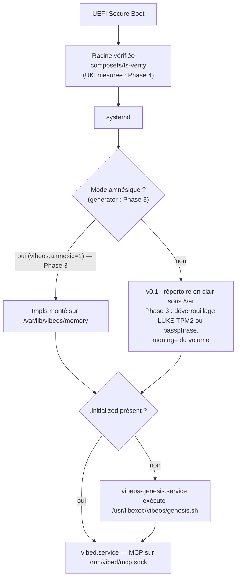

# Sous-système mémoire de VibeOS

> Spécification v0.1 — 2026-07-03.
> Implémentation de référence du premier boot : [`memory/genesis.sh`](../memory/genesis.sh).
> Procédure de test locale : [`memory/README.md`](../memory/README.md).

---

## 1. Philosophie

VibeOS est un OS immuable : la racine est en lecture seule, l'image est identique
pour toutes les machines, signée (sigstore/cosign) et vérifiée (dm-verity/composefs).
**Rien de personnel ne vit dans l'image.** Ce qui distingue une machine d'une autre —
son identité, son histoire, ce qu'elle a appris de son humain — est sa **mémoire**.

Trois principes non négociables :

1. **Naissance vierge.** L'OS est livré « vierge ». La mémoire n'est pas installée :
   elle est **créée** au premier démarrage par la séquence **Genesis**
   (`vibeos-genesis.service`). Avant Genesis, la machine n'a pas de passé ;
   après Genesis, elle a une date de naissance (`birth` dans `identity.toml`).

2. **La mémoire appartient à la machine et à son humain.** Elle ne quitte jamais
   la machine sans action explicite (export chiffré, §8). En v0.1 elle vit dans un
   **répertoire en clair** (`root:root`, `0700`) sous `/var` ; la cible **Phase 3**
   est un volume LUKS dédié dont la clé n'existera dans aucune image, aucun dépôt,
   aucun cloud (§6). Les agents IA n'y accèdent **jamais** directement par le
   système de fichiers : uniquement via les outils MCP de `vibed`, gouvernés par le
   moteur de politiques et journalisés (§9).

3. **Séparation stricte OS / mémoire.** L'OS (bootc/OSTree) se met à jour, se
   rollback et se réinstalle sans toucher la mémoire, qui vit sous `/var`
   (mutable par conception dans le modèle OSTree). Réciproquement, détruire la
   mémoire (factory reset, §7) rend la machine à son état de naissance sans
   réinstaller l'OS. Le **mode amnésique** (§5) pousse ce principe à l'extrême :
   la mémoire est recréée à chaque boot et ne touche jamais le disque.

---

## 2. Vue d'ensemble au démarrage



En mode amnésique (**Phase 3**, §5) le tmpfs est toujours vide au boot, donc
`.initialized` est toujours absent : **Genesis s'exécute à chaque démarrage** —
c'est le mécanisme, pas un cas particulier.

---

## 3. Layout de `/var/lib/vibeos/memory/`

```text
/var/lib/vibeos/memory/          # racine, root:root 0700 — v0.1 : répertoire en clair (LUKS ou tmpfs : Phase 3)
├── identity.toml                # identité de la machine — écrit UNE fois par Genesis
├── hardware.json                # profil matériel — écrit par Genesis
├── user/                        # profil de l'humain
│   ├── README.md                # placeholder posé par Genesis
│   ├── profile.toml             # (rempli au fil de l'eau) identité déclarée
│   ├── preferences.toml         # (rempli au fil de l'eau) préférences UI/outils
│   └── codestyle.md             # (rempli au fil de l'eau) style de code observé
├── projects/                    # index des projets connus
│   ├── README.md                # placeholder posé par Genesis
│   └── index.json               # (rempli au fil de l'eau) liste des projets
├── journal/                     # événements append-only
│   ├── README.md                # placeholder posé par Genesis
│   └── 2026-07-03.jsonl         # un fichier JSONL par jour UTC
├── knowledge/                   # faits appris
│   ├── README.md                # placeholder posé par Genesis
│   ├── facts.jsonl              # (rempli au fil de l'eau) faits datés et sourcés
│   └── embeddings/              # (futur) index vectoriel local (ollama)
└── .initialized                 # sentinelle — contient l'horodatage de naissance
```

| Entrée | Format | Écrit par | Lecture MCP | Écriture MCP |
|---|---|---|---|---|
| `identity.toml` | TOML | Genesis uniquement | `memory.query` (T0) | **interdite** |
| `hardware.json` | JSON | Genesis uniquement | `memory.query` (T0) | **interdite** |
| `user/` | TOML/MD | `vibed` | `memory.query` (T0) | `memory.append` (T1)* |
| `projects/index.json` | JSON | `vibed` | `memory.query` (T0) | `memory.append` (T1)* |
| `journal/*.jsonl` | JSONL | Genesis puis `vibed` | `memory.query` (T0) | `memory.append` (T1, append-only)* |
| `knowledge/` | JSONL | `vibed` | `memory.query` (T0) | `memory.append` (T1)* |
| `.initialized` | texte | Genesis uniquement | — | — |

\* `memory.append` est une **cible Phase 2/3** — non livré en v0.1 (voir §9). En
v0.1, la mémoire n'est inscriptible via **aucun** outil MCP : `fs.write` est
confiné à `/home/**`/`/var/home/**` et la mémoire figure dans la denylist
intégrée au code de `vibed`.

### 3.1 `identity.toml`

Écrit une seule fois, jamais modifié ensuite (sauf `vibectl`, CLI d'administration future).

```toml
# VibeOS machine identity — written once by the Genesis sequence.
schema = 1
hostname = "forge"
machine_id = "6f3c9e2a8b1d4f7c9e0a1b2c3d4e5f60"   # /etc/machine-id, "unknown" sinon
birth = "2026-07-03T09:14:22+02:00"                # date -Is au moment de Genesis
mode = "persistent"                                # "persistent" | "amnesic"
```

| Clé | Sémantique |
|---|---|
| `schema` | version du schéma mémoire (entier, incrémenté à chaque évolution) |
| `hostname` | nom d'hôte au moment de la naissance |
| `machine_id` | contenu de `/etc/machine-id` si lisible, `"unknown"` sinon |
| `birth` | **date de naissance** de la mémoire (ISO 8601 avec fuseau) |
| `mode` | `persistent` ou `amnesic` — lu par Genesis dans la variable d'environnement `VIBEOS_MEMORY_MODE` (support de montage : LUKS/tmpfs en Phase 3) |

### 3.2 `hardware.json`

Profil matériel collecté à la naissance. En v0.1, ce sont des instantanés **bruts**
(sortie texte des outils, échappée en chaînes JSON) — suffisant pour que les agents
répondent à « sur quoi je tourne ? » sans exécuter de commande. Chaque outil absent
ou en échec est remplacé par un marqueur explicite (`"(lscpu not available)"`),
jamais par un crash de Genesis.

```json
{
  "schema": 1,
  "collected_at": "2026-07-03T09:14:22+02:00",
  "kernel": "Linux 6.15.4-200.fc42.x86_64 x86_64 GNU/Linux",
  "cpu": "…sortie de lscpu…",
  "memory": "…sortie de free -h…",
  "block_devices": "…sortie de lsblk…",
  "filesystems": "…sortie de df -h…"
}
```

Évolution prévue (`schema = 2`) : champs structurés (cœurs, RAM en octets,
GPU/VRAM pour dimensionner les modèles ollama locaux) et re-collecte journalisée
quand le matériel change.

### 3.3 `user/`

Ce que la machine sait de **son humain**. Rempli progressivement par `vibed` via
`memory.append` (cible Phase 2/3 — jamais par Genesis, qui ne pose qu'un `README.md`) :
`profile.toml` (nom d'usage, langue — le français est détecté dès la locale),
`preferences.toml` (éditeur, shell, thème, outils préférés), `codestyle.md`
(conventions observées dans les sessions de vibecoding : indentation, nommage,
frameworks favoris).

### 3.4 `projects/`

`index.json` : tableau d'objets `{ "path", "name", "languages", "vcs",
"first_seen", "last_opened", "summary" }`. Alimenté quand un agent ouvre un
projet ; consulté en début de session pour retrouver le contexte (« reprends le
projet d'hier »).

### 3.5 `journal/`

La colonne vertébrale de la mémoire : **append-only**, un fichier par jour UTC
(`AAAA-MM-JJ.jsonl`), une ligne JSON par événement. On n'édite jamais une ligne
existante ; une correction est un nouvel événement.

Schéma d'un événement :

```json
{"ts":"2026-07-03T09:14:22+02:00","type":"genesis","source":"genesis.sh","data":{"mode":"persistent","hostname":"forge","schema":1}}
```

| Champ | Contenu |
|---|---|
| `ts` | horodatage ISO 8601 |
| `type` | `genesis`, `boot`, `tool_call`, `observation`, `decision`, `preference`, `project_seen`, `error`, `purge` |
| `source` | émetteur : `genesis.sh`, `vibed`, nom d'agent (`claude-code`, `aider`, …) |
| `data` | objet libre, spécifique au type |

Le tout premier événement de la vie d'une machine est toujours `type: "genesis"`,
écrit par `genesis.sh` lui-même.

### 3.6 `knowledge/`

Faits durables extraits du journal : `facts.jsonl` avec
`{ "id", "ts", "subject", "fact", "confidence", "source" }`. Le répertoire
`embeddings/` est réservé à un index vectoriel local (embeddings calculés par
ollama, jamais envoyés dans le cloud) pour la recherche sémantique de
`memory.query` — hors périmètre v0.1.

### 3.7 Permissions et confinement

- Racine `0700`, fichiers `0600` (Genesis s'exécute avec `umask 077`), propriétaire `root:root`.
- Cible SELinux : label dédié (`vibeos_memory_t`, à définir), accessible uniquement
  aux domaines de `vibed` et de Genesis. Les sandboxes d'exécution d'outils
  (systemd hardening, seccomp, landlock) n'ont **aucune vue** sur ce chemin.
- Conséquence : le seul chemin d'accès pour un agent est le socket MCP
  `/run/vibed/mcp.sock`, donc le moteur de politiques et l'audit (§9).

---

## 4. Cycle de vie

### 4.1 Genesis — le premier boot

Unité : `vibeos-genesis.service` (`Type=oneshot`, `RemainAfterExit=yes`),
avec le garde-fou :

```ini
ConditionPathExists=!/var/lib/vibeos/memory/.initialized
```

Ordonnancement : après le montage du volume mémoire
(`RequiresMountsFor=/var/lib/vibeos/memory`), avant `vibed.service`
(`Before=vibed.service` ; `vibed.service` déclare `After=vibeos-genesis.service`).

Séquence exacte exécutée par `/usr/libexec/vibeos/genesis.sh`
(source : [`memory/genesis.sh`](../memory/genesis.sh)) :

1. **Garde d'idempotence** : si `.initialized` existe, sortie immédiate code 0
   (double sécurité en plus de la condition systemd).
2. `umask 077` — tout ce qui naît ici est privé.
3. Création du squelette : `user/`, `projects/`, `journal/`, `knowledge/`,
   racine en `0700`.
4. Collecte matérielle → `hardware.json` : `uname`, `lscpu`, `free`, `lsblk`,
   `df` — chaque outil avec repli gracieux s'il est absent ou en échec.
5. Écriture d'`identity.toml` : hostname, machine-id (si lisible),
   `birth = date -Is`, `mode` (persistent par défaut, amnesic si la variable
   d'environnement `VIBEOS_MEMORY_MODE=amnesic` est injectée — par le generator
   amnésique en Phase 3, cf. §5).
6. Pose des `README.md` placeholders dans les quatre sous-répertoires.
7. Premier événement du journal : `type: "genesis"` dans le fichier du jour.
8. **En dernier** : écriture de `.initialized` (contenu : horodatage de naissance).

L'ordre 8-en-dernier rend Genesis **crash-safe** : une interruption à n'importe
quelle étape laisse `.initialized` absent, donc la séquence se rejoue intégralement
au boot suivant. Toutes les écritures des étapes 3–7 sont des créations/écrasements
idempotents.

Périmètre strict de `genesis.sh` : il crée des répertoires et des fichiers, rien
d'autre. **Ni `cryptsetup`, ni `mkfs`, ni montage, ni option de ligne de
commande** — le chiffrement (LUKS, §6) et le tmpfs amnésique (§5) sont fournis
*autour* de lui (crypttab, generator) à partir de la Phase 3.

### 4.2 Enrichissement continu (cible Phase 2/3)

Après Genesis, seule `vibed` écrira dans la mémoire, exclusivement via l'outil MCP
`memory.append` (T1 — cible Phase 2/3, non livré en v0.1, cf. §9) :

- fin de session agent → `observation` / `decision` dans le journal ;
- détection de préférences → `user/preferences.toml`, `user/codestyle.md` ;
- ouverture d'un projet → mise à jour de `projects/index.json` ;
- consolidation périodique journal → `knowledge/facts.jsonl` (tâche `vibed`, future).

Chaque écriture passe le moteur de politiques (`/etc/vibeos/policy.d/*.toml`) et
laisse une trace d'audit — y compris les écritures refusées.

### 4.3 Consultation par les agents

En début de session (à partir de la **Phase 2**, quand `vibed` sert l'outil), un
agent (Claude Code, aider, modèle local ollama) appelle
`memory.query` (T0, lecture seule, auto-approuvé par défaut) pour charger son
contexte : identité et matériel de la machine, préférences de l'humain, index des
projets, faits pertinents. C'est ce qui fait qu'une machine VibeOS « reconnaît »
son humain d'une session à l'autre — sans que rien ne sorte de la machine.

---

## 5. Mode amnésique (cible Phase 3 — non livré en v0.1)

**Principe** (inspiré de Tails) : `/var/lib/vibeos/memory` est un **tmpfs**.
La mémoire est reconstruite par Genesis **à chaque boot** et disparaît à
l'extinction — elle n'a jamais existé sur le disque.

**Activation (Phase 3)** : paramètre kernel `vibeos.amnesic=1` (entrée de boot
dédiée), lu par un **generator systemd** — *non livré en v0.1, aucun generator
n'existe encore dans l'image* — qui :

1. montera un tmpfs sur `/var/lib/vibeos/memory` à la place du volume LUKS
   (qui ne sera ni déverrouillé ni monté) ;
2. injectera `VIBEOS_MEMORY_MODE=amnesic` dans l'environnement de
   `vibeos-genesis.service` (drop-in), d'où `mode = "amnesic"` dans
   `identity.toml`.

Le tmpfs étant vide, `.initialized` sera absent et Genesis se rejouera : **aucun
code spécifique** n'est nécessaire dans `genesis.sh`, le mécanisme d'idempotence
suffit. Dès la v0.1, `genesis.sh` sait d'ailleurs déjà écrire `mode = "amnesic"`
si on lui fournit `VIBEOS_MEMORY_MODE=amnesic` — c'est le seul morceau du mode
amnésique livré aujourd'hui, et il est testable à la main.

**Cas d'usage** : machine partagée ou de démonstration ; poste de réponse à
incident / forensics (aucune trace de la session) ; travail sur données sensibles ;
kiosque ; et — bonus d'ingénierie — test de non-régression de Genesis à chaque boot.

**Contraintes associées** : en mode amnésique, swap désactivé (ou zram chiffré
volatil) et hibernation interdite, sinon la « mémoire volatile » fuite sur disque.
Un indicateur visible dans Plasma doit rappeler le mode actif.

---

## 6. Chiffrement (cible Phase 3 — non livré en v0.1)

**En v0.1, la mémoire est en clair au repos** : `genesis.sh` peuple un simple
répertoire (`root:root`, `0700`) sous `/var`. C'est une limite assumée et
documentée ([THREAT-MODEL.md](THREAT-MODEL.md) §7). La cible Phase 3 :

- **Volume LUKS2 dédié** (label `vibeos-memory`), distinct de la racine, monté sur
  `/var/lib/vibeos/memory` via `crypttab` + unité de montage systemd — **jamais
  par `genesis.sh`**. Créé à l'installation (ISO bootc-image-builder, Phase 5) ou
  lors de la migration Phase 3.
- **Déverrouillage TPM2 d'abord** : `systemd-cryptenroll --tpm2-device=auto`,
  scellé sur la chaîne de boot mesurée (PCR 7 — état Secure Boot ; PCR 11 — UKI).
  Si la chaîne de boot a été altérée, le TPM refuse de desceller → **repli
  passphrase** demandé à l'humain. Une clé de secours (recovery key) est générée à
  l'enrôlement, affichée une seule fois, jamais stockée sur la machine.
- **La clé n'est jamais dans l'image.** L'image OS (`ghcr.io/micka420-collab/vibeos`) est
  générique et publique ; les secrets sont par-machine, créés localement. Aucun
  matériel de clé dans le dépôt, l'image, ni le CI.
- **Mises à jour** : une mise à jour bootc légitime change les mesures PCR 11 ;
  le ré-enrôlement est gérén par la politique de mise à jour (à terme
  `systemd-pcrlock`). En attendant, le repli passphrase garantit l'accès.
- **Mode amnésique** : pas de LUKS — la mémoire vit en RAM (§5).

---

## 7. Rétention et purge

Valeurs par défaut, configurables dans `/etc/vibeos/policy.d/memory.toml`
(lu par `vibed`) :

| Donnée | Rétention par défaut | Mécanisme |
|---|---|---|
| `journal/*.jsonl` | 365 jours | compression puis consolidation dans `knowledge/`, suppression des JSONL bruts |
| `knowledge/facts.jsonl` | illimitée | dépréciation par `confidence` (future) |
| `user/`, `projects/` | illimitée | curation via `vibectl` (future) |

**Purge sélective** : `vibectl memory purge --scope journal --before 2026-01-01`
(CLI future). Toute purge est une action **T3 (destructive)** → approbation
humaine obligatoire, et laisse elle-même un événement `purge` dans le journal
(on n'efface pas le fait d'avoir effacé).

**Oubli total (factory reset)** : en v0.1, suppression du répertoire mémoire
(dont `.initialized`) ; à partir de la Phase 3, destruction des en-têtes LUKS
(`cryptsetup erase` + ré-initialisation du volume) — un effacement cryptographique,
pas une simple suppression. Dans les deux cas la machine redevient vierge : au boot
suivant, Genesis rejoue et une nouvelle `birth` est écrite. L'OS immuable est
inchangé.

---

## 8. Export / import de mémoire

La mémoire est portable — elle appartient à l'humain, pas au matériel.

- **Export** : `vibectl memory export` (future) produit
  `vibeos-memory-<machine_id>-<date>.tar.zst.age` — archive du layout complet
  (§3) + manifeste avec sommes de contrôle, chiffrée avec
  [age](https://age-encryption.org) vers une clé fournie par l'humain.
  Action **T3** (les données quittent le volume) → approbation humaine.
  Aucun export automatique, jamais.
- **Import** : `vibectl memory import <archive>` sur une machine **non initialisée**
  (avant que `.initialized` n'existe) : vérifie le manifeste, restaure le layout,
  ajoute un événement `journal` de type `observation` documentant la migration
  (ancienne `birth` conservée, `machine_id` mis à jour), puis écrit `.initialized`
  — ce qui neutralise Genesis via sa condition systemd.
- **Cas d'usage** : migration vers une nouvelle machine, sauvegarde froide,
  duplication d'un profil d'équipe sur un parc.

---

## 9. Interface MCP — les outils `memory.*` de `vibed`

Transport : socket UNIX `/run/vibed/mcp.sock`, JSON-RPC 2.0 (serveur MCP de
`vibed`). **Aucun outil `memory.*` n'est exposé en v0.1** : ils sont servis par
`vibed`, dont le binaire n'est pas encore embarqué dans l'image (**Phase 2**).
`memory.query` (argument unique `query`) est **implémenté et testé dans le crate
`vibed`** mais reste inaccessible tant que le démon n'est pas livré — c'est un
livrable **Phase 2 (servi par `vibed`)**. `memory.append` et les arguments
`scope`/`limit` viennent ensuite (**Phase 2/3**).

| Outil | Tier | Approbation par défaut | Rôle | Statut |
|---|---|---|---|---|
| `memory.query` | **T0** (observe) | automatique | lecture seule (argument unique `query`) | 🛣️ **Phase 2** (servi par `vibed` ; implémenté et testé dans le crate, non exposé) |
| `memory.append` | **T1** (modify-user) | automatique (révocable par policy) | écriture additive sur `user`, `projects`, `journal`, `knowledge` | **cible Phase 2/3** |

Points durs :

- `identity` et `hardware` sont **interrogeables mais jamais inscriptibles** via
  MCP — seul Genesis les écrit.
- En v0.1, la mémoire n'est inscriptible via **aucun** outil MCP (`fs.write` la
  refuse par denylist intégrée au code) : jusqu'à `memory.append`, seuls Genesis
  et `vibed` lui-même y écrivent.
- `memory.append` sera strictement **additif** : pas d'outil `memory.delete` ni
  `memory.rewrite`. La suppression restera réservée à `vibectl` (T3, humain).
- Chaque appel — accepté ou refusé — est audité et produira, à terme, un événement
  `tool_call` dans le journal.

### `memory.query` (T0 — 🛣️ Phase 2, servi par `vibed`)

```json
{
  "jsonrpc": "2.0",
  "id": 42,
  "method": "tools/call",
  "params": {
    "name": "memory.query",
    "arguments": {
      "query": "style de code préféré"
    }
  }
}
```

Dans sa première version (Phase 2), `query` est l'**unique argument** : filtrage
lexical (sous-chaîne / clés) sur la mémoire. Réponse : contenu MCP standard
(`result.content`) portant les entrées trouvées en JSON.

**Cible Phase 2/3** : arguments supplémentaires `scope` ∈ `identity` | `hardware` |
`user` | `projects` | `journal` | `knowledge` et `limit` (plafond de résultats) ;
la recherche sémantique via `knowledge/embeddings/` viendra ensuite.

### `memory.append` (T1 — cible Phase 2/3, non livré en v0.1)

```json
{
  "jsonrpc": "2.0",
  "id": 43,
  "method": "tools/call",
  "params": {
    "name": "memory.append",
    "arguments": {
      "scope": "journal",
      "entry": {
        "type": "observation",
        "source": "claude-code",
        "data": { "note": "le projet vibeos-ui utilise pnpm, pas npm" }
      }
    }
  }
}
```

`vibed` complétera `ts`, validera le schéma selon le scope (événement journal,
fait knowledge, clé de préférence…), appliquera la politique, écrira, auditera.

---

## 10. Références

- Prototype Genesis : [`memory/genesis.sh`](../memory/genesis.sh) — test local : [`memory/README.md`](../memory/README.md)
- Construction de l'image et de l'ISO : [`docs/BUILD.md`](BUILD.md)
- Trajectoire du projet : [`ROADMAP.md`](../ROADMAP.md)
- Amont : [bootc](https://bootc-dev.github.io/bootc/), [systemd-cryptenroll](https://www.freedesktop.org/software/systemd/man/latest/systemd-cryptenroll.html), [MCP](https://modelcontextprotocol.io), [Tails (modèle amnésique)](https://tails.net)
