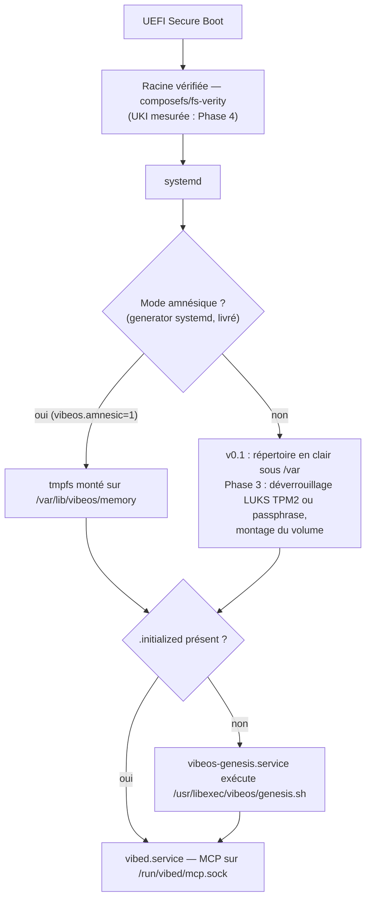

# Sous-système mémoire de VibeOS

> Spécification v0.1 — 2026-07-03.
> Implémentation de référence du premier boot : [`memory/genesis.sh`](../memory/genesis.sh).
> Procédure de test locale : [`memory/README.md`](../memory/README.md).

---

## 1. Philosophie

VibeOS est un OS immuable : la racine est en lecture seule, l'image est identique
pour toutes les machines, signée (sigstore/cosign) et vérifiée (dm-verity/composefs).
**Rien de personnel ne vit dans l'image.** Ce qui distingue une machine d'une autre —
son identité, son histoire, ce qu'elle a appris de son humain — est sa **mémoire**.

Trois principes non négociables :

1. **Naissance vierge.** L'OS est livré « vierge ». La mémoire n'est pas installée :
   elle est **créée** au premier démarrage par la séquence **Genesis**
   (`vibeos-genesis.service`). Avant Genesis, la machine n'a pas de passé ;
   après Genesis, elle a une date de naissance (`birth` dans `identity.toml`).

2. **La mémoire appartient à la machine et à son humain.** Elle ne quitte jamais
   la machine sans action explicite (export chiffré, §8). En v0.1 elle vit dans un
   **répertoire en clair** (`root:root`, `0700`) sous `/var` ; la cible **Phase 3**
   est un volume LUKS dédié dont la clé n'existera dans aucune image, aucun dépôt,
   aucun cloud (§6). Les agents IA n'y accèdent **jamais** directement par le
   système de fichiers : uniquement via les outils MCP de `vibed`, gouvernés par le
   moteur de politiques et journalisés (§9).

3. **Séparation stricte OS / mémoire.** L'OS (bootc/OSTree) se met à jour, se
   rollback et se réinstalle sans toucher la mémoire, qui vit sous `/var`
   (mutable par conception dans le modèle OSTree). Réciproquement, détruire la
   mémoire (factory reset, §7) rend la machine à son état de naissance sans
   réinstaller l'OS. Le **mode amnésique** (§5) pousse ce principe à l'extrême :
   la mémoire est recréée à chaque boot et ne touche jamais le disque.

---

## 2. Vue d'ensemble au démarrage



En mode amnésique (§5, generator livré) le tmpfs est toujours vide au boot, donc
`.initialized` est toujours absent : **Genesis s'exécute à chaque démarrage** —
c'est le mécanisme, pas un cas particulier.

---

## 3. Layout de `/var/lib/vibeos/memory/`

```text
/var/lib/vibeos/memory/          # racine, root:root 0700 — v0.1 : répertoire en clair (LUKS ou tmpfs : Phase 3)
├── identity.toml                # identité de la machine — écrit UNE fois par Genesis
├── hardware.json                # profil matériel — écrit par Genesis
├── personality.toml             # caractère du citoyen IA, choisi à la naissance — écrit par Genesis
├── user/                        # profil de l'humain
│   ├── README.md                # placeholder posé par Genesis
│   ├── profile.toml             # (rempli au fil de l'eau) identité déclarée
│   ├── preferences.toml         # (rempli au fil de l'eau) préférences UI/outils
│   └── codestyle.md             # (rempli au fil de l'eau) style de code observé
├── projects/                    # index des projets connus
│   ├── README.md                # placeholder posé par Genesis
│   └── index.json               # (rempli au fil de l'eau) liste des projets
├── journal/                     # événements append-only
│   ├── README.md                # placeholder posé par Genesis
│   └── 2026-07-03.jsonl         # un fichier JSONL par jour UTC
├── knowledge/                   # faits appris
│   ├── README.md                # placeholder posé par Genesis
│   ├── facts.jsonl              # (rempli au fil de l'eau) faits datés et sourcés
│   └── embeddings/              # (futur) index vectoriel local (ollama)
├── reasoning/                   # raisonnement des agents capté (ADR-012, Phase 2.5)
│   ├── README.md                # placeholder posé par Genesis
│   └── <session>.jsonl          # (rempli au fil de l'eau) un fichier par session
└── .initialized                 # sentinelle — contient l'horodatage de naissance
```

| Entrée | Format | Écrit par | Lecture MCP | Écriture MCP |
|---|---|---|---|---|
| `identity.toml` | TOML | Genesis uniquement | `memory.query` (T0) | **interdite** |
| `hardware.json` | JSON | Genesis uniquement | `memory.query` (T0) | **interdite** |
| `personality.toml` | TOML | Genesis uniquement | `memory.query` (T0, scope `personality`) | **interdite** |
| `user/updates.jsonl` | JSONL | `vibed` | `memory.query` (T0) | ✅ `memory.append` (T1, append-only ; scope `user`) |
| `projects/updates.jsonl` | JSONL | `vibed` | `memory.query` (T0) | ✅ `memory.append` (T1, append-only ; scope `projects`) |
| `journal/*.jsonl` | JSONL | Genesis puis `vibed` | `memory.query` (T0) | ✅ `memory.append` (T1, append-only) |
| `knowledge/facts.jsonl` | JSONL | `vibed` | `memory.query` (T0) | ✅ `memory.append` (T1, append-only) |
| `.initialized` | texte | Genesis uniquement | — | — |

\* `memory.append` est **livré** pour les quatre scopes agents `journal`,
`knowledge`, `user` et `projects` (voir §9). Invariant §4 oblige :
**tous append-only** — `user` et `projects` ne « fusionnent » pas par
réécriture mais accumulent des mises à jour dans `updates.jsonl` ; la vue
courante (profil, index) est le *fold* de ces lignes (dernière écriture gagne
par clé/`path`), jamais un fichier réécrit sur place. La mémoire
n'est inscriptible par aucun autre outil MCP : `fs.write` est confiné à
`/home/**`/`/var/home/**` et la mémoire figure dans la denylist intégrée au
code de `vibed` — `memory.append`, qui ne prend aucun argument de chemin, est
l'unique canal d'écriture gouverné.

### 3.1 `identity.toml`

Écrit une seule fois, jamais modifié ensuite (sauf `vibectl`, CLI d'administration future).

```toml
# VibeOS machine identity — written once by the Genesis sequence.
schema = 1
hostname = "forge"
machine_id = "6f3c9e2a8b1d4f7c9e0a1b2c3d4e5f60"   # /etc/machine-id, "unknown" sinon
birth = "2026-07-03T09:14:22+02:00"                # date -Is au moment de Genesis
mode = "persistent"                                # "persistent" | "amnesic"
```

| Clé | Sémantique |
|---|---|
| `schema` | version du schéma mémoire (entier, incrémenté à chaque évolution) |
| `hostname` | nom d'hôte au moment de la naissance |
| `machine_id` | contenu de `/etc/machine-id` si lisible, `"unknown"` sinon |
| `birth` | **date de naissance** de la mémoire (ISO 8601 avec fuseau) |
| `mode` | `persistent` ou `amnesic` — lu par Genesis dans la variable d'environnement `VIBEOS_MEMORY_MODE` (support de montage : LUKS/tmpfs en Phase 3) |

### 3.2 `hardware.json` (schema 2)

Profil matériel collecté à la naissance. **schema 2** expose des **champs
structurés** (nombre de cœurs, RAM en octets, GPU + VRAM en octets) exploitables
directement par les agents, et conserve les **instantanés bruts** des outils
sous `raw` pour la forensique. Chaque sonde dégrade gracieusement (`cores: 0`,
`total_bytes: null`, `gpu: []`, `"(lscpu not available)"`) — jamais un crash de
Genesis. La VRAM n'est renseignée que si un outil vendeur la fournit
(`nvidia-smi` pour NVIDIA) ; sinon `vram_bytes: null`.

```json
{
  "schema": 2,
  "collected_at": "2026-07-03T09:14:22+02:00",
  "kernel": "Linux 6.15.4-200.fc42.x86_64 x86_64 GNU/Linux",
  "cpu": { "model": "AMD Ryzen 7 3700X 8-Core Processor", "cores": 16 },
  "memory": { "total_bytes": 16777216000 },
  "gpu": [
    { "vendor": "NVIDIA", "model": "NVIDIA GeForce RTX 3070 Ti", "vram_bytes": 8589934592 }
  ],
  "raw": {
    "cpu": "…sortie de lscpu…",
    "memory": "…sortie de free -h…",
    "block_devices": "…sortie de lsblk…",
    "filesystems": "…sortie de df -h…"
  }
}
```

> **Note schema** : `hardware.json` porte son propre numéro (2), distinct du
> schema de la mémoire/identité (`identity.toml`, événement `genesis` = 1).

Évolution prévue (`schema = 2`) : champs structurés (cœurs, RAM en octets,
GPU/VRAM pour dimensionner les modèles ollama locaux) et re-collecte journalisée
quand le matériel change.

### 3.3 `user/`

Ce que la machine sait de **son humain**. Rempli progressivement par `vibed` via
`memory.append` scope `user` (jamais par Genesis, qui ne pose qu'un
`README.md`). Invariant §4 : c'est **append-only**, pas une réécriture. Chaque
appel ajoute une ligne à `user/updates.jsonl` : `{ ts, key, value, source }`,
où `key` est une clé pointée `[A-Za-z0-9._-]` (ex. `profile.lang`,
`preferences.editor`, `codestyle.indent`). La **vue courante** (profil,
préférences) est le *fold* de ces lignes — **dernière écriture gagne par
`key`** — matérialisée par `memory.query` ou un futur `vibectl`, jamais par un
fichier réécrit sur place.

### 3.4 `projects/`

Index des projets connus, **append-only** : `projects/updates.jsonl`, une ligne
par mise à jour `{ ts, path, source, name?, languages?, vcs?, summary?,
last_opened? }` (champs hors liste ignorés). `path` (absolu) est la clé de
*fold* : la vue courante est l'agrégat **dernière écriture gagne par `path`**.
Alimenté quand un agent ouvre un projet ; consulté en début de session pour
retrouver le contexte (« reprends le projet d'hier »).

### 3.5 `journal/`

La colonne vertébrale de la mémoire : **append-only**, un fichier par jour UTC
(`AAAA-MM-JJ.jsonl`), une ligne JSON par événement. On n'édite jamais une ligne
existante ; une correction est un nouvel événement.

Schéma d'un événement :

```json
{"ts":"2026-07-03T09:14:22+02:00","type":"genesis","source":"genesis.sh","data":{"mode":"persistent","hostname":"forge","schema":1}}
```

| Champ | Contenu |
|---|---|
| `ts` | horodatage ISO 8601 |
| `type` | `genesis`, `boot`, `tool_call`, `observation`, `decision`, `preference`, `project_seen`, `error`, `purge` |
| `source` | émetteur : `genesis.sh`, `vibed`, nom d'agent (`claude-code`, `aider`, …) |
| `data` | objet libre, spécifique au type |

Le tout premier événement de la vie d'une machine est toujours `type: "genesis"`,
écrit par `genesis.sh` lui-même.

**Événement `tool_call` (écrit par `vibed`)** — à chaque **action agent T1+
réellement exécutée** (aujourd'hui `fs.write` ; demain les outils T2/T3
approuvés), `vibed` ajoute une ligne `type: "tool_call"`, `source: "vibed"`,
`data: {tool, target, tier, caller_uid}` — sans secret (le `target` non secret
reprend celui de l'audit). C'est la mémoire *de haut niveau* de ce que la
machine a fait (« qu'ai-je fait hier ? »), distincte du journal d'audit
forensique. Les lectures T0 et les outils `memory.*` en sont **exclus** (bruit
méta). `tool_call` est un type **réservé au système** : un agent ne peut pas le
forger via `memory.append` (refusé).

### 3.6 `knowledge/`

Faits durables extraits du journal : `facts.jsonl` avec
`{ "id", "ts", "subject", "fact", "confidence", "source" }`. Le répertoire
`embeddings/` est réservé à un index vectoriel local (embeddings calculés par
ollama, jamais envoyés dans le cloud) pour la recherche sémantique de
`memory.query` — hors périmètre v0.1.

**Classement de rappel (livré pur, câblage à venir — [ADR-030](DECISIONS.md)).**
Une mémoire qui grossit sans classement se dégrade : tout remonter noie le
signal, filtrer par sous-chaîne rate le souvenir pertinent mal nommé.
`vibed/src/tools/recall.rs` implémente — **pur, déterministe, testé, inerte**
(même statut que `propose.rs`/`embeddings.rs`) — le **score de rappel** que
`memory.query` classera, d'après le modèle *memory stream* des *Generative
Agents* (Park et al. 2023) :

```text
score = w_récence · récence + w_importance · importance + w_pertinence · pertinence
```

- **récence** : décroissance exponentielle par demi-vie, `[0, 1]` ;
- **importance** : saillance dérivée du **type** d'événement journal (§3.5) —
  `decision` > `preference` > `observation` > `tool_call`… — **jamais** d'un
  champ auto-déclaré par l'agent (§9 : `source`/`data`/`fact` sont NON FIABLES) ;
- **pertinence** : deux moteurs de même échelle `[0, 1]`, **lexical** (Jaccard
  des jetons, hors-ligne, immédiat) et **vectoriel** (cosinus de
  `knowledge/embeddings/`, replié `[-1,1]→[0,1]`) — `recall.rs` est le **premier
  consommateur réel** de la couche `embeddings`.

Ce classement est **livré ET câblé** : `memory.query` en mode `rank: true`
(opt-in, scopes `journal`/`knowledge`, §9) l'applique aux événements. Le moteur
**lexical** de pertinence est donc actif ; restent à venir la **production des
vecteurs** (ollama local) et le branchement du moteur **vectoriel** (le cosinus
de `embeddings/`, déjà présent dans `recall.rs` mais inerte).

### 3.7 Permissions et confinement

- Racine `0700`, fichiers `0600` (Genesis s'exécute avec `umask 077`), propriétaire `root:root`.
- Cible SELinux : label dédié (`vibeos_memory_t`, à définir), accessible uniquement
  aux domaines de `vibed` et de Genesis. Les sandboxes d'exécution d'outils
  (systemd hardening, seccomp, landlock) n'ont **aucune vue** sur ce chemin.
- Conséquence : le seul chemin d'accès pour un agent est le socket MCP
  `/run/vibed/mcp.sock`, donc le moteur de politiques et l'audit (§9).

### 3.8 `personality.toml` (schema 1)

Le **caractère du citoyen IA**, choisi par la machine **à sa naissance**. C'est
le pendant « âme » de `identity.toml` (le pendant « corps » étant
`hardware.json`) : écrit **une seule fois** par Genesis, jamais par
`memory.append`, lisible via `memory.query` (scope `personality`). Voir
[ADR-029](DECISIONS.md).

```toml
schema = 1
name = "Lumen"                 # nom choisi dans un vivier de noms neutres
archetype = "sentinelle"       # l'axe de trait dominant, valeur en français
tone = "concis et direct"      # comment il s'exprime, dérivé des axes de tête
birth = "2026-07-21T13:49:41+00:00"  # même instant que identity.birth
seed = "2067ece4"              # empreinte FNV-1a de l'ancre (traçabilité)

[traits]                       # six axes 0..100, dérivés du seed
curiosity = 62
caution = 78                   # plancher 50 — un citoyen VibeOS n'est jamais imprudent
initiative = 40
warmth = 55
concision = 70
playfulness = 33

[values]                       # valeurs civiques héritées, non tirées au sort
principles = ["la sécurité d'abord", "la transparence", "la mémoire appartient à l'humain"]

[adaptation]                   # comment le caractère se plie à l'humain (symbiose)
source = "user.model"          # signal ADR-028
concision = "rhythm+preferences"
warmth = "friction"
initiative = "patterns"
note = "Caractère de naissance. Il évolue vers vous ; il ne vous imite pas."
```

**Déterminisme et unicité.** Le caractère est **dérivé de façon déterministe**
d'une **ancre stable** — `machine_id` (repli `hostname`) — par une fonction de
hachage FNV-1a **en bash pur** (aucun outil externe, hors-ligne, reproductible).
Conséquences voulues :

- **une installation = un caractère unique** (les `machine_id` diffèrent) : « à
  chaque installation l'IA choisit sa personnalité » est réel, pas du théâtre ;
- **même machine = même caractère à chaque boot**, y compris en **mode
  amnésique** — la mémoire est effacée à chaque démarrage, le tempérament de
  naissance ne l'est pas (`machine_id` vit dans `/etc`, hors du tmpfs). L'âme est
  constante ; seul ce qu'elle apprend est effacé.

**Naissance puis symbiose.** `[traits]` est un tempérament **de naissance** ; la
table `[adaptation]` déclare le **contrat d'évolution** — quels traits se
réajustent à partir de quel champ du signal `user.model` ([ADR-028](DECISIONS.md)).
La **boucle de réécriture vivante** (un agent qui replie `user.model` dans
`personality.toml`) est une **sur-couche (Phase 3)** ; ce qui est **livré** est
la naissance déterministe, le schéma, le contrat d'adaptation et l'exposition en
lecture. L'« éveil » visible (le bloc futuriste imprimé sur la console de
premier boot par `genesis.sh`) accompagne la naissance ; la cérémonie graphique
riche dans le HUD reste **machine-gated** (pas d'ISO bootée).

---

## 4. Cycle de vie

### 4.1 Genesis — le premier boot

Unité : `vibeos-genesis.service` (`Type=oneshot`, `RemainAfterExit=yes`),
avec le garde-fou :

```ini
ConditionPathExists=!/var/lib/vibeos/memory/.initialized
```

Ordonnancement : après le montage du volume mémoire
(`RequiresMountsFor=/var/lib/vibeos/memory`), avant `vibed.service`
(`Before=vibed.service` ; `vibed.service` déclare `After=vibeos-genesis.service`).

Séquence exacte exécutée par `/usr/libexec/vibeos/genesis.sh`
(source : [`memory/genesis.sh`](../memory/genesis.sh)) :

1. **Garde d'idempotence** : si `.initialized` existe, sortie immédiate code 0
   (double sécurité en plus de la condition systemd).
2. `umask 077` — tout ce qui naît ici est privé.
3. Création du squelette : `user/`, `projects/`, `journal/`, `knowledge/`,
   `reasoning/`, racine en `0700`.
4. Collecte matérielle → `hardware.json` (schema 2, champs structurés
   cœurs/RAM/GPU + blobs bruts) : `uname`, `lscpu`, `free`, `lsblk`,
   `df` — chaque outil avec repli gracieux s'il est absent ou en échec.
5. Écriture d'`identity.toml` : hostname, machine-id (si lisible),
   `birth = date -Is`, `mode` (persistent par défaut, amnesic si la variable
   d'environnement `VIBEOS_MEMORY_MODE=amnesic` est injectée — par le generator
   amnésique livré, cf. §5).
6. Écriture de `personality.toml` : le **caractère du citoyen IA** dérivé de
   façon déterministe de `machine_id` (§3.8, [ADR-029](DECISIONS.md)) — nom,
   archétype, six axes de trait, ton, contrat d'`[adaptation]`.
7. Pose des `README.md` placeholders dans les cinq sous-répertoires.
8. Premier événement du journal : `type: "genesis"` (portant le caractère né :
   nom/archétype/seed) dans le fichier du jour.
8bis. **L'interview de naissance** (opt-in) : `genesis-interview.sh`, appelé
   best-effort entre l'éveil et la sentinelle. Sans TTY sur stdin et sans
   `VIBEOS_INTERVIEW=1`, c'est un no-op silencieux — un premier boot sans
   surveillance n'est **jamais** bloqué. Opt-in : 4 questions (nom d'usage,
   langue, domaine, style de collaboration) écrites en append-only dans
   `user/updates.jsonl` (`profile.name`, `profile.lang`, `profile.domain`,
   `preferences.collaboration`, source `genesis-interview`), échappées JSON
   (anti-empoisonnement), idempotent (un rejeu ne double-écrit pas). Réponses
   injectables par `VIBEOS_INTERVIEW_*` (testable en CI sans TTY).
9. **L'éveil** : un bloc futuriste imprimé sur la console (stderr) révélant le
   citoyen qui vient de naître — purement cosmétique, gardé pour ne jamais
   pouvoir faire échouer Genesis.
10. **En dernier** : écriture de `.initialized` (contenu : horodatage de naissance).

L'ordre « sentinelle-en-dernier » rend Genesis **crash-safe** : une interruption
à n'importe quelle étape laisse `.initialized` absent, donc la séquence se rejoue
intégralement au boot suivant. Toutes les écritures des étapes 3–8 sont des
créations/écrasements idempotents (le caractère, dérivé d'une ancre stable, se
réécrit à l'identique) — sauf l'ajout au journal (étape 8), append-only, donc
**gardé** (voir le script) pour ne jamais estampiller une seconde naissance.

Périmètre strict de `genesis.sh` : il crée des répertoires et des fichiers, rien
d'autre. **Ni `cryptsetup`, ni `mkfs`, ni montage, ni option de ligne de
commande** — le chiffrement (LUKS, §6) et le tmpfs amnésique (§5) sont fournis
*autour* de lui (crypttab, generator) à partir de la Phase 3.

### 4.2 Enrichissement continu (cible Phase 2/3)

Après Genesis, seule `vibed` écrit dans la mémoire, exclusivement via l'outil MCP
`memory.append` (T1 — livré pour `journal`/`knowledge`, cf. §9) :

- fin de session agent → `observation` / `decision` dans le journal ;
- détection de préférences → `user/preferences.toml`, `user/codestyle.md` ;
- ouverture d'un projet → mise à jour de `projects/index.json` ;
- consolidation périodique journal → `knowledge/facts.jsonl` (tâche `vibed`, future).

Chaque écriture passe le moteur de politiques (`/etc/vibeos/policy.d/*.toml`) et
laisse une trace d'audit — y compris les écritures refusées.

### 4.3 Consultation par les agents

En début de session, un agent (Claude Code, aider, modèle local ollama) appelle
`memory.query` (T0, lecture seule, auto-approuvé par défaut) pour charger son
contexte : identité et matériel de la machine, préférences de l'humain, index des
projets, faits pertinents. L'outil est **servi par `vibed` dès la v0.1** ; la
**configuration MCP côté client** (ex. Claude Code) pour l'appeler sans réglage
manuel reste, elle, un livrable **Phase 2**. C'est ce qui fait qu'une machine
VibeOS « reconnaît » son humain d'une session à l'autre — sans que rien ne sorte
de la machine.

---

## 5. Mode amnésique (generator livré ; validation VM = Phase 3)

**Principe** (inspiré de Tails) : `/var/lib/vibeos/memory` est un **tmpfs**.
La mémoire est reconstruite par Genesis **à chaque boot** et disparaît à
l'extinction — elle n'a jamais existé sur le disque.

**Activation** : paramètre kernel `vibeos.amnesic=1` (entrée de boot dédiée), lu
par le **generator systemd** `os/rootfs/usr/lib/systemd/system-generators/vibeos-amnesic-generator`
(**livré** dans l'image, shellcheck + tests fonctionnels verts). Il :

1. génère un **mount unit tmpfs** `var-lib-vibeos-memory.mount`
   (`mode=0700,nosuid,nodev,noexec,size=512M`) et le câble dans
   `local-fs.target` — la mémoire est un tmpfs, le volume LUKS (Phase 3) n'est
   ni déverrouillé ni monté ;
2. injecte `VIBEOS_MEMORY_MODE=amnesic` (drop-in) dans `vibeos-genesis.service`
   **et** `vibed.service`, et les ordonne après le montage
   (`RequiresMountsFor`), d'où `mode = "amnesic"` dans `identity.toml` ;
3. publie un marqueur non secret `/run/vibeos/memory-mode` (`amnesic` |
   `persistent`) pour Genesis/vibed/HUD. `vibeos.amnesic=0` force persistent ;
   toute cmdline non reconnue reste persistent (défaut sûr).

Le tmpfs étant vide, `.initialized` est absent et Genesis se rejoue : **aucun
code spécifique** n'est nécessaire dans `genesis.sh`, le mécanisme d'idempotence
suffit ; `genesis.sh` lit `VIBEOS_MEMORY_MODE` et écrit `mode = "amnesic"`.
**Reste Phase 3** : la validation en VM du cycle boot amnésique → reboot →
vérification qu'aucune trace ne persiste (nécessite un vrai boot), et le swap
volatil ci-dessous.

**Cas d'usage** : machine partagée ou de démonstration ; poste de réponse à
incident / forensics (aucune trace de la session) ; travail sur données sensibles ;
kiosque ; et — bonus d'ingénierie — test de non-régression de Genesis à chaque boot.

**Contraintes associées** : en mode amnésique, swap désactivé (ou zram chiffré
volatil) et hibernation interdite, sinon la « mémoire volatile » fuite sur disque.
Un indicateur visible dans Plasma doit rappeler le mode actif.

---

## 6. Chiffrement (cible Phase 3 — non livré en v0.1)

**En v0.1, la mémoire est en clair au repos** : `genesis.sh` peuple un simple
répertoire (`root:root`, `0700`) sous `/var`. C'est une limite assumée et
documentée ([THREAT-MODEL.md](THREAT-MODEL.md) §7). La cible Phase 3 :

- **Volume LUKS2 dédié** (label `vibeos-memory`), distinct de la racine, monté sur
  `/var/lib/vibeos/memory` via `crypttab` + unité de montage systemd — **jamais
  par `genesis.sh`**. Créé à l'installation (ISO bootc-image-builder, Phase 5) ou
  lors de la migration Phase 3.
- **Déverrouillage TPM2 d'abord** : `systemd-cryptenroll --tpm2-device=auto`,
  scellé sur la chaîne de boot mesurée (PCR 7 — état Secure Boot ; PCR 11 — UKI).
  Si la chaîne de boot a été altérée, le TPM refuse de desceller → **repli
  passphrase** demandé à l'humain. Une clé de secours (recovery key) est générée à
  l'enrôlement, affichée une seule fois, jamais stockée sur la machine.
- **La clé n'est jamais dans l'image.** L'image OS (`ghcr.io/micka420-collab/vibeos`) est
  générique et publique ; les secrets sont par-machine, créés localement. Aucun
  matériel de clé dans le dépôt, l'image, ni le CI.
- **Mises à jour** : une mise à jour bootc légitime change les mesures PCR 11 ;
  le ré-enrôlement est gérén par la politique de mise à jour (à terme
  `systemd-pcrlock`). En attendant, le repli passphrase garantit l'accès.
- **Mode amnésique** : pas de LUKS — la mémoire vit en RAM (§5).

---

## 7. Rétention et purge

Valeurs par défaut **cibles**. Le mécanisme visé — un fichier
`/etc/vibeos/policy.d/memory.toml` lu par `vibed` — n'est **pas implémenté
aujourd'hui** : `vibed` n'applique encore aucune logique de rétention.

| Donnée | Rétention par défaut | Mécanisme |
|---|---|---|
| `journal/*.jsonl` | 365 jours | compression puis consolidation dans `knowledge/`, suppression des JSONL bruts |
| `knowledge/facts.jsonl` | illimitée | dépréciation par `confidence` (future) |
| `user/`, `projects/` | illimitée | curation via `vibectl` (future) |

**Purge sélective** : `vibectl memory purge --scope journal --before 2026-01-01`
(CLI future). Toute purge est une action **T3 (destructive)** → approbation
humaine obligatoire, et laisse elle-même un événement `purge` dans le journal
(on n'efface pas le fait d'avoir effacé).

**Oubli total (factory reset)** : ✅ livré — `vibectl memory reset --yes`
(root-only ; sans `--yes`, la commande **refuse** et liste ce qui serait
détruit). Elle supprime `.initialized`, les fichiers de naissance
(`identity.toml`, `hardware.json`, `personality.toml`) et le **contenu** des
sous-répertoires (`user/`, `projects/`, `journal/`, `knowledge/`,
`reasoning/`) — sans toucher la racine ni les sous-répertoires (point de
montage préservé, layout prêt pour le rejeu), ni les fichiers inconnus (elle ne
détruit que ce qu'elle connaît). À partir de la Phase 3, s'y ajoutera la
destruction des en-têtes LUKS (`cryptsetup erase` + ré-initialisation du
volume) — un effacement cryptographique, pas une simple suppression. Dans les
deux cas la machine redevient vierge : au boot suivant, Genesis rejoue et une
nouvelle `birth` est écrite. L'OS immuable est inchangé.

---

## 8. Export / import de mémoire

La mémoire est portable — elle appartient à l'humain, pas au matériel.

- **Export** : `vibectl memory export` (future) produit
  `vibeos-memory-<machine_id>-<date>.tar.zst.age` — archive du layout complet
  (§3) + manifeste avec sommes de contrôle, chiffrée avec
  [age](https://age-encryption.org) vers une clé fournie par l'humain.
  Action **T3** (les données quittent le volume) → approbation humaine.
  Aucun export automatique, jamais.
- **Import** : `vibectl memory import <archive>` sur une machine **non initialisée**
  (avant que `.initialized` n'existe) : vérifie le manifeste, restaure le layout,
  ajoute un événement `journal` de type `observation` documentant la migration
  (ancienne `birth` conservée, `machine_id` mis à jour), puis écrit `.initialized`
  — ce qui neutralise Genesis via sa condition systemd.
- **Cas d'usage** : migration vers une nouvelle machine, sauvegarde froide,
  duplication d'un profil d'équipe sur un parc.

---

## 9. Interface MCP — les outils `memory.*` de `vibed`

Transport : socket UNIX `/run/vibed/mcp.sock`, JSON-RPC 2.0 (serveur MCP de
`vibed`, désormais **embarqué dans l'image et démarré au boot**).
`memory.query` (arguments `query`, `scope`, `limit`, `fold`) et `memory.append`
(scopes `journal`, `knowledge`, `user`, `projects` — tous append-only) sont
**implémentés, testés et exposés** par le démon `vibed`. La **vue courante**
(fold last-write-wins des scopes `user`/`projects`) est matérialisée pour
l'opérateur par `vibectl memory profile`/`projects` **et pour les agents** par
`memory.query` avec `fold: true` (T0, un seul appel) — les deux **livrés**.
Reste une **cible ultérieure** : la recherche sémantique par embeddings.

| Outil | Tier | Approbation par défaut | Rôle | Statut |
|---|---|---|---|---|
| `memory.query` | **T0** (observe) | automatique | lecture seule (`query` + `scope`/`limit`), chaque match rendu **avec un extrait de contenu borné** ; `fold:true` sur `user`/`projects` = vue consolidée | ✅ **livré** (scope/limit + extraits + fold) |
| `memory.append` | **T1** (modify-user) | automatique (révocable par policy) | écriture strictement additive | ✅ **livré** pour `journal`, `knowledge`, `user`, `projects` (tous append-only) |

Points durs :

- `identity` et `hardware` sont **interrogeables mais jamais inscriptibles** via
  MCP — seul Genesis les écrit.
- La mémoire n'est inscriptible par **aucun autre** outil MCP (`fs.write` la
  refuse par denylist intégrée au code) : `memory.append` est l'unique canal
  d'écriture, et il ne prend **aucun argument de chemin** (le fichier cible est
  dérivé du scope).
- `memory.append` est strictement **additif** : une ligne JSONL par appel
  (`O_APPEND` + `O_NOFOLLOW`, plafond 16 KiB/ligne), pas d'outil
  `memory.delete` ni `memory.rewrite`. La suppression reste réservée à
  `vibectl` (T3, humain). Les types de journal `genesis`, `boot`, `tool_call`
  et `purge` sont **réservés au système** : un agent ne peut pas les forger.
  `ts` (et l'`id` des faits) sont posés par `vibed`, jamais par l'agent ;
  l'identité authentique de l'appelant vit dans le journal d'audit
  (`SO_PEERCRED`), le champ `source` n'est qu'une étiquette déclarative.
- ⚠️ **`source` (et tout `data`/`fact`/`value`) est NON FIABLE.** C'est du
  contenu **auto-déclaré par l'agent**, lui-même un *insider non fiable*
  (THREAT-MODEL §1) : un agent peut inscrire `source: "genesis.sh"` ou un
  `fact` mensonger. `source` est une **étiquette de commodité**, jamais une
  preuve de provenance ni d'autorité. Toute lecture — et en particulier une
  future **consolidation/synthèse `knowledge`** (dédup, agrégation, calcul de
  confiance) — doit traiter ces champs comme des assertions non vérifiées :
  ne jamais élever la confiance d'un fait sur la seule foi de son `source`, ne
  jamais accorder un privilège d'après lui. La seule identité fiable est l'uid
  `SO_PEERCRED` du journal d'audit. Corollaire : la mémoire n'est pas un
  coffre-fort — **aucun secret** ne doit y être écrit.
- Chaque appel — accepté ou refusé — est audité et produira, à terme, un événement
  `tool_call` dans le journal.

### `memory.query` (T0 — ✅ livré, `scope`/`limit` inclus)

```json
{
  "jsonrpc": "2.0",
  "id": 42,
  "method": "tools/call",
  "params": {
    "name": "memory.query",
    "arguments": {
      "query": "style de code préféré"
    }
  }
}
```

Quatre arguments, tous optionnels : `query` (filtrage lexical — sous-chaîne
sur le nom relatif et le contenu), `scope` ∈ `identity` | `hardware` |
`personality` | `user` | `projects` | `journal` | `knowledge` (restreint la
marche à une entrée du layout §3 ; un scope inconnu est une erreur explicite),
`limit` (entier ≥ 1,
plafond de résultats — la réponse porte un drapeau `truncated`) et `rank`
(booléen, ci-dessous). Chaque match du mode par défaut
est rendu `{ "file": <chemin relatif>, "snippet": <extrait de contenu borné,
≤ 1024 caractères>, "snippet_truncated": <bool> }` : l'agent **lit la mémoire
en un seul appel**, sans enchaîner un `fs.read` sur le chemin absolu — la lecture
est le rôle de `memory.query`, conformément à cette spec. La marche reste bornée
en dur (200 fichiers, 64 KiB scannés par fichier, extrait ≤ 1024 caractères).

**`rank: true` (✅ livré, opt-in — scopes `journal`/`knowledge`).** Au lieu de
rendre des **fichiers** dans l'ordre du parcours (dépendant du système de
fichiers), le mode `rank` classe les **événements** par le **score de rappel**
(récence + importance + pertinence, [`recall.rs`](../vibed/src/tools/recall.rs) §3.6,
[ADR-030](DECISIONS.md)) — `limit` garde alors les **plus pertinents**, pas les
premiers rencontrés. Chaque match rend `{ "file", "line", "ts", "type", "score",
"snippet", "snippet_truncated" }` ; la réponse porte `"ranked": true` et
`"scanned_events"`. **Additif** : `rank` vaut `false` par défaut et le chemin
par défaut est inchangé (même précédent que `fold`). L'importance vient du
**type** d'événement (journal) ou de la **confidence** stockée (knowledge),
**jamais** d'un champ auto-déclaré (§ points durs : `source`/`data`/`fact` non
fiables). Bornes respectées : `MAX_MEMORY_FILES` (parcours), 64 KiB/fichier
(lecture), et un plafond dur d'événements classés par appel.

**Cible ultérieure** : la pertinence **vectorielle** (cosinus de
`knowledge/embeddings/`, moteur déjà présent dans `recall.rs` mais **inerte**
tant que la production des vecteurs — ollama local — n'existe pas). Le moteur
**lexical** du classement, lui, est **livré et câblé** (`rank`).

### `memory.append` (T1 — ✅ livré pour `journal` et `knowledge`)

```json
{
  "jsonrpc": "2.0",
  "id": 43,
  "method": "tools/call",
  "params": {
    "name": "memory.append",
    "arguments": {
      "scope": "journal",
      "entry": {
        "type": "observation",
        "source": "claude-code",
        "data": { "note": "le projet vibeos-ui utilise pnpm, pas npm" }
      }
    }
  }
}
```

`vibed` valide le schéma selon le scope, pose `ts` lui-même, applique la
politique, écrit **une ligne JSONL** (`O_APPEND`, `O_NOFOLLOW`, `0600`,
plafond 16 KiB) et audite :

- **`journal`** → `journal/<AAAA-MM-JJ UTC>.jsonl`. `entry` : `type`
  (∈ `observation`, `decision`, `preference`, `project_seen`, `error` — les
  types système `genesis`/`boot`/`tool_call`/`purge` sont refusés), `source`
  (étiquette `[A-Za-z0-9._-]{1,64}`) et `data` (objet libre).
- **`knowledge`** → `knowledge/facts.jsonl`. `entry` : `subject` (≤ 256 o),
  `fact` (≤ 4 096 o), `source`, `confidence` optionnel ∈ [0, 1] ; `vibed`
  génère l'`id`.
- **`user`** → `user/updates.jsonl`. `entry` : `key` (clé pointée
  `[A-Za-z0-9._-]`, ≤ 256 o), `value` (JSON libre), `source`. Append-only ;
  vue courante = fold last-write-wins par `key` (§3.3).
- **`projects`** → `projects/updates.jsonl`. `entry` : `path` (absolu, ≤ 4096 o,
  clé de fold), `source`, et champs structurés optionnels
  `name`/`languages`/`vcs`/`summary`/`last_opened` (le reste est ignoré).
  Append-only ; vue courante = fold last-write-wins par `path` (§3.4).

Si la mémoire n'existe pas encore (Genesis n'a pas tourné), l'appel échoue
explicitement — `memory.append` ne crée jamais la racine du store.

---

## 10. Références

- Prototype Genesis : [`memory/genesis.sh`](../memory/genesis.sh) — test local : [`memory/README.md`](../memory/README.md)
- Construction de l'image et de l'ISO : [`docs/BUILD.md`](BUILD.md)
- Trajectoire du projet : [`ROADMAP.md`](../ROADMAP.md)
- Amont : [bootc](https://bootc-dev.github.io/bootc/), [systemd-cryptenroll](https://www.freedesktop.org/software/systemd/man/latest/systemd-cryptenroll.html), [MCP](https://modelcontextprotocol.io), [Tails (modèle amnésique)](https://tails.net)
