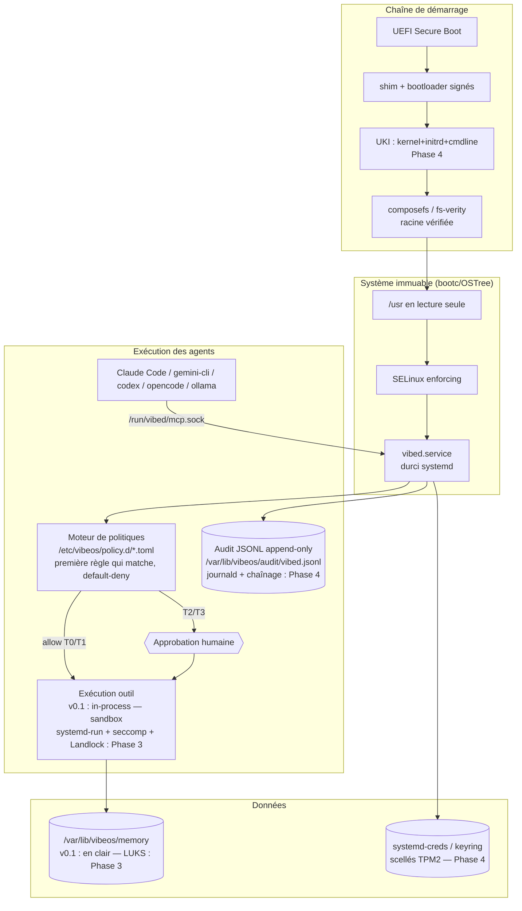

# Architecture de sécurité — VibeOS

> Version : 0.1 (2026-07-03) · Documents associés : [THREAT-MODEL.md](THREAT-MODEL.md) · [../SECURITY.md](../SECURITY.md) · [BUILD.md](BUILD.md) · [../ROADMAP.md](../ROADMAP.md)
> **Numérotation des phases** : celle de [../ROADMAP.md](../ROADMAP.md), qui fait foi — Phase 1 = v0.1 Première ISO · Phase 2 = vibed + MCP · Phase 3 = Genesis & mémoire · Phase 4 = Durcissement · Phase 5 = Installateur & identité · Phase 6 = v1.0.

Ce document décrit **comment** VibeOS implémente les principes énoncés dans [../SECURITY.md](../SECURITY.md). Pour chaque mécanisme : ce qui existe réellement aujourd'hui (fourni par Fedora/bootc ou livré en v0.1), et ce qui est planifié, avec sa phase.

## 0. Vue d'ensemble



---

## 1. Chaîne de démarrage mesurée

### Ce que Fedora bootc fournit réellement aujourd'hui (base v0.1)

- **UEFI Secure Boot** : Fedora est signé via `shim` (signé Microsoft) → GRUB/systemd-boot signés Fedora → noyau signé Fedora. Fonctionne *out of the box* sur l'image dérivée de Kinoite tant que nous n'introduisons pas de modules noyau tiers.
- **Racine immuable OSTree/composefs** : sur Fedora bootc actuel, le système de fichiers racine est monté via **composefs** adossé à fs-verity : les objets du commit OSTree sont scellés fs-verity et le montage overlay est reconstruit à l'identique. Cela garantit une **intégrité forte à l'exécution** (un fichier de `/usr` altéré offline est détecté à la lecture).
- **Limite honnête** : la chaîne n'est **pas encore scellée de bout en bout**. Aujourd'hui : la *cmdline* du noyau et l'initrd générés localement ne sont pas couverts par une signature unique, et le lien « ce commit OSTree précis est le seul démarrable » n'est pas imposé cryptographiquement par défaut. Un attaquant root peut encore modifier la configuration de boot. C'est l'écart que les Phases 4–5 comblent.

### Ce que VibeOS ajoutera

| Ajout | Description | Phase |
|---|---|---|
| **UKI** (Unified Kernel Image) | kernel + initrd + cmdline en un seul PE signé, mesuré dans les PCR TPM ; supprime l'initrd local non signé. Aligné sur le travail upstream Fedora/bootc UKI | Phase 4 |
| **Scellement TPM2** | Déverrouillage LUKS et `systemd-creds` liés aux PCR (état de boot conforme requis) | Phase 4 |
| **Clés propres** | Enrôlement de clés Secure Boot VibeOS (ou signature de l'UKI dans la chaîne shim existante) | Phase 4–5 |
| **Attestation à distance** (opt-in) | Preuve de l'état mesuré vers un vérificateur | Phase 6+ |

## 2. SELinux enforcing et politique dédiée `vibed`

- **Aujourd'hui (v0.1)** : SELinux `enforcing` hérité de Fedora Kinoite, politique *targeted*. `vibed` s'exécute initialement dans un domaine générique confiné par les mécanismes systemd (§3) — SELinux apporte à ce stade le confinement des services système standard et la protection des labels OSTree.
- **Phase 4 — politique dédiée** : module SELinux `vibed` définissant `vibed_t` (domaine du daemon), `vibed_exec_t`, `vibeos_memory_t` (label de `/var/lib/vibeos/memory`), `vibeos_audit_t` (audit, append-only au niveau MAC). Objectifs : (1) `vibed_t` est le **seul** domaine autorisé à écrire `vibeos_audit_t` et à gérer `vibeos_memory_t` ; (2) les processus outils sandboxés transitionnent vers un domaine `vibed_tool_t` plus faible, sans accès au socket de contrôle ; (3) aucune transition de `vibed_tool_t` vers un domaine privilégié.
- Règle projet : **jamais** de `setenforce 0` ni de règle `dontaudit` masquant un déni réel ; les dénis AVC rencontrés en développement sont traités comme des bugs de politique.

## 3. Sandboxing de l'exécution des outils

Deux couches distinctes : le **daemon** est durci en permanence ; chaque **outil** s'exécute dans un sandbox jetable dimensionné au tier de l'appel.

### 3.1 Durcissement du daemon (`vibed.service`, v0.1)

**État honnête de la v0.1 : `vibed` s'exécute en root.** L'unité livrée ne déclare pas `User=` ; les capacités sont réduites par une **deny-list** (pas encore une allow-list vide). Extrait de l'unité réellement livrée dans l'image (`os/rootfs/usr/lib/systemd/system/vibed.service`, qui fait foi) :

```ini
# vibed.service — hardening excerpt of the SHIPPED unit (v0.1: runs as root)
[Service]
NoNewPrivileges=yes
ProtectSystem=strict
# fs.write (T1) targets user files under /home -> /var/home (Fedora symlink).
# ProtectHome=read-only would defeat that tool, so /var/home is explicitly
# writable instead.
ProtectHome=no
ReadWritePaths=/var/home
RuntimeDirectory=vibed
StateDirectory=vibeos
ConfigurationDirectory=vibeos
PrivateTmp=yes
ProtectKernelTunables=yes
ProtectKernelModules=yes
ProtectKernelLogs=yes
ProtectControlGroups=yes
ProtectClock=yes
ProtectHostname=yes
RestrictAddressFamilies=AF_UNIX AF_INET AF_INET6 AF_NETLINK
RestrictNamespaces=yes
RestrictRealtime=yes
RestrictSUIDSGID=yes
LockPersonality=yes
MemoryDenyWriteExecute=yes
SystemCallArchitectures=native
SystemCallFilter=@system-service
SystemCallFilter=~@mount @swap @reboot @obsolete @cpu-emulation @raw-io
SystemCallErrorNumber=EPERM
# v0.1: deny-list of capabilities vibed must never hold, even as root.
CapabilityBoundingSet=~CAP_SYS_MODULE CAP_SYS_RAWIO CAP_SYS_BOOT CAP_SYS_TIME CAP_AUDIT_CONTROL
UMask=0077
DevicePolicy=closed
```

**Cible Phase 4** : `User=vibed` + `Group=vibed` (utilisateur système créé par `usr/lib/sysusers.d/vibeos.conf`, déjà livré pour le groupe `vibeos-agents` du socket) et `CapabilityBoundingSet=` en **allow-list vide** + `AmbientCapabilities=`, une fois les besoins exacts du daemon (D-Bus systemd, gestion de paquets) mesurés. Tant que cette bascule n'est pas faite, les gardes de chemins reposent sur le moteur de politiques et la denylist intégrée au code, pas sur le noyau — c'est précisément ce que la Phase 3 (Landlock par outil) et la Phase 4 (moindre privilège du daemon) viennent fermer.

Les actions T2 (paquets, services) qui exigent des privilèges ne seront **pas** exécutées dans le processus `vibed` (cible Phase 3/4) : elles passeront par des helpers dédiés à périmètre étroit (polkit/systemd), de sorte que le daemon lui-même n'ait jamais besoin de capacités larges.

### 3.2 Sandbox par appel d'outil (Phase 3 — non livré en v0.1)

En v0.1, les outils s'exécutent **in-process** dans `vibed` (cf. §3.1 et [ARCHITECTURE.md](ARCHITECTURE.md) §4.3). Cible Phase 3 : chaque exécution d'outil approuvée sera lancée comme unité transitoire (`systemd-run`) avec :

- **systemd** : mêmes protections que ci-dessus plus `PrivateNetwork=yes` par défaut (le réseau est une capacité déclarée par l'outil, pas un acquis), `RuntimeMaxSec=` (timeout), `MemoryMax=`/`TasksMax=` (anti-DoS).
- **seccomp** : profil par *classe* d'outil (un outil `fs.*` n'a pas besoin de `socket()` ; un outil réseau n'a pas besoin de `mount()`), en plus du filtre `@system-service`.
- **Landlock** : c'est la brique clé pour les règles de chemins. Les contraintes `paths.allowed` / `paths.denied` de la politique (voir [../security/policy.d/default.toml](../security/policy.d/default.toml)) seront **compilées en règles Landlock** appliquées au processus outil avant `exec`. La politique ne sera donc plus seulement vérifiée à l'entrée par `vibed` : elle sera *imposée par le noyau* pendant l'exécution — un outil compromis ne pourra pas lire un chemin que la règle ne lui donne pas. (En v0.1, ces contraintes de chemins sont vérifiées par `vibed` à l'entrée, complétées par une denylist intégrée au code.)
- Kinoite fournissant un noyau récent, Landlock (LSM empilable) est disponible ; en son absence (noyau de secours), `vibed` refusera de dégrader silencieusement et exécutera en mode restreint équivalent via montages privés (`TemporaryFileSystem=` + `BindReadOnlyPaths=`).

## 4. Gestion des secrets

Règle absolue : **aucun secret en clair sur disque, et jamais dans la mémoire VibeOS** (`/var/lib/vibeos/memory` stocke du contexte, pas des credentials — une clé API qui y transite est un bug de sévérité critique, cf. [../SECURITY.md](../SECURITY.md) §2).

- **Au repos** : clés API (Anthropic, GitHub…) stockées via `systemd-creds encrypt` — chiffrées avec la clé locale et, dès la Phase 4, **scellées TPM2 + PCR** (indéchiffrables hors de la machine et hors d'un état de boot conforme). Injection dans `vibed` par `LoadCredentialEncrypted=`, exposées uniquement dans `/run/credentials/vibed.service/` (ramfs, non swappable, visible du seul service).
- **À l'exécution** : secrets promus dans le **kernel keyring** de session `vibed` (`keyctl`), jamais dans des variables d'environnement transmises aux outils, jamais en arguments de processus (visibles dans `/proc`).
- **Vis-à-vis des agents** : les agents n'obtiennent jamais un secret ; ils obtiennent un *usage*. Exemple : l'outil qui appelle une API s'exécute côté `vibed` qui attache le credential ; le chemin `/run/credentials/**` et les magasins de secrets figurent dans les chemins refusés de `fs.read` de la politique par défaut.
- Rotation : `vibectl secrets rotate` (CLI future) ; les credentials compromis sont révocables sans reconstruction d'image.

## 5. Signature et vérification des images (cosign)

- **Signature (Phase 1 — livrée en v0.1)** : le workflow GitHub Actions (`build-os.yml`) signe chaque image poussée sur `ghcr.io/micka420-collab/vibeos` avec **cosign en mode keyless** (OIDC du workflow, certificat Fulcio, journal de transparence Rekor). Pas de clé privée à protéger ; l'identité de signature est « ce dépôt, ce workflow, cette branche ».
- **Vérification côté client (Phase 2)** : la politique des conteneurs de l'hôte (`/etc/containers/policy.json` + `registries.d`) exigera `sigstoreSigned` pour `ghcr.io/micka420-collab/vibeos` — `bootc upgrade` refusera toute image non signée ou signée par une autre identité. Tant que cette vérification n'est pas active, la signature existe mais ne protège pas : c'est explicitement un trou connu de la v0.1, fermé en Phase 2.
- **Provenance (Phase 5)** : attestations SLSA (commit, workflow, matériaux) attachées à l'image et vérifiées en plus de la signature.
- Les ISO produites par bootc-image-builder sont publiées avec sommes SHA-256 signées.

## 6. Sécurité des mises à jour et rollback

- **Atomicité** : `bootc upgrade` prépare un déploiement complet à côté de l'actuel ; bascule au reboot ; échec = l'ancien déploiement reste intact. Pas d'état intermédiaire.
- **Anti-rollback ciblé vs rollback volontaire** : le rollback local (`bootc rollback`) est une *fonctionnalité* (factory-reset semantics). Le risque de **downgrade attack** (forcer une machine vers une image ancienne vulnérable) est traité en Phase 4–5 : horodatage/époque minimale dans les métadonnées d'image vérifiée à l'upgrade.
- **Health checks (Phase 4)** : vérifications de santé au boot (démarrage de `vibed`, montage mémoire, SELinux enforcing) avec rollback automatique après N échecs, à la greenboot.
- Les mises à jour ne touchent jamais `/var` : la mémoire de la machine survit aux upgrades et aux rollbacks (et le mode amnésique, Phase 3, l'effacera volontairement, indépendamment des mises à jour).

## 7. Genesis et mémoire (rappel sécurité)

La création de la mémoire au premier boot est décrite dans [MEMORY.md](MEMORY.md) (référence) et implémentée par [memory/genesis.sh](../memory/genesis.sh) (installé : `/usr/libexec/vibeos/genesis.sh`, unité `vibeos-genesis.service`, garde `ConditionPathExists=!/var/lib/vibeos/memory/.initialized`, `RequiresMountsFor=/var/lib/vibeos/memory`).

- **v0.1 (livré)** : `genesis.sh` crée l'arborescence mémoire **en clair** sous `/var/lib/vibeos/memory` — permissions `0700 root:root`, `umask 077`, fichiers `0600`, marqueur `.initialized` écrit en dernier (crash-safe). Il ne fait **ni `cryptsetup`, ni `mkfs`, ni montage** ; le mode est lu depuis la variable d'environnement `VIBEOS_MEMORY_MODE`. La mémoire est donc **non chiffrée au repos en v0.1** — limite assumée, cf. [THREAT-MODEL.md](THREAT-MODEL.md) §7.
- **Phase 3 (cible)** : volume **LUKS2** dédié monté via `crypttab` + unité de montage (jamais par `genesis.sh`). Exigences imposées à cette étape : clé LUKS générée localement avec entropie noyau (jamais dérivée d'un secret faible), effacement des clés temporaires (`shred`/keyring éphémère), et en mode amnésique (generator systemd, Phase 3 également) un tmpfs monté avec `noswap` pour éviter toute rémanence disque.

## 8. Audit inviolable

### v0.1 (servi par `vibed` dès la Phase 2) : JSONL append-only simple

**JSONL append-only** : `/var/lib/vibeos/audit/vibed.jsonl` — un objet JSON par appel d'outil : horodatage, **identité de l'appelant** (uid/gid/pid capturés par peer credentials sur le socket), outil, **digest FNV-1a des arguments** (non cryptographique — corrélation, pas preuve d'intégrité), règle de politique appliquée, tier, décision, résultat d'exécution. Le fichier est ouvert en `O_APPEND` par `vibed` uniquement, et **illisible/inaccessible en écriture pour les agents** à double titre : chemins refusés de la politique ([../security/policy.d/default.toml](../security/policy.d/default.toml)) **et** denylist intégrée au code de `vibed` (`/var/lib/vibeos/audit/**`), qui s'applique quelle que soit la politique. Si l'écriture d'audit échoue, l'action échoue (fail-closed sur le chemin Allow).

### Phase 4 : intégrité forte

- **Chaînage de hachés** : chaque entrée embarquera `prev_hash = SHA-256(entrée précédente)` — toute suppression ou réécriture cassera la chaîne de manière détectable.
- **Réplication journald** : chaque décision émise en journal structuré (`SYSLOG_IDENTIFIER=vibed`, champs `VIBEOS_TOOL=`, `VIBEOS_TIER=`, `VIBEOS_DECISION=`), avec `Seal=yes` (FSS) pour détecter la falsification a posteriori ; `chattr +a` posé sur le JSONL.
- **Scellement TPM périodique** : ancrage régulier du haché de tête (signature par clé TPM résidente, ou étendue dans un PCR/NV index) — même root ne pourra pas réécrire l'historique *antérieur au dernier scellement* sans détection.
- **Verrou MAC** : `vibeos_audit_t` (module SELinux dédié, §2), append-only au niveau MAC.
- **Export** : `vibectl audit verify` (CLI future) revalidera la chaîne complète ; export vers un collecteur distant en option (Phase 5).

### Ce que l'audit garantit — et ne garantit pas

| Garanti | Non garanti |
|---|---|
| Toute action d'agent passée par `vibed` est tracée | Les actions d'un attaquant déjà root hors `vibed` (hors modèle, cf. [THREAT-MODEL.md](THREAT-MODEL.md) §2) |
| Falsification détectable **à partir de la Phase 4** (FSS, chaîne de hachés, TPM) — en v0.1, le JSONL n'est protégé que par les permissions et la denylist | Confidentialité du journal en cas de vol de session déverrouillée |
| Corrélation agent ↔ action ↔ approbation | Interprétation sémantique (« cette action était-elle *souhaitable* ? ») |

## 9. État récapitulatif par phase

| Mécanisme | Phase 1 (v0.1) | Phase 2 | Phase 3 | Phase 4 | Phase 5 |
|---|---|---|---|---|---|
| Root immuable + composefs/fs-verity | ✅ (hérité bootc) | | | | |
| Secure Boot (chaîne Fedora) | ✅ | | | UKI + TPM | clés propres |
| SELinux enforcing | ✅ (targeted) | | | politique `vibed_t` | |
| Signature cosign des images | ✅ (CI) | vérif. client | | | provenance SLSA |
| Moteur de politiques + tiers + approbation T2+ | politique par défaut installée (`/etc/vibeos/policy.d`) | ✅ (servi par `vibed`) | | | |
| Audit JSONL append-only (`vibed.jsonl`, identité appelant, digest FNV-1a) | | ✅ | | hash chain + journald/FSS + TPM | export distant |
| Genesis + mémoire | ✅ (répertoire en clair) | | LUKS + amnésique | scellement TPM | |
| Sandbox par outil (systemd-run + seccomp + Landlock) | durcissement `vibed.service` (root, deny-list) | | ✅ | `User=vibed`, caps allow-list vide | |
| Secrets systemd-creds / keyring | | ✅ (local) | | scellés TPM2 | |
| ISO chiffrée par défaut | | | | | ✅ |

*Le détail calendaire des phases est maintenu dans [../ROADMAP.md](../ROADMAP.md) ; en cas de divergence, la roadmap fait foi sur le « quand », ce document fait foi sur le « quoi » et le « comment ».*
