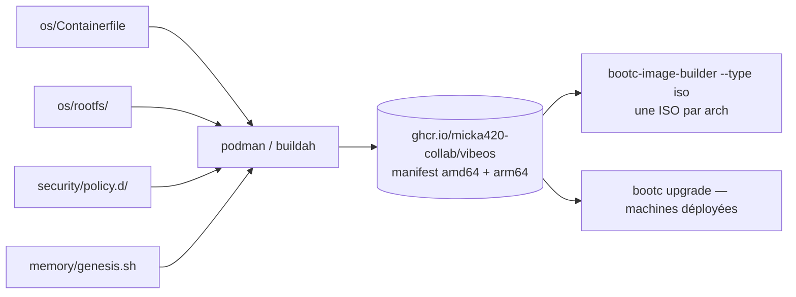

# `os/` — Définition de l'image VibeOS

Ce dossier est la **source de vérité de l'image OS**. VibeOS est une distribution
immuable de type *image-based* (bootc/OSTree, dérivée de Fedora Kinoite 42,
base épinglée par **digest**) : le système déployé sur les machines **est**
exactement le contenu de l'image OCI construite ici, publiée sur
`ghcr.io/micka420-collab/vibeos`.

L'image est **multi-architecture** : `linux/amd64` **et** `linux/arm64` sous un
manifest OCI unique. La couche pilote NVIDIA (RPM Fusion, `akmod-nvidia` +
CUDA) est appliquée **uniquement sur amd64** — machines cibles et contraintes
détaillées dans [`docs/HARDWARE.md`](../docs/HARDWARE.md).

## Contenu

| Chemin | Rôle |
|---|---|
| `Containerfile` | Recette bootc complète (paquets, VS Code, couche NVIDIA amd64, ollama vérifié par sha256, CLIs IA épinglées, overlay, politiques, lint). **Contexte de build = racine du dépôt.** |
| `rootfs/` | Overlay copié tel quel à la racine de l'image (`COPY os/rootfs/ /`). Miroir exact de l'arborescence cible. |
| `rootfs/usr/lib/systemd/system/` | Unités `vibed.service` et `vibeos-genesis.service`. |
| `rootfs/usr/lib/systemd/system-preset/50-vibeos.preset` | Activation des unités par *preset* (appliqué au premier boot, jamais de `systemctl enable` au build). |
| `rootfs/usr/lib/sysusers.d/vibeos.conf` | Création au premier boot de l'utilisateur système `vibed` et du groupe `vibeos-agents` (accès au socket MCP `root:vibeos-agents 0660`). |
| `rootfs/usr/lib/vibeos/image-info.json` | Identité de l'image (nom, version, variante, architectures, date). |
| `rootfs/usr/bin/vibeos-hud` | Lanceur du HUD Quickshell (config immuable `/usr/share/vibeos/quickshell/`, lancée par chemin explicite). |
| `rootfs/etc/xdg/kdeglobals` | Pointeur système du Global Theme par défaut (`LookAndFeelPackage=org.vibeos.dark`) — cascade KConfig, surchargeable par utilisateur ; garde anti-collision dans le `Containerfile`. |
| `rootfs/etc/skel/` | Dotfiles du premier `$HOME` : pile terminal vibecoding, autostart du HUD (`.config/autostart/vibeos-hud.desktop`), config MCP de Claude Code (`.claude.json` → socket `vibed`). |
| `packages.txt` | Manifeste des paquets, catégorisé et épinglé — doit rester **strictement synchronisé** avec le `Containerfile`. |

Deux contenus livrés par l'image ont leur source **hors de `os/`** (ne pas les
éditer ici) :

- les politiques du moteur vibed : `security/policy.d/*.toml` →
  `/etc/vibeos/policy.d/` (copie au build) ;
- le script Genesis : `memory/genesis.sh` → `/usr/libexec/vibeos/genesis.sh`.

## Règles OSTree — à connaître avant toute modification

- **`/usr`** : contenu de l'image, **immuable** à l'exécution. Tout ce que l'on
  livre doit atterrir ici.
- **`/etc`** : valeurs par défaut de l'image, fusionnées en 3 voies avec les
  modifications locales à chaque mise à jour.
- **`/var`** : état machine, créé au déploiement — **jamais livré par l'image**.
  Le `Containerfile` purge `/var` avant `bootc container lint` (qui échoue sinon).
- **`/usr/local` et `/opt`** : liens symboliques vers `/var` → **interdits**
  comme cible d'installation. C'est la raison des `--prefix=/usr` (npm, pip)
  et de l'installation d'ollama par archive extraite dans `/usr`.

## Comment modifier l'image

1. **Ajouter un paquet RPM** : l'ajouter dans le groupe adéquat du
   `Containerfile` (couches 1a/1b/1c) **et** dans `packages.txt` (même groupe).
2. **Ajouter un fichier système** (unité, preset, config par défaut) : le créer
   sous `rootfs/` au chemin exact où il doit exister dans l'image
   (ex. `rootfs/usr/lib/systemd/system/mon.service`).
3. **Activer un service** : ajouter une ligne `enable mon.service` dans
   `rootfs/usr/lib/systemd/system-preset/50-vibeos.preset`. Ne jamais utiliser
   `systemctl enable` dans le `Containerfile`.
4. **Livrer un binaire hors RPM** : l'installer dans `/usr/bin` (ou
   `/usr/libexec/vibeos` pour les internes), jamais dans `/usr/local`, version
   épinglée et somme de contrôle vérifiée (voir la couche ollama).
5. **Mettre à jour la base ou une version épinglée** : changer le digest du
   `FROM` / la version + sha256 délibérément, dans un commit dédié.
6. **Reconstruire et tester** : voir le guide complet [`docs/BUILD.md`](../docs/BUILD.md)
   (build local WSL2 + podman, build arm64 via qemu, ISO, test en VM,
   publication, vérification cosign).

## Points d'attention spécifiques VibeOS

- `vibed` est **compilé et embarqué** par l'étage `vibed-builder` du
  `Containerfile` (`/usr/bin/vibed`), et `vibed.service` démarre au boot.
  La garde `ConditionPathExists=/usr/bin/vibed` reste en place : si l'étage
  est retiré (image de debug), systemd *saute* l'unité sans casser le boot.
- `quickshell` (runtime du HUD) est **compilé depuis les sources** par
  l'étage `quickshell-builder` — aucun paquet n'existe pour Fedora 42 (le
  paquet officiel commence à f44, aucun COPR n'a de chroot f42). Version
  épinglée + sha256 vérifié ; le `Containerfile` exécute
  `quickshell --version` dans l'image finale pour attraper tout décalage
  d'ABI privée Qt avec la base épinglée.
- `genesis.sh` a sa source dans [`memory/genesis.sh`](../memory/genesis.sh)
  (sous-système mémoire) : **ne pas l'éditer ici**. En v0.1 il crée la mémoire
  **en clair** (LUKS et mode amnésique = Phase 3, voir
  [`docs/MEMORY.md`](../docs/MEMORY.md)).
- Les politiques ont leur source dans [`security/policy.d/`](../security/policy.d/) :
  **ne pas les éditer ici**. vibed charge `/etc/vibeos/policy.d/*.toml` en
  ordre lexicographique, la première règle qui matche gagne, et refuse de
  servir (fail-closed) sur tout fichier invalide.
- La couche NVIDIA compile le kmod **au build de l'image** (technique
  Bazzite/uBlue). En v0.1 le module n'est **pas signé** pour Secure Boot
  (signature MOK = Phase 4) : voir [`docs/HARDWARE.md`](../docs/HARDWARE.md).

## Déclencheurs CI (`.github/workflows/build-os.yml`)

- **push sur `main`** touchant `os/**`, `memory/**`, `security/**` ou le
  workflow → build multi-arch + push du manifest sur ghcr.io + **signature
  cosign keyless** ;
- **tag `v*`** → idem, image taguée avec la version, **plus** les jobs ISO
  (une par architecture) ;
- **pull request** touchant les mêmes chemins → **build seul** (sans push ni
  signature) ;
- **`workflow_dispatch`** (manuel) → build + push + signature + ISO.

Le workflow [`ci.yml`](../.github/workflows/ci.yml) couvre quant à lui le code
(`vibed/`, `memory/genesis.sh`, `security/policy.d/`).
