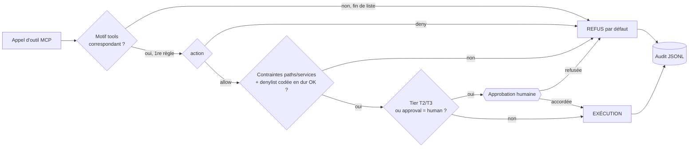

# `policy.d/` — Politiques de capacités des agents IA

Ce répertoire contient les politiques que le moteur de `vibed` charge depuis **`/etc/vibeos/policy.d/*.toml`** sur le système installé. Les fichiers de ce répertoire du dépôt sont copiés dans l'image OS à cet emplacement par le `Containerfile` (`COPY security/policy.d/ /etc/vibeos/policy.d/`) — ils font donc partie de l'image immuable. Chaque appel d'outil MCP reçu sur `/run/vibed/mcp.sock` est évalué contre ces politiques **avant** toute exécution, et la décision est journalisée dans `/var/lib/vibeos/audit/ (par jour)`.

**Règle d'or : le refus par défaut est absolu.** Un outil qui ne correspond à aucune règle est rejeté ; un outil inconnu est rejeté. Ce comportement est câblé dans le moteur — il ne dépend pas de la règle attrape-tout `default-deny` de `default.toml` (qui existe uniquement pour rendre le refus explicite et documenté dans l'audit) et il n'existe aucun mécanisme pour le désactiver.

## Format canonique du fichier

Un fichier de politique est un document TOML :

- `schema_version = 1` (optionnel, en tête de fichier) ;
- `[meta]` (optionnel) : `name`, `description` — purement informatif ;
- une suite de `[[rule]]`.

### Champs d'une `[[rule]]`

| Champ | Obligatoire | Description |
|---|---|---|
| `id` | oui | Identifiant unique (kebab-case), repris tel quel dans l'audit |
| `tools` | oui | Liste de motifs glob comparés au nom d'outil MCP (`fs.read`, `os.*`, `*`) |
| `tier` | oui | Tier de capacité : `T0`, `T1`, `T2` ou `T3` |
| `action` | oui | `allow` ou `deny` |
| `approval` | non | `none` (défaut) ou `human` |
| `reason` | non | Explication humaine, renvoyée à l'agent en cas de refus |
| `[rule.paths]` | non | Sous-table : `allowed` et/ou `denied`, listes de motifs glob de chemins |
| `[rule.services]` | non | Sous-table : `denied`, liste d'unités systemd interdites (règles `svc.*`) |

**Syntaxe glob** (même moteur pour les noms d'outils et les chemins) : `*` matche à l'intérieur d'un segment de chemin, `**` matche à travers les segments.

### Sémantique des tiers

| Tier | Portée | Effet d'un `allow` |
|---|---|---|
| `T0` | Lecture seule, aucune mutation | Autorisé (sous contraintes de chemins/services) |
| `T1` | Fichiers utilisateur (`/home`, `/var/home`) | Autorisé (sous contraintes de chemins/services) |
| `T2` | Paquets, services, config système | **Toujours** suspendu à une approbation humaine |
| `T3` | Disque, credentials, identité réseau | **Toujours** suspendu à une approbation humaine |

Le tier est un **plancher d'approbation** : une règle `T2`/`T3` avec `action = "allow"` exige toujours l'approbation humaine, quoi qu'en dise son champ `approval`. Pour rendre cette exigence explicite, une règle `T2`/`T3` en `allow` dont `approval` n'est pas `"human"` est une **erreur de chargement** — `vibed` refuse de démarrer avec une politique incohérente.

## Ordre d'évaluation

1. **Fichiers** : tous les `*.toml` de `/etc/vibeos/policy.d/` (et uniquement les `*.toml`) sont chargés en **ordre lexicographique** de nom de fichier. Convention : préfixez pour ordonner — `00-local.toml` est trié **avant** `default.toml`, donc ses règles sont évaluées en premier et surchargent la politique livrée sans la modifier (elle appartient à l'image immuable).
2. **Règles** : à l'intérieur de la liste concaténée, évaluation de haut en bas ; **la première règle qui matche gagne** (correspondance d'un motif `tools` avec le nom de l'outil), et l'évaluation s'arrête.
3. **Contraintes de la règle retenue** : pour les outils à chemin (`fs.read`, `fs.write`), le chemin résolu doit matcher `paths.allowed` si cette liste est présente, et ne doit pas matcher `paths.denied` — **`denied` gagne** en cas de double correspondance. Un service dans `services.denied` ⇒ refus. Une contrainte qui échoue ⇒ **refus** de la requête — elle ne « retombe » jamais sur une règle suivante plus permissive. C'est voulu : le fall-through est un vecteur de contournement classique.
4. **Approbation** : si la règle retenue autorise en `T2`/`T3` (ou porte `approval = "human"`), l'exécution est suspendue jusqu'à confirmation humaine hors bande (jamais via le canal de l'agent). Refus humain ⇒ refus audité.
5. **Aucune correspondance** : refus absolu, journalisé.



## Fail-closed au chargement

Si un fichier `*.toml` de `/etc/vibeos/policy.d/` est illisible ou invalide (TOML malformé, champ obligatoire manquant, tier inconnu, règle `T2`/`T3` en `allow` sans `approval = "human"`), `vibed` **journalise l'erreur et quitte avec un code de sortie non nul** : il refuse de servir plutôt que de tourner avec une politique partielle ou des défauts implicites.

## Denylist codée en dur

Indépendamment de tout fichier de politique, le moteur refuse dans le code (source de vérité : `BUILTIN_DENY_ALWAYS` / `BUILTIN_DENY_WRITE` dans `vibed/src/mcp.rs`, ~30 motifs) :

- en **lecture et écriture** : le journal d'audit (`/var/lib/vibeos/audit/**`), les bases de comptes (`/etc/shadow*`, `/etc/gshadow*`), le matériel de clés (`**/.ssh/**`, `**/.gnupg/**`, `/etc/ssh/*`), les magasins de credentials cloud et conteneurs (`**/.aws/**`, `**/.config/gcloud/**`, `**/.docker/config.json`, `**/.kube/config`, `**/.netrc`, `/etc/NetworkManager/system-connections/**`), les credentials des agents IA et de l'outillage dev livrés dans l'image (`**/.claude/**`, `**/.claude.json`, `**/.config/gh/**`, `**/.gemini/**`, `**/.codex/**`, `**/.local/share/opencode/**`, `**/.ollama/**`, `**/.npmrc`, `**/.git-credentials`, `**/.config/sops/**`), le home de root (`/root/**`), les fuites procfs (`/proc/**/environ`, `/proc/**/cmdline`), les secrets systemd (`/run/credentials/**`) et la chaîne de boot (`/boot/**`) ;
- en **écriture uniquement** : `/etc/vibeos/policy.d/**` et `/var/lib/vibeos/memory/**`.

Les entrées `paths.denied` de `default.toml` reprennent cette liste par défense en profondeur : les retirer du TOML ne rouvre **pas** l'accès. Le volume mémoire n'est pas inscriptible via `fs.write` ; les écritures mémoire passent par `memory.append` (T1, additif, sans argument de chemin — règle `memory-append`).

## Écrire une règle

Exemple : autoriser un futur outil `net.http_get` (lecture web) en T0, mais uniquement après réflexion sur l'exfiltration (voir [../../docs/THREAT-MODEL.md](../../docs/THREAT-MODEL.md), S2) :

```toml
# 10-net.toml — comments in English, like all code
[[rule]]
id = "net-http-get"
tools = ["net.http_get"]
tier = "T0"
action = "allow"
reason = "Outbound HTTP GET for documentation fetching. Reviewed against THREAT-MODEL S2 (exfiltration channel)."
```

Check-list avant d'ajouter une règle :

1. **Choisir le tier honnêtement** : « ça ne fait que lire » n'est pas T0 si la lecture peut servir de canal d'exfiltration ou toucher un secret.
2. **Motifs `tools` étroits** : jamais de `*` dans une règle `allow`. Préférez `os.status` à `os.*`.
3. **Contraindre les chemins** : toute règle `fs.*` en `allow` doit porter `[rule.paths]` avec `allowed` et/ou `denied` (la liste de référence est dans `default.toml`, règles `fs-read` et `fs-write`).
4. **Penser à la position** : la première règle qui matche gagne — votre règle est-elle atteinte avant `default-deny` ? Une règle plus large placée avant masquerait la vôtre. Pour surcharger la politique livrée, utilisez un fichier trié avant elle (`00-local.toml`).
5. **Mettre à jour le modèle de menace** : tout nouvel outil exposé ajoute sa ligne au tableau §6 de [../../docs/THREAT-MODEL.md](../../docs/THREAT-MODEL.md) (exigence de [../../SECURITY.md](../../SECURITY.md) §4).
6. **Valider la syntaxe** : `python -c "import tomllib,sys; tomllib.load(open(sys.argv[1],'rb'))" 10-net.toml`. La CI valide aussi le chargement de `default.toml` par le vrai parseur de `vibed` (test d'intégration Rust) et par `tomllib`.

## Ce qu'il ne faut jamais faire

- Affaiblir les entrées `paths.denied` couvrant l'audit, les credentials ou les clés — ce sont des invariants du modèle de menace, pas des réglages (et la denylist codée en dur les impose de toute façon).
- Donner `approval = "none"` à une règle `T2`/`T3` en `allow` (erreur de chargement, voir plus haut).
- Ajouter une règle `allow` avec `tools = ["*"]` — cela revient à supprimer le moteur de politiques.
- Modifier `default.toml` sur une machine installée : il appartient à l'image en lecture seule ; surchargez via `00-local.toml` dans `/etc/vibeos/policy.d/` (qui, lui, est de l'état local géré). Notez que l'écriture dans `/etc/vibeos/policy.d/**` via `fs.write` est de toute façon refusée en dur : un agent ne peut pas éditer sa propre politique.

## Livré en v0.1 vs planifié

- **Livré (v0.1)** : moteur de politiques `first-match-wins` avec refus par défaut absolu, plancher d'approbation T2/T3, fail-closed au chargement, denylist codée en dur, audit JSONL append-only.
- **Phase 2** : ~~`memory.append`~~ ✅ livré (écritures mémoire médiées, scopes `journal`/`knowledge` ; `user`/`projects` restent à venir).
- **Phase 3** : sandbox par outil (systemd-run, seccomp, landlock).
- **Phase 4** : chaînage cryptographique de l'audit, `vibed` sans privilèges (`User=vibed`), SELinux dédiée.
