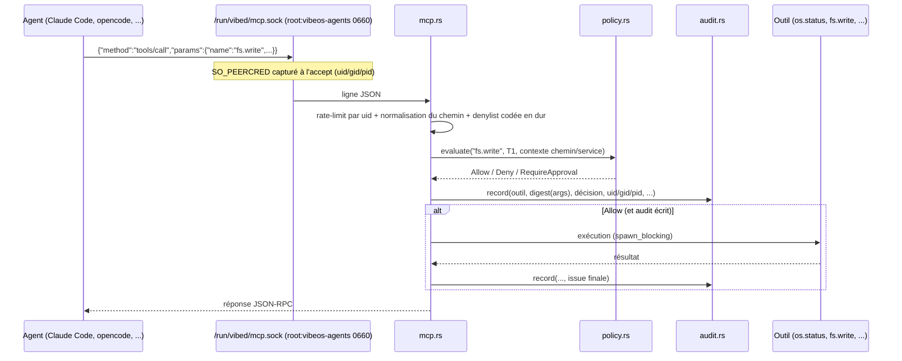

# vibed — démon IA système de VibeOS

`vibed` est le point d'entrée **unique** par lequel les agents IA contrôlent le système. C'est un démon Rust (tokio) qui expose un serveur MCP (JSON-RPC 2.0) sur le socket unix `/run/vibed/mcp.sock`. Aucun agent ne parle directement à systemd, rpm-ostree ou au système de fichiers système : tout passe par `vibed`, donc tout passe par la **politique** et par l'**audit**.

- Binaire installé : `/usr/bin/vibed`
- Unité systemd : `vibed.service`
- Politique : `/etc/vibeos/policy.d/*.toml` (chargement **fail-closed**)
- Audit : `/var/lib/vibeos/audit/vibed-<AAAA-MM-JJ UTC>.jsonl` (append-only, JSON Lines, **un fichier par jour**, chaîne de hachés **continue** entre les jours, identité de l'appelant incluse)
- Mémoire interrogée : `/var/lib/vibeos/memory` (créée par `vibeos-genesis.service`, source : `memory/genesis.sh`)
- Socket : `/run/vibed/mcp.sock`, `root:vibeos-agents`, mode `0660`

## Privilèges — état honnête de la v0.1

En v0.1, **vibed tourne en root** sous `vibed.service`. Les barrières livrées aujourd'hui sont : le groupe `vibeos-agents` sur le socket (première porte), le moteur de politique fail-closed (deuxième porte), la denylist codée en dur (troisième porte) et l'audit systématique avec identité du pair (`SO_PEERCRED`). Le passage à `User=vibed` avec une `CapabilityBoundingSet=` vide (allow-list), ainsi que le sandbox par outil (systemd-run, seccomp, landlock), sont des cibles **Phase 4** et **Phase 3** respectivement — voir `docs/SECURITY-ARCHITECTURE.md` et `ROADMAP.md`. Ne pas décrire ces mécanismes au présent tant qu'ils ne sont pas livrés.

Le groupe `vibeos-agents` et l'utilisateur `vibed` (cible Phase 4) sont créés par `os/rootfs/usr/lib/sysusers.d/vibeos.conf`. Au démarrage, `main.rs` applique `chgrp vibeos-agents` sur le socket (gid résolu en lisant `/etc/group`) ; si le groupe est absent (machine de dev), un avertissement est émis et le socket reste accessible à root seul — l'issue la plus restrictive.

## Architecture du crate

| Module | Rôle |
|---|---|
| `main.rs` | Bootstrap : tracing, chargement **fail-closed** de la politique (exit non-zéro si un fichier est invalide), bind du socket, `chgrp vibeos-agents` + `0660`, capture `SO_PEERCRED` à l'accept, boucle d'acceptation, arrêt propre SIGTERM/SIGINT |
| `lib.rs` | Racine de bibliothèque : expose les modules aux tests d'intégration (`tests/`) |
| `mcp.rs` | Serveur JSON-RPC 2.0 délimité par lignes : `initialize`, `tools/list`, `tools/call` ; registre des outils et leurs tiers ; denylist codée en dur ; exécution sous `spawn_blocking` |
| `policy.rs` | Moteur de règles TOML (schéma canonique) : tiers T0..T3, première règle qui matche gagne, default-deny absolu, plancher d'approbation T2/T3, contraintes de chemins/services |
| `glob.rs` | Matcher glob minimal maison (aucune dépendance) : `*` = à l'intérieur d'un segment, `**` = à travers les segments ; normalisation lexicale des chemins |
| `audit.rs` | Journal d'audit append-only chaîné SHA-256, rotation par jour UTC (horodatage, outil, digest FNV-1a des arguments, décision, issue, uid/gid/pid de l'appelant) |
| `sha256.rs` | SHA-256 (FIPS 180-4) **sans dépendance** pour le chaînage de l'audit ; vecteurs NIST testés |
| `ratelimit.rs` | Rate-limiting par uid (token bucket, `SO_PEERCRED`) partagé entre connexions — borne un agent emballé/compromis |
| `approval.rs` | Flux d'approbation humaine T2/T3 : requête → grant à usage unique borné `(outil, cible, uid)` + expiration ; store `pending/` borné (purge/dedup/plafond) |
| `vibectl.rs` + `bin/vibectl.rs` | CLI opérateur : `memory status/mode/profile/projects`, `audit verify`, `approvals list`, `approve/deny` (root) |
| `tests/policy_integration.rs`, `tests/mcp_integration.rs` | Tests d'intégration : chargent le **vrai** `security/policy.d/default.toml` ; le second pilote `handle_connection` sur une vraie socketpair (handshake, refus, rate-limit, audit) |



**Fail-closed, deux fois** : (1) au chargement, un seul fichier `*.toml` illisible ou invalide dans `policy.d` fait quitter vibed avec un code non-zéro — jamais de dégradation silencieuse vers un état plus permissif ; (2) sur le chemin `Allow`, si l'écriture de l'audit échoue, l'outil n'est **pas** exécuté. Pas de trace, pas d'exécution.

## Outils exposés (v0.1)

| Outil | Tier | Décision (politique par défaut) | Description |
|---|---|---|---|
| `os.status` | T0 | Allow | Uptime, charge, mémoire, points de montage (via `/proc`) |
| `fs.read` | T0 | Allow (confiné) | Lecture de fichier (UTF-8 lossy, tronqué à 256 KiB). **Confiné au home de l'appelant** (SO_PEERCRED) + arbres système non personnels (`/etc /usr /proc /sys /run /var/lib/vibeos`) — les fichiers d'un **autre utilisateur** sont refusés ; denylist codée en dur + `paths.denied` par-dessus ; re-vérification sur le chemin canonicalisé (symlinks) |
| `fs.list` | T0 | Allow (confiné) | Listing **non récursif** d'un répertoire (nom, type, taille des fichiers réguliers ; plafond 500 entrées + `limit`). **Même confinement** que `fs.read` (home appelant + arbres système) et même denylist ; les symlinks sont signalés mais **jamais suivis** |
| `fs.write` | T1 | Allow (périmètre restreint) | Écriture restreinte à `/home/**` et `/var/home/**` **uniquement** (sur Fedora, `/home` est un lien vers `/var/home`) ; la mémoire VibeOS n'est **pas** inscriptible par `fs.write` — son chemin d'écriture gouverné est `memory.append` |
| `pkg.install` | T2 | **RequireApproval** | Crée une requête d'approbation (`vibectl approve <id>`) ; backend d'install = stub v0.1 (aucun paquet installé même après approbation) |
| `svc.restart` | T2 | **RequireApproval** | Crée une requête d'approbation (`vibectl approve <id>`) ; backend systemd = stub v0.1 (aucune unité redémarrée même après approbation) |
| `svc.status` | T0 | Allow | État d'une unité systemd en lecture seule (`systemctl show` : load/active/sub state, unit file state) ; validation stricte du nom d'unité en code (pas d'injection d'option ni de chemin), environnement vidé, chemin absolu |
| `sectools.list` | T0 | Allow | Découverte **en lecture seule** de la trousse cybersécurité (`/usr/share/vibeos/security-tools.tsv`) : nom, catégorie, tier gouvernant l'invocation agent, présence — **n'exécute aucun outil** (lancer un outil T2/T3 = chemin séparé, approbation humaine ; voir [../docs/SECURITY-TOOLKIT.md](../docs/SECURITY-TOOLKIT.md)) |
| `memory.query` | T0 | Allow | Recherche par sous-chaîne (nom **et contenu**) dans `/var/lib/vibeos/memory`, chaque match rendu **avec un extrait de contenu borné** (lecture de la mémoire en un seul appel, pas de `fs.read` de suivi) ; arguments `query`, `scope` (identity/hardware/user/projects/journal/knowledge) et `limit` (drapeau `truncated`) — voir `docs/MEMORY.md` §9 |
| `memory.append` | T1 | Allow | Écriture mémoire **strictement additive** : une ligne JSONL par appel, scopes `journal` (type/source/data, types réservés au système refusés), `knowledge` (subject/fact/source[/confidence]), `user` (key/value/source → `user/updates.jsonl`, fold last-write-wins) et `projects` (path/source[+champs] → `projects/updates.jsonl`, fold par path) ; `ts` et `id` posés par vibed, ligne plafonnée à 16 KiB, `O_APPEND`+`O_NOFOLLOW`, aucun argument de chemin |

**Default-deny absolu** : un outil absent du registre est refusé, et un outil sans règle qui matche est refusé aussi. Il n'existe aucun « défaut par tier » permissif.

## Politique — schéma canonique

Fichiers TOML dans `/etc/vibeos/policy.d/`, chargés dans l'ordre lexicographique des noms de fichiers (seuls les `*.toml` sont considérés) ; les règles sont évaluées de haut en bas et **la première règle qui matche gagne**.

```toml
# /etc/vibeos/policy.d/50-exemple.toml
schema_version = 1        # optionnel ; si présent, doit valoir 1

[meta]                    # optionnel, informatif
name = "exemple"

[[rule]]
id      = "fs-write-user"        # obligatoire, unique sur tout policy.d
tools   = ["fs.write", "fs.mkdir"]  # obligatoire : globs sur les noms d'outils
tier    = "T1"                   # obligatoire : T0 | T1 | T2 | T3
action  = "allow"                # obligatoire : allow | deny
approval = "none"                # optionnel : none (défaut) | human
reason  = "périmètre utilisateur"  # optionnel, contexte d'audit

[rule.paths]                     # optionnel : contraintes de chemins (globs)
allowed = ["/home/**", "/var/home/**"]
denied  = ["/home/*/.ssh/**"]    # denied gagne toujours

[[rule]]
id      = "pkg"
tools   = ["pkg.install", "pkg.remove"]
tier    = "T2"
action  = "allow"
approval = "human"               # OBLIGATOIRE pour un allow T2/T3

[rule.services]                  # optionnel : contraintes de services
denied  = ["vibed.service"]
```

### Sémantique du moteur

1. Outil inconnu du registre ⇒ **Deny** (avant même de consulter les règles).
2. Aucune règle ne matche ⇒ **Deny** (default-deny absolu).
3. `action = "deny"` ⇒ **Deny**.
4. `action = "allow"` + tier **T0/T1** ⇒ **Allow**, sous réserve des contraintes `paths`/`services` (un chemin/service refusé gagne ; si `paths.allowed` est présent, le chemin doit y matcher).
5. `action = "allow"` + tier **T2/T3** ⇒ **toujours RequireApproval** : le tier est un plancher qu'aucune règle ne peut abaisser. Une règle T2/T3 `allow` sans `approval = "human"` est une **erreur de chargement**.
6. Le tier du registre est lui aussi un plancher : une règle qui déclare `tier = "T0"` sur un outil T2 du registre produit quand même `RequireApproval`.
7. Tout fichier `*.toml` illisible ou invalide dans `policy.d` ⇒ **fail-closed** : vibed journalise l'erreur et quitte avec un code non-zéro (refuse de servir). Idem pour un `id` dupliqué ou un `schema_version` ≠ 1.

### Syntaxe glob (matcher maison, `glob.rs`)

- `*` matche à l'intérieur d'**un seul segment** de chemin (jamais `/`) ;
- `**` en tant que segment complet matche **zéro ou plusieurs segments** (`/a/b/**` couvre `/a/b` lui-même) ;
- même matcher pour les noms d'outils (`os.metrics.*`) et pour les chemins.

Les chemins sont normalisés lexicalement avant toute décision (`//`, `.`, `..` résolus ; chemin relatif ou remontée au-dessus de `/` ⇒ refus). `fs.read` re-vérifie en plus le chemin **canonicalisé** (symlinks résolus).

### Denylist codée en dur

Indépendamment de la politique chargée (une politique erronée ou altérée ne peut **pas** rouvrir ces chemins), le code refuse — lectures **et** écritures (source de vérité : `BUILTIN_DENY_ALWAYS` dans `src/mcp.rs`, ~30 motifs) :

```
/var/lib/vibeos/audit/**    /etc/shadow*    /etc/gshadow*    **/.ssh/**
**/.gnupg/**    /etc/ssh/*    **/.aws/**
**/.config/gcloud/**    /etc/NetworkManager/system-connections/**
**/.docker/config.json    **/.kube/config    **/.netrc    /root/**
/proc/**/environ    /proc/**/cmdline    /run/credentials/**    /boot/**
```

plus les credentials des agents IA et de l'outillage dev livrés dans l'image (vibed tourne en root et `fs.read` n'est pas confiné au home de l'appelant) :

```
**/.claude/**    **/.claude.json    **/.config/gh/**    **/.gemini/**
**/.codex/**    **/.local/share/opencode/**    **/.ollama/**
**/.npmrc    **/.git-credentials    **/.config/sops/**
```

et, pour les **écritures seulement** : `/etc/vibeos/policy.d/**` et `/var/lib/vibeos/memory/**` (la mémoire se lit via `memory.query` ; son chemin d'écriture gouverné est `memory.append`, qui ne prend aucun argument de chemin — cette denylist ne s'applique qu'à `fs.write`).

Le rechargement de la politique se fait par redémarrage du démon (`systemctl restart vibed`) — la politique est immuable après chargement. La politique par défaut livrée est `security/policy.d/default.toml` (installée dans l'image sous `/etc/vibeos/policy.d/`).

## Audit

Chaque appel produit au moins une ligne JSON dans le **répertoire** d'audit
`/var/lib/vibeos/audit/`, **rotation par jour UTC** (`vibed-AAAA-MM-JJ.jsonl`) —
aucun fichier ne croît sans borne (sinon, disque plein + fail-closed finiraient
par bloquer tout appel d'outil) :

```json
{"seq":42,"prev":"9f2c…","ts_unix_ms":1751500000000,"tool":"fs.write","target":"/var/home/dev/notes.md","args_fnv1a64":"a1b2c3d4e5f60718","decision":"allow","outcome":"ok","caller_uid":1000,"caller_gid":1002,"caller_pid":4242,"hash":"3ab7…"}
```

- Les arguments ne sont **jamais** journalisés en clair : digest FNV-1a 64 **non cryptographique** (corrélation, pas intégrité). Le champ `target` porte le sujet **non secret** de l'action (chemin, unité, paquet) pour la forensique — jamais de contenu de fichier.
- L'identité de l'appelant (uid/gid/pid) provient des **peer credentials** du socket unix (`SO_PEERCRED`), capturées à l'accept et estampillées sur chaque enregistrement de la connexion.
- **Chaînage par hachage (tamper evidence) — livré** : chaque enregistrement porte `seq` (compteur monotone), `prev` (SHA-256 de l'enregistrement précédent) et `hash` (SHA-256 de l'enregistrement lui-même, hors champ `hash`). La chaîne est **continue à travers les fichiers datés** (`seq`/`prev` ne se réinitialisent pas au changement de jour — un jour entier ne peut pas être supprimé sans détection). Toute altération/suppression/réordonnancement casse la chaîne. Vérification (parcourt tous les fichiers datés) :

  ```bash
  vibed --verify-audit                 # /var/lib/vibeos/audit/ (défaut)
  vibed --verify-audit /chemin/audit   # {"ok":true,"records":N,...}, exit 0/1
  # ou l'équivalent opérateur : vibectl audit verify [répertoire]
  ```

  Le SHA-256 est l'implémentation maison **sans dépendance** (`src/sha256.rs`, vecteurs NIST testés), fidèle à la doctrine TCB sans dépendance (glob/FNV faits main). La chaîne est reprise au redémarrage. `fsync` par enregistrement (durabilité). **Reste Phase 4** : ancrage externe de la tête (TPM/Rekor — ferme la troncature du dernier enregistrement) + réplication journald (`docs/SECURITY-ARCHITECTURE.md` §8).
  - Un appel **approuvé** (T2/T3) porte l'uid de l'opérateur dans son `outcome` : `ok_approved(by_uid=0)`. Le grant étant supprimé au ré-appel, cette ligne est la **seule trace durable** de qui a autorisé le changement système.
  - Un appel refusé par le rate-limiter porte `decision=deny`, `outcome=rate_limited`.

## Bornes de résilience (anti-DoS)

Un agent est un *insider non fiable* : le daemon se protège d'un agent emballé ou compromis qui le noierait d'appels.

- **Rate-limiting par uid** (`src/ratelimit.rs`) : token bucket par identité `SO_PEERCRED`, **partagé entre connexions** (ouvrir plusieurs sockets ne multiplie pas le budget). Défaut : burst 60, refill 10/s. Un appel au-delà de la limite est **refusé fail-closed et audité** (`rate_limited`) — la mémoire, le store d'approbation et le corps de l'outil ne s'exécutent jamais. Vérifié tôt dans le pipeline (après normalisation du chemin, avant denylist/politique).
- **Store d'approbation borné** (`src/approval.rs`) : `pending/` purge les requêtes périmées (> 1 h), **déduplique** les requêtes identiques `(outil, cible, uid)` (le ré-appel en attente réutilise l'id, pas de nouveau fichier) et applique un **plafond dur** (64 requêtes). Un agent ne peut donc pas remplir le volume mémoire en spammant des demandes T2/T3 non approuvables.
- **Journal d'audit** : rotation par jour (ci-dessus) ; la rétention/purge des vieux fichiers est une **politique opérateur** (une purge = T3, approbation humaine — jamais une action d'agent).

## Builder et tester (WSL2 Ubuntu)

L'hôte est Windows 11 ; la compilation se fait dans WSL2 (voir `docs/BUILD.md` pour la chaîne complète de build de l'image OS). Toolchain minimale : **Rust 1.75** (déclarée dans `Cargo.toml` via `rust-version`).

```bash
wsl -d Ubuntu
cd "/mnt/f/je ne sais pas encore/vibed"   # attention aux espaces : garder les guillemets

cargo build --locked      # Cargo.lock est commité (épinglage supply-chain, voir SECURITY.md)
cargo test                 # 96 tests unitaires + 6 tests d'intégration
                           # (2 politique réelle + 4 MCP bout-en-bout sur socketpair)
# le crate produit deux binaires : vibed (démon) et vibectl (CLI admin)
```

Notes :

- `Cargo.lock` épingle `indexmap 2.5.0` / `hashbrown 0.14.5` : les versions plus récentes de hashbrown exigent l'édition 2024 de cargo (Rust ≥ 1.85). Ne pas faire `cargo update` de ces deux crates sans monter la toolchain partout (dev, CI, Containerfile).
- Les tests ne nécessitent **pas** les droits root (politique et audit testés sous `/tmp`).
- Le test d'intégration `tests/policy_integration.rs` charge le **vrai** `security/policy.d/default.toml` du dépôt : toute dérive entre le schéma de la politique livrée et le moteur casse `cargo test` (et donc la CI). Il verrouille : `os.status` ⇒ Allow, `pkg.install` ⇒ RequireApproval, outil inconnu ⇒ Deny.
- Le binaire vise Linux uniquement (`tokio::signal::unix`, sockets unix, `SO_PEERCRED`) — il ne compile pas sur l'hôte Windows, c'est voulu.

## Tester le socket avec un client MCP

Lancer le démon (en dev, root nécessaire pour `/run`, `/etc/vibeos`, `/var/lib/vibeos`) :

```bash
sudo ./target/debug/vibed
```

Si `/etc/vibeos/policy.d` n'existe pas, vibed démarre avec **zéro règle : tout est refusé** (default-deny absolu). Pour un essai réaliste, copier la politique du dépôt :

```bash
sudo mkdir -p /etc/vibeos/policy.d
sudo cp "/mnt/f/je ne sais pas encore/security/policy.d/default.toml" /etc/vibeos/policy.d/
```

### Avec socat (une requête par ligne ; socat est livré dans l'image OS)

```bash
printf '%s\n' '{"jsonrpc":"2.0","id":1,"method":"initialize","params":{}}' \
  | sudo socat - UNIX-CONNECT:/run/vibed/mcp.sock

printf '%s\n' '{"jsonrpc":"2.0","id":2,"method":"tools/list"}' \
  | sudo socat - UNIX-CONNECT:/run/vibed/mcp.sock

printf '%s\n' '{"jsonrpc":"2.0","id":3,"method":"tools/call","params":{"name":"os.status","arguments":{}}}' \
  | sudo socat - UNIX-CONNECT:/run/vibed/mcp.sock
```

### Avec Python (session interactive)

```bash
sudo python3 - <<'EOF'
import json, socket
s = socket.socket(socket.AF_UNIX)
s.connect("/run/vibed/mcp.sock")

def call(payload):
    s.sendall((json.dumps(payload) + "\n").encode())
    buf = b""
    while not buf.endswith(b"\n"):
        buf += s.recv(65536)
    print(json.dumps(json.loads(buf), indent=2, ensure_ascii=False))

call({"jsonrpc": "2.0", "id": 1, "method": "initialize", "params": {}})
call({"jsonrpc": "2.0", "id": 2, "method": "tools/list"})
call({"jsonrpc": "2.0", "id": 3, "method": "tools/call",
      "params": {"name": "memory.query", "arguments": {"query": "identity"}}})
EOF
```

Comportements attendus :

- `pkg.install` répond `isError: true` avec `requires human approval` **et** laisse une ligne `pending_approval` dans l'audit ;
- `fs.read` sur `/etc/shadow` ou un fichier de `/var/lib/vibeos/audit/` est refusé par la denylist codée en dur (`/var/lib/vibeos/audit/**`), politique ou pas ;
- `fs.write` hors de `/home/**` et `/var/home/**` est refusé ;
- chaque ligne d'audit porte l'uid/gid/pid du client qui a émis l'appel.

## Intégration dans l'image OS

Le binaire est compilé et copié dans l'image bootc (`ghcr.io/micka420-collab/vibeos`) pendant le build CI ; l'unité `vibed.service`, le fichier `sysusers.d` (groupe `vibeos-agents`) et la politique par défaut (`/etc/vibeos/policy.d/default.toml`) sont livrés par l'image (racine en lecture seule, mise à jour atomique). La connexion côté agents (Claude Code, agent SDK, gemini-cli, codex, opencode, ollama) est documentée dans `agent/README.md`.

## Références

- `security/policy.d/README.md` — format canonique des règles et check-list pour en écrire une
- `docs/SECURITY-ARCHITECTURE.md` — modèle de menace, durcissement de l'unité, gestion des secrets, phases
- `docs/BUILD.md` — build de l'image OS et de l'ISO (bootc-image-builder)
- `ROADMAP.md` — Phase 2 (vibed+MCP complet, memory.append), Phase 3 (sandbox par outil), Phase 4 (User=vibed, audit chaîné)
- `agent/README.md` — configuration `.mcp.json` des agents et CLIs embarquées
- `memory/genesis.sh` — création de la mémoire au premier démarrage (Genesis)
